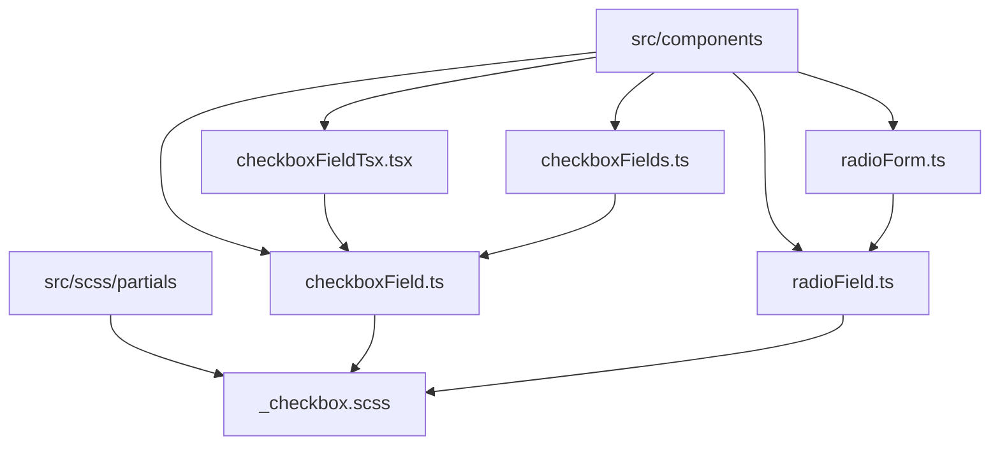
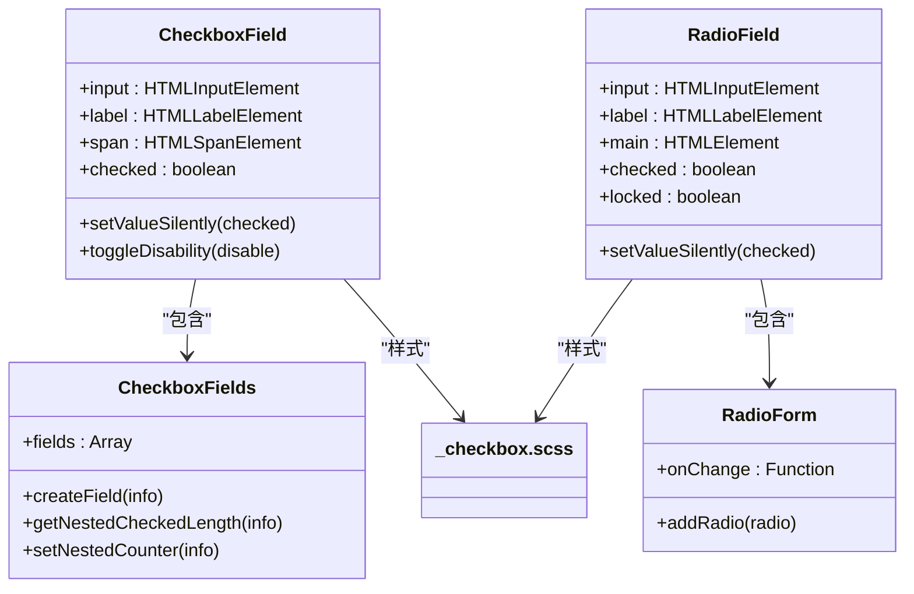
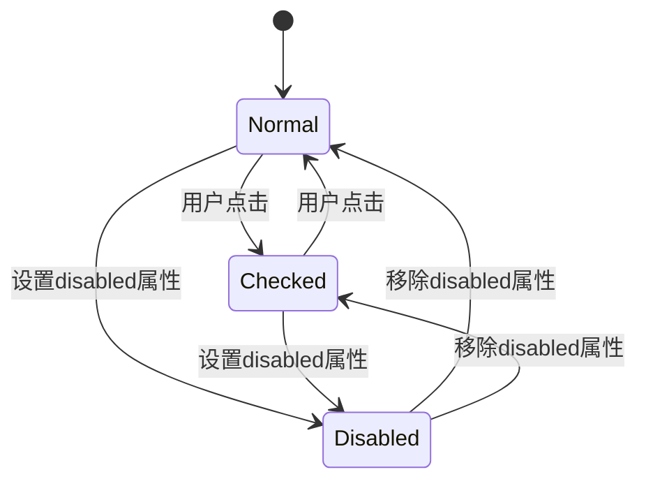
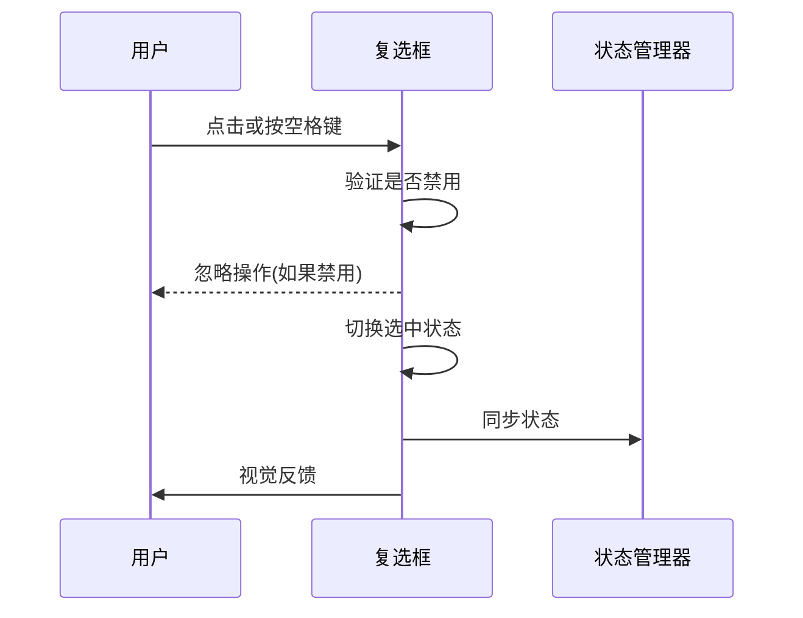
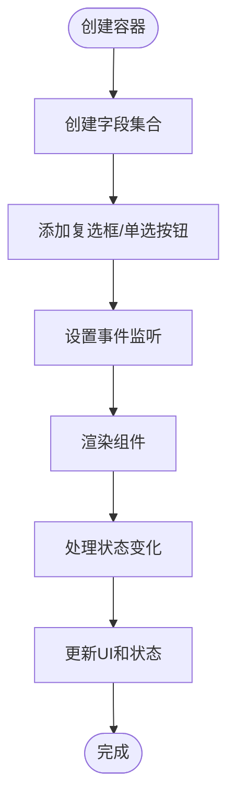
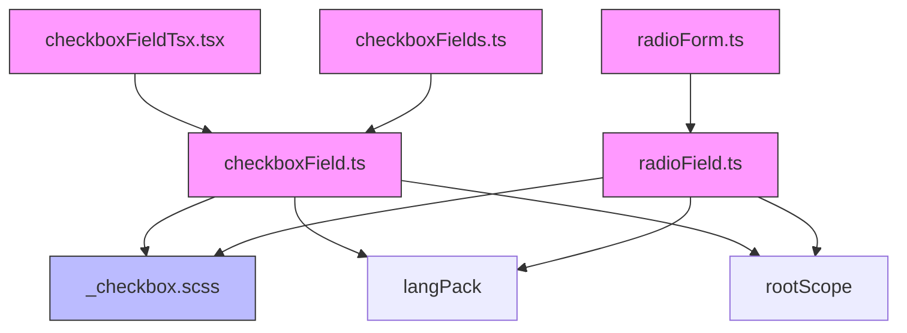

# 复选框与单选按钮

<cite>
**本文档引用的文件**  
- [checkboxField.ts](file://src/components/checkboxField.ts)
- [checkboxFieldTsx.tsx](file://src/components/checkboxFieldTsx.tsx)
- [checkboxFields.ts](file://src/components/checkboxFields.ts)
- [radioField.ts](file://src/components/radioField.ts)
- [radioForm.ts](file://src/components/radioForm.ts)
- [_checkbox.scss](file://src/scss/partials/_checkbox.scss)
</cite>

## 目录
1. [简介](#简介)
2. [项目结构](#项目结构)
3. [核心组件](#核心组件)
4. [架构概述](#架构概述)
5. [详细组件分析](#详细组件分析)
6. [依赖分析](#依赖分析)
7. [性能考虑](#性能考虑)
8. [故障排除指南](#故障排除指南)
9. [结论](#结论)

## 简介
本文档详细描述了复选框和单选按钮组件的实现机制，涵盖状态管理、用户交互、表单集成和无障碍访问等方面。文档重点分析了复选框的各种状态（正常、选中、禁用、半选中）、单选按钮组的互斥选择行为，以及容器组件的功能特性。同时提供了样式定制方法和实际使用示例，确保开发者能够全面理解和有效使用这些UI组件。

## 项目结构
复选框和单选按钮组件位于`src/components`目录下，采用模块化设计。核心功能由多个独立但相互关联的文件组成，包括基础组件实现、容器包装和样式定义。组件设计遵循单一职责原则，将状态管理、视觉呈现和用户交互分离。



**图示来源**  
- [checkboxField.ts](file://src/components/checkboxField.ts#L1-L196)
- [radioField.ts](file://src/components/radioField.ts#L1-L114)
- [_checkbox.scss](file://src/scss/partials/_checkbox.scss#L1-L438)

**本节来源**  
- [checkboxField.ts](file://src/components/checkboxField.ts)
- [radioField.ts](file://src/components/radioField.ts)
- [_checkbox.scss](file://src/scss/partials/_checkbox.scss)

## 核心组件
复选框和单选按钮组件的核心功能由`CheckboxField`和`RadioField`类实现，分别处理复选框和单选按钮的逻辑。`CheckboxFields`类提供复选框组的容器功能，而`RadioForm`则管理单选按钮组的互斥选择行为。这些组件通过事件监听和状态同步机制，确保用户交互的响应性和数据一致性。

**本节来源**  
- [checkboxField.ts](file://src/components/checkboxField.ts#L32-L195)
- [radioField.ts](file://src/components/radioField.ts#L14-L113)

## 架构概述
组件架构采用分层设计，将基础组件、容器组件和样式系统分离。基础组件负责核心逻辑，容器组件提供高级功能，样式系统控制视觉呈现。这种设计提高了组件的可维护性和可扩展性，同时支持多种使用场景。



**图示来源**  
- [checkboxField.ts](file://src/components/checkboxField.ts#L32-L195)
- [radioField.ts](file://src/components/radioField.ts#L14-L113)
- [checkboxFields.ts](file://src/components/checkboxFields.ts#L34-L221)
- [radioForm.ts](file://src/components/radioForm.ts#L7-L21)

## 详细组件分析

### 复选框组件分析
复选框组件支持多种状态和样式变体，包括标准复选框、圆形复选框和开关样式。组件通过CSS类控制外观，并通过JavaScript管理状态和用户交互。

#### 状态管理
复选框组件支持以下状态：
- **正常状态**：默认的未选中状态
- **选中状态**：用户选择后的状态
- **禁用状态**：不可交互的状态
- **半选中状态**：通过`stateKey`属性实现的中间状态



**图示来源**  
- [checkboxField.ts](file://src/components/checkboxField.ts#L169-L184)
- [_checkbox.scss](file://src/scss/partials/_checkbox.scss#L302-L328)

#### 交互逻辑
复选框组件通过事件监听处理用户交互，包括鼠标点击和键盘导航。组件支持无障碍访问，确保符合WCAG标准。



**图示来源**  
- [checkboxField.ts](file://src/components/checkboxField.ts#L178-L179)
- [checkboxFieldTsx.tsx](file://src/components/checkboxFieldTsx.tsx#L39-L41)

**本节来源**  
- [checkboxField.ts](file://src/components/checkboxField.ts#L1-L196)
- [checkboxFieldTsx.tsx](file://src/components/checkboxFieldTsx.tsx#L1-L48)

### 单选按钮组件分析
单选按钮组件实现了一组互斥选择的选项，确保同一时间只有一个选项被选中。组件通过共享的`name`属性实现互斥行为。

#### 互斥选择机制
单选按钮组通过`RadioForm`类管理互斥选择行为，当一个按钮被选中时，其他同组按钮自动取消选中。

```mermaid
classDiagram
class RadioField {
+name : string
+value : string
+checked : boolean
}
class RadioForm {
+radios : Array
+onChange : Function
}
RadioForm --> RadioField : "管理"
RadioField "1" -- "0..*" RadioForm : "属于"
note right of RadioForm
同一name属性的RadioField
组成一个互斥选择组
end note
```

**图示来源**  
- [radioField.ts](file://src/components/radioField.ts#L38-L39)
- [radioForm.ts](file://src/components/radioForm.ts#L10-L17)

#### 容器组件功能
`CheckboxFields`和`RadioForm`作为容器组件，提供了标签关联、错误消息显示和布局管理等高级功能。



**图示来源**  
- [checkboxFields.ts](file://src/components/checkboxFields.ts#L54-L211)
- [radioForm.ts](file://src/components/radioForm.ts#L7-L21)

**本节来源**  
- [radioField.ts](file://src/components/radioField.ts#L14-L113)
- [radioForm.ts](file://src/components/radioForm.ts#L7-L21)
- [checkboxFields.ts](file://src/components/checkboxFields.ts#L34-L221)

## 依赖分析
组件依赖关系清晰，基础组件独立于容器组件，样式系统与逻辑分离。这种设计降低了耦合度，提高了组件的可测试性和可维护性。



**图示来源**  
- [checkboxField.ts](file://src/components/checkboxField.ts#L7-L14)
- [radioField.ts](file://src/components/radioField.ts#L7-L13)
- [checkboxFields.ts](file://src/components/checkboxFields.ts#L7-L17)
- [radioForm.ts](file://src/components/radioForm.ts#L7-L21)

**本节来源**  
- [checkboxField.ts](file://src/components/checkboxField.ts#L7-L31)
- [radioField.ts](file://src/components/radioField.ts#L7-L29)
- [checkboxFields.ts](file://src/components/checkboxFields.ts#L7-L32)
- [radioForm.ts](file://src/components/radioForm.ts#L7-L21)

## 性能考虑
组件设计考虑了性能优化，通过事件委托、状态缓存和动画分级等技术确保流畅的用户体验。样式系统支持动画级别控制，可以根据设备性能调整动画效果。

## 故障排除指南
常见问题包括状态不同步、样式不生效和无障碍访问问题。建议检查组件属性设置、事件监听器注册和CSS类应用情况。

**本节来源**  
- [checkboxField.ts](file://src/components/checkboxField.ts#L67-L107)
- [radioField.ts](file://src/components/radioField.ts#L46-L54)

## 结论
复选框和单选按钮组件提供了完整的UI解决方案，支持丰富的状态管理和用户交互。通过合理的架构设计和清晰的API，组件易于使用和扩展，能够满足各种复杂的表单需求。