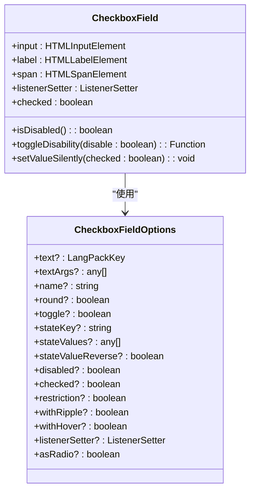
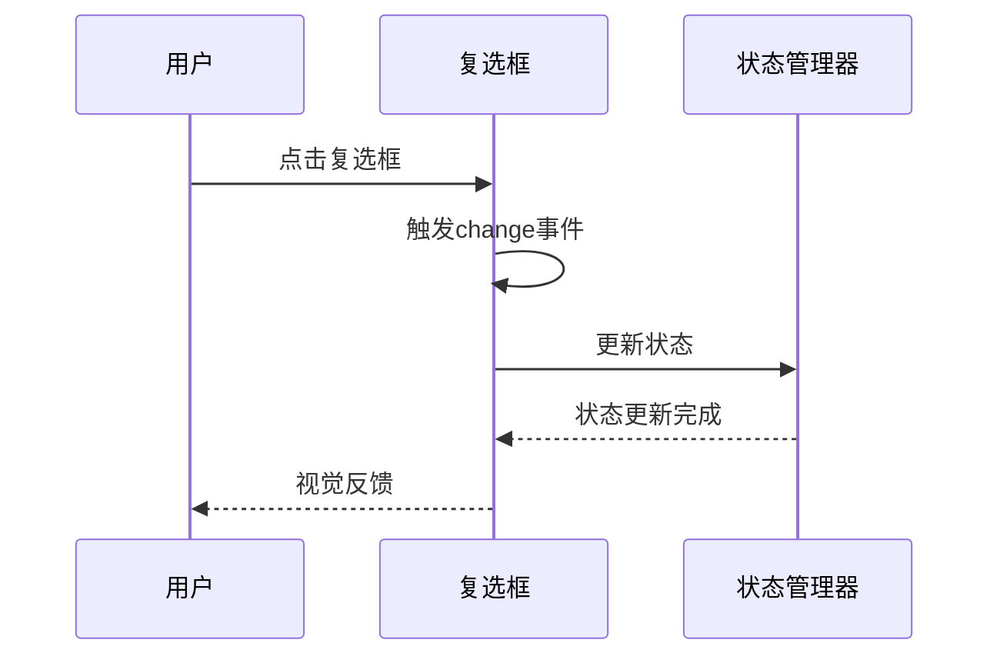
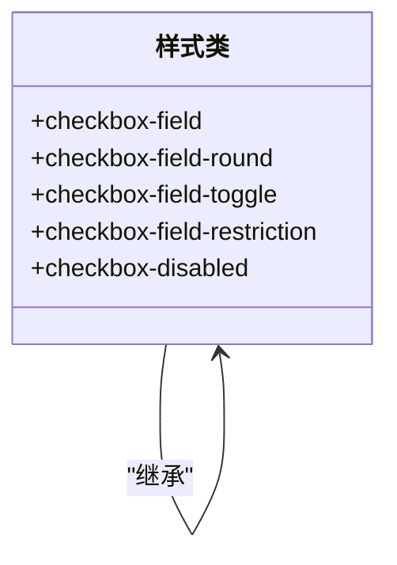
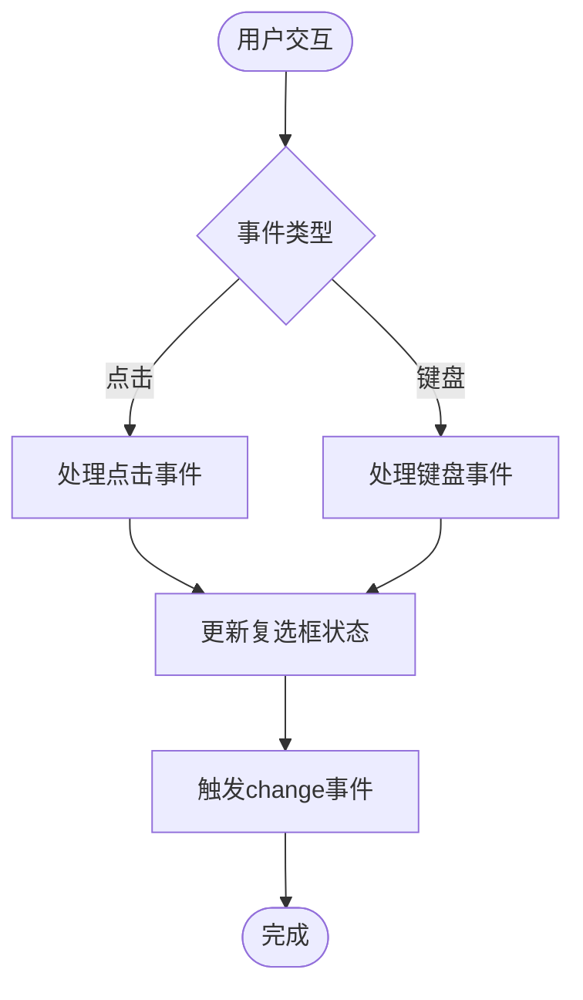
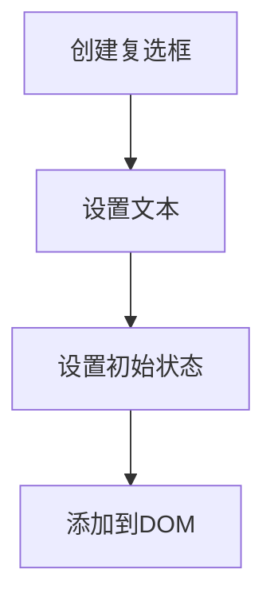
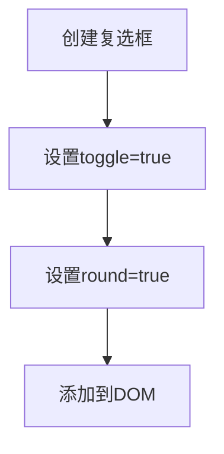
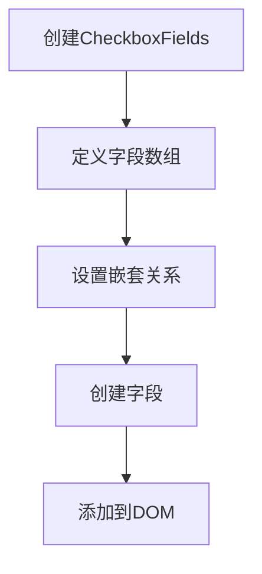
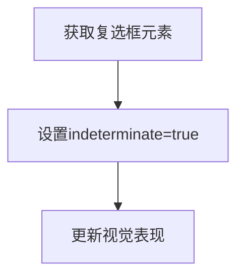

# 复选框组件

<cite>
**本文档中引用的文件**  
- [checkboxField.ts](file://src/components/checkboxField.ts)
- [checkboxFieldTsx.tsx](file://src/components/checkboxFieldTsx.tsx)
- [checkboxFields.ts](file://src/components/checkboxFields.ts)
- [_checkbox.scss](file://src/scss/partials/_checkbox.scss)
</cite>

## 目录
1. [简介](#简介)
2. [核心组件](#核心组件)
3. [状态管理机制](#状态管理机制)
4. [视觉表现与样式](#视觉表现与样式)
5. [事件处理与交互](#事件处理与交互)
6. [复选框字段容器](#复选框字段容器)
7. [无障碍访问实现](#无障碍访问实现)
8. [实际使用示例](#实际使用示例)
9. [结论](#结论)

## 简介
复选框组件是用户界面中用于选择和配置选项的核心交互元素。本技术文档详细阐述了复选框组件的实现原理，包括其状态管理、视觉表现、事件处理、无障碍访问支持以及与其他系统（如表单验证）的集成方式。文档还涵盖了复选框字段容器的功能，以及如何通过CSS变量进行样式定制。

## 核心组件

复选框组件由多个核心文件构成，主要包括`CheckboxField`类、`CheckboxFieldTsx`函数组件以及`CheckboxFields`类。这些组件共同实现了复选框的创建、状态管理和用户交互功能。

**Section sources**
- [checkboxField.ts](file://src/components/checkboxField.ts#L32-L195)
- [checkboxFieldTsx.tsx](file://src/components/checkboxFieldTsx.tsx#L7-L47)
- [checkboxFields.ts](file://src/components/checkboxFields.ts#L34-L221)

## 状态管理机制

复选框组件支持多种状态，包括正常、选中、禁用和半选中（indeterminate）状态。状态管理主要通过`CheckboxField`类的属性和方法实现。



**Diagram sources**
- [checkboxField.ts](file://src/components/checkboxField.ts#L32-L195)

### 状态实现原理

复选框的状态主要通过`HTMLInputElement`的`checked`属性来管理。`CheckboxField`类提供了`checked`的getter和setter方法，以及`setValueSilently`方法用于在不触发事件的情况下设置状态。



**Diagram sources**
- [checkboxField.ts](file://src/components/checkboxField.ts#L169-L184)

## 视觉表现与样式

复选框的视觉表现通过CSS样式文件`_checkbox.scss`实现，支持多种样式变体，包括标准复选框、圆形复选框和开关样式复选框。



**Diagram sources**
- [_checkbox.scss](file://src/scss/partials/_checkbox.scss#L6-L438)

### 样式定制

开发者可以通过CSS变量来定制复选框的外观，包括尺寸、颜色主题和动画效果。主要的CSS变量包括`--size`、`--primary-color`、`--secondary-color`等。

**Section sources**
- [_checkbox.scss](file://src/scss/partials/_checkbox.scss#L8-L10)

## 事件处理与交互

复选框组件支持点击事件和键盘导航（Tab键和Space键）。事件处理逻辑通过`addEventListener`方法实现，并与`ListenerSetter`类集成以管理事件监听器。



**Diagram sources**
- [checkboxField.ts](file://src/components/checkboxField.ts#L105-L107)

## 复选框字段容器

`CheckboxFields`类提供了复选框字段容器的功能，支持标签关联、错误消息显示、布局管理和嵌套复选框。

```mermaid
classDiagram
class CheckboxFields {
+fields : Array<CheckboxFieldsField>
+listenerSetter : ListenerSetter
+asRestrictions : boolean
+round : boolean
+onRowCreation : (row : Row, info : K) => void
+rightButtonIcon : Icon
+onAnyChange? : () => void
+onExpand? : (info : K) => void
+createField(info : CheckboxFieldsField, isNested? : boolean) : {row : Row, nodes : HTMLElement[]}
+getNestedCheckedLength(info : CheckboxFieldsField) : number
+setNestedCounter(info : CheckboxFieldsField, count? : number) : void
}
class CheckboxFieldsField {
+text? : LangPackKey
+textArgs? : FormatterArguments
+description? : LangPackKey
+restrictionText? : LangPackKey
+checkboxField? : CheckboxField
+checked? : boolean
+nested? : CheckboxFieldsField[]
+nestedTo? : CheckboxFieldsField
+nestedCounter? : HTMLElement
+setNestedCounter? : (count : number) => void
+toggleWith? : {checked? : CheckboxFieldsField[], unchecked? : CheckboxFieldsField[]}
+name? : string
+row? : Row
}
CheckboxFields --> CheckboxFieldsField : "包含"
```

**Diagram sources**
- [checkboxFields.ts](file://src/components/checkboxFields.ts#L34-L221)

## 无障碍访问实现

复选框组件实现了完整的无障碍访问支持，包括ARIA属性、屏幕阅读器支持和焦点管理，确保符合WCAG 2.1标准。

**Section sources**
- [checkboxField.ts](file://src/components/checkboxField.ts#L56-L61)

## 实际使用示例

以下是一些复选框组件的实际使用场景示例：

### 基础复选框


### 开关样式复选框


### 多选列表


### 半选中状态


**Section sources**
- [checkboxFieldTsx.tsx](file://src/components/checkboxFieldTsx.tsx#L17-L46)
- [checkboxFields.ts](file://src/components/checkboxFields.ts#L57-L211)

## 结论

复选框组件通过精心设计的状态管理、视觉表现和事件处理机制，提供了一个功能完整、易于使用且符合无障碍标准的UI组件。通过CSS变量和属性配置，开发者可以轻松定制复选框的外观和行为，满足各种应用场景的需求。