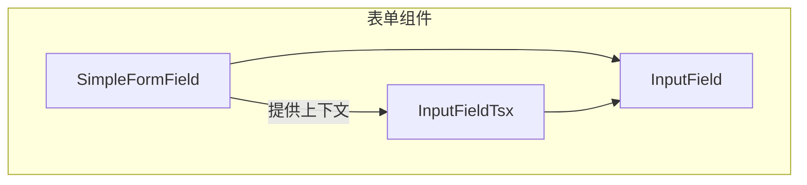
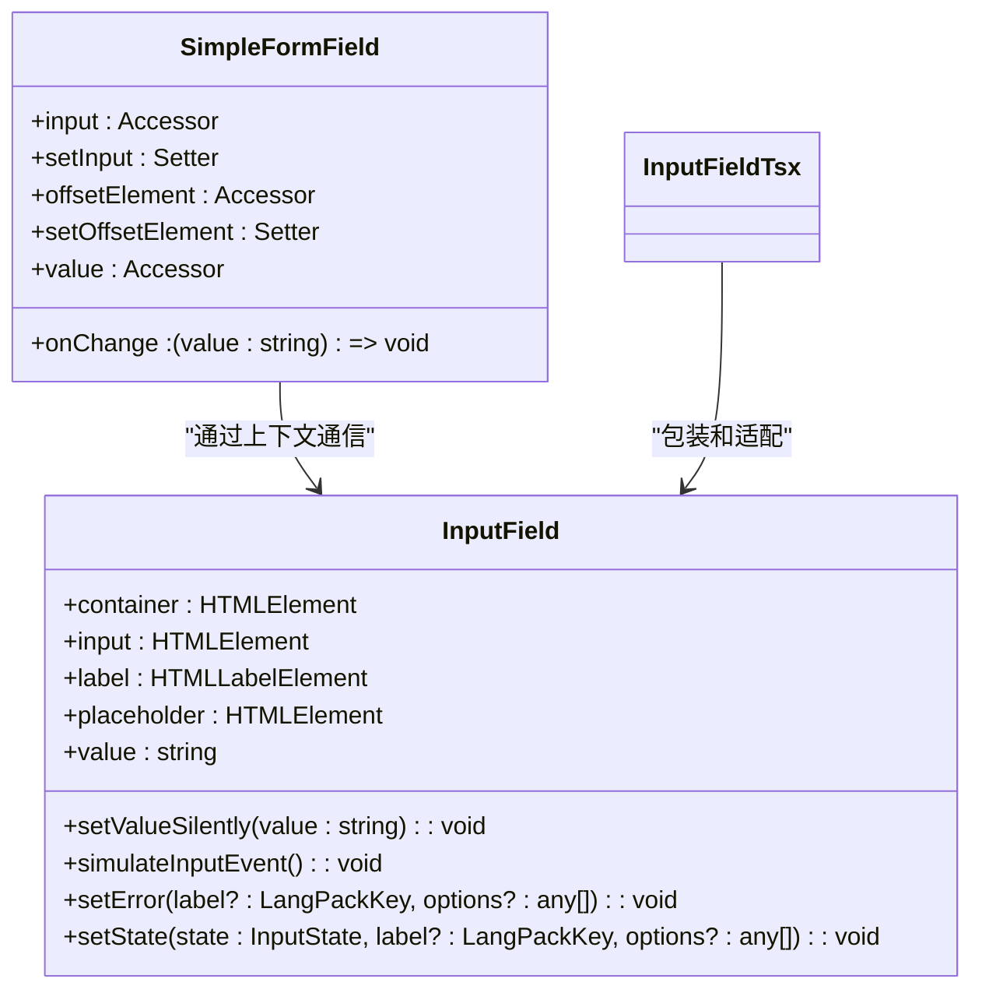
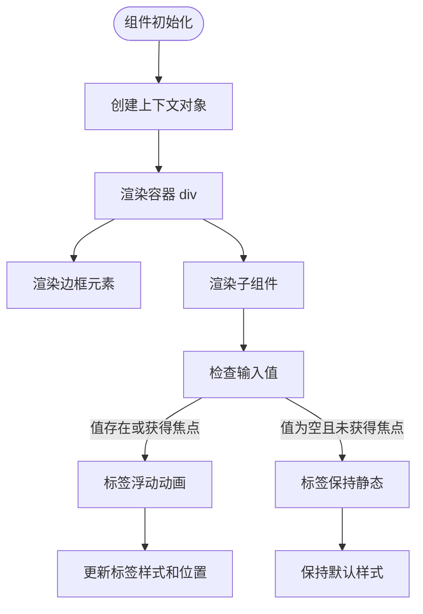
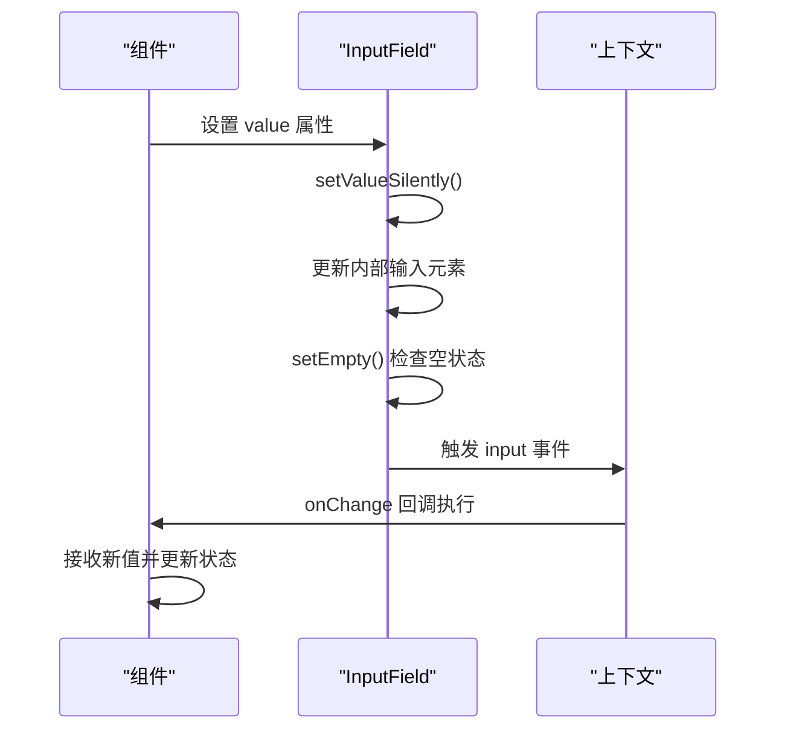
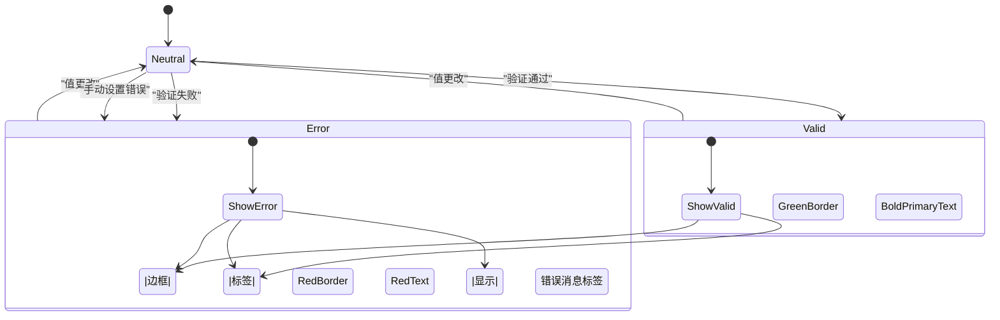

# 表单容器与字段

<cite>
**本文档引用的文件**
- [simpleFormField/index.tsx](file://src/components/simpleFormField/index.tsx)
- [simpleFormField/styles.module.scss](file://src/components/simpleFormField/styles.module.scss)
- [inputField.ts](file://src/components/inputField.ts)
- [inputFieldTsx.tsx](file://src/components/inputFieldTsx.tsx)
</cite>

## 目录
1. [简介](#简介)
2. [项目结构](#项目结构)
3. [核心组件](#核心组件)
4. [架构概述](#架构概述)
5. [详细组件分析](#详细组件分析)
6. [依赖分析](#依赖分析)
7. [性能考虑](#性能考虑)
8. [故障排除指南](#故障排除指南)
9. [结论](#结论)
10. [附录](#附录)（如有必要）

## 简介
本文档详细说明了表单容器与字段组件的设计与实现。这些组件构成了用户界面中表单输入的基础，提供了统一的布局结构、标签管理、帮助文本显示和错误消息呈现机制。文档将深入分析简单表单字段组件的实现细节，包括其与各种输入组件的集成方式、值传递、状态同步和验证结果展示。同时，还将解释样式模块的实现，支持主题定制和响应式设计，并提供组合使用示例，展示如何构建完整的表单布局。

## 项目结构
表单相关组件主要位于 `src/components` 目录下，采用模块化设计，分离了基础表单字段和具体输入组件的实现。核心表单功能由 `simpleFormField` 组件提供基础容器和上下文管理，而具体的输入行为则由 `inputField` 系列组件实现。



**图表来源**
- [simpleFormField/index.tsx](file://src/components/simpleFormField/index.tsx#L1-L165)
- [inputField.ts](file://src/components/inputField.ts#L1-L803)

**章节来源**
- [simpleFormField/index.tsx](file://src/components/simpleFormField/index.tsx#L1-L165)
- [inputField.ts](file://src/components/inputField.ts#L1-L803)

## 核心组件
核心表单组件包括 `SimpleFormField` 容器和 `InputField` 输入组件。`SimpleFormField` 提供了一个可复用的表单字段容器，处理布局、标签浮动动画和错误状态管理。`InputField` 则是一个功能丰富的输入组件，支持纯文本和富文本输入、实体解析、自定义表情符号处理和输入验证。

**章节来源**
- [simpleFormField/index.tsx](file://src/components/simpleFormField/index.tsx#L1-L165)
- [inputField.ts](file://src/components/inputField.ts#L1-L803)

## 架构概述
表单系统的架构采用分层设计，上层组件通过 SolidJS 的上下文机制与底层输入组件通信。`SimpleFormField` 作为容器组件，通过 Context API 向其子组件提供输入元素引用、值和变更处理函数。`InputField` 作为具体的输入实现，处理复杂的输入逻辑，包括富文本处理、实体解析和自定义表情符号渲染。



**图表来源**
- [simpleFormField/index.tsx](file://src/components/simpleFormField/index.tsx#L6-L39)
- [inputField.ts](file://src/components/inputField.ts#L457-L461)

**章节来源**
- [simpleFormField/index.tsx](file://src/components/simpleFormField/index.tsx#L1-L165)
- [inputField.ts](file://src/components/inputField.ts#L1-L803)

## 详细组件分析
### SimpleFormField 分析
`SimpleFormField` 组件是一个基于 SolidJS 的复合组件，提供了表单字段的基础布局和交互逻辑。它通过 Context API 管理内部状态，并提供了多个子组件来构建完整的表单字段。

#### 布局结构与标签管理


**图表来源**
- [simpleFormField/index.tsx](file://src/components/simpleFormField/index.tsx#L42-L63)
- [simpleFormField/styles.module.scss](file://src/components/simpleFormField/styles.module.scss#L4-L61)

#### 帮助文本与错误消息呈现
```mermaid
classDiagram
class SimpleFormField {
+isError? : boolean
+clickable? : boolean
+withEndButtonIcon? : boolean
}
class Styles {
+error : 样式类
+clickable : 样式类
+withEndButtonIcon : 样式类
}
SimpleFormField --> Styles : "应用样式类"
Styles -->|错误状态| BorderThick : "红色边框"
Styles -->|错误状态| Label : "红色文本"
Styles -->|可点击状态| Container : "指针光标"
note right of SimpleFormField
isError 属性控制错误状态样式
clickable 属性启用点击交互
withEndButtonIcon 调整右侧内边距
end note
```

**图表来源**
- [simpleFormField/index.tsx](file://src/components/simpleFormField/index.tsx#L22-L25)
- [simpleFormField/styles.module.scss](file://src/components/simpleFormField/styles.module.scss#L54-L60)

**章节来源**
- [simpleFormField/index.tsx](file://src/components/simpleFormField/index.tsx#L1-L165)
- [simpleFormField/styles.module.scss](file://src/components/simpleFormField/styles.module.scss#L1-L158)

### InputField 分析
`InputField` 组件是一个功能完整的输入组件，支持多种输入模式和高级功能。

#### 值传递与状态同步


**图表来源**
- [inputField.ts](file://src/components/inputField.ts#L710-L733)
- [inputFieldTsx.tsx](file://src/components/inputFieldTsx.tsx#L47-L54)

#### 验证结果展示


**图表来源**
- [inputField.ts](file://src/components/inputField.ts#L782-L797)
- [inputField.ts](file://src/components/inputField.ts#L363-L367)

**章节来源**
- [inputField.ts](file://src/components/inputField.ts#L1-L803)
- [inputFieldTsx.tsx](file://src/components/inputFieldTsx.tsx#L1-L74)

## 依赖分析
表单组件与其他系统模块存在紧密的依赖关系，这些依赖确保了组件的功能完整性和国际化支持。

```mermaid
graph TB
subgraph "表单组件"
SF[SimpleFormField]
IF[InputField]
IFTSX[InputFieldTsx]
end
subgraph "核心库"
LangPack[langPack]
RichText[richTextProcessor]
DOM[dom helpers]
end
subgraph "样式系统"
SCSS[SCSS variables]
Mixins[SCSS mixins]
end
SF --> SCSS
IF --> LangPack
IF --> RichText
IF --> DOM
IFTSX --> IF
IFTSX --> LangPack
SF --> Mixins
note right of LangPack
提供国际化文本支持
用于标签和错误消息
end note
note right of RichText
处理富文本输入和实体解析
支持自定义表情符号
end note
```

**图表来源**
- [inputField.ts](file://src/components/inputField.ts#L23-L28)
- [simpleFormField/styles.module.scss](file://src/components/simpleFormField/styles.module.scss#L1-L2)

**章节来源**
- [inputField.ts](file://src/components/inputField.ts#L1-L803)
- [simpleFormField/styles.module.scss](file://src/components/simpleFormField/styles.module.scss#L1-L158)

## 性能考虑
表单组件在设计时考虑了性能优化，特别是在频繁更新的场景下。`SimpleFormField` 使用 SolidJS 的响应式系统，确保只有必要的部分会重新渲染。`InputField` 在处理富文本输入时，通过事件批处理和选择性更新来减少 DOM 操作的开销。对于长列表中的表单字段，建议使用虚拟滚动技术来提高渲染性能。

## 故障排除指南
当遇到表单组件相关问题时，可以参考以下常见问题的解决方案：

1. **标签不正确浮动**：检查 `SimpleFormField.Label` 组件是否正确放置在 `SimpleFormField` 容器内，并确保 `forceFieldValue` 属性在需要时正确设置。
2. **输入值不同步**：确认 `onChange` 回调函数正确传递，并检查是否存在多个状态源导致的冲突。
3. **富文本输入异常**：验证 `canWrapCustomEmojis` 选项是否根据需要正确配置，并检查自定义表情符号的加载状态。
4. **国际化文本不显示**：确保 `LangPackKey` 值正确，并检查语言包是否已正确加载。

**章节来源**
- [inputField.ts](file://src/components/inputField.ts#L782-L797)
- [simpleFormField/index.tsx](file://src/components/simpleFormField/index.tsx#L87-L89)

## 结论
表单容器与字段组件提供了一套完整且灵活的解决方案，用于构建现代化的用户界面表单。通过 `SimpleFormField` 和 `InputField` 的组合，开发者可以轻松创建具有一致外观和行为的表单元素。组件的设计充分考虑了可访问性、国际化和性能，支持从简单文本输入到复杂富文本编辑的各种场景。建议在实际使用中遵循组件的最佳实践，充分利用其提供的功能来提升用户体验。