# 表单组件

<cite>
**本文档中引用的文件**  
- [inputFieldTsx.tsx](file://src/components/inputFieldTsx.tsx)
- [checkboxFieldTsx.tsx](file://src/components/checkboxFieldTsx.tsx)
- [codeInputField.tsx](file://src/components/codeInputField.tsx)
- [simpleFormField/index.tsx](file://src/components/simpleFormField/index.tsx)
- [passwordInputField.ts](file://src/components/passwordInputField.ts)
- [usernameInputField.ts](file://src/components/usernameInputField.ts)
- [countryInputField.ts](file://src/components/countryInputField.ts)
- [radioField.ts](file://src/components/radioField.ts)
</cite>

## 目录
1. [简介](#简介)
2. [项目结构](#项目结构)
3. [核心组件](#核心组件)
4. [架构概述](#架构概述)
5. [详细组件分析](#详细组件分析)
6. [依赖分析](#依赖分析)
7. [性能考虑](#性能考虑)
8. [故障排除指南](#故障排除指南)
9. [结论](#结论)

## 简介
本文档全面介绍基于 Solid.js 的表单 UI 组件系统，涵盖输入框、复选框、单选按钮、验证码输入、用户名输入、国家选择、密码输入和表单字段容器等核心组件。文档详细描述了各组件的状态管理机制（聚焦、禁用、错误状态）、验证逻辑、与 Solid.js 响应式系统的集成方式，以及移动端兼容性、无障碍访问和样式定制等关键特性。

## 项目结构
表单组件分布在 `src/components` 目录下，采用模块化设计，每个组件都有独立的文件和样式模块。核心表单功能由基础组件（如 `inputField`）和高级封装组件（如 `inputFieldTsx`）组成，通过 Solid.js 的响应式系统实现高效的状态管理。

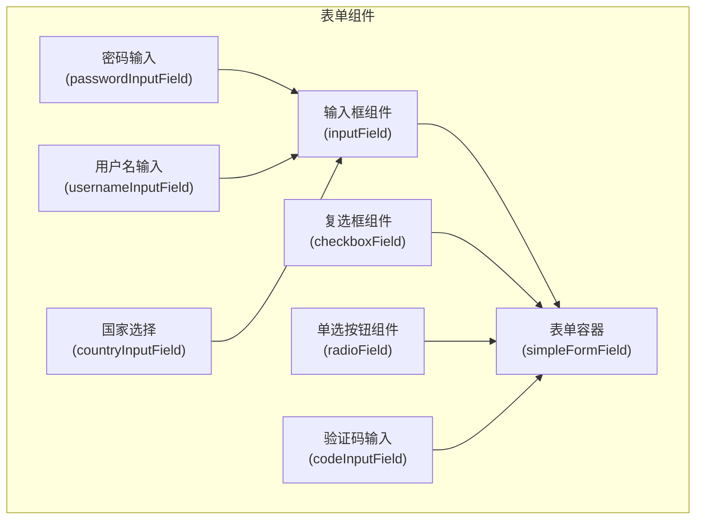

**图表来源**  
- [inputFieldTsx.tsx](file://src/components/inputFieldTsx.tsx)
- [simpleFormField/index.tsx](file://src/components/simpleFormField/index.tsx)

**章节来源**  
- [src/components](file://src/components)

## 核心组件
本系统提供了一套完整的表单 UI 组件，包括基础输入组件和高级专用组件。所有组件都基于 Solid.js 构建，利用其响应式特性实现高效的状态更新和渲染。组件设计注重可复用性、可访问性和移动端兼容性，支持实时验证、自动格式化和无障碍访问等现代 Web 应用所需的功能。

**章节来源**  
- [inputFieldTsx.tsx](file://src/components/inputFieldTsx.tsx)
- [checkboxFieldTsx.tsx](file://src/components/checkboxFieldTsx.tsx)
- [codeInputField.tsx](file://src/components/codeInputField.tsx)

## 架构概述
表单组件系统采用分层架构设计，底层是基础输入组件，中层是 Solid.js 封装组件，上层是专用输入组件。这种设计实现了关注点分离，提高了代码的可维护性和可扩展性。

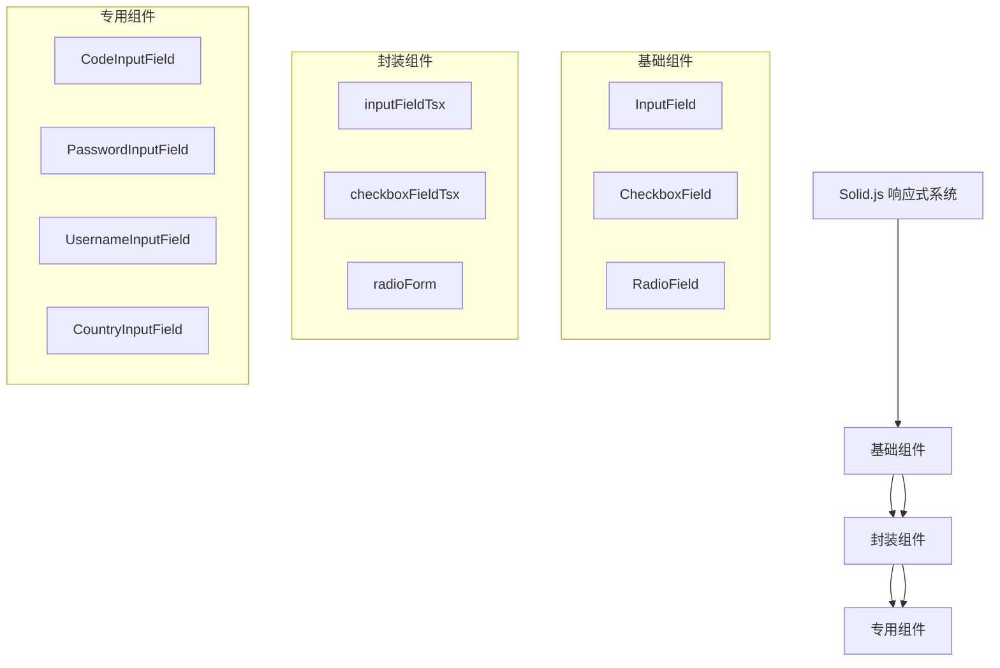

**图表来源**  
- [inputFieldTsx.tsx](file://src/components/inputFieldTsx.tsx)
- [passwordInputField.ts](file://src/components/passwordInputField.ts)
- [usernameInputField.ts](file://src/components/usernameInputField.ts)

## 详细组件分析

### 输入框组件分析
输入框组件是表单系统的基础，提供了文本输入的核心功能和状态管理。

#### 状态管理实现
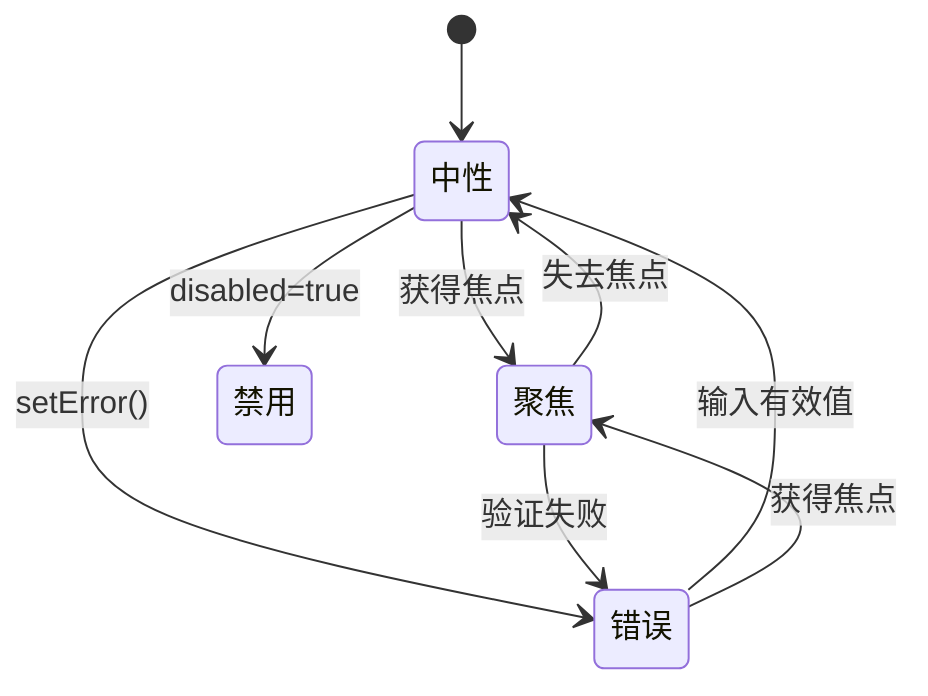

**图表来源**  
- [inputFieldTsx.tsx](file://src/components/inputFieldTsx.tsx#L21-L73)

#### 与Solid.js集成
```mermaid
sequenceDiagram
participant 组件属性
participant createEffect
participant InputField
participant DOM
组件属性->>createEffect : 属性变化
createEffect->>InputField : 调用方法
InputField->>DOM : 更新元素
DOM-->>createEffect : 渲染完成
createEffect-->>组件属性 : 响应结束
```

**图表来源**  
- [inputFieldTsx.tsx](file://src/components/inputFieldTsx.tsx#L29-L72)

**章节来源**  
- [inputFieldTsx.tsx](file://src/components/inputFieldTsx.tsx)

### 复选框组件分析
复选框组件提供了布尔值输入功能，支持受控和非受控两种使用模式。

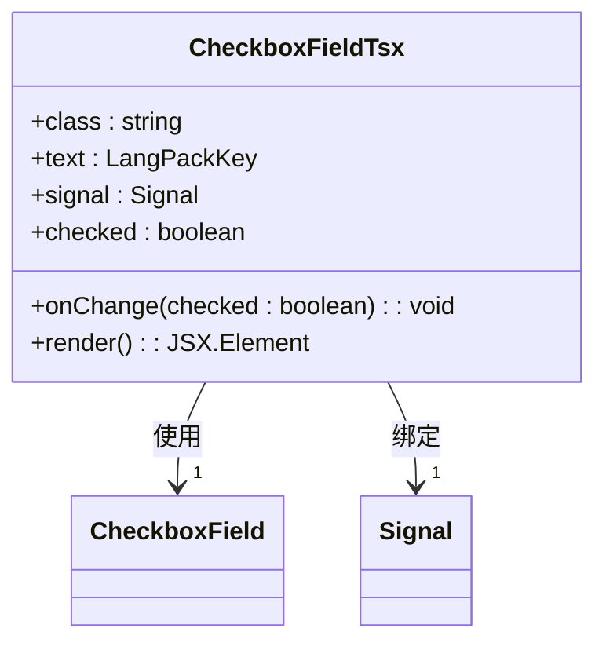

**图表来源**  
- [checkboxFieldTsx.tsx](file://src/components/checkboxFieldTsx.tsx#L7-L47)

**章节来源**  
- [checkboxFieldTsx.tsx](file://src/components/checkboxFieldTsx.tsx)

### 验证码输入组件分析
验证码输入组件专为数字验证码设计，提供逐位显示和光标管理功能。

#### 输入流程
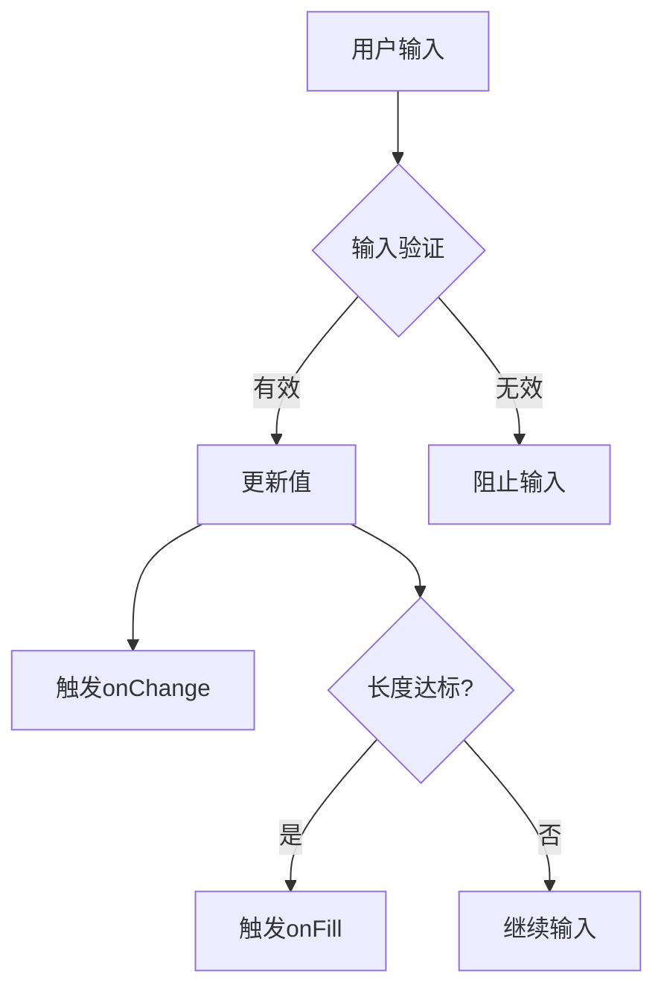

**图表来源**  
- [codeInputField.tsx](file://src/components/codeInputField.tsx#L65-L296)

**章节来源**  
- [codeInputField.tsx](file://src/components/codeInputField.tsx)

### 密码输入组件分析
密码输入组件在基础输入框基础上增加了密码可见性切换功能。

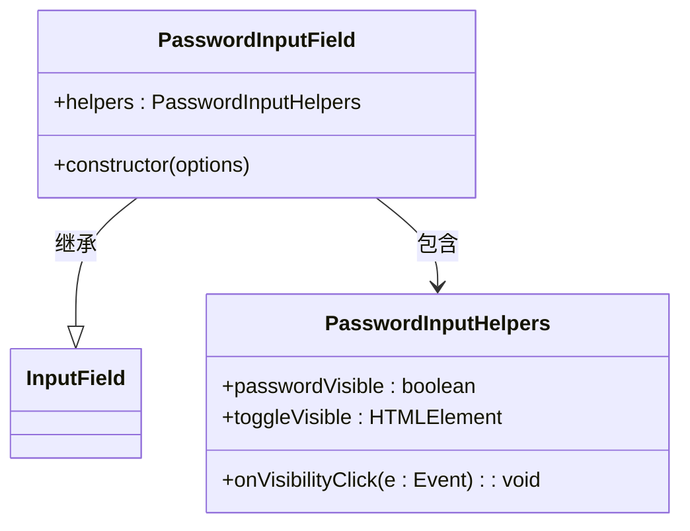

**图表来源**  
- [passwordInputField.ts](file://src/components/passwordInputField.ts#L11-L70)

**章节来源**  
- [passwordInputField.ts](file://src/components/passwordInputField.ts)

### 用户名输入组件分析
用户名输入组件实现了实时验证功能，与后端服务集成检查用户名可用性。

#### 验证流程
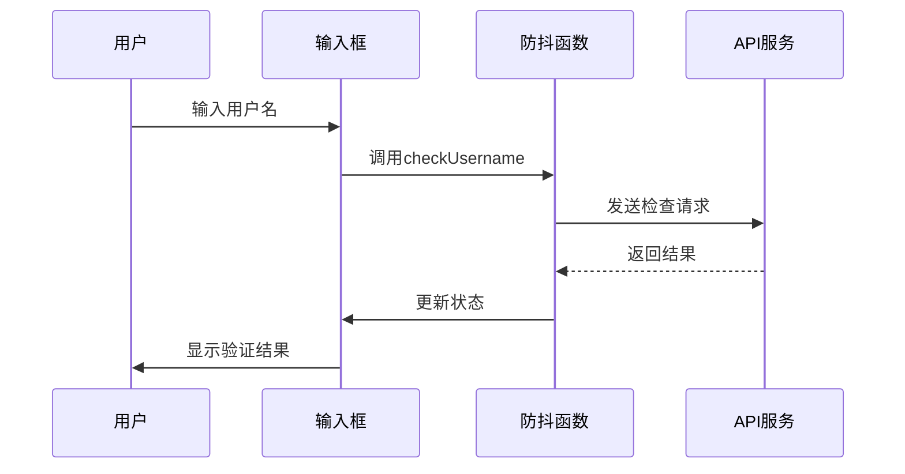

**图表来源**  
- [usernameInputField.ts](file://src/components/usernameInputField.ts#L14-L117)

**章节来源**  
- [usernameInputField.ts](file://src/components/usernameInputField.ts)

### 国家选择组件分析
国家选择组件基于基础输入框构建，提供国家选择功能。

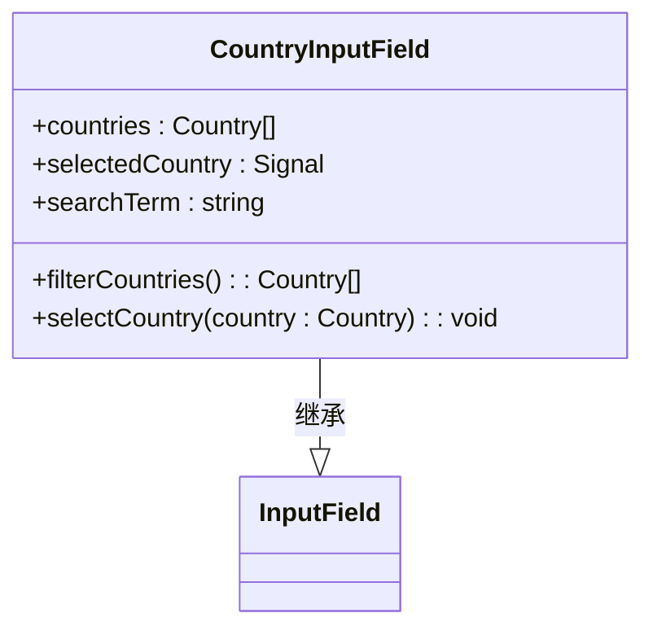

**图表来源**  
- [countryInputField.ts](file://src/components/countryInputField.ts)

**章节来源**  
- [countryInputField.ts](file://src/components/countryInputField.ts)

### 单选按钮组件分析
单选按钮组件提供单选功能，支持选项组管理。

```mermaid
classDiagram
class RadioField {
+name : string
+value : string
+checked : boolean
+onChange : (value : string) => void
}
class RadioForm {
+name : string
+options : Array<{value : string, text : string}>
+value : Signal<string>
+render() : JSX.Element
}
RadioForm --> RadioField : 包含多个
```

**图表来源**  
- [radioField.ts](file://src/components/radioField.ts)

**章节来源**  
- [radioField.ts](file://src/components/radioField.ts)

### 表单字段容器分析
表单字段容器提供统一的样式和布局管理。

#### 组件结构
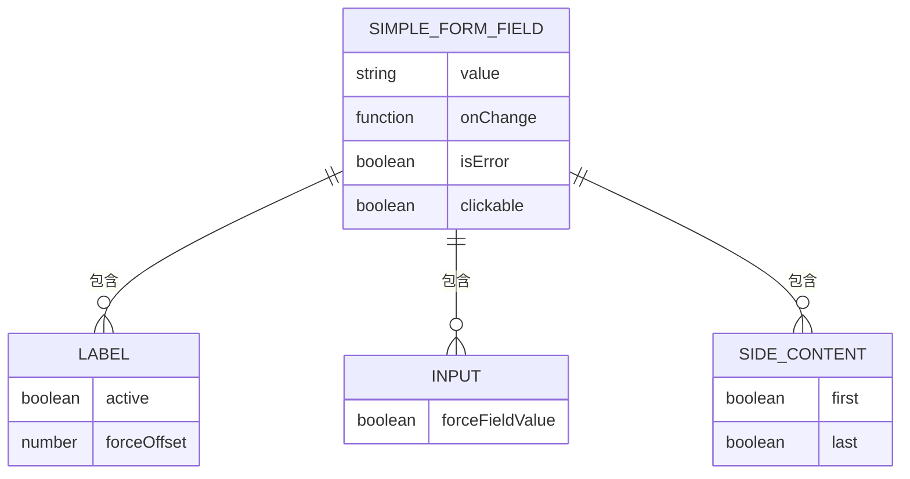

**图表来源**  
- [simpleFormField/index.tsx](file://src/components/simpleFormField/index.tsx#L1-L164)

**章节来源**  
- [simpleFormField/index.tsx](file://src/components/simpleFormField/index.tsx)

## 依赖分析
表单组件系统依赖于 Solid.js 响应式系统和项目内部的国际化、验证等服务。

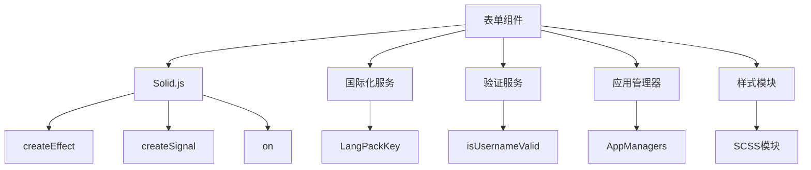

**图表来源**  
- [inputFieldTsx.tsx](file://src/components/inputFieldTsx.ts#L1-L73)
- [usernameInputField.ts](file://src/components/usernameInputField.ts#L1-L117)

**章节来源**  
- [src/lib/langPack](file://src/lib/langPack)
- [src/lib/richTextProcessor/validators](file://src/lib/richTextProcessor/validators)
- [src/lib/appManagers/managers](file://src/lib/appManagers/managers)

## 性能考虑
表单组件系统在性能方面进行了多项优化：
- 使用防抖技术减少频繁的 API 调用
- 利用 Solid.js 的细粒度响应式系统避免不必要的重渲染
- 采用虚拟 DOM 技术提高渲染效率
- 对复杂计算进行缓存处理

## 故障排除指南
常见问题及解决方案：

1. **输入框不更新**：检查是否正确使用了 `value` 和 `onChange` 属性
2. **验证不触发**：确保已正确配置验证规则和错误处理函数
3. **移动端键盘问题**：检查 `inputmode` 和 `autocomplete` 属性设置
4. **样式不生效**：确认 SCSS 模块正确导入和使用
5. **无障碍访问问题**：验证 ARIA 属性和标签关联是否正确

**章节来源**  
- [inputFieldTsx.tsx](file://src/components/inputFieldTsx.tsx)
- [simpleFormField/index.tsx](file://src/components/simpleFormField/index.tsx)

## 结论
本文档详细介绍了基于 Solid.js 的表单组件系统，涵盖了从基础输入到高级验证的各个方面。该系统设计合理，性能优良，具有良好的可扩展性和可维护性，能够满足现代 Web 应用的表单需求。