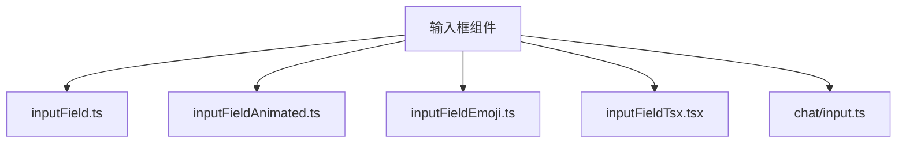
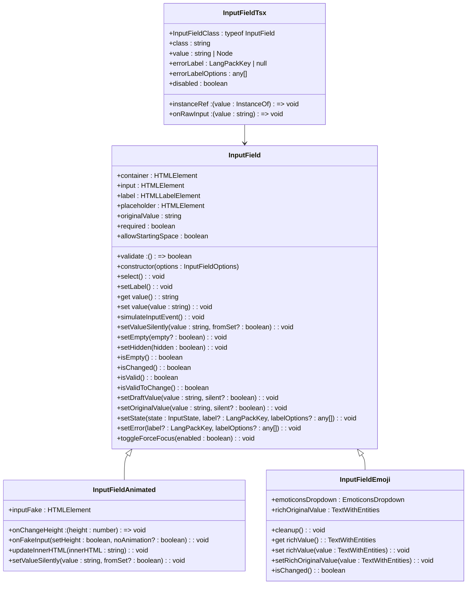
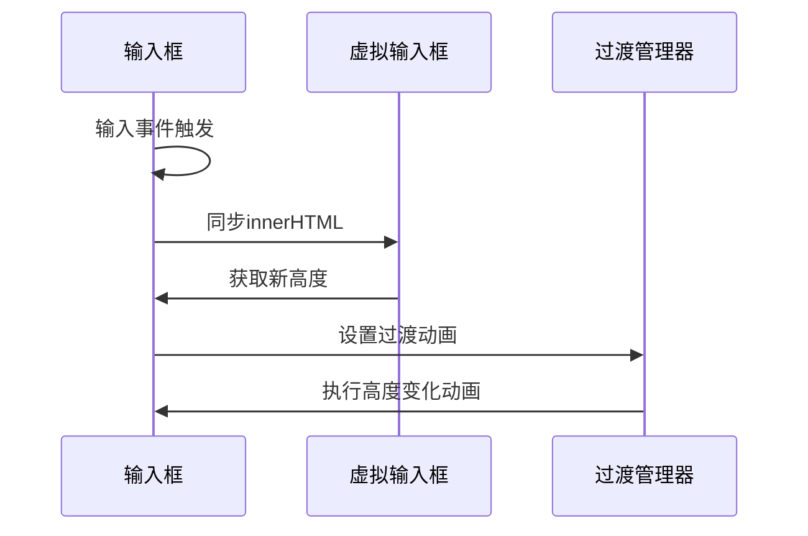
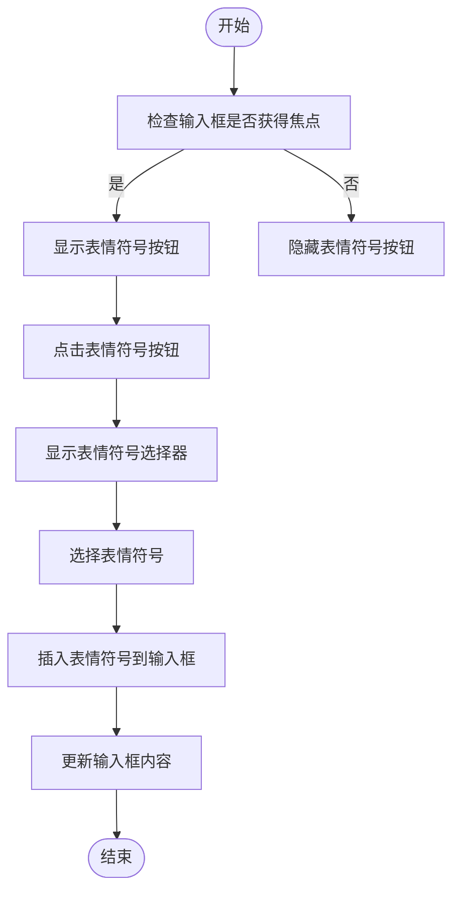
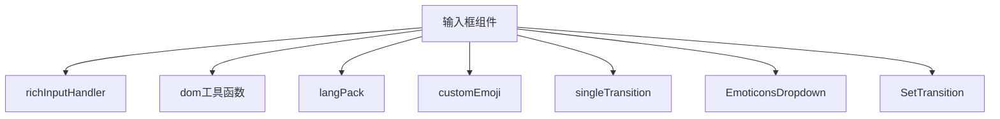

# 输入框组件

<cite>
**本文档引用的文件**  
- [inputField.ts](file://src/components/inputField.ts)
- [inputFieldAnimated.ts](file://src/components/inputFieldAnimated.ts)
- [inputFieldEmoji.ts](file://src/components/inputFieldEmoji.ts)
- [inputFieldTsx.tsx](file://src/components/inputFieldTsx.tsx)
- [chat/input.ts](file://src/components/chat/input.ts)
</cite>

## 目录
1. [简介](#简介)
2. [项目结构](#项目结构)
3. [核心组件](#核心组件)
4. [架构概述](#架构概述)
5. [详细组件分析](#详细组件分析)
6. [依赖分析](#依赖分析)
7. [性能考虑](#性能考虑)
8. [故障排除指南](#故障排除指南)
9. [结论](#结论)

## 简介
本文档详细说明了输入框组件的实现机制，包括聚焦状态管理、占位符处理、值绑定与Solid.js响应式系统的集成。描述了带表情符号支持的输入框特性，包括表情符号选择器集成、内容编辑处理和光标定位逻辑。解释了动画输入框的过渡效果实现，涵盖边框动画、标签移动和错误状态视觉反馈。提供了组合使用示例，展示如何与其他表单元素协同工作。记录了键盘事件处理、自动聚焦和移动端兼容性考虑。说明了无障碍访问实现，包括ARIA属性和屏幕阅读器支持。提供了样式定制选项，允许修改边框样式、颜色主题和动画时长。

## 项目结构
输入框组件位于`src/components/`目录下，主要包含以下几个文件：
- `inputField.ts`：基础输入框实现
- `inputFieldAnimated.ts`：带动画效果的输入框
- `inputFieldEmoji.ts`：支持表情符号的输入框
- `inputFieldTsx.tsx`：基于Solid.js的输入框组件
- `chat/input.ts`：聊天界面中的输入框实现

**Diagram sources**
- [inputField.ts](file://src/components/inputField.ts)
- [inputFieldAnimated.ts](file://src/components/inputFieldAnimated.ts)
- [inputFieldEmoji.ts](file://src/components/inputFieldEmoji.ts)
- [inputFieldTsx.tsx](file://src/components/inputFieldTsx.tsx)
- [chat/input.ts](file://src/components/chat/input.ts)

**Section sources**
- [inputField.ts](file://src/components/inputField.ts)
- [inputFieldAnimated.ts](file://src/components/inputFieldAnimated.ts)
- [inputFieldEmoji.ts](file://src/components/inputFieldEmoji.ts)
- [inputFieldTsx.tsx](file://src/components/inputFieldTsx.tsx)
- [chat/input.ts](file://src/components/chat/input.ts)

## 核心组件
输入框组件的核心实现基于`InputField`类，该类提供了基础的输入框功能，包括占位符处理、值绑定、验证状态管理等。`InputFieldAnimated`类继承自`InputField`，添加了高度动画效果。`InputFieldEmoji`类则扩展了表情符号支持功能。

**Section sources**
- [inputField.ts](file://src/components/inputField.ts)
- [inputFieldAnimated.ts](file://src/components/inputFieldAnimated.ts)
- [inputFieldEmoji.ts](file://src/components/inputFieldEmoji.ts)

## 架构概述
输入框组件采用分层架构设计，基础功能由`InputField`类提供，特定功能通过继承方式扩展。组件与Solid.js响应式系统集成，支持响应式更新。表情符号支持通过`EmoticonsDropdown`组件实现，动画效果通过`SetTransition`工具类管理。

**Diagram sources**
- [inputField.ts](file://src/components/inputField.ts)
- [inputFieldAnimated.ts](file://src/components/inputFieldAnimated.ts)
- [inputFieldEmoji.ts](file://src/components/inputFieldEmoji.ts)
- [inputFieldTsx.tsx](file://src/components/inputFieldTsx.tsx)

## 详细组件分析

### 基础输入框分析
基础输入框组件`InputField`实现了核心的输入功能，包括：
- 聚焦状态管理
- 占位符处理
- 值绑定与验证
- 键盘事件处理

组件通过`options`参数配置各种行为，如是否需要验证、最大长度限制、占位符文本等。值的获取和设置通过getter和setter实现，确保了数据的一致性。

**Section sources**
- [inputField.ts](file://src/components/inputField.ts)

### 动画输入框分析
动画输入框组件`InputFieldAnimated`继承自`InputField`，添加了高度动画效果。通过创建一个隐藏的`inputFake`元素来计算内容高度变化，并使用CSS过渡动画实现平滑的高度变化。

**Diagram sources**
- [inputFieldAnimated.ts](file://src/components/inputFieldAnimated.ts)

### 表情符号输入框分析
表情符号输入框组件`InputFieldEmoji`扩展了基础输入框功能，集成了表情符号选择器。通过`EmoticonsDropdown`组件提供表情符号选择界面，并处理表情符号的插入逻辑。

**Diagram sources**
- [inputFieldEmoji.ts](file://src/components/inputFieldEmoji.ts)

### Solid.js集成分析
`InputFieldTsx`组件提供了与Solid.js响应式系统的集成，通过`createEffect`和`on`函数实现响应式更新。组件支持通过props传递各种配置，并自动处理值的双向绑定。

**Section sources**
- [inputFieldTsx.tsx](file://src/components/inputFieldTsx.tsx)

## 依赖分析
输入框组件依赖于多个核心模块：
- `richInputHandler`：处理富文本输入
- `dom`工具函数：DOM操作辅助
- `langPack`：国际化支持
- `customEmoji`：自定义表情符号支持
- `singleTransition`：过渡动画管理

**Diagram sources**
- [inputField.ts](file://src/components/inputField.ts)
- [inputFieldAnimated.ts](file://src/components/inputFieldAnimated.ts)
- [inputFieldEmoji.ts](file://src/components/inputFieldEmoji.ts)

## 性能考虑
输入框组件在性能方面做了以下优化：
- 使用虚拟输入框计算高度变化，避免频繁的DOM重排
- 通过防抖和节流减少事件处理频率
- 懒加载表情符号资源
- 使用CSS过渡动画替代JavaScript动画

## 故障排除指南
常见问题及解决方案：
- **输入框高度不正确**：检查`inputFake`元素的样式是否正确同步
- **表情符号不显示**：确保`customEmojiRenderer`正确初始化
- **动画卡顿**：检查过渡动画的持续时间设置
- **键盘事件不响应**：检查事件监听器是否正确绑定

**Section sources**
- [inputField.ts](file://src/components/inputField.ts)
- [inputFieldAnimated.ts](file://src/components/inputFieldAnimated.ts)
- [inputFieldEmoji.ts](file://src/components/inputFieldEmoji.ts)

## 结论
输入框组件提供了一套完整的输入解决方案，支持基础输入、动画效果和表情符号集成。组件设计模块化，易于扩展和维护。通过与Solid.js响应式系统的集成，提供了良好的开发体验。未来可以考虑添加更多高级功能，如语法高亮、自动补全等。