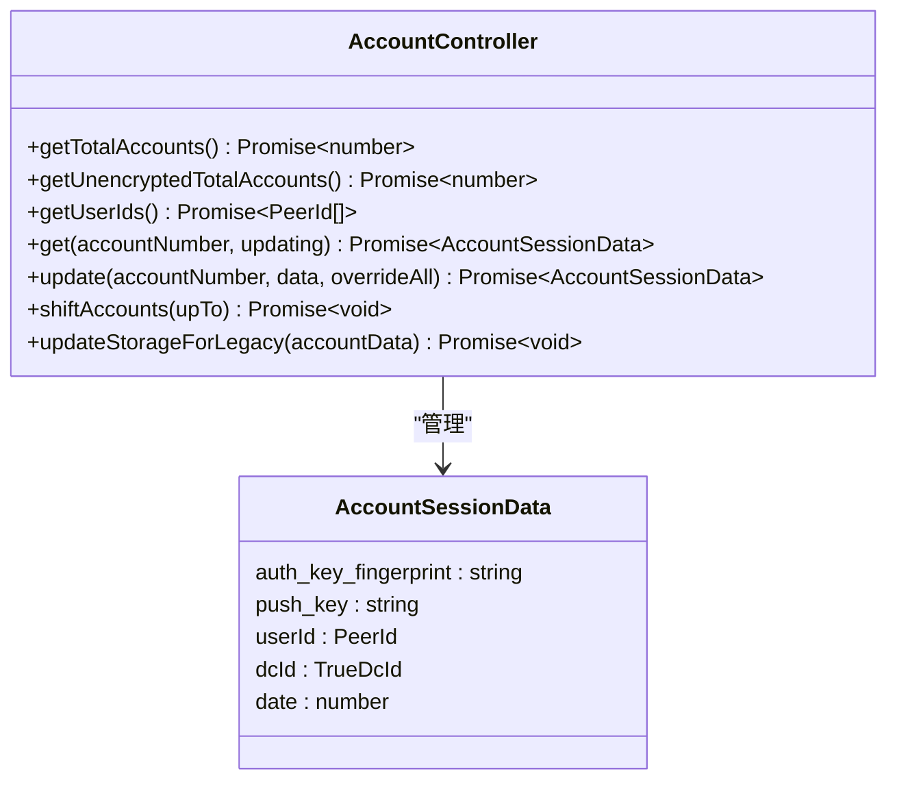
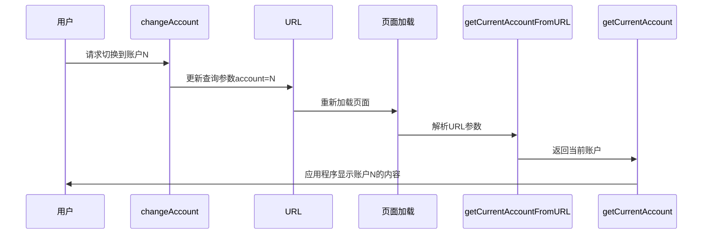
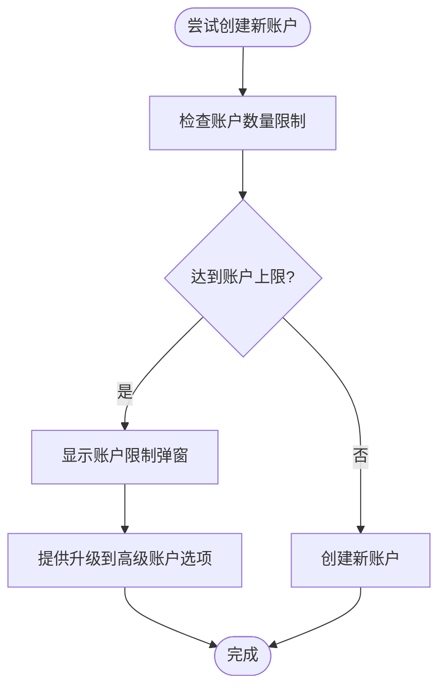

# 多账户管理

<cite>
**本文档中引用的文件**
- [accountController.ts](file://src/lib/accounts/accountController.ts)
- [changeAccount.ts](file://src/lib/accounts/changeAccount.ts)
- [constants.ts](file://src/lib/accounts/constants.ts)
- [types.d.ts](file://src/lib/accounts/types.d.ts)
- [getCurrentAccount.ts](file://src/lib/accounts/getCurrentAccount.ts)
- [getCurrentAccountFromURL.ts](file://src/lib/accounts/getCurrentAccountFromURL.ts)
- [getValidatedAccount.ts](file://src/lib/accounts/getValidatedAccount.ts)
- [createAppURLForAccount.ts](file://src/lib/accounts/createAppURLForAccount.ts)
- [accountsLimitPopup.ts](file://src/components/sidebarLeft/accountsLimitPopup.ts)
- [accountsLimitPopupContent.tsx](file://src/components/sidebarLeft/accountsLimitPopupContent.tsx)
- [_accountsLimit.scss](file://src/scss/partials/popups/_accountsLimit.scss)
</cite>

## 目录
1. [简介](#简介)
2. [账户创建与管理](#账户创建与管理)
3. [账户切换机制](#账户切换机制)
4. [账户数据隔离与状态同步](#账户数据隔离与状态同步)
5. [账户限制与配额管理](#账户限制与配额管理)
6. [UI交互设计](#ui交互设计)
7. [账户导入导出功能](#账户导入导出功能)
8. [安全考虑](#安全考虑)
9. [通知与消息同步策略](#通知与消息同步策略)
10. [结论](#结论)

## 简介
本文档详细描述了多账户管理功能的实现机制，包括账户创建、切换、管理和数据隔离等核心功能。系统支持最多4个账户（免费用户3个，高级用户4个），通过URL参数和本地存储实现账户状态管理。

**Section sources**
- [constants.ts](file://src/lib/accounts/constants.ts#L1-L6)

## 账户创建与管理
账户管理系统通过`AccountController`类实现核心管理功能。每个账户的数据存储在浏览器的sessionStorage中，以"account{number}"为键名进行隔离存储。系统支持获取账户总数、用户ID列表以及单个账户数据的读取和更新。

账户数据包含认证密钥指纹、推送密钥、用户ID、数据中心ID等关键信息。当账户数据缺失必要字段时，系统会自动填充，如生成推送密钥或计算认证密钥指纹。

**Diagram sources**
- [accountController.ts](file://src/lib/accounts/accountController.ts#L15-L154)
- [types.d.ts](file://src/lib/accounts/types.d.ts#L1-L17)

**Section sources**
- [accountController.ts](file://src/lib/accounts/accountController.ts#L1-L154)
- [types.d.ts](file://src/lib/accounts/types.d.ts#L1-L17)

## 账户切换机制
账户切换通过URL查询参数`account`实现。当用户切换账户时，系统会更新URL中的查询参数并重新加载页面。主账户（账户1）不显示查询参数，而其他账户则通过`account=2`、`account=3`等参数标识。

`changeAccount`函数负责处理账户切换逻辑，支持在当前标签页或新标签页中打开目标账户。系统通过`getCurrentAccount`和`getCurrentAccountFromURL`函数解析当前活动账户，确保应用程序状态与URL参数保持一致。

**Diagram sources**
- [changeAccount.ts](file://src/lib/accounts/changeAccount.ts#L6-L20)
- [getCurrentAccount.ts](file://src/lib/accounts/getCurrentAccount.ts#L4-L7)
- [getCurrentAccountFromURL.ts](file://src/lib/accounts/getCurrentAccountFromURL.ts#L4-L7)

**Section sources**
- [changeAccount.ts](file://src/lib/accounts/changeAccount.ts#L1-L21)
- [getCurrentAccount.ts](file://src/lib/accounts/getCurrentAccount.ts#L1-L8)
- [getCurrentAccountFromURL.ts](file://src/lib/accounts/getCurrentAccountFromURL.ts#L1-L8)
- [getValidatedAccount.ts](file://src/lib/accounts/getValidatedAccount.ts#L1-L7)

## 账户数据隔离与状态同步
系统通过独立的存储键实现账户数据隔离，每个账户的数据完全分离，避免相互干扰。账户1的数据还会同步到传统存储位置，以保持向后兼容性。

当启用密码保护时，系统会限制对敏感数据的访问，确保账户安全。`updateStorageForLegacy`方法负责处理这种特殊情况，防止在设置密码时暴露密钥信息。

账户数据的更新通过`update`方法实现，支持部分更新和完全覆盖两种模式。系统在更新数据后会自动填充缺失的必要字段，并更新账户总数统计。

**Section sources**
- [accountController.ts](file://src/lib/accounts/accountController.ts#L72-L97)
- [accountController.ts](file://src/lib/accounts/accountController.ts#L116-L148)

## 账户限制与配额管理
系统对账户数量实施严格限制：免费用户最多创建3个账户，高级用户最多创建4个账户。这些限制通过`MAX_ACCOUNTS_FREE`和`MAX_ACCOUNTS_PREMIUM`常量定义，并在`MAX_ACCOUNTS`中统一引用。

当用户尝试创建超过限额的账户时，系统会显示账户限制弹窗（accountsLimitPopup），提示用户升级到高级账户以获得更多账户额度。该功能通过`accountsLimitPopup.ts`和`accountsLimitPopupContent.tsx`实现，并配有专门的SCSS样式文件进行视觉呈现。

**Diagram sources**
- [constants.ts](file://src/lib/accounts/constants.ts#L3-L5)
- [accountsLimitPopup.ts](file://src/components/sidebarLeft/accountsLimitPopup.ts#L1-L10)
- [accountsLimitPopupContent.tsx](file://src/components/sidebarLeft/accountsLimitPopupContent.tsx#L1-L50)

**Section sources**
- [constants.ts](file://src/lib/accounts/constants.ts#L1-L6)
- [accountsLimitPopup.ts](file://src/components/sidebarLeft/accountsLimitPopup.ts#L1-L10)
- [accountsLimitPopupContent.tsx](file://src/components/sidebarLeft/accountsLimitPopupContent.tsx#L1-L50)
- [_accountsLimit.scss](file://src/scss/partials/popups/_accountsLimit.scss#L1-L20)

## UI交互设计
用户界面包含账户切换器和账户列表，允许用户直观地管理和切换账户。账户切换主要通过侧边栏的账户列表实现，用户点击不同账户即可触发切换流程。

账户限制弹窗提供清晰的视觉反馈，使用SVG图形（accounts-limit-pin-shape.svg）增强用户体验。弹窗内容明确告知用户当前账户限额，并提供升级选项。

系统还提供了`createAppURLForAccount`工具函数，用于生成特定账户的应用程序URL，支持在不同上下文中保持账户状态的一致性。

**Section sources**
- [accountsLimitPopupContent.tsx](file://src/components/sidebarLeft/accountsLimitPopupContent.tsx#L1-L50)
- [createAppURLForAccount.ts](file://src/lib/accounts/createAppURLForAccount.ts#L1-L29)

## 账户导入导出功能
虽然当前代码库中未直接体现账户导入导出功能的具体实现，但系统架构为这类功能提供了基础支持。通过`AccountController`的`get`和`update`方法，可以方便地读取和写入账户数据。

账户数据以结构化的JSON格式存储在sessionStorage中，这种设计使得数据的序列化和反序列化变得简单，为实现账户数据的导入导出功能奠定了基础。

未来可以基于现有API扩展导入导出功能，例如通过加密文件的形式保存和恢复账户配置。

**Section sources**
- [accountController.ts](file://src/lib/accounts/accountController.ts#L32-L39)
- [accountController.ts](file://src/lib/accounts/accountController.ts#L72-L97)

## 安全考虑
系统在多账户管理中实施了多项安全措施。首先，账户敏感数据（如认证密钥）存储在sessionStorage中，而非更持久的localStorage，降低了数据泄露风险。

其次，系统实现了密码保护机制，通过`DeferredIsUsingPasscode`检查是否启用了密码保护。当密码保护启用时，`updateStorageForLegacy`方法会阻止敏感数据的暴露。

推送密钥通过`bytesToHex(randomize(new Uint8Array(256)))`生成，确保了密钥的随机性和安全性。认证密钥指纹从完整的认证密钥派生，避免了直接存储完整的敏感密钥。

**Section sources**
- [accountController.ts](file://src/lib/accounts/accountController.ts#L117-L118)
- [accountController.ts](file://src/lib/accounts/accountController.ts#L65-L66)

## 通知与消息同步策略
多账户场景下的通知和消息同步依赖于独立的推送密钥系统。每个账户拥有独立的`push_key`，确保推送通知能够准确路由到正确的账户。

消息同步通过账户特定的数据存储实现，每个账户的消息历史、设置和状态都独立存储，避免了不同账户间的消息混淆。URL参数机制确保了在多标签页环境中，每个标签页都能正确识别和显示对应账户的内容。

当用户在不同设备间切换时，账户状态通过服务器端同步，本地只缓存当前会话数据，保证了数据的一致性和安全性。

**Section sources**
- [types.d.ts](file://src/lib/accounts/types.d.ts#L9-L10)
- [accountController.ts](file://src/lib/accounts/accountController.ts#L63-L69)

## 结论
多账户管理系统通过清晰的架构设计和稳健的实现，提供了安全可靠的多账户管理功能。系统采用URL参数驱动的账户切换机制，结合本地存储的数据隔离策略，实现了高效且用户友好的账户管理体验。

通过`AccountController`为核心的管理类，系统提供了完整的账户生命周期管理功能，包括创建、读取、更新和删除操作。账户限制机制和相应的UI反馈为商业模型提供了支持，而安全措施则确保了用户数据的保密性。

该设计具有良好的扩展性，为未来添加账户导入导出、云同步等高级功能奠定了坚实的基础。