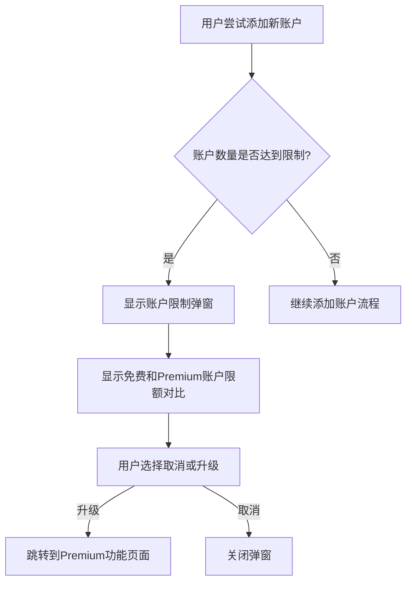
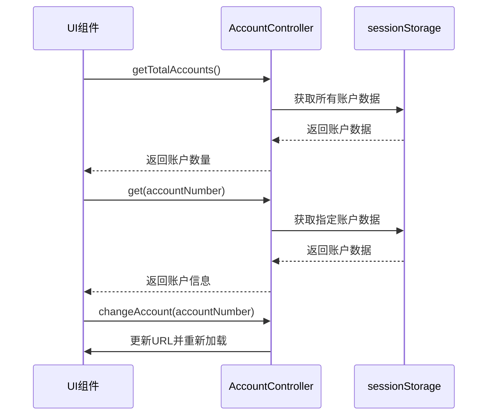
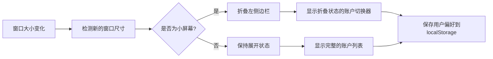

# 账户UI交互

<cite>
**本文档引用的文件**  
- [index.ts](file://src/components/sidebarLeft/index.ts)
- [accountsLimitPopup.ts](file://src/components/sidebarLeft/accountsLimitPopup.ts)
- [accountsLimitPopupContent.tsx](file://src/components/sidebarLeft/accountsLimitPopupContent.tsx)
- [accountController.ts](file://src/lib/accounts/accountController.ts)
- [changeAccount.ts](file://src/lib/accounts/changeAccount.ts)
- [windowSize.ts](file://src/helpers/windowSize.ts)
</cite>

## 目录
1. [简介](#简介)
2. [账户切换器实现](#账户切换器实现)
3. [账户列表展示](#账户列表展示)
4. [账户限制弹窗](#账户限制弹窗)
5. [UI与账户管理器通信机制](#ui与账户管理器通信机制)
6. [账户状态视觉反馈](#账户状态视觉反馈)
7. [响应式设计考虑](#响应式设计考虑)
8. [无障碍访问支持](#无障碍访问支持)
9. [结论](#结论)

## 简介
本文档详细描述了Telegram Web客户端中账户管理UI的实现，包括账户切换器、账户列表和账户限制弹窗的交互设计。文档涵盖了UI组件与底层账户管理器的通信机制、账户状态的视觉反馈设计、响应式布局适配以及无障碍访问支持的实现细节。

## 账户切换器实现
账户切换器通过左侧边栏的工具菜单实现，用户可以通过点击工具菜单中的账户选项来切换不同账户。当用户选择切换账户时，系统会先保存当前账户的加密密钥（如果启用了密码保护），然后调用`changeAccount`函数执行账户切换操作。切换过程中，界面会显示过渡动画，确保用户体验的流畅性。

**Section sources**
- [index.ts](file://src/components/sidebarLeft/index.ts#L655-L687)
- [changeAccount.ts](file://src/lib/accounts/changeAccount.ts#L6-L20)

## 账户列表展示
账户列表在工具菜单中动态生成，显示所有已登录账户的信息。当前账户会以高亮状态显示，并在账户头像旁显示活动状态标识。其他账户会显示未读通知数量的徽章。账户列表支持通过Ctrl/Cmd+数字快捷键快速切换账户。

**Section sources**
- [index.ts](file://src/components/sidebarLeft/index.ts#L783-L843)
- [accountController.ts](file://src/lib/accounts/accountController.ts#L16-L30)

## 账户限制弹窗
当免费用户尝试添加超过限制的账户时，系统会显示账户限制弹窗。弹窗采用模态对话框形式，包含视觉化的账户数量限制指示器，显示免费账户限制（4个）和Premium账户限制（8个）的对比。用户可以选择取消操作或升级到Premium以增加账户限额。

**Diagram sources**
- [accountsLimitPopup.ts](file://src/components/sidebarLeft/accountsLimitPopup.ts#L5-L23)
- [accountsLimitPopupContent.tsx](file://src/components/sidebarLeft/accountsLimitPopupContent.tsx#L7-L41)

## UI与账户管理器通信机制
UI组件通过AccountController类与底层账户管理系统通信。AccountController提供了一系列静态方法用于获取和更新账户信息，包括`getTotalAccounts`、`get`和`update`等。当需要切换账户时，UI调用`changeAccount`函数，该函数会更新URL参数并重新加载页面以切换到目标账户。

**Diagram sources**
- [accountController.ts](file://src/lib/accounts/accountController.ts#L15-L154)
- [changeAccount.ts](file://src/lib/accounts/changeAccount.ts#L6-L20)

## 账户状态视觉反馈
账户状态通过多种视觉元素进行反馈。当前账户在列表中高亮显示，并在头像旁显示活动状态。未读通知通过红色徽章显示在工具按钮上，不同账户的未读数量也会在账户列表中分别显示。账户头像采用圆形设计，大小统一为30px，确保视觉一致性。

**Section sources**
- [index.ts](file://src/components/sidebarLeft/index.ts#L162-L165)
- [index.ts](file://src/components/sidebarLeft/index.ts#L810-L814)

## 响应式设计考虑
账户管理界面采用响应式设计，适配不同屏幕尺寸。在小屏幕设备上，左侧边栏可以折叠，账户切换功能通过专门的触发器按钮访问。界面宽度可由用户调整，并将偏好设置保存在localStorage中。当窗口大小变化时，系统会自动调整布局，确保内容的可访问性。

**Diagram sources**
- [index.ts](file://src/components/sidebarLeft/index.ts#L577-L612)
- [windowSize.ts](file://src/helpers/windowSize.ts#L11-L64)

## 无障碍访问支持
系统实现了多项无障碍访问功能。所有交互元素都具有适当的ARIA标签和键盘导航支持。账户切换操作可以通过键盘快捷键完成，提高了效率。弹窗和对话框实现了焦点管理，确保屏幕阅读器用户能够正确理解界面状态。所有图标都配有文字替代内容，确保信息的可访问性。

**Section sources**
- [index.ts](file://src/components/sidebarLeft/index.ts#L378-L389)
- [index.ts](file://src/components/sidebarLeft/index.ts#L1417-L1418)

## 结论
Telegram Web客户端的账户管理UI设计注重用户体验和可访问性。通过清晰的视觉反馈、流畅的交互动画和响应式布局，系统为用户提供了便捷的多账户管理功能。账户限制弹窗的设计既明确了功能限制，又提供了升级路径，平衡了免费用户和Premium用户的体验。整体实现体现了对细节的关注和对用户需求的深入理解。