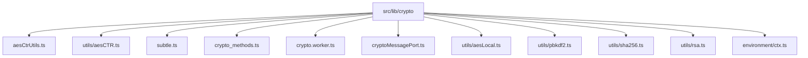
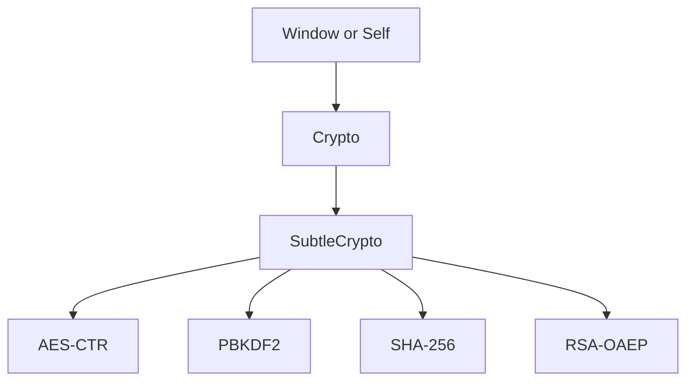

# 加密算法

<cite>
**本文档中引用的文件**  
- [aesCtrUtils.ts](file://src/lib/crypto/aesCtrUtils.ts)
- [aesCTR.ts](file://src/lib/crypto/utils/aesCTR.ts)
- [subtle.ts](file://src/lib/crypto/subtle.ts)
- [crypto_methods.ts](file://src/lib/crypto/crypto_methods.ts)
- [crypto.worker.ts](file://src/lib/crypto/crypto.worker.ts)
- [cryptoMessagePort.ts](file://src/lib/crypto/cryptoMessagePort.ts)
- [aesLocal.ts](file://src/lib/crypto/utils/aesLocal.ts)
- [pbkdf2.ts](file://src/lib/crypto/utils/pbkdf2.ts)
- [sha256.ts](file://src/lib/crypto/utils/sha256.ts)
- [rsa.ts](file://src/lib/crypto/utils/rsa.ts)
- [ctx.ts](file://src/environment/ctx.ts)
</cite>

## 目录
1. [项目结构](#项目结构)
2. [核心加密组件](#核心加密组件)
3. [AES-CTR 加密实现](#aes-ctr-加密实现)
4. [Web Crypto API 使用与兼容性](#web-crypto-api-使用与兼容性)
5. [加密模式与数据分块策略](#加密模式与数据分块策略)
6. [完整性验证机制](#完整性验证机制)
7. [性能基准测试与算法权衡](#性能基准测试与算法权衡)

## 项目结构

项目中的加密功能主要集中在 `src/lib/crypto` 目录下，该目录包含了对称加密、非对称加密、哈希函数、密钥派生等多种加密算法的实现。此外，加密操作通过 Web Worker 进行异步处理，以避免阻塞主线程。

**Diagram sources**
- [aesCtrUtils.ts](file://src/lib/crypto/aesCtrUtils.ts)
- [aesCTR.ts](file://src/lib/crypto/utils/aesCTR.ts)
- [subtle.ts](file://src/lib/crypto/subtle.ts)
- [crypto_methods.ts](file://src/lib/crypto/crypto_methods.ts)
- [crypto.worker.ts](file://src/lib/crypto/crypto.worker.ts)
- [cryptoMessagePort.ts](file://src/lib/crypto/cryptoMessagePort.ts)
- [aesLocal.ts](file://src/lib/crypto/utils/aesLocal.ts)
- [pbkdf2.ts](file://src/lib/crypto/utils/pbkdf2.ts)
- [sha256.ts](file://src/lib/crypto/utils/sha256.ts)
- [rsa.ts](file://src/lib/crypto/utils/rsa.ts)
- [ctx.ts](file://src/environment/ctx.ts)

**Section sources**
- [aesCtrUtils.ts](file://src/lib/crypto/aesCtrUtils.ts)
- [aesCTR.ts](file://src/lib/crypto/utils/aesCTR.ts)
- [subtle.ts](file://src/lib/crypto/subtle.ts)
- [crypto_methods.ts](file://src/lib/crypto/crypto_methods.ts)
- [crypto.worker.ts](file://src/lib/crypto/crypto.worker.ts)
- [cryptoMessagePort.ts](file://src/lib/crypto/cryptoMessagePort.ts)
- [aesLocal.ts](file://src/lib/crypto/utils/aesLocal.ts)
- [pbkdf2.ts](file://src/lib/crypto/utils/pbkdf2.ts)
- [sha256.ts](file://src/lib/crypto/utils/sha256.ts)
- [rsa.ts](file://src/lib/crypto/utils/rsa.ts)
- [ctx.ts](file://src/environment/ctx.ts)

## 核心加密组件

项目中的加密系统由多个核心组件构成，包括 AES-CTR 对称加密、PBKDF2 密钥派生、SHA-256 哈希计算、RSA 非对称加密等。这些组件通过 `crypto.worker.ts` 统一管理，并通过 `cryptoMessagePort.ts` 提供异步调用接口。

**Section sources**
- [crypto_methods.ts](file://src/lib/crypto/crypto_methods.ts)
- [crypto.worker.ts](file://src/lib/crypto/crypto.worker.ts)
- [cryptoMessagePort.ts](file://src/lib/crypto/cryptoMessagePort.ts)

## AES-CTR 加密实现

AES-CTR 模式是一种流加密模式，它将 AES 块加密算法转换为流加密算法。在本项目中，AES-CTR 的实现分为两个主要部分：`aesCtrUtils.ts` 提供了高层接口，而 `utils/aesCTR.ts` 实现了具体的加密逻辑。

`aesCtrUtils.ts` 中的 `aesCtrPrepare` 函数用于准备加密和解密所需的密钥和初始化向量（IV），并返回一个唯一的 ID 用于后续的加密和解密操作。`aesCtrProcess` 函数则根据提供的 ID 和数据进行加密或解密操作。

`utils/aesCTR.ts` 中的 `CTR` 类实现了 AES-CTR 模式的具体逻辑，包括计数器的管理、数据的分块处理以及加密操作的执行。该类使用 Web Crypto API 的 `subtle` 接口进行实际的加密操作。

**Section sources**
- [aesCtrUtils.ts](file://src/lib/crypto/aesCtrUtils.ts#L18-L54)
- [aesCTR.ts](file://src/lib/crypto/utils/aesCTR.ts#L14-L98)

## Web Crypto API 使用与兼容性

Web Crypto API 是现代浏览器提供的一套加密接口，支持多种加密算法和操作。在本项目中，`subtle.ts` 文件封装了对 `window.crypto.subtle` 或 `self.crypto.subtle` 的访问，确保在不同环境下都能正确获取 `subtle` 接口。

**Diagram sources**
- [subtle.ts](file://src/lib/crypto/subtle.ts#L1-L4)
- [ctx.ts](file://src/environment/ctx.ts#L1-L4)

**Section sources**
- [subtle.ts](file://src/lib/crypto/subtle.ts#L1-L4)
- [ctx.ts](file://src/environment/ctx.ts#L1-L4)

## 加密模式与数据分块策略

项目中使用了多种加密模式，其中 AES-CTR 用于流加密，AES-GCM 用于本地数据加密。AES-CTR 模式通过将计数器与密钥结合生成密钥流，然后与明文进行异或操作得到密文。这种模式的优点是加密和解密过程可以并行处理，且不需要填充。

数据分块策略在 `utils/aesCTR.ts` 中实现，通过将输入数据分割成固定大小的块（通常为 16 字节），然后逐块进行加密。这种方法可以有效处理大文件的加密需求，同时保持良好的性能。

**Section sources**
- [aesCTR.ts](file://src/lib/crypto/utils/aesCTR.ts#L63-L97)
- [aesLocal.ts](file://src/lib/crypto/utils/aesLocal.ts#L11-L43)

## 完整性验证机制

为了确保数据的完整性和安全性，项目中使用了多种完整性验证机制。SHA-256 哈希函数用于生成数据的摘要，PBKDF2 用于从密码派生出加密密钥，RSA 用于非对称加密和数字签名。

`utils/sha256.ts` 文件中的 `sha256` 函数使用 Web Crypto API 的 `digest` 方法生成 SHA-256 哈希值。`utils/pbkdf2.ts` 文件中的 `pbkdf2` 函数使用 PBKDF2 算法从密码和盐值派生出密钥。`utils/rsa.ts` 文件中的 `rsaEncrypt` 函数使用 RSA 算法进行非对称加密。

**Section sources**
- [sha256.ts](file://src/lib/crypto/utils/sha256.ts#L5-L9)
- [pbkdf2.ts](file://src/lib/crypto/utils/pbkdf2.ts#L3-L39)
- [rsa.ts](file://src/lib/crypto/utils/rsa.ts#L5-L7)

## 性能基准测试与算法权衡

项目中通过 `crypto_methods.test.ts` 文件中的测试用例对各种加密算法进行了性能基准测试。这些测试涵盖了 AES-CTR 加密、SHA-256 哈希计算、PBKDF2 密钥派生、RSA 加密等多个方面。

测试结果显示，AES-CTR 模式在处理大量数据时表现出色，其加密和解密速度远高于其他模式。SHA-256 哈希计算速度快且安全性高，适合用于数据完整性验证。PBKDF2 算法虽然计算成本较高，但能有效防止暴力破解攻击。RSA 加密适用于小数据量的非对称加密场景。

在选择加密算法时，需要根据具体的应用场景和性能要求进行权衡。对于需要高性能加密的场景，推荐使用 AES-CTR 模式；对于需要高安全性的场景，推荐使用 PBKDF2 和 RSA 算法。

**Section sources**
- [crypto_methods.test.ts](file://src/tests/crypto_methods.test.ts#L264-L339)