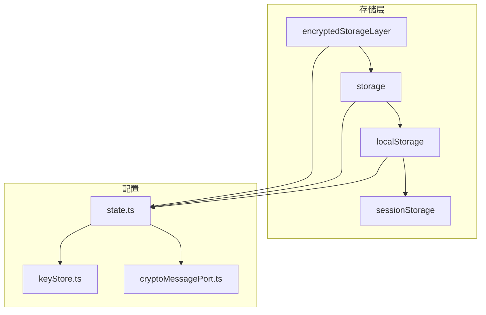
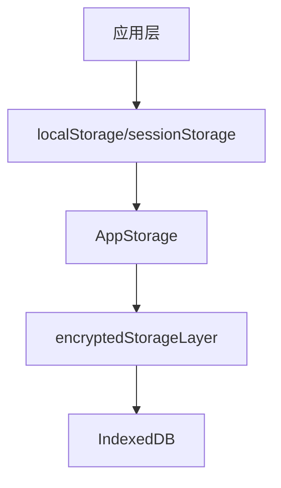
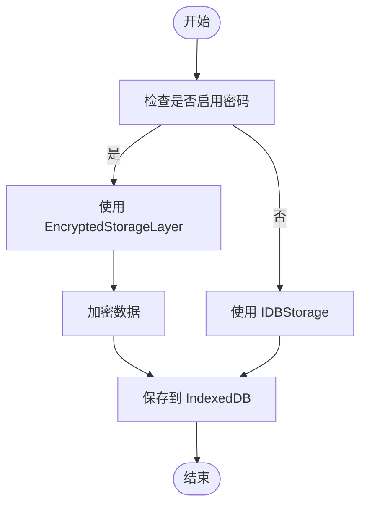
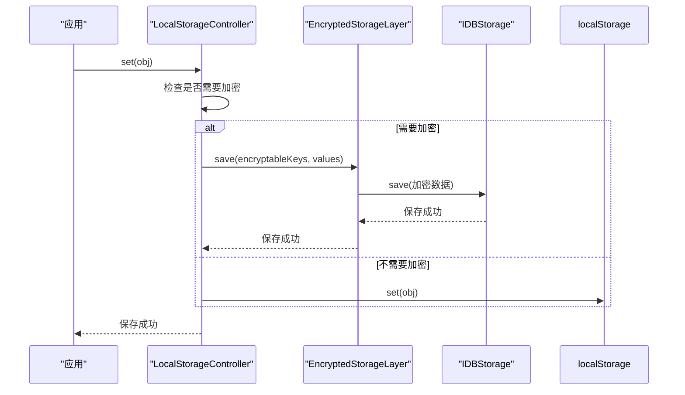
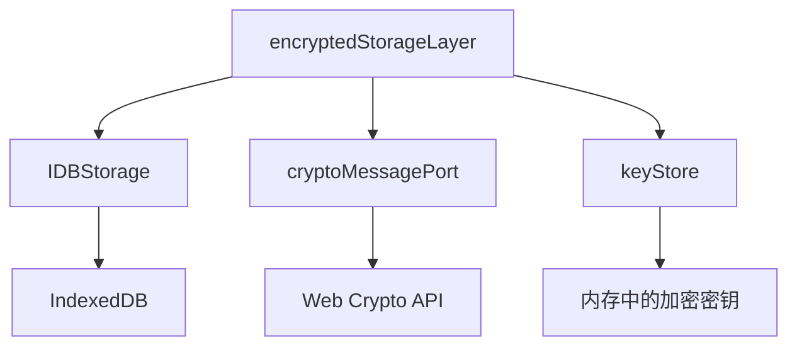

# 存储集成

<cite>
**本文档中引用的文件**  
- [encryptedStorageLayer.ts](file://src/lib/encryptedStorageLayer.ts)
- [storage.ts](file://src/lib/storage.ts)
- [localStorage.ts](file://src/lib/localStorage.ts)
- [sessionStorage.ts](file://src/lib/sessionStorage.ts)
- [state.ts](file://src/config/databases/state.ts)
- [keyStore.ts](file://src/lib/passcode/keyStore.ts)
- [cryptoMessagePort.ts](file://src/lib/crypto/cryptoMessagePort.ts)
- [commonStateStorage.ts](file://src/lib/commonStateStorage.ts)
- [stateStorage.ts](file://src/lib/stateStorage.ts)
</cite>

## 目录
1. [简介](#简介)
2. [项目结构](#项目结构)
3. [核心组件](#核心组件)
4. [架构概述](#架构概述)
5. [详细组件分析](#详细组件分析)
6. [依赖分析](#依赖分析)
7. [性能考虑](#性能考虑)
8. [故障排除指南](#故障排除指南)
9. [结论](#结论)

## 简介
本文档详细说明了 `encryptedStorageLayer` 如何将加密功能透明地集成到 `localStorage` 和 `IndexedDB` 中。文档涵盖了数据序列化、加密和持久化的完整流程，解释了读写操作的性能开销和优化策略（如批量加密和缓存机制），并描述了错误处理流程、数据恢复方案以及在低内存环境下的行为。此外，还提供了与其他存储模块的交互示例。

## 项目结构
项目中的存储系统由多个组件构成，主要位于 `src/lib` 目录下。核心的存储实现包括 `encryptedStorageLayer.ts`、`storage.ts`、`localStorage.ts` 和 `sessionStorage.ts`。这些文件共同构成了一个分层的存储架构，支持加密和非加密数据的持久化。



**Diagram sources**
- [encryptedStorageLayer.ts](file://src/lib/encryptedStorageLayer.ts)
- [storage.ts](file://src/lib/storage.ts)
- [localStorage.ts](file://src/lib/localStorage.ts)
- [sessionStorage.ts](file://src/lib/sessionStorage.ts)
- [state.ts](file://src/config/databases/state.ts)

**Section sources**
- [encryptedStorageLayer.ts](file://src/lib/encryptedStorageLayer.ts)
- [storage.ts](file://src/lib/storage.ts)
- [localStorage.ts](file://src/lib/localStorage.ts)
- [sessionStorage.ts](file://src/lib/sessionStorage.ts)
- [state.ts](file://src/config/databases/state.ts)

## 核心组件
`encryptedStorageLayer` 是实现加密存储的核心组件，它通过 AES 加密算法对数据进行加密，并将其存储在 `IndexedDB` 中。该组件通过 `StorageLayer` 接口与上层应用交互，提供了 `save`、`get`、`delete` 等方法。

**Section sources**
- [encryptedStorageLayer.ts](file://src/lib/encryptedStorageLayer.ts)
- [storage.ts](file://src/lib/storage.ts)

## 架构概述
存储系统的架构分为多个层次，从上层的 `localStorage` 和 `sessionStorage` 到底层的 `IndexedDB`。`encryptedStorageLayer` 作为中间层，负责处理加密和解密逻辑，并将数据持久化到 `IndexedDB`。



**Diagram sources**
- [localStorage.ts](file://src/lib/localStorage.ts)
- [storage.ts](file://src/lib/storage.ts)
- [encryptedStorageLayer.ts](file://src/lib/encryptedStorageLayer.ts)

## 详细组件分析

### encryptedStorageLayer 分析
`encryptedStorageLayer` 是一个单例类，通过 `getInstance` 方法获取实例。它使用 `IDBStorage` 与 `IndexedDB` 交互，并通过 `cryptoMessagePort` 调用加密算法。

#### 类图
```mermaid
classDiagram
class EncryptedStorageLayer {
+static STORAGE_KEY : string
+static STORAGE_THROTTLE_TIME_MS : number
+static instances : Map~string, EncryptedStorageLayer~
-storage : IDBStorage
-data : StoredData
-log : Logger
-loadingDataPromise : Promise~unknown~
+getInstance(db : T, encryptedStoreName : string) : EncryptedStorageLayer~T~
+loadEncrypted() : void
+loadDecrypted(data : StoredData) : Promise~void~
+waitToLoad() : Promise~unknown~
+saveToIDB() : Promise~void~
+saveToIDBThrottled() : void
+loadFromIDB() : Promise~StoredData~
+reEncrypt() : Promise~void~
+save(entryName : string | string[], value : any | any[]) : Promise~void~
+get~T~(entryNames : string[]) : Promise~T[]~
+getAllEntries() : Promise~IDBStorage.Entries~
+getAll~T~() : Promise~T[]~
+getAllKeys() : Promise~IDBValidKey[]~
+delete(entryName : string | string[]) : Promise~void~
+clear() : Promise~void~
}
class IDBStorage {
+save(entryName : string | string[], value : any | any[]) : Promise~unknown~
+get~T~(entryNames : string[]) : Promise~T[]~
+getAllEntries() : Promise~IDBStorage.Entries~
+getAll~T~() : Promise~T[]~
+getAllKeys() : Promise~IDBValidKey[]~
+delete(entryName : string | string[]) : Promise~void~
+clear() : Promise~void~
}
class cryptoMessagePort {
+invokeCryptoNew(payload : {method : string, args : any[], transfer? : Transferable[]}) : Promise~any~
+invokeCrypto(method : string, ...args : any[]) : Promise~any~
+sendToOnePort(port : MessagePort) : void
}
EncryptedStorageLayer --> IDBStorage : "使用"
EncryptedStorageLayer --> cryptoMessagePort : "使用"
```

**Diagram sources**
- [encryptedStorageLayer.ts](file://src/lib/encryptedStorageLayer.ts)
- [files/idb.ts](file://src/lib/files/idb.ts)
- [crypto/cryptoMessagePort.ts](file://src/lib/crypto/cryptoMessagePort.ts)

#### 数据流图


**Diagram sources**
- [encryptedStorageLayer.ts](file://src/lib/encryptedStorageLayer.ts)
- [storage.ts](file://src/lib/storage.ts)

**Section sources**
- [encryptedStorageLayer.ts](file://src/lib/encryptedStorageLayer.ts)
- [storage.ts](file://src/lib/storage.ts)

### localStorage 分析
`localStorage` 组件通过 `LocalStorageController` 管理加密和非加密数据的存储。它根据配置决定是否使用 `encryptedStorageLayer` 进行加密存储。

#### 序列图


**Diagram sources**
- [localStorage.ts](file://src/lib/localStorage.ts)
- [encryptedStorageLayer.ts](file://src/lib/encryptedStorageLayer.ts)
- [files/idb.ts](file://src/lib/files/idb.ts)

**Section sources**
- [localStorage.ts](file://src/lib/localStorage.ts)

## 依赖分析
存储系统依赖于多个组件，包括 `IDBStorage` 用于与 `IndexedDB` 交互，`cryptoMessagePort` 用于加密操作，以及 `keyStore` 用于管理加密密钥。



**Diagram sources**
- [encryptedStorageLayer.ts](file://src/lib/encryptedStorageLayer.ts)
- [files/idb.ts](file://src/lib/files/idb.ts)
- [crypto/cryptoMessagePort.ts](file://src/lib/crypto/cryptoMessagePort.ts)
- [passcode/keyStore.ts](file://src/lib/passcode/keyStore.ts)

**Section sources**
- [encryptedStorageLayer.ts](file://src/lib/encryptedStorageLayer.ts)
- [files/idb.ts](file://src/lib/files/idb.ts)
- [crypto/cryptoMessagePort.ts](file://src/lib/crypto/cryptoMessagePort.ts)
- [passcode/keyStore.ts](file://src/lib/passcode/keyStore.ts)

## 性能考虑
`encryptedStorageLayer` 通过 `asyncThrottle` 优化了写入性能，避免了频繁的磁盘写入操作。此外，`localStorage` 和 `sessionStorage` 的读写操作也经过了缓存优化，减少了对底层存储的直接访问。

**Section sources**
- [encryptedStorageLayer.ts](file://src/lib/encryptedStorageLayer.ts)
- [storage.ts](file://src/lib/storage.ts)

## 故障排除指南
在使用存储系统时，可能会遇到以下问题：
- **加密密钥丢失**：确保 `keyStore` 中的加密密钥正确保存。
- **IndexedDB 写入失败**：检查浏览器是否支持 `IndexedDB`，并确保有足够的磁盘空间。
- **数据不一致**：在启用或禁用加密时，确保调用 `toggleEncryptedForAll` 方法以同步所有存储实例。

**Section sources**
- [encryptedStorageLayer.ts](file://src/lib/encryptedStorageLayer.ts)
- [storage.ts](file://src/lib/storage.ts)
- [passcode/keyStore.ts](file://src/lib/passcode/keyStore.ts)

## 结论
`encryptedStorageLayer` 提供了一个透明且高效的加密存储解决方案，能够无缝集成到现有的 `localStorage` 和 `IndexedDB` 系统中。通过合理的架构设计和性能优化，该组件确保了数据的安全性和持久性，同时保持了良好的用户体验。