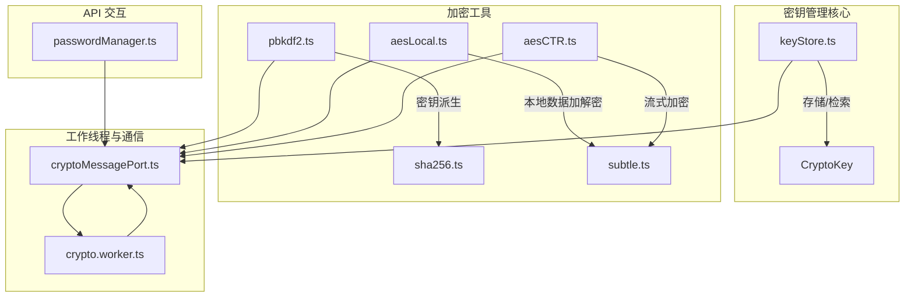
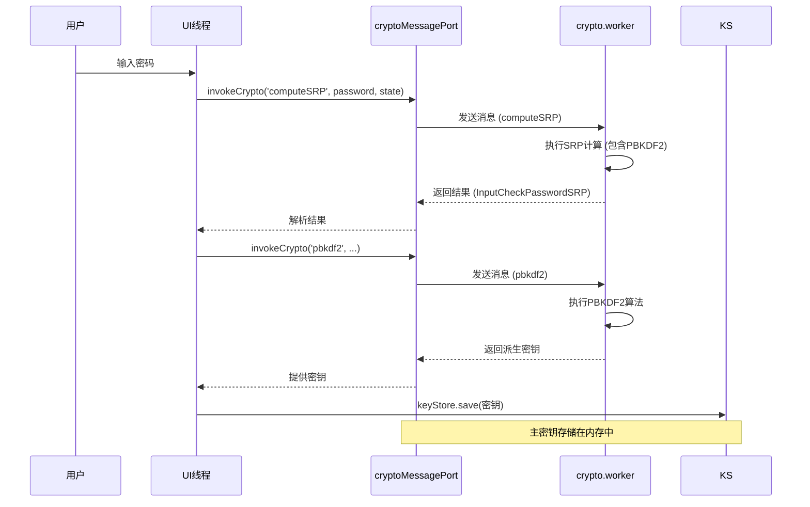
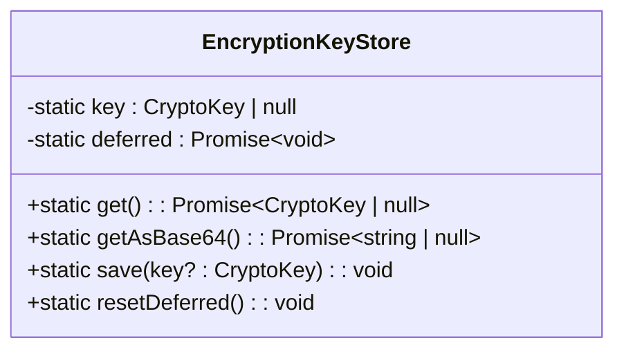
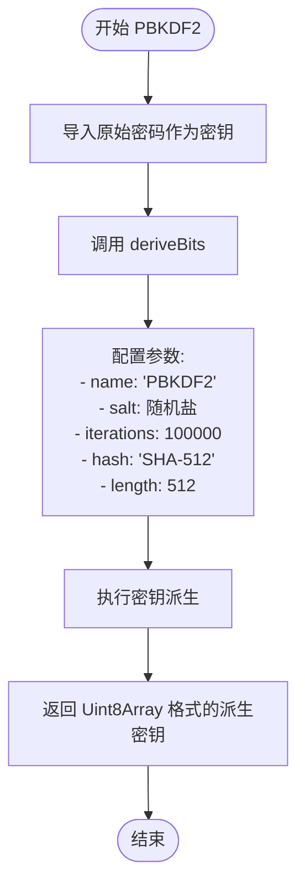
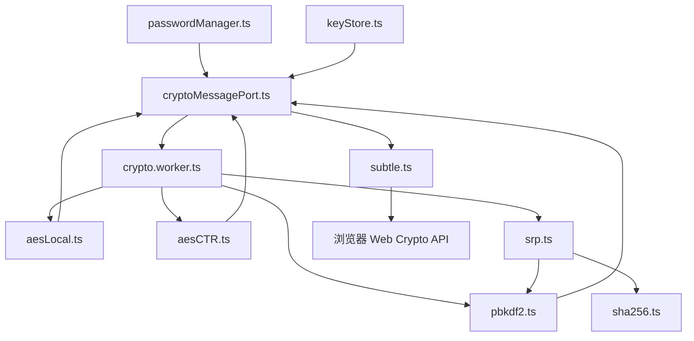

# 密钥管理

<cite>
**本文档中引用的文件**  
- [keyStore.ts](file://src/lib/passcode/keyStore.ts)
- [pbkdf2.ts](file://src/lib/crypto/utils/pbkdf2.ts)
- [srp.ts](file://src/lib/crypto/srp.ts)
- [crypto_methods.ts](file://src/lib/crypto/crypto_methods.ts)
- [aesLocal.ts](file://src/lib/crypto/utils/aesLocal.ts)
- [cryptoMessagePort.ts](file://src/lib/crypto/cryptoMessagePort.ts)
- [crypto.worker.ts](file://src/lib/crypto/crypto.worker.ts)
- [passwordManager.ts](file://src/lib/mtproto/passwordManager.ts)
- [subtle.ts](file://src/lib/crypto/subtle.ts)
</cite>

## 目录
1. [简介](#简介)
2. [项目结构](#项目结构)
3. [核心组件](#核心组件)
4. [架构概述](#架构概述)
5. [详细组件分析](#详细组件分析)
6. [依赖分析](#依赖分析)
7. [性能考虑](#性能考虑)
8. [故障排除指南](#故障排除指南)
9. [结论](#结论)

## 简介
本文档详细阐述了`tweb`项目中密钥管理模块的设计与实现，重点分析了`keyStore`模块如何安全地存储和检索加密密钥。文档涵盖了密钥派生函数（KDF）的实现、使用PBKDF2进行密码强化的过程、主密钥与数据加密密钥的分层结构、密钥更新和轮换机制，以及密钥与用户密码锁的集成方式。同时，提供了密钥安全存储的最佳实践和潜在风险缓解措施。

## 项目结构
密钥管理功能主要分布在`src/lib`目录下的多个子模块中。核心的密钥存储逻辑位于`passcode`模块，而加密算法和密钥派生功能则分散在`crypto`模块中。`mtproto`模块负责与Telegram后端API进行交互，处理密码验证和设置。

**图示来源**
- [keyStore.ts](file://src/lib/passcode/keyStore.ts)
- [pbkdf2.ts](file://src/lib/crypto/utils/pbkdf2.ts)
- [aesLocal.ts](file://src/lib/crypto/utils/aesLocal.ts)
- [aesCTR.ts](file://src/lib/crypto/utils/aesCTR.ts)
- [cryptoMessagePort.ts](file://src/lib/crypto/cryptoMessagePort.ts)
- [crypto.worker.ts](file://src/lib/crypto/crypto.worker.ts)
- [passwordManager.ts](file://src/lib/mtproto/passwordManager.ts)

**本节来源**
- [src/lib/passcode](file://src/lib/passcode)
- [src/lib/crypto](file://src/lib/crypto)
- [src/lib/mtproto](file://src/lib/mtproto)

## 核心组件
密钥管理的核心组件包括`EncryptionKeyStore`类，它负责在内存中安全地存储和提供主加密密钥。该密钥用于派生其他数据加密密钥。密钥的生成依赖于`pbkdf2`函数，该函数使用PBKDF2算法对用户密码进行强化。整个加密操作在独立的`crypto.worker.ts`工作线程中执行，通过`cryptoMessagePort.ts`进行通信，以确保主线程的性能不受影响。

**本节来源**
- [keyStore.ts](file://src/lib/passcode/keyStore.ts#L5-L38)
- [pbkdf2.ts](file://src/lib/crypto/utils/pbkdf2.ts#L3-L38)
- [cryptoMessagePort.ts](file://src/lib/crypto/cryptoMessagePort.ts#L20-L67)

## 架构概述
系统的密钥管理采用分层架构。用户输入的密码首先通过SRP（安全远程密码）协议或直接通过PBKDF2算法进行处理，生成一个强密钥。这个密钥被`EncryptionKeyStore`安全地存储在内存中，并作为主密钥。当需要加密或解密本地数据时，系统会使用主密钥配合`AES-GCM`或`AES-CTR`模式进行操作。所有加密计算都在一个或多个Web Worker中异步执行，通过`cryptoMessagePort`进行消息传递，实现了计算与UI的分离。

**图示来源**
- [srp.ts](file://src/lib/crypto/srp.ts#L17-L166)
- [pbkdf2.ts](file://src/lib/crypto/utils/pbkdf2.ts#L3-L38)
- [cryptoMessagePort.ts](file://src/lib/crypto/cryptoMessagePort.ts#L56-L58)
- [crypto.worker.ts](file://src/lib/crypto/crypto.worker.ts#L53-L57)
- [keyStore.ts](file://src/lib/passcode/keyStore.ts#L25-L28)

## 详细组件分析

### keyStore 模块分析
`EncryptionKeyStore`类是一个静态工具类，用于集中管理应用的主加密密钥。它使用`CryptoKey`对象来存储密钥，该对象由浏览器的Web Crypto API创建，通常不会以明文形式暴露在JavaScript环境中，从而提高了安全性。

#### 类图

**图示来源**
- [keyStore.ts](file://src/lib/passcode/keyStore.ts#L5-L38)

**本节来源**
- [keyStore.ts](file://src/lib/passcode/keyStore.ts#L1-L39)

### 密钥派生函数 (KDF) 分析
系统使用PBKDF2（基于密码的密钥派生函数2）来强化用户密码。`pbkdf2.ts`文件中的函数利用Web Crypto API的`deriveBits`方法，以SHA-512作为哈希函数，进行100,000次迭代，将用户密码和盐值转换为一个512位的密钥材料。这个过程极大地增加了暴力破解的难度。

#### 流程图

**图示来源**
- [pbkdf2.ts](file://src/lib/crypto/utils/pbkdf2.ts#L3-L38)
- [subtle.ts](file://src/lib/crypto/subtle.ts#L1-L4)

### 密码验证与设置分析
`passwordManager.ts`和`srp.ts`共同实现了与Telegram后端的密码交互。`srp.ts`中的`makePasswordHash`函数是关键，它首先对密码进行SHA-256哈希，然后使用PBKDF2进行强化，最后再进行一次SHA-256哈希，生成最终的密码哈希。`passwordManager`则负责调用这些函数，并通过API与服务器通信。

**本节来源**
- [srp.ts](file://src/lib/crypto/srp.ts#L17-L28)
- [passwordManager.ts](file://src/lib/mtproto/passwordManager.ts#L45-L60)

## 依赖分析
密钥管理模块的依赖关系清晰，体现了良好的关注点分离。

**图示来源**
- [passwordManager.ts](file://src/lib/mtproto/passwordManager.ts#L45)
- [keyStore.ts](file://src/lib/passcode/keyStore.ts#L10)
- [pbkdf2.ts](file://src/lib/crypto/utils/pbkdf2.ts#L1)
- [aesLocal.ts](file://src/lib/crypto/utils/aesLocal.ts#L11)
- [aesCTR.ts](file://src/lib/crypto/utils/aesCTR.ts#L10)
- [cryptoMessagePort.ts](file://src/lib/crypto/cryptoMessagePort.ts#L7)
- [crypto.worker.ts](file://src/lib/crypto/crypto.worker.ts#L20-L23)
- [srp.ts](file://src/lib/crypto/srp.ts#L1)
- [subtle.ts](file://src/lib/crypto/subtle.ts#L1)

**本节来源**
- [crypto_methods.ts](file://src/lib/crypto/crypto_methods.ts#L22-L42)
- [crypto.worker.ts](file://src/lib/crypto/crypto.worker.ts#L30-L50)

## 性能考虑
为了不影响用户界面的响应速度，所有计算密集型的加密操作（如PBKDF2、RSA、大数运算）都被移至`crypto.worker.ts`工作线程中执行。通过`cryptoMessagePort`进行异步通信，确保了主线程的流畅性。`EncryptionKeyStore`使用`deferredPromise`来管理密钥的异步获取，避免了重复计算。

## 故障排除指南
- **问题：** 密钥无法正确存储或检索。
  - **检查：** `keyStore.save()`是否被正确调用，`deferred` promise是否被resolve。
  - **来源：** [keyStore.ts](file://src/lib/passcode/keyStore.ts#L27-L28)
- **问题：** PBKDF2派生过程失败。
  - **检查：** `subtle`对象是否可用（浏览器兼容性），传入的参数（salt, iterations）是否正确。
  - **来源：** [pbkdf2.ts](file://src/lib/crypto/utils/pbkdf2.ts#L4-L35)
- **问题：** 工作线程未响应。
  - **检查：** `cryptoMessagePort`是否已正确附加端口，`crypto.worker.ts`是否已启动。
  - **来源：** [cryptoMessagePort.ts](file://src/lib/crypto/cryptoMessagePort.ts#L64-L66)
  - **来源：** [crypto.worker.ts](file://src/lib/crypto/crypto.worker.ts#L69-L72)

## 结论
`tweb`项目的密钥管理设计安全且高效。它通过`EncryptionKeyStore`在内存中安全地管理主密钥，利用PBKDF2和SRP协议强化用户密码，并将所有加密计算卸载到Web Worker中以保证性能。这种分层、异步的架构为应用提供了坚实的安全基础。