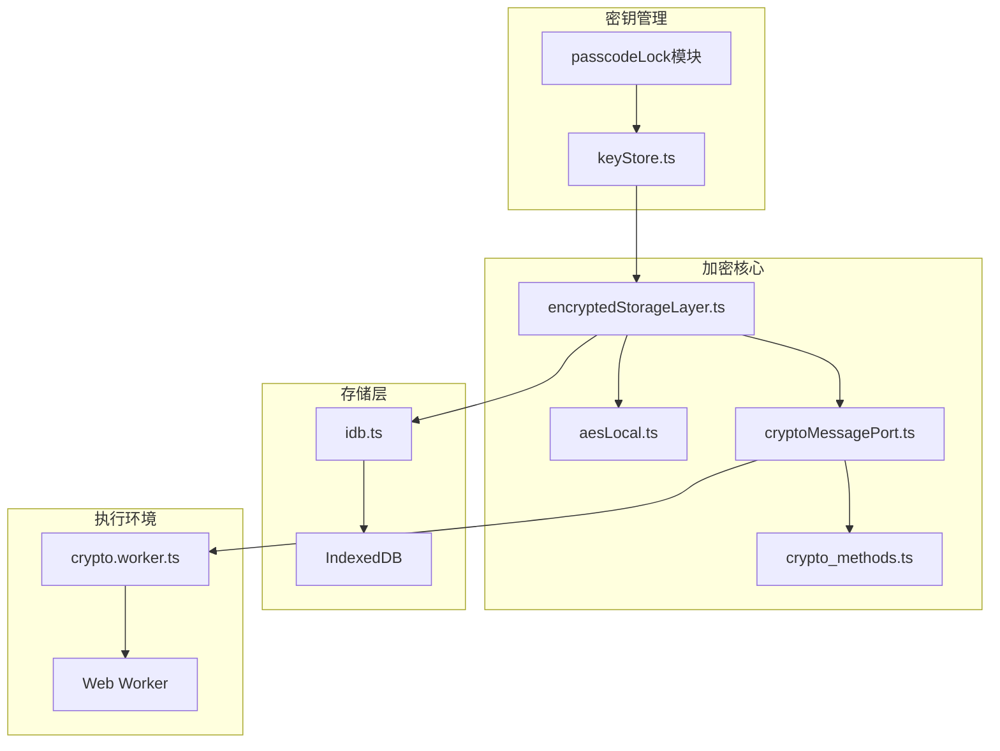
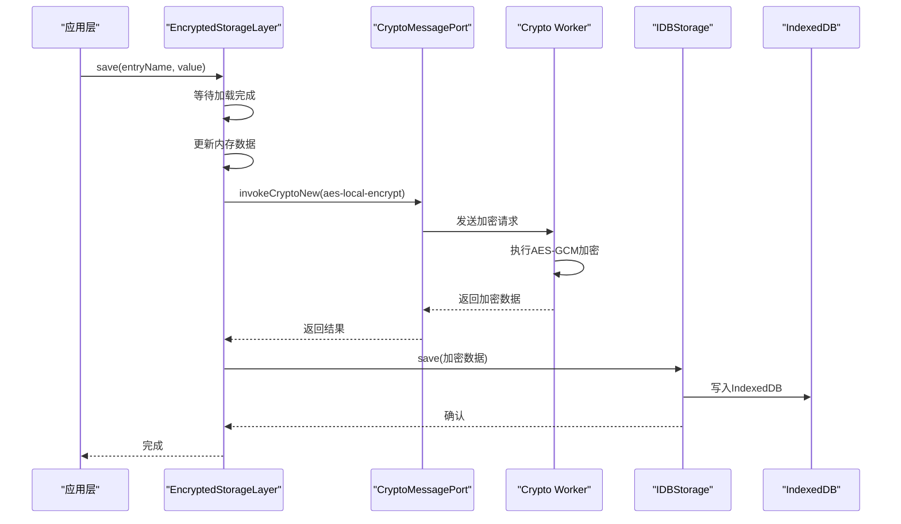
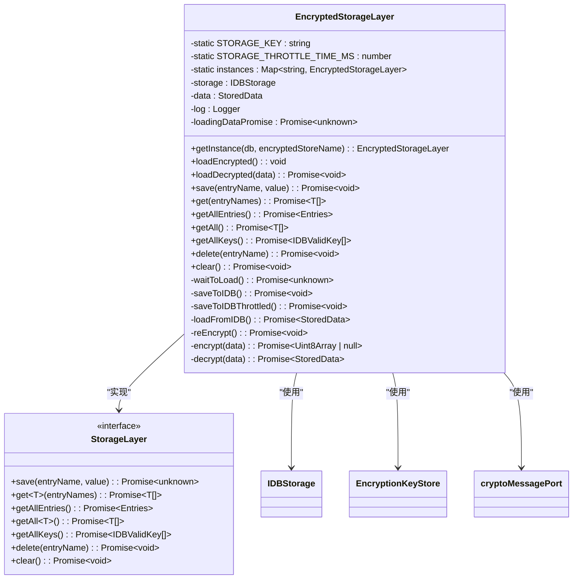
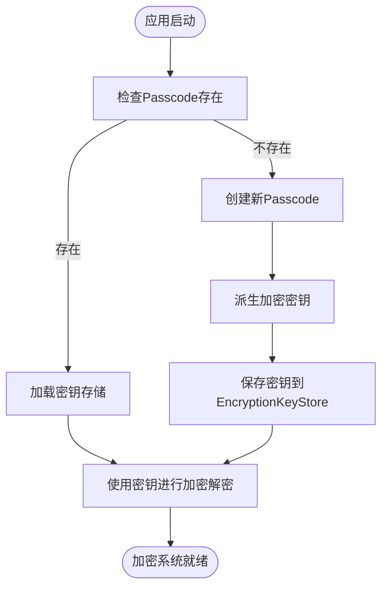
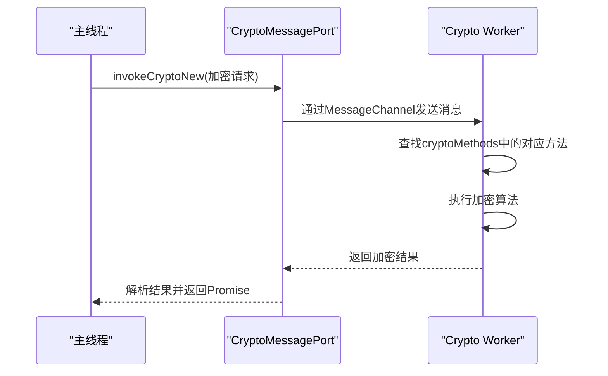
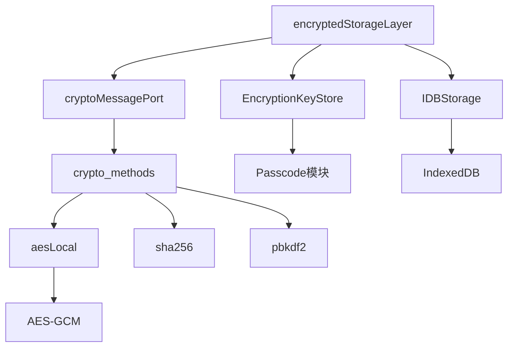

# 数据加密

<cite>
**本文档中引用的文件**  
- [encryptedStorageLayer.ts](file://src/lib/encryptedStorageLayer.ts)
- [aesLocal.ts](file://src/lib/crypto/utils/aesLocal.ts)
- [keyStore.ts](file://src/lib/passcode/keyStore.ts)
- [cryptoMessagePort.ts](file://src/lib/crypto/cryptoMessagePort.ts)
- [crypto_methods.ts](file://src/lib/crypto/crypto_methods.ts)
- [idb.ts](file://src/lib/files/idb.ts)
- [crypto.worker.ts](file://src/lib/crypto/crypto.worker.ts)
- [passcodeLockScreen.tsx](file://src/components/passcodeLock/passcodeLockScreen.tsx)
- [passcodeLockScreenController.tsx](file://src/components/passcodeLock/passcodeLockScreenController.tsx)
</cite>

## 目录
1. [简介](#简介)
2. [项目结构](#项目结构)
3. [核心组件](#核心组件)
4. [架构概述](#架构概述)
5. [详细组件分析](#详细组件分析)
6. [依赖分析](#依赖分析)
7. [性能考虑](#性能考虑)
8. [故障排除指南](#故障排除指南)
9. [结论](#结论)

## 简介
本文档详细阐述了`tweb`项目中数据加密层的实现原理。重点分析了`encryptedStorageLayer`的架构设计，包括对称加密算法的选择、密钥管理策略、与本地存储（IndexedDB）的集成方式，以及与passcode模块的协作机制。文档还提供了加密性能优化技巧和安全审计要点，为开发者理解和维护该加密系统提供全面指导。

## 项目结构
项目中的加密功能主要分布在`src/lib`目录下的多个子模块中。核心加密逻辑位于`crypto`目录，而加密存储层则通过`encryptedStorageLayer.ts`实现。密钥管理由`passcode`模块负责，本地存储基于`IndexedDB`封装在`files/idb.ts`中。整个加密体系通过`crypto.worker.ts`在独立线程中执行，确保主线程性能不受影响。

**图源**  
- [encryptedStorageLayer.ts](file://src/lib/encryptedStorageLayer.ts)
- [aesLocal.ts](file://src/lib/crypto/utils/aesLocal.ts)
- [keyStore.ts](file://src/lib/passcode/keyStore.ts)
- [cryptoMessagePort.ts](file://src/lib/crypto/cryptoMessagePort.ts)
- [crypto_methods.ts](file://src/lib/crypto/crypto_methods.ts)
- [idb.ts](file://src/lib/files/idb.ts)
- [crypto.worker.ts](file://src/lib/crypto/crypto.worker.ts)

**本节来源**  
- [src/lib](file://src/lib)
- [src/components/passcodeLock](file://src/components/passcodeLock)

## 核心组件
`encryptedStorageLayer`是整个加密系统的核心组件，负责将应用数据加密后安全地存储到IndexedDB中。该组件通过`EncryptionKeyStore`获取加密密钥，并利用`cryptoMessagePort`与Web Worker通信，执行实际的加密解密操作。数据在内存中以明文形式存在，仅在持久化时进行加密，平衡了安全性和性能。

**本节来源**  
- [encryptedStorageLayer.ts](file://src/lib/encryptedStorageLayer.ts#L29-L229)
- [keyStore.ts](file://src/lib/passcode/keyStore.ts#L5-L38)
- [cryptoMessagePort.ts](file://src/lib/crypto/cryptoMessagePort.ts#L20-L67)

## 架构概述
系统采用分层架构，将加密逻辑与存储逻辑分离。`encryptedStorageLayer`作为中间层，向上为应用提供简单的存储接口，向下与`IDBStorage`交互。加密操作在独立的Web Worker中执行，通过`cryptoMessagePort`进行通信，避免阻塞主线程。密钥由`EncryptionKeyStore`统一管理，确保密钥的安全性和一致性。

**图源**  
- [encryptedStorageLayer.ts](file://src/lib/encryptedStorageLayer.ts#L175-L185)
- [cryptoMessagePort.ts](file://src/lib/crypto/cryptoMessagePort.ts#L29-L53)
- [idb.ts](file://src/lib/files/idb.ts#L277-L320)

## 详细组件分析

### 加密存储层分析
`EncryptedStorageLayer`类实现了`StorageLayer`接口，提供了一套完整的加密存储功能。该组件采用单例模式，通过`getInstance`方法获取实例，确保每个数据库存储名称对应唯一的实例。数据在内存中以明文对象形式存在，通过`save`和`get`方法进行读写操作。

#### 类图

**图源**  
- [encryptedStorageLayer.ts](file://src/lib/encryptedStorageLayer.ts#L29-L229)

**本节来源**  
- [encryptedStorageLayer.ts](file://src/lib/encryptedStorageLayer.ts#L1-L230)

### 加密算法与密钥管理
系统采用AES-GCM（Galois/Counter Mode）作为对称加密算法，提供机密性和完整性保护。加密密钥由`EncryptionKeyStore`静态类管理，采用`CryptoKey`对象形式存储在内存中。密钥的生成和派生与passcode模块紧密协作，确保只有通过身份验证的用户才能访问加密数据。

#### 密钥管理流程

**图源**  
- [keyStore.ts](file://src/lib/passcode/keyStore.ts#L5-L38)
- [aesLocal.ts](file://src/lib/crypto/utils/aesLocal.ts#L11-L43)

**本节来源**  
- [keyStore.ts](file://src/lib/passcode/keyStore.ts#L1-L39)
- [aesLocal.ts](file://src/lib/crypto/utils/aesLocal.ts#L1-L44)

### Web Worker加密执行
加密操作在独立的Web Worker中执行，通过`crypto.worker.ts`文件定义的工作线程实现。`cryptoMessagePort`作为通信桥梁，将加密请求从主线程传递到Worker线程。这种设计避免了加密计算对UI线程的阻塞，提升了应用的整体响应性能。

#### 工作线程通信流程

**图源**  
- [cryptoMessagePort.ts](file://src/lib/crypto/cryptoMessagePort.ts#L20-L67)
- [crypto.worker.ts](file://src/lib/crypto/crypto.worker.ts#L28-L73)

**本节来源**  
- [cryptoMessagePort.ts](file://src/lib/crypto/cryptoMessagePort.ts#L1-L68)
- [crypto.worker.ts](file://src/lib/crypto/crypto.worker.ts#L1-L74)

## 依赖分析
加密系统依赖多个核心组件协同工作。`encryptedStorageLayer`依赖`IDBStorage`进行底层存储操作，依赖`EncryptionKeyStore`获取加密密钥，依赖`cryptoMessagePort`与Web Worker通信。`cryptoMessagePort`本身又依赖`crypto_methods.ts`中定义的各种加密算法实现。整个系统通过清晰的依赖关系实现了关注点分离。

**图源**  
- [encryptedStorageLayer.ts](file://src/lib/encryptedStorageLayer.ts)
- [cryptoMessagePort.ts](file://src/lib/crypto/cryptoMessagePort.ts)
- [crypto_methods.ts](file://src/lib/crypto/crypto_methods.ts)

**本节来源**  
- [encryptedStorageLayer.ts](file://src/lib/encryptedStorageLayer.ts#L1-L230)
- [cryptoMessagePort.ts](file://src/lib/crypto/cryptoMessagePort.ts#L1-L68)
- [crypto_methods.ts](file://src/lib/crypto/crypto_methods.ts#L1-L43)

## 性能考虑
系统在设计时充分考虑了加密操作的性能影响。通过将加密计算移至Web Worker，避免了主线程阻塞。`saveToIDBThrottled`方法采用节流技术，防止频繁保存操作导致性能下降。同时，系统仅在数据持久化时进行加密，在内存中保持明文状态，平衡了安全性和运行效率。

对于大量数据的加密，建议采用分块处理策略，避免单次加密操作占用过多资源。监控`DEBUG`模式下的日志输出可以帮助识别性能瓶颈，特别是在加密时间和存储时间的分布上。

## 故障排除指南
当遇到加密相关问题时，首先检查`EncryptionKeyStore`中的密钥是否正确加载。如果密钥为空，可能是passcode验证未通过或密钥派生失败。其次，检查Web Worker是否正常启动，`crypto.worker.js`文件是否正确加载。最后，验证IndexedDB的存储权限和可用空间，确保底层存储功能正常。

常见的错误包括：密钥获取超时、加密方法调用失败、IndexedDB事务错误等。通过启用`DEBUG`模式，可以获取详细的加密和存储操作日志，帮助定位问题根源。

**本节来源**  
- [encryptedStorageLayer.ts](file://src/lib/encryptedStorageLayer.ts#L163-L166)
- [cryptoMessagePort.ts](file://src/lib/crypto/cryptoMessagePort.ts#L36-L46)
- [idb.ts](file://src/lib/files/idb.ts#L106-L110)

## 结论
`tweb`项目的加密系统通过分层架构和Web Worker技术，实现了安全与性能的平衡。AES-GCM算法提供了强大的数据保护，密钥管理系统确保了密钥的安全性，而独立的加密执行环境则保证了应用的流畅性。该设计为Web应用的数据安全提供了可靠的解决方案，值得在类似项目中借鉴。