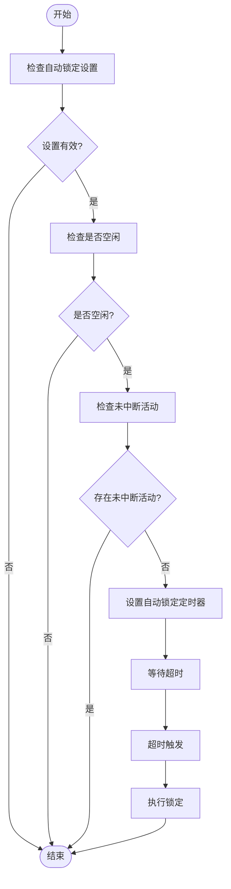
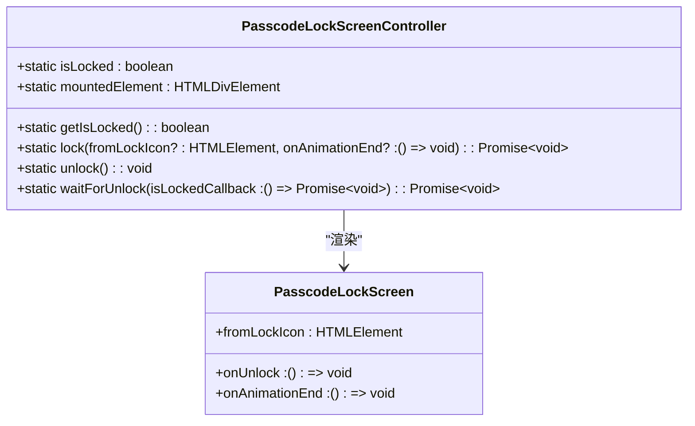
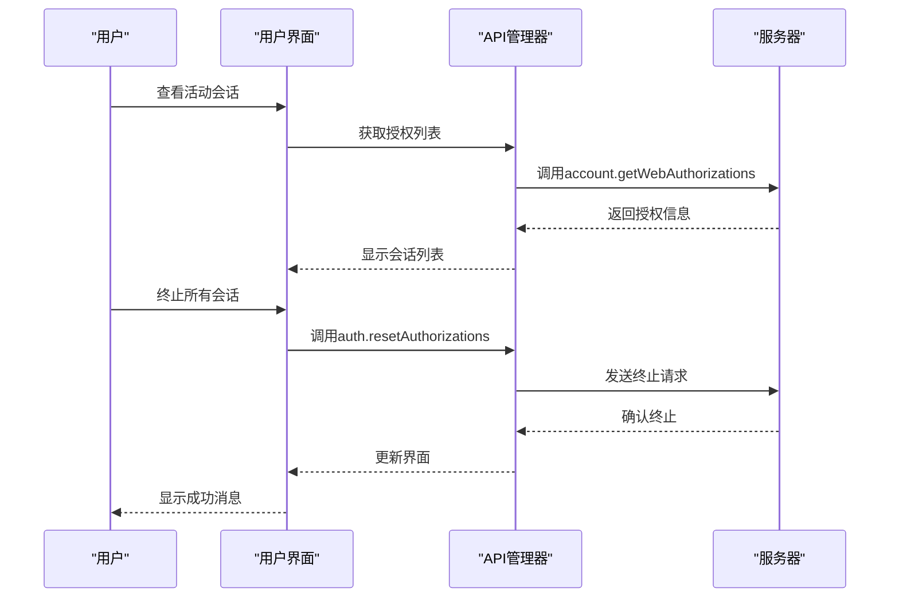

# 会话控制

<cite>
**本文档中引用的文件**  
- [passcodeLockScreenController.tsx](file://src/components/passcodeLock/passcodeLockScreenController.tsx)
- [useAutoLock.ts](file://src/lib/mtproto/useAutoLock.ts)
- [idleController.ts](file://src/helpers/idleController.ts)
- [passcodeLockScreen.tsx](file://src/components/passcodeLock/passcodeLockScreen.tsx)
- [mainTab.tsx](file://src/components/sidebarLeft/tabs/passcodeLock/mainTab.tsx)
- [lockButton.tsx](file://src/components/sidebarLeft/lockButton.tsx)
- [activeSessions.ts](file://src/components/sidebarLeft/tabs/activeSessions.ts)
- [accountController.ts](file://src/lib/accounts/accountController.ts)
- [sessionStorage.ts](file://src/lib/sessionStorage.ts)
- [actions.ts](file://src/lib/passcode/actions.ts)
- [privacyAndSecurity.ts](file://src/components/sidebarLeft/tabs/privacyAndSecurity.ts)
</cite>

## 目录
1. [引言](#引言)
2. [会话生命周期与用户活动检测](#会话生命周期与用户活动检测)
3. [自动锁定策略配置与实现机制](#自动锁定策略配置与实现机制)
4. [锁定状态管理](#锁定状态管理)
5. [多设备会话同步与管理策略](#多设备会话同步与管理策略)
6. [用户体验优化建议](#用户体验优化建议)
7. [结论](#结论)

## 引言
本文档详细阐述了会话控制系统的实现机制，重点分析自动锁定策略、超时设置、锁定状态管理、会话生命周期、用户活动检测以及多设备会话同步与管理。系统通过精细化的超时配置和活动检测，确保用户数据安全，同时提供智能锁定和快速解锁功能，平衡安全性与用户体验。

## 会话生命周期与用户活动检测
会话生命周期管理是确保用户数据安全的核心。系统通过`idleController`检测用户活动状态，当用户长时间无操作时，自动触发锁定机制。`idleController`监听`blur`、`focus`及触摸/鼠标事件，判断用户是否处于空闲状态。此外，`useAutoLock`钩子函数结合`areAllIdle`信号和`uninteruptableActivities`活动计数，精确控制自动锁定的触发时机。

**Section sources**
- [idleController.ts](file://src/helpers/idleController.ts#L1-L76)
- [useAutoLock.ts](file://src/lib/mtproto/useAutoLock.ts#L1-L91)

## 自动锁定策略配置与实现机制
自动锁定策略通过配置`autoLockTimeoutMins`参数实现。用户可在隐私与安全设置中选择1、5、10、15或30分钟的超时时间。当会话空闲时间超过设定值且无未中断活动时，系统将自动锁定。`useAutoLock`函数监听设置变化，动态调整`autoLockTimeout`定时器，确保策略即时生效。

**Diagram sources**
- [useAutoLock.ts](file://src/lib/mtproto/useAutoLock.ts#L41-L58)
- [mainTab.tsx](file://src/components/sidebarLeft/tabs/passcodeLock/mainTab.tsx#L148-L185)

**Section sources**
- [useAutoLock.ts](file://src/lib/mtproto/useAutoLock.ts#L1-L91)
- [mainTab.tsx](file://src/components/sidebarLeft/tabs/passcodeLock/mainTab.tsx#L114-L305)

## 锁定状态管理
锁定状态由`PasscodeLockScreenController`统一管理。该控制器提供`getIsLocked`、`lock`和`unlock`方法，控制锁定状态的查询、设置和解除。锁定时，系统会保存当前哈希并显示锁定界面；解锁时，恢复哈希并移除锁定界面。`lock`方法支持动画效果，提升用户体验。

**Diagram sources**
- [passcodeLockScreenController.tsx](file://src/components/passcodeLock/passcodeLockScreenController.tsx#L1-L179)
- [passcodeLockScreen.tsx](file://src/components/passcodeLock/passcodeLockScreen.tsx#L1-L252)

**Section sources**
- [passcodeLockScreenController.tsx](file://src/components/passcodeLock/passcodeLockScreenController.tsx#L1-L179)
- [passcodeLockScreen.tsx](file://src/components/passcodeLock/passcodeLockScreen.tsx#L1-L252)

## 多设备会话同步与管理策略
系统支持多设备会话管理，用户可在“活动会话”页面查看和管理所有登录设备。每个会话包含设备名称、版本、IP地址、国家和最后活动时间。用户可终止单个或所有其他会话，确保账户安全。`activeSessions`组件通过`auth.resetAuthorizations` API调用实现会话终止。

**Diagram sources**
- [activeSessions.ts](file://src/components/sidebarLeft/tabs/activeSessions.ts#L28-L106)
- [privacyAndSecurity.ts](file://src/components/sidebarLeft/tabs/privacyAndSecurity.ts#L142-L179)

**Section sources**
- [activeSessions.ts](file://src/components/sidebarLeft/tabs/activeSessions.ts#L28-L106)
- [accountController.ts](file://src/lib/accounts/accountController.ts#L30-L154)

## 用户体验优化建议
为平衡智能锁定与快速解锁的体验，系统提供了以下优化：
1. **快捷锁定**：用户可通过预设的快捷键（如Ctrl+L）快速锁定会话，提升操作效率。
2. **动画反馈**：锁定和解锁过程包含流畅的动画效果，提供视觉反馈，增强用户体验。
3. **错误处理**：连续多次输入错误密码后，系统将暂时禁用输入，防止暴力破解，同时提供清晰的错误提示。
4. **无缝切换**：锁定状态下，用户可快速输入密码解锁，无需重新加载页面，保持会话连续性。

**Section sources**
- [lockButton.tsx](file://src/components/sidebarLeft/lockButton.tsx#L1-L88)
- [useLockScreenShortcut.ts](file://src/lib/appManagers/utils/useLockScreenShortcut.ts#L1-L35)
- [passcodeLockScreen.tsx](file://src/components/passcodeLock/passcodeLockScreen.tsx#L1-L252)

## 结论
本文档全面解析了会话控制系统的各项机制，从自动锁定策略到多设备会话管理，再到用户体验优化。通过合理的配置和精细的实现，系统在保障用户数据安全的同时，提供了流畅、便捷的操作体验。未来可进一步优化活动检测算法，实现更智能的锁定策略，如基于用户行为模式的动态超时调整。