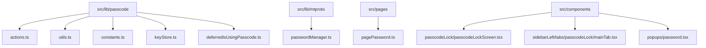
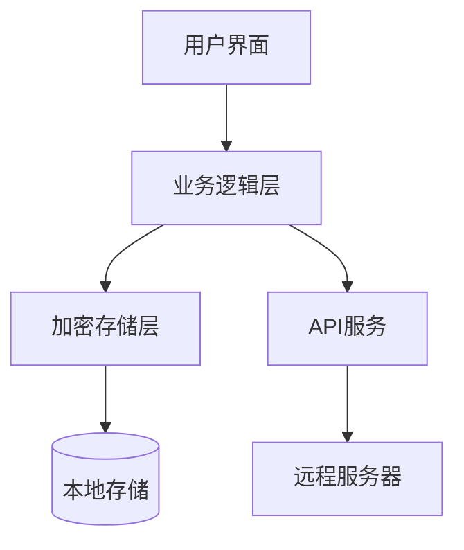
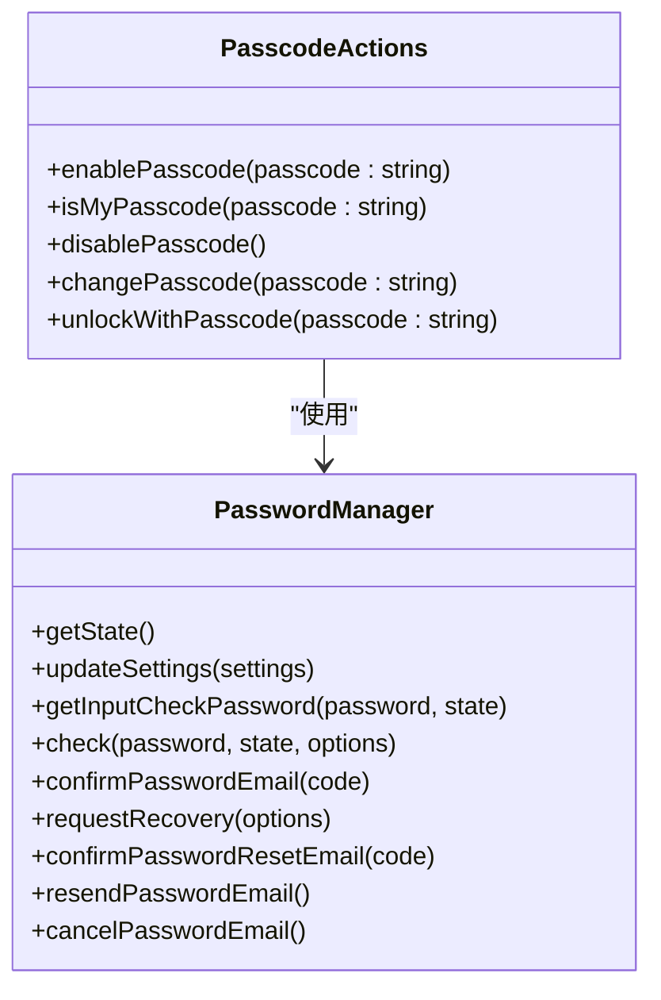
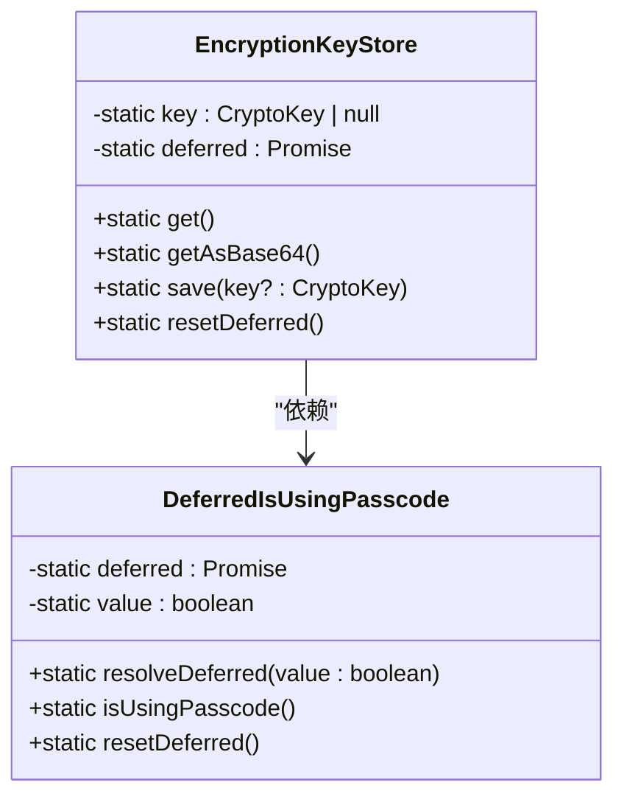
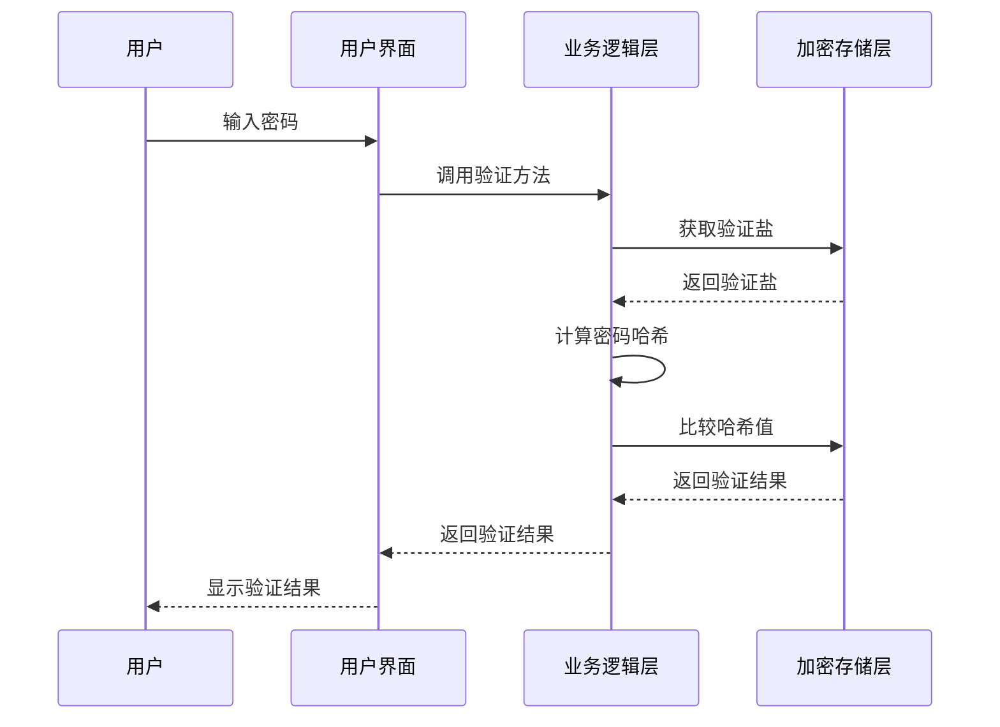
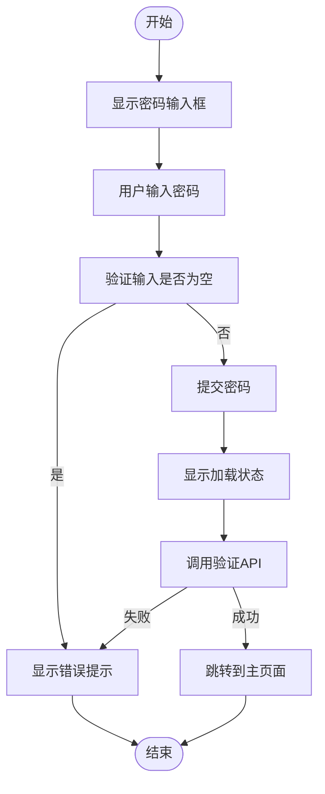
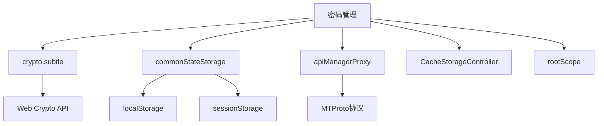

# 密码管理

<cite>
**本文档中引用的文件**  
- [actions.ts](file://src/lib/passcode/actions.ts)
- [utils.ts](file://src/lib/passcode/utils.ts)
- [constants.ts](file://src/lib/passcode/constants.ts)
- [keyStore.ts](file://src/lib/passcode/keyStore.ts)
- [deferredIsUsingPasscode.ts](file://src/lib/passcode/deferredIsUsingPasscode.ts)
- [passwordManager.ts](file://src/lib/mtproto/passwordManager.ts)
- [pagePassword.ts](file://src/pages/pagePassword.ts)
- [passcodeLockScreen.tsx](file://src/components/passcodeLock/passcodeLockScreen.tsx)
- [mainTab.tsx](file://src/components/sidebarLeft/tabs/passcodeLock/mainTab.tsx)
- [password.tsx](file://src/components/popups/password.tsx)
</cite>

## 目录
1. [简介](#简介)
2. [项目结构](#项目结构)
3. [核心组件](#核心组件)
4. [架构概述](#架构概述)
5. [详细组件分析](#详细组件分析)
6. [依赖分析](#依赖分析)
7. [性能考虑](#性能考虑)
8. [故障排除指南](#故障排除指南)
9. [结论](#结论)

## 简介
本文档详细阐述了密码管理系统的设计与实现，重点介绍密钥存储机制、密码加密与验证流程、密码强度策略、用户密码设置最佳实践、密码更新与恢复安全机制、防泄露与防暴力破解措施，以及与生物识别认证的集成方式。

## 项目结构
密码管理功能主要分布在`src/lib/passcode`目录下，包含核心逻辑实现，同时在`src/components`和`src/pages`目录中包含用户界面和交互逻辑。

**图示来源**
- [actions.ts](file://src/lib/passcode/actions.ts)
- [utils.ts](file://src/lib/passcode/utils.ts)
- [constants.ts](file://src/lib/passcode/constants.ts)
- [keyStore.ts](file://src/lib/passcode/keyStore.ts)
- [deferredIsUsingPasscode.ts](file://src/lib/passcode/deferredIsUsingPasscode.ts)
- [passwordManager.ts](file://src/lib/mtproto/passwordManager.ts)
- [pagePassword.ts](file://src/pages/pagePassword.ts)
- [passcodeLockScreen.tsx](file://src/components/passcodeLock/passcodeLockScreen.tsx)
- [mainTab.tsx](file://src/components/sidebarLeft/tabs/passcodeLock/mainTab.tsx)
- [password.tsx](file://src/components/popups/password.tsx)

**节来源**
- [actions.ts](file://src/lib/passcode/actions.ts)
- [utils.ts](file://src/lib/passcode/utils.ts)
- [constants.ts](file://src/lib/passcode/constants.ts)
- [keyStore.ts](file://src/lib/passcode/keyStore.ts)
- [deferredIsUsingPasscode.ts](file://src/lib/passcode/deferredIsUsingPasscode.ts)
- [passwordManager.ts](file://src/lib/mtproto/passwordManager.ts)
- [pagePassword.ts](file://src/pages/pagePassword.ts)
- [passcodeLockScreen.tsx](file://src/components/passcodeLock/passcodeLockScreen.tsx)
- [mainTab.tsx](file://src/components/sidebarLeft/tabs/passcodeLock/mainTab.tsx)
- [password.tsx](file://src/components/popups/password.tsx)

## 核心组件
密码管理系统由多个核心组件构成，包括密码操作管理、加密密钥存储、密码验证、用户界面交互等。

**节来源**
- [actions.ts](file://src/lib/passcode/actions.ts)
- [utils.ts](file://src/lib/passcode/utils.ts)
- [keyStore.ts](file://src/lib/passcode/keyStore.ts)
- [passwordManager.ts](file://src/lib/mtproto/passwordManager.ts)

## 架构概述
密码管理系统的架构分为前端用户界面、业务逻辑层和加密存储层。前端负责用户输入和显示，业务逻辑层处理密码操作，加密存储层负责密钥的安全存储。

**图示来源**
- [actions.ts](file://src/lib/passcode/actions.ts)
- [utils.ts](file://src/lib/passcode/utils.ts)
- [keyStore.ts](file://src/lib/passcode/keyStore.ts)
- [passwordManager.ts](file://src/lib/mtproto/passwordManager.ts)

## 详细组件分析

### 密码操作管理分析
密码操作管理组件负责处理密码的启用、禁用、更改和验证等操作。

**图示来源**
- [actions.ts](file://src/lib/passcode/actions.ts)
- [passwordManager.ts](file://src/lib/mtproto/passwordManager.ts)

### 加密密钥存储分析
加密密钥存储组件负责安全地存储和管理加密密钥。

**图示来源**
- [keyStore.ts](file://src/lib/passcode/keyStore.ts)
- [deferredIsUsingPasscode.ts](file://src/lib/passcode/deferredIsUsingPasscode.ts)

### 密码验证流程分析
密码验证流程涉及用户输入、密码哈希计算和验证。

**图示来源**
- [actions.ts](file://src/lib/passcode/actions.ts)
- [utils.ts](file://src/lib/passcode/utils.ts)
- [keyStore.ts](file://src/lib/passcode/keyStore.ts)

### 用户界面交互分析
用户界面组件负责与用户进行交互，包括密码输入、错误提示和操作按钮。

**图示来源**
- [pagePassword.ts](file://src/pages/pagePassword.ts)
- [passcodeLockScreen.tsx](file://src/components/passcodeLock/passcodeLockScreen.tsx)
- [mainTab.tsx](file://src/components/sidebarLeft/tabs/passcodeLock/mainTab.tsx)
- [password.tsx](file://src/components/popups/password.tsx)

**节来源**
- [pagePassword.ts](file://src/pages/pagePassword.ts)
- [passcodeLockScreen.tsx](file://src/components/passcodeLock/passcodeLockScreen.tsx)
- [mainTab.tsx](file://src/components/sidebarLeft/tabs/passcodeLock/mainTab.tsx)
- [password.tsx](file://src/components/popups/password.tsx)

## 依赖分析
密码管理系统依赖于多个内部和外部组件，包括加密库、存储系统和API服务。

**图示来源**
- [actions.ts](file://src/lib/passcode/actions.ts)
- [utils.ts](file://src/lib/passcode/utils.ts)
- [keyStore.ts](file://src/lib/passcode/keyStore.ts)
- [passwordManager.ts](file://src/lib/mtproto/passwordManager.ts)

**节来源**
- [actions.ts](file://src/lib/passcode/actions.ts)
- [utils.ts](file://src/lib/passcode/utils.ts)
- [keyStore.ts](file://src/lib/passcode/keyStore.ts)
- [passwordManager.ts](file://src/lib/mtproto/passwordManager.ts)

## 性能考虑
密码管理系统在设计时考虑了性能因素，包括异步操作、缓存机制和资源优化。

- 使用异步操作避免阻塞主线程
- 采用缓存机制减少重复计算
- 优化资源加载和内存使用

## 故障排除指南
常见问题及解决方案：

- **密码验证失败**：检查密码输入是否正确，确认大小写和特殊字符
- **无法启用密码**：确保设备支持必要的加密功能
- **密码恢复失败**：检查网络连接，确认恢复邮箱是否正确

**节来源**
- [actions.ts](file://src/lib/passcode/actions.ts)
- [passwordManager.ts](file://src/lib/mtproto/passwordManager.ts)
- [pagePassword.ts](file://src/pages/pagePassword.ts)

## 结论
本文档全面介绍了密码管理系统的设计与实现，涵盖了从密钥存储到用户交互的各个方面。系统采用先进的加密技术，确保用户密码的安全性，同时提供友好的用户界面和可靠的故障恢复机制。