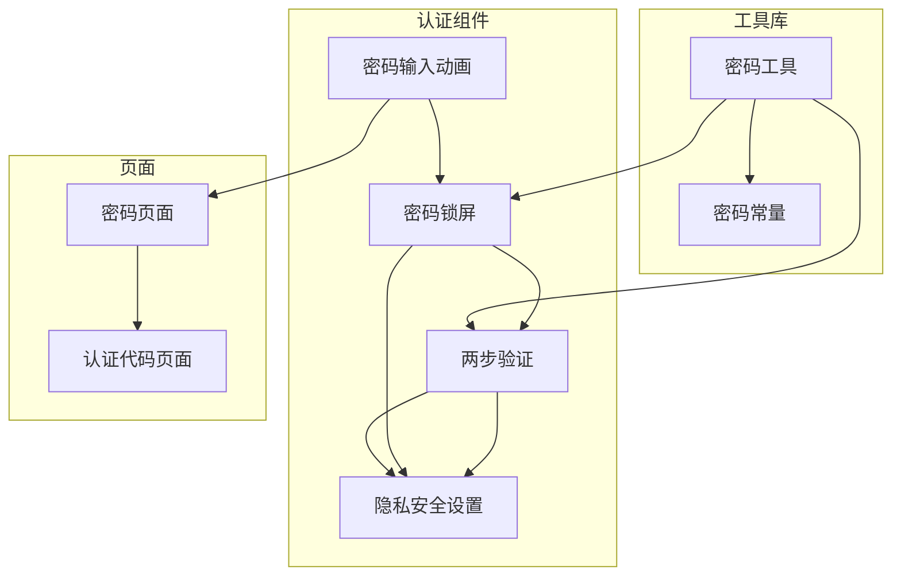
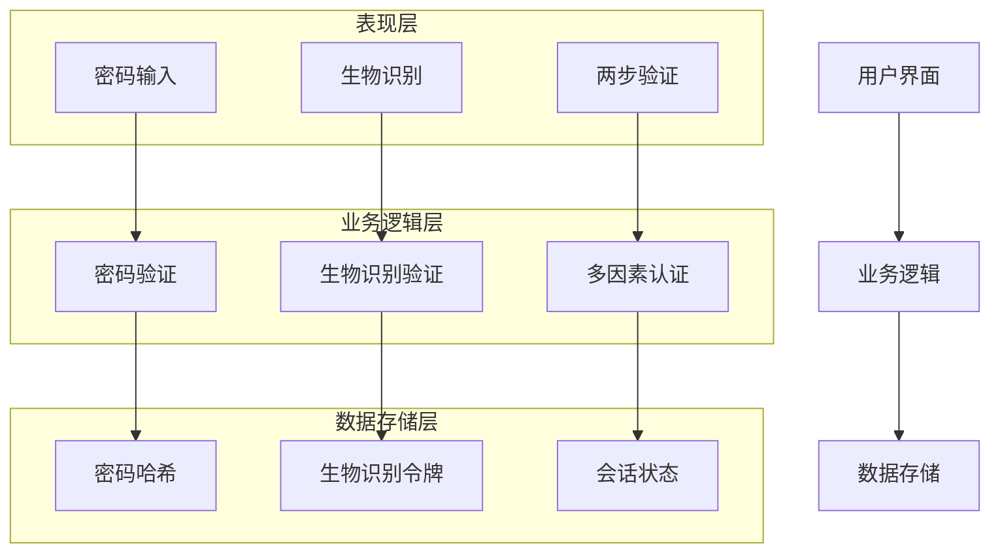
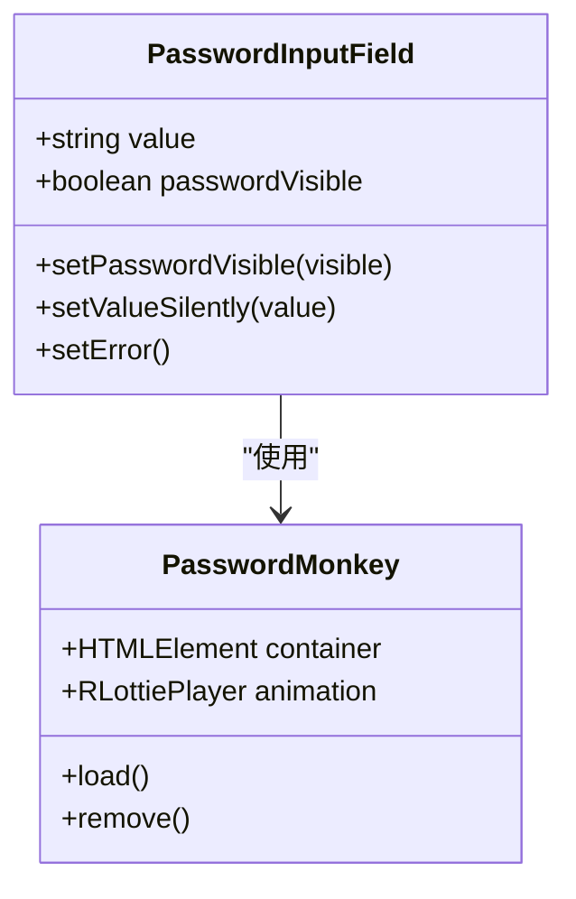
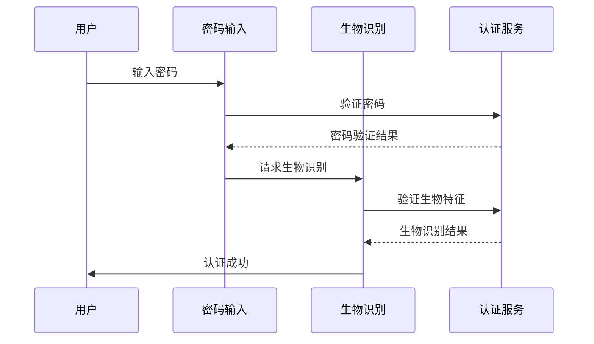
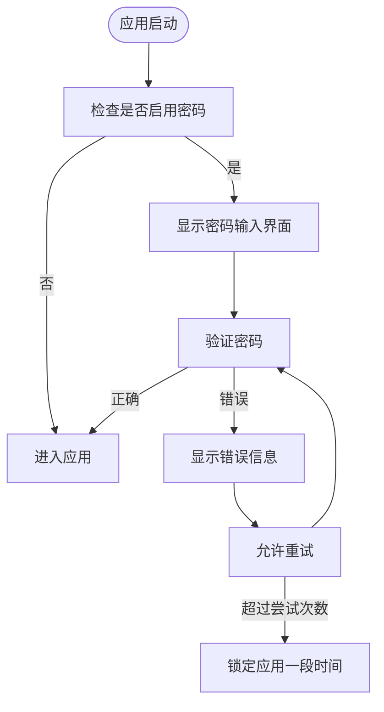
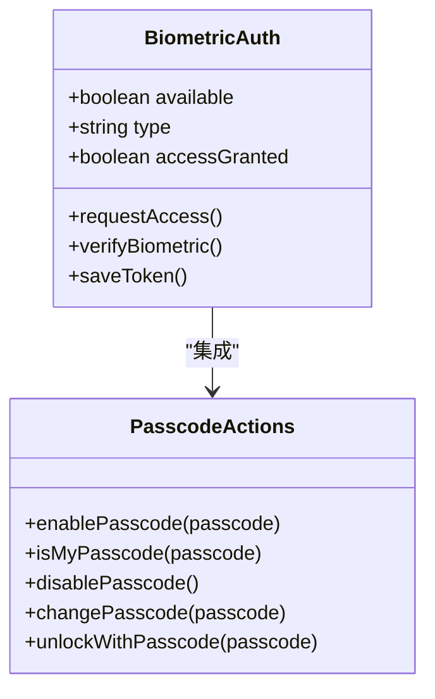
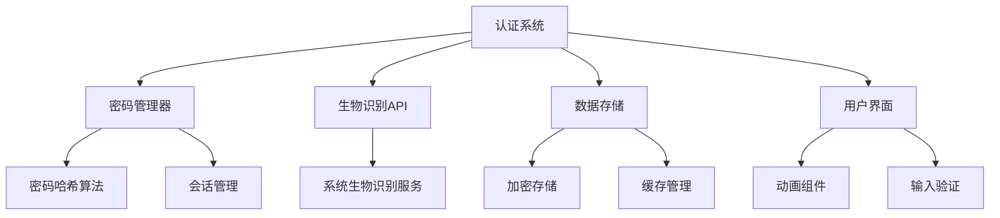

# 认证方式

<cite>
**本文档中引用的文件**  
- [password.ts](file://src/components/monkeys/password.ts)
- [passcodeLockScreen.tsx](file://src/components/passcodeLock/passcodeLockScreen.tsx)
- [enterPassword.ts](file://src/components/sidebarLeft/tabs/2fa/enterPassword.ts)
- [pagePassword.ts](file://src/pages/pagePassword.ts)
- [privacyAndSecurity.ts](file://src/components/sidebarLeft/tabs/privacyAndSecurity.ts)
- [actions.ts](file://src/lib/passcode/actions.ts)
- [utils.ts](file://src/lib/passcode/utils.ts)
- [constants.ts](file://src/lib/passcode/constants.ts)
</cite>

## 目录
1. [简介](#简介)
2. [项目结构](#项目结构)
3. [核心组件](#核心组件)
4. [架构概述](#架构概述)
5. [详细组件分析](#详细组件分析)
6. [依赖分析](#依赖分析)
7. [性能考虑](#性能考虑)
8. [故障排除指南](#故障排除指南)
9. [结论](#结论)
10. [附录](#附录)（如有必要）

## 简介
本文档详细阐述了传统密码认证与生物识别认证的集成实现，重点分析多因素认证的工作流程和安全优势。文档还说明了不同认证方式的切换机制和用户体验设计，并提供认证方式选择的策略建议以及在不同安全级别场景下的应用指导。

## 项目结构
项目结构显示了认证相关组件分布在多个目录中，主要包括：
- `src/components/monkeys/`：包含密码输入相关的动画组件
- `src/components/passcodeLock/`：包含密码锁屏相关的组件
- `src/components/sidebarLeft/tabs/`：包含两步验证和隐私安全相关的标签页
- `src/pages/`：包含认证流程的页面组件
- `src/lib/passcode/`：包含密码相关的工具和常量

**图源**  
- [password.ts](file://src/components/monkeys/password.ts)
- [passcodeLockScreen.tsx](file://src/components/passcodeLock/passcodeLockScreen.tsx)
- [enterPassword.ts](file://src/components/sidebarLeft/tabs/2fa/enterPassword.ts)
- [pagePassword.ts](file://src/pages/pagePassword.ts)
- [utils.ts](file://src/lib/passcode/utils.ts)
- [constants.ts](file://src/lib/passcode/constants.ts)

**节源**
- [password.ts](file://src/components/monkeys/password.ts)
- [passcodeLockScreen.tsx](file://src/components/passcodeLock/passcodeLockScreen.tsx)
- [enterPassword.ts](file://src/components/sidebarLeft/tabs/2fa/enterPassword.ts)
- [pagePassword.ts](file://src/pages/pagePassword.ts)
- [utils.ts](file://src/lib/passcode/utils.ts)
- [constants.ts](file://src/lib/passcode/constants.ts)

## 核心组件
系统中的核心认证组件包括：
- 传统密码认证：通过`pagePassword.ts`实现的密码输入和验证流程
- 密码锁屏：通过`passcodeLockScreen.tsx`实现的应用级密码保护
- 两步验证：通过`enterPassword.ts`实现的双因素认证机制
- 生物识别集成：通过系统API实现的指纹和面部识别支持

**节源**
- [pagePassword.ts](file://src/pages/pagePassword.ts#L1-L232)
- [passcodeLockScreen.tsx](file://src/components/passcodeLock/passcodeLockScreen.tsx#L1-L252)
- [enterPassword.ts](file://src/components/sidebarLeft/tabs/2fa/enterPassword.ts#L1-L348)

## 架构概述
系统采用分层架构设计，将认证功能分为表现层、业务逻辑层和数据存储层。表现层负责用户界面和交互，业务逻辑层处理认证逻辑，数据存储层管理认证相关的数据。

**图源**  
- [pagePassword.ts](file://src/pages/pagePassword.ts)
- [passcodeLockScreen.tsx](file://src/components/passcodeLock/passcodeLockScreen.tsx)
- [actions.ts](file://src/lib/passcode/actions.ts)

## 详细组件分析

### 传统密码认证分析
传统密码认证通过密码输入和验证流程实现，包含密码提示、错误处理和密码强度检查等功能。

**图源**  
- [password.ts](file://src/components/monkeys/password.ts#L1-L69)
- [pagePassword.ts](file://src/pages/pagePassword.ts#L1-L232)

### 多因素认证工作流程
多因素认证结合了密码认证和生物识别认证，提供更高的安全性。

**图源**  
- [enterPassword.ts](file://src/components/sidebarLeft/tabs/2fa/enterPassword.ts#L1-L348)
- [actions.ts](file://src/lib/passcode/actions.ts#L1-L169)

### 密码锁屏机制
密码锁屏机制通过应用级密码保护用户数据，防止未经授权的访问。

**图源**  
- [passcodeLockScreen.tsx](file://src/components/passcodeLock/passcodeLockScreen.tsx#L1-L252)
- [actions.ts](file://src/lib/passcode/actions.ts#L1-L169)

**节源**
- [passcodeLockScreen.tsx](file://src/components/passcodeLock/passcodeLockScreen.tsx#L1-L252)
- [actions.ts](file://src/lib/passcode/actions.ts#L1-L169)

### 生物识别认证集成
生物识别认证通过系统API集成指纹和面部识别功能，提供便捷的认证方式。

**图源**  
- [types.d.ts](file://src/types.d.ts#L412-L419)
- [actions.ts](file://src/lib/passcode/actions.ts#L1-L169)

**节源**
- [types.d.ts](file://src/types.d.ts#L412-L419)
- [actions.ts](file://src/lib/passcode/actions.ts#L1-L169)

## 依赖分析
认证系统依赖于多个核心组件和外部服务，确保认证流程的安全性和可靠性。

**图源**  
- [passwordManager.ts](file://src/lib/mtproto/passwordManager.ts#L68-L105)
- [actions.ts](file://src/lib/passcode/actions.ts#L1-L169)
- [utils.ts](file://src/lib/passcode/utils.ts#L1-L45)

**节源**
- [passwordManager.ts](file://src/lib/mtproto/passwordManager.ts#L68-L105)
- [actions.ts](file://src/lib/passcode/actions.ts#L1-L169)
- [utils.ts](file://src/lib/passcode/utils.ts#L1-L45)

## 性能考虑
在设计认证系统时，需要考虑以下性能因素：
- 密码验证的响应时间
- 生物识别的识别速度
- 多因素认证的流程效率
- 密码锁屏的解锁体验

通过优化算法和减少不必要的计算，可以提高认证系统的整体性能。

## 故障排除指南
当认证系统出现问题时，可以参考以下故障排除步骤：
1. 检查密码输入是否正确
2. 确认生物识别设备是否正常工作
3. 验证网络连接是否稳定
4. 检查系统权限设置
5. 重启应用尝试解决问题

**节源**
- [pagePassword.ts](file://src/pages/pagePassword.ts#L143-L231)
- [passcodeLockScreen.tsx](file://src/components/passcodeLock/passcodeLockScreen.tsx#L141-L168)

## 结论
本文档详细分析了传统密码认证与生物识别认证的集成实现，阐述了多因素认证的工作流程和安全优势。通过合理的架构设计和组件分离，系统提供了安全、便捷的认证体验。建议在高安全要求的场景下使用多因素认证，在普通场景下可根据用户体验需求选择合适的认证方式。