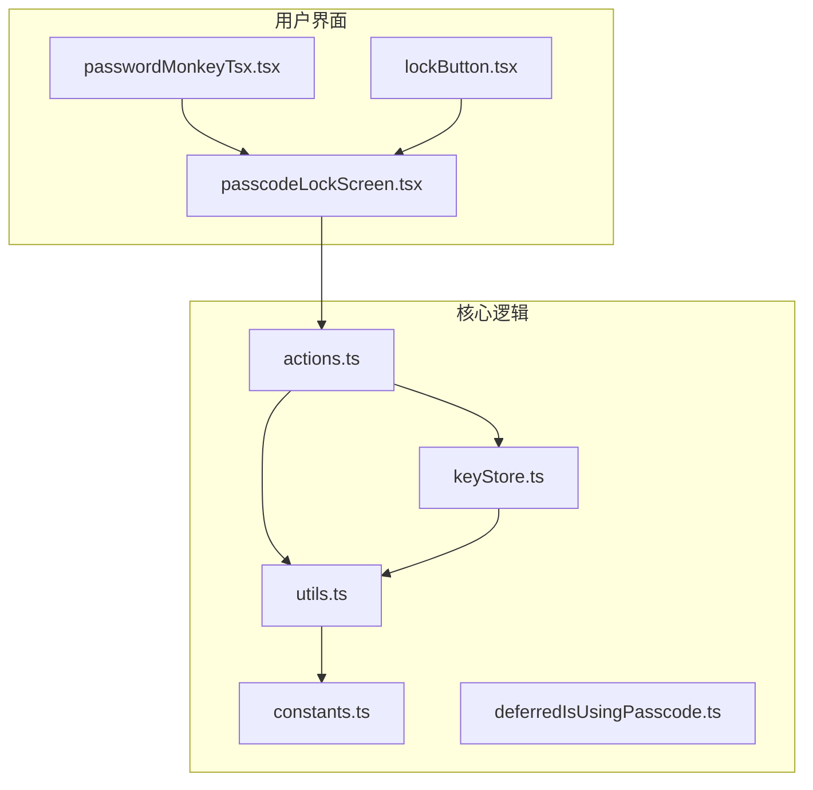
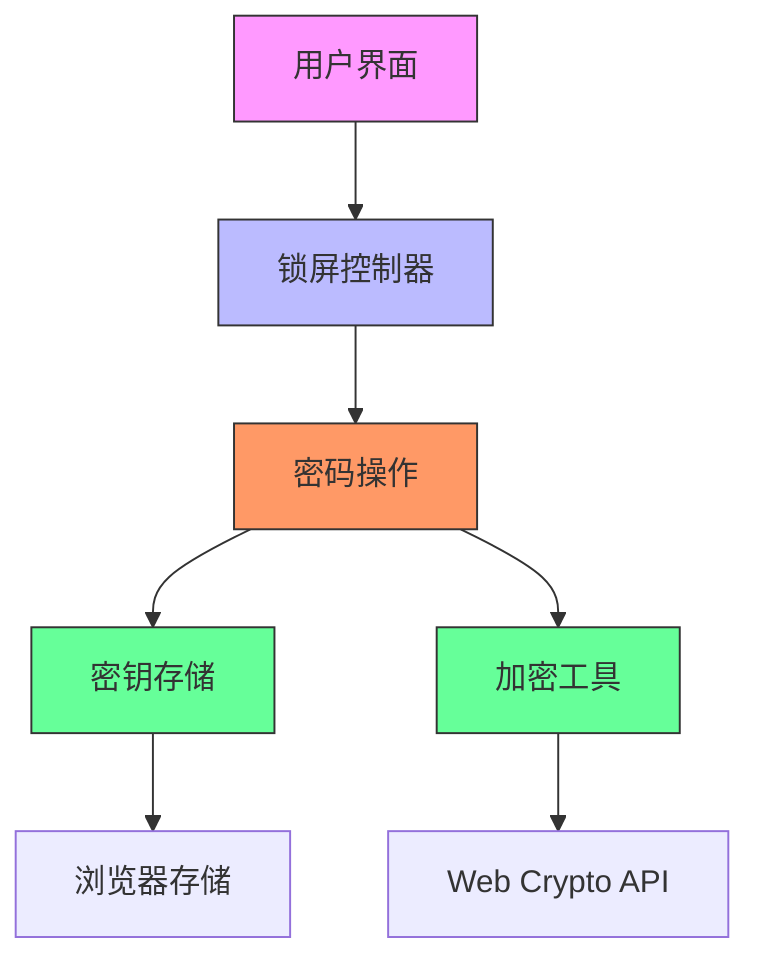
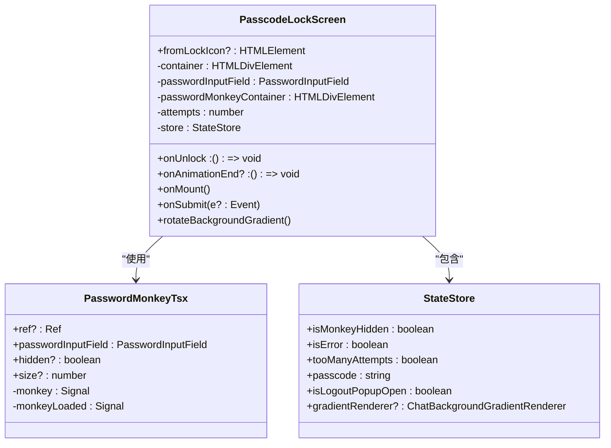
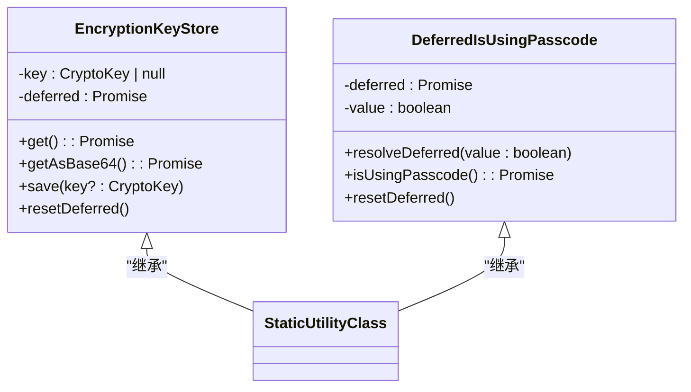
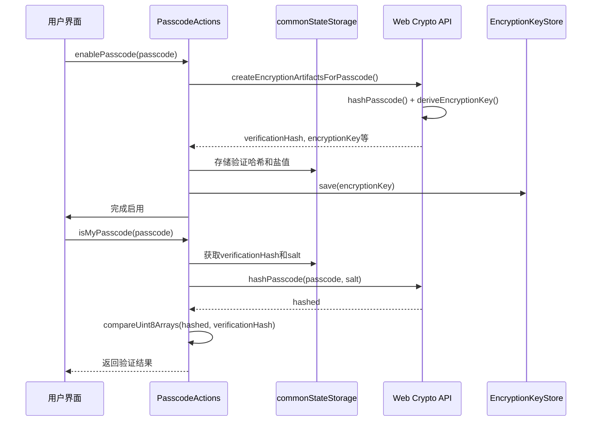
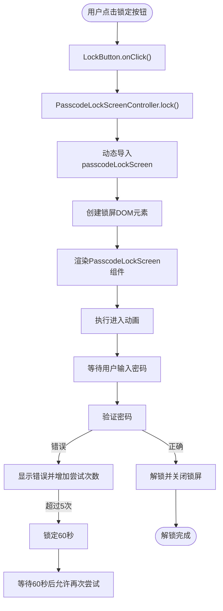
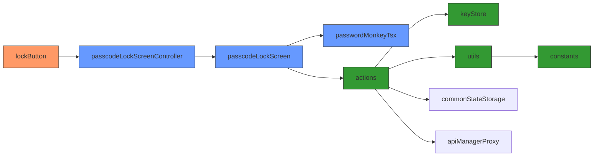

# 访问控制

<cite>
**本文档中引用的文件**  
- [passcodeLockScreen.tsx](file://src/components/passcodeLock/passcodeLockScreen.tsx)
- [passcodeLockScreenController.tsx](file://src/components/passcodeLock/passcodeLockScreenController.tsx)
- [passwordMonkeyTsx.tsx](file://src/components/passcodeLock/passwordMonkeyTsx.tsx)
- [lockButton.tsx](file://src/components/sidebarLeft/lockButton.tsx)
- [actions.ts](file://src/lib/passcode/actions.ts)
- [keyStore.ts](file://src/lib/passcode/keyStore.ts)
- [constants.ts](file://src/lib/passcode/constants.ts)
- [utils.ts](file://src/lib/passcode/utils.ts)
- [deferredIsUsingPasscode.ts](file://src/lib/passcode/deferredIsUsingPasscode.ts)
</cite>

## 目录
1. [简介](#简介)
2. [项目结构](#项目结构)
3. [核心组件](#核心组件)
4. [架构概述](#架构概述)
5. [详细组件分析](#详细组件分析)
6. [依赖分析](#依赖分析)
7. [性能考虑](#性能考虑)
8. [故障排除指南](#故障排除指南)
9. [结论](#结论)

## 简介
本文档详细描述了基于密钥库的访问控制机制，包括密码锁的实现原理、用户界面交互流程、多因素认证支持、会话管理与自动锁定策略，以及防止暴力破解的安全措施。系统通过加密密钥存储、密码验证和用户交互设计，实现了安全且用户体验良好的访问控制方案。

## 项目结构
访问控制功能主要集中在 `src/components/passcodeLock` 和 `src/lib/passcode` 目录下，涉及用户界面、密码验证、密钥管理和加密逻辑等多个模块。

**图示来源**  
- [passcodeLockScreen.tsx](file://src/components/passcodeLock/passcodeLockScreen.tsx)
- [actions.ts](file://src/lib/passcode/actions.ts)
- [keyStore.ts](file://src/lib/passcode/keyStore.ts)

**本节来源**  
- [src/components/passcodeLock](file://src/components/passcodeLock)
- [src/lib/passcode](file://src/lib/passcode)

## 核心组件
访问控制系统由密码锁界面、密钥存储、密码验证和用户交互按钮等核心组件构成。系统使用基于PBKDF2的密钥派生函数和AES-GCM加密算法，确保数据安全。密码长度限制为32位，使用独立的验证盐和加密盐增强安全性。

**本节来源**  
- [passcodeLockScreen.tsx](file://src/components/passcodeLock/passcodeLockScreen.tsx#L1-L252)
- [actions.ts](file://src/lib/passcode/actions.ts#L1-L169)
- [constants.ts](file://src/lib/passcode/constants.ts#L1-L3)

## 架构概述
系统采用分层架构，将用户界面、业务逻辑和加密存储分离。密码验证与密钥管理通过独立的服务进行，确保安全性与可维护性。

**图示来源**  
- [passcodeLockScreenController.tsx](file://src/components/passcodeLock/passcodeLockScreenController.tsx#L1-L180)
- [actions.ts](file://src/lib/passcode/actions.ts#L1-L169)
- [keyStore.ts](file://src/lib/passcode/keyStore.ts#L1-L39)

## 详细组件分析

### 密码锁界面分析
密码锁界面负责用户输入处理、错误反馈和解锁流程控制。

#### 类图

**图示来源**  
- [passcodeLockScreen.tsx](file://src/components/passcodeLock/passcodeLockScreen.tsx#L42-L252)
- [passwordMonkeyTsx.tsx](file://src/components/passcodeLock/passwordMonkeyTsx.tsx#L11-L54)

**本节来源**  
- [passcodeLockScreen.tsx](file://src/components/passcodeLock/passcodeLockScreen.tsx#L1-L252)
- [passwordMonkeyTsx.tsx](file://src/components/passcodeLock/passwordMonkeyTsx.tsx#L1-L54)

### 密钥存储机制分析
密钥存储组件负责管理加密密钥的生命周期，提供同步访问接口。

#### 类图

**图示来源**  
- [keyStore.ts](file://src/lib/passcode/keyStore.ts#L1-L39)
- [deferredIsUsingPasscode.ts](file://src/lib/passcode/deferredIsUsingPasscode.ts#L1-L32)

**本节来源**  
- [keyStore.ts](file://src/lib/passcode/keyStore.ts#L1-L39)
- [deferredIsUsingPasscode.ts](file://src/lib/passcode/deferredIsUsingPasscode.ts#L1-L32)

### 密码操作逻辑分析
密码操作组件提供启用、禁用、更改和验证密码的核心功能。

#### 序列图

**图示来源**  
- [actions.ts](file://src/lib/passcode/actions.ts#L16-L169)
- [utils.ts](file://src/lib/passcode/utils.ts#L1-L46)

**本节来源**  
- [actions.ts](file://src/lib/passcode/actions.ts#L1-L169)
- [utils.ts](file://src/lib/passcode/utils.ts#L1-L46)

### 用户交互流程分析
用户通过侧边栏锁定按钮触发锁定操作，系统执行动画并显示密码锁界面。

#### 流程图

**图示来源**  
- [lockButton.tsx](file://src/components/sidebarLeft/lockButton.tsx#L1-L88)
- [passcodeLockScreenController.tsx](file://src/components/passcodeLock/passcodeLockScreenController.tsx#L1-L180)
- [passcodeLockScreen.tsx](file://src/components/passcodeLock/passcodeLockScreen.tsx#L1-L252)

**本节来源**  
- [lockButton.tsx](file://src/components/sidebarLeft/lockButton.tsx#L1-L88)
- [passcodeLockScreenController.tsx](file://src/components/passcodeLock/passcodeLockScreenController.tsx#L1-L180)

## 依赖分析
系统各组件之间存在明确的依赖关系，确保功能解耦和代码复用。

**图示来源**  
- [lockButton.tsx](file://src/components/sidebarLeft/lockButton.tsx#L6)
- [passcodeLockScreenController.tsx](file://src/components/passcodeLock/passcodeLockScreenController.tsx#L11)
- [passcodeLockScreen.tsx](file://src/components/passcodeLock/passcodeLockScreen.tsx#L7)
- [actions.ts](file://src/lib/passcode/actions.ts#L11)

**本节来源**  
- 所有引用文件

## 性能考虑
系统在性能方面进行了多项优化：
- 使用节流函数(Throttle)控制背景渐变动画频率
- 延迟加载密码锁组件，减少初始加载时间
- 使用信号(Signal)机制实现高效的UI更新
- 密钥派生使用100,000次迭代的PBKDF2，平衡安全与性能
- 错误尝试限制为5次，60秒冷却期，防止暴力破解

## 故障排除指南
### 常见问题及解决方案
| 问题现象 | 可能原因 | 解决方案 |
|--------|--------|--------|
| 无法解锁 | 密码错误 | 检查密码输入，注意大小写 |
| 连续错误后被锁定 | 超过最大尝试次数 | 等待60秒后重试 |
| 锁屏界面不显示 | 组件加载失败 | 检查网络连接和资源加载 |
| 自动锁定失效 | 会话管理异常 | 重启应用或清除缓存 |

### 调试方法
1. 检查浏览器控制台是否有JavaScript错误
2. 验证`commonStateStorage`中是否正确存储了密码相关数据
3. 确认`EncryptionKeyStore`中的密钥状态
4. 检查服务工作者(Service Worker)是否正常运行

**本节来源**  
- [passcodeLockScreen.tsx](file://src/components/passcodeLock/passcodeLockScreen.tsx#L138-L168)
- [actions.ts](file://src/lib/passcode/actions.ts#L1-L169)

## 结论
该访问控制系统实现了安全可靠的密码保护机制，通过基于密钥库的加密存储、多层验证和用户友好的界面设计，提供了良好的安全性和用户体验。系统采用现代Web加密API，确保数据安全，同时通过合理的错误处理和锁定策略，有效防止暴力破解攻击。建议定期更新密码策略，结合生物识别等多因素认证方式，进一步提升系统安全性。