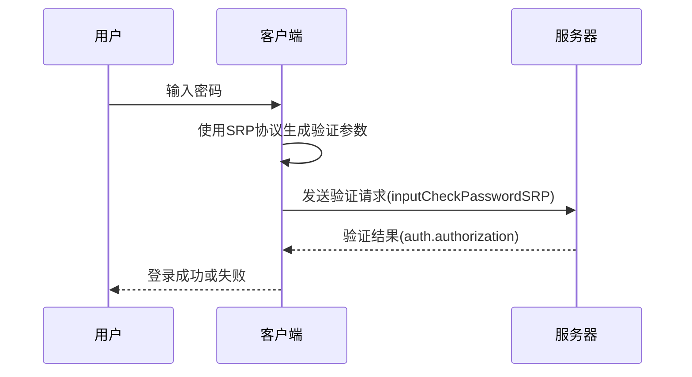
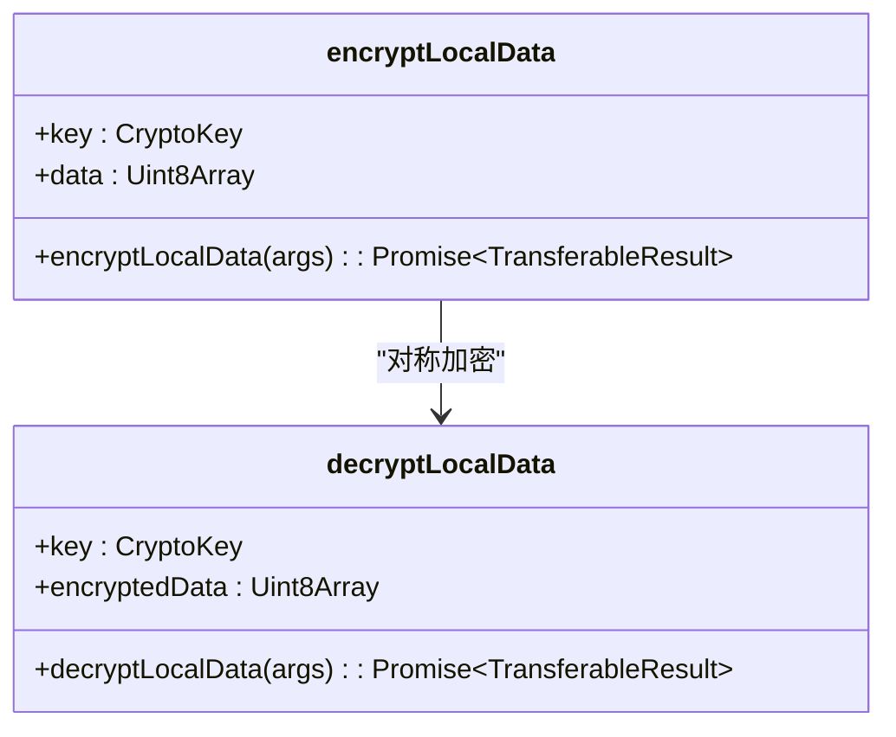
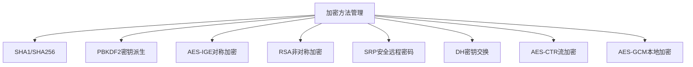
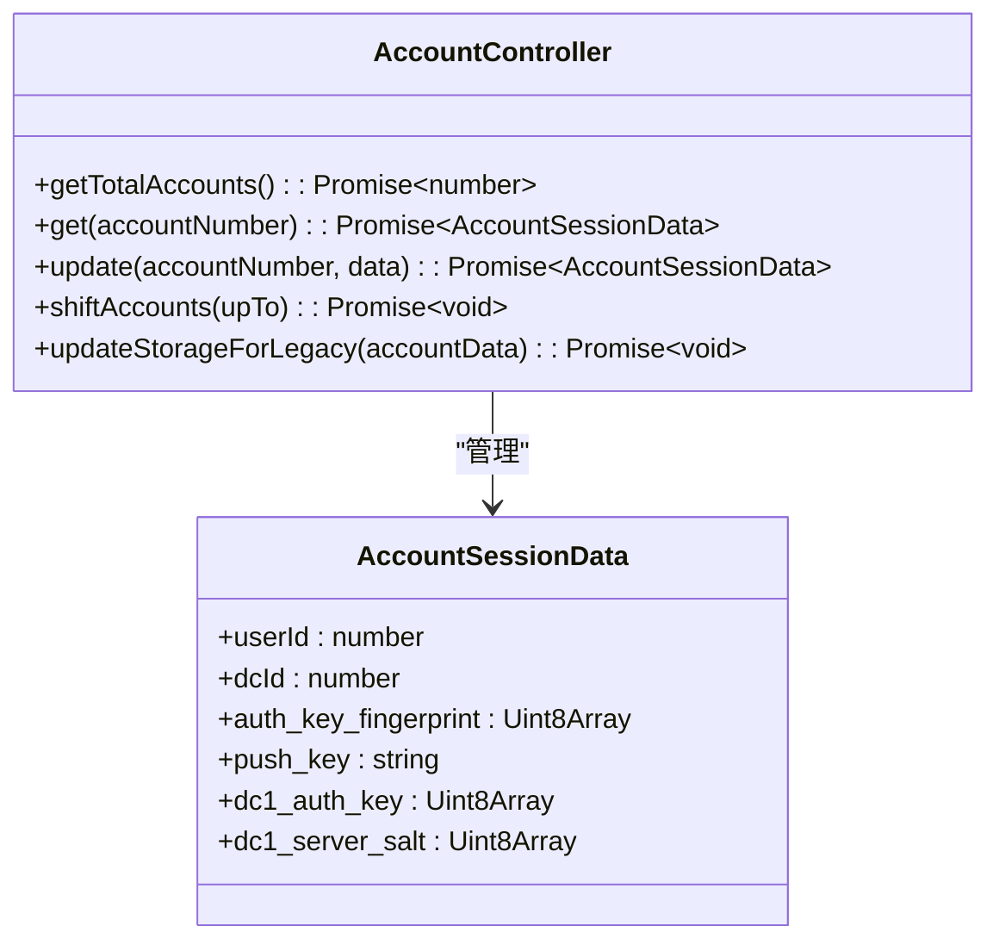
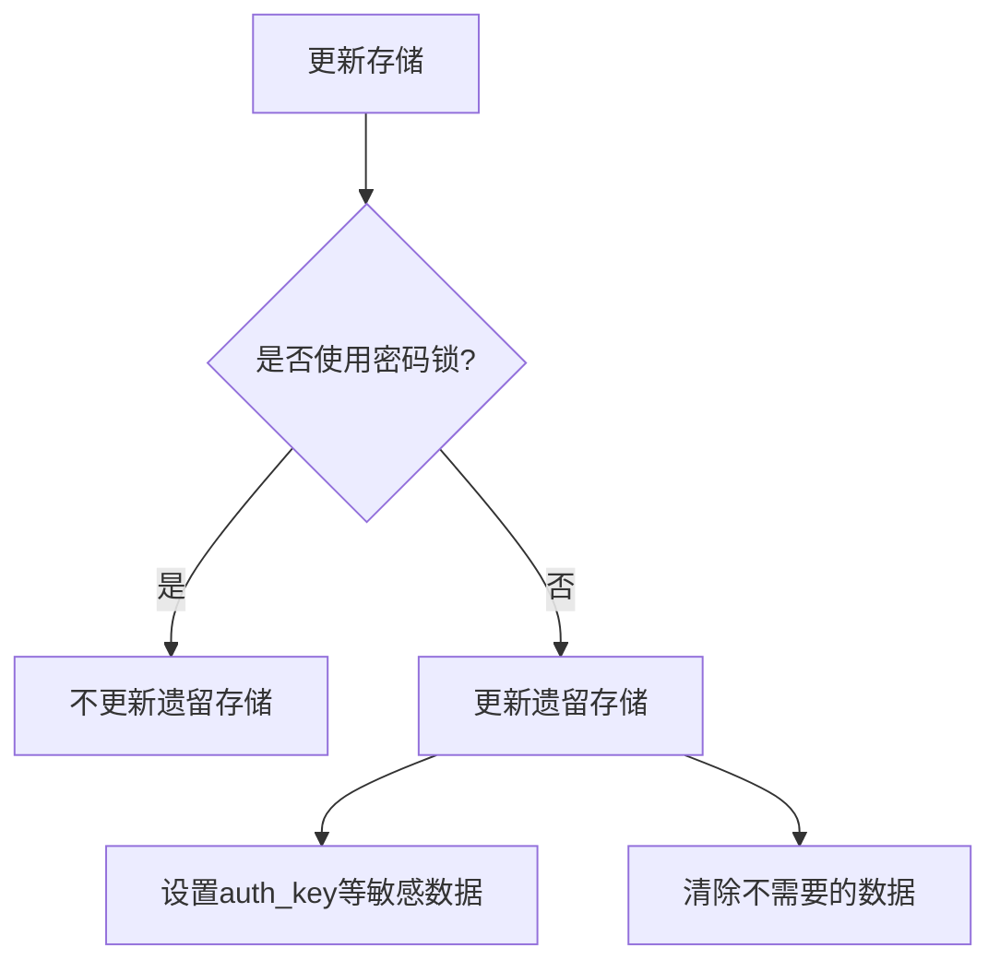
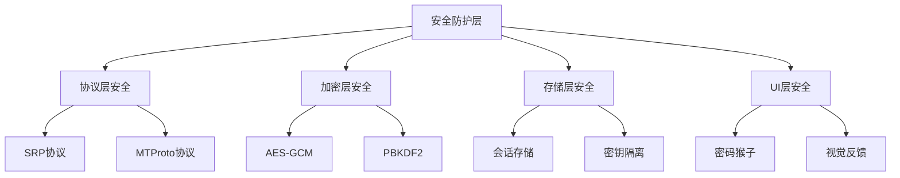

# 账户安全

<cite>
**本文档中引用的文件**  
- [accountController.ts](file://src/lib/accounts/accountController.ts)
- [crypto_methods.ts](file://src/lib/crypto/crypto_methods.ts)
- [passwordManager.ts](file://src/lib/mtproto/passwordManager.ts)
- [srp.ts](file://src/lib/crypto/srp.ts)
- [aesLocal.ts](file://src/lib/crypto/utils/aesLocal.ts)
- [deferredIsUsingPasscode.ts](file://src/lib/passcode/deferredIsUsingPasscode.ts)
- [passwordMonkeyTsx.tsx](file://src/components/passcodeLock/passwordMonkeyTsx.tsx)
</cite>

## 目录
1. [简介](#简介)
2. [账户验证实现](#账户验证实现)
3. [数据加密与密钥管理](#数据加密与密钥管理)
4. [访问控制与多账户安全边界](#访问控制与多账户安全边界)
5. [账户导入导出安全](#账户导入导出安全)
6. [安全审计与漏洞防护](#安全审计与漏洞防护)
7. [结论](#结论)

## 简介
本文件详细说明了tweb项目中账户安全的实现机制，涵盖账户验证、数据加密、访问控制、密钥存储、多账户环境安全、账户导入导出保护以及安全审计等方面。系统通过多层次的安全架构确保用户数据的机密性、完整性和可用性。

## 账户验证实现

系统采用基于SRP（Secure Remote Password）协议的密码验证机制，结合Telegram的MTProto协议实现安全的身份认证。账户验证流程包括密码哈希计算、安全参数生成和密钥交换等步骤。

**Diagram sources**
- [passwordManager.ts](file://src/lib/mtproto/passwordManager.ts#L17-L121)
- [srp.ts](file://src/lib/crypto/srp.ts#L31-L167)

**账户验证流程：**
1. 用户输入密码后，客户端使用SRP协议计算密码哈希
2. 哈希计算采用SHA256-SHA256-PBKDF2-HMAC-SHA512迭代100000次的算法组合
3. 生成SRP验证参数，包括srp_id、A值和M1验证码
4. 向服务器发送验证请求
5. 服务器验证通过后返回授权信息

**Section sources**
- [passwordManager.ts](file://src/lib/mtproto/passwordManager.ts#L17-L121)
- [srp.ts](file://src/lib/crypto/srp.ts#L17-L167)

## 数据加密与密钥管理

系统实现了多层次的数据加密机制，包括本地数据加密、会话密钥管理和加密工作线程调度。

### 本地数据加密
使用AES-GCM模式对本地存储的敏感数据进行加密，确保数据在设备上的安全性。

**Diagram sources**
- [aesLocal.ts](file://src/lib/crypto/utils/aesLocal.ts#L1-L44)

### 加密方法管理
系统通过CryptoMethods接口统一管理各种加密算法，包括哈希函数、对称加密、非对称加密和密钥派生函数。

**Diagram sources**
- [crypto_methods.ts](file://src/lib/crypto/crypto_methods.ts#L22-L42)

**Section sources**
- [crypto_methods.ts](file://src/lib/crypto/crypto_methods.ts#L1-L43)
- [aesLocal.ts](file://src/lib/crypto/utils/aesLocal.ts#L1-L44)
- [srp.ts](file://src/lib/crypto/srp.ts#L1-L167)

## 访问控制与多账户安全边界

系统实现了严格的访问控制机制和多账户隔离策略，确保不同账户之间的数据安全边界。

### 多账户管理
通过AccountController类管理最多4个账户，每个账户有独立的会话数据和安全上下文。

**Diagram sources**
- [accountController.ts](file://src/lib/accounts/accountController.ts#L15-L155)

### 安全边界控制
系统通过延迟判断机制确保在启用密码锁时不会暴露敏感密钥信息。

**Diagram sources**
- [accountController.ts](file://src/lib/accounts/accountController.ts#L116-L149)

**Section sources**
- [accountController.ts](file://src/lib/accounts/accountController.ts#L1-L155)
- [deferredIsUsingPasscode.ts](file://src/lib/passcode/deferredIsUsingPasscode.ts#L1-L32)

## 账户导入导出安全

系统在账户导入导出过程中实施了严格的安全保护措施，确保用户数据的隐私合规性。

### 导入导出安全考虑
1. **数据保护**：在导入导出过程中，敏感数据始终处于加密状态
2. **隐私合规**：遵循数据最小化原则，只传输必要的账户信息
3. **完整性验证**：使用哈希校验确保数据在传输过程中的完整性
4. **访问控制**：导入导出操作需要用户明确授权

系统通过加密工作线程处理所有敏感操作，确保密钥材料不会暴露在主执行上下文中。

**Section sources**
- [accountController.ts](file://src/lib/accounts/accountController.ts#L32-L40)
- [crypto_methods.ts](file://src/lib/crypto/crypto_methods.ts#L22-L42)

## 安全审计与漏洞防护

系统实现了全面的安全审计和漏洞防护机制，确保账户系统的长期安全性。

### 安全审计功能
1. **密码强度验证**：在设置密码时检查密码复杂度
2. **异常登录检测**：监控异常的登录行为
3. **安全事件日志**：记录关键安全操作
4. **定期安全检查**：自动检测潜在的安全风险

### 漏洞防护措施
1. **SRP协议实现**：使用经过验证的SRP协议实现，防止中间人攻击
2. **密钥隔离**：将加密密钥与主应用逻辑隔离在独立的工作线程中
3. **输入验证**：对所有用户输入进行严格验证
4. **安全随机数**：使用高质量的随机数生成器
5. **内存安全**：及时清除敏感数据的内存引用

系统通过密码猴子(passcode monkey)等视觉反馈机制，增强用户对安全状态的感知。

**Diagram sources**
- [passwordMonkeyTsx.tsx](file://src/components/passcodeLock/passwordMonkeyTsx.tsx#L1-L54)
- [srp.ts](file://src/lib/crypto/srp.ts#L1-L167)

**Section sources**
- [passwordMonkeyTsx.tsx](file://src/components/passcodeLock/passwordMonkeyTsx.tsx#L1-L54)
- [srp.ts](file://src/lib/crypto/srp.ts#L1-L167)
- [crypto_methods.ts](file://src/lib/crypto/crypto_methods.ts#L1-L43)

## 结论
tweb项目通过多层次的安全架构实现了全面的账户安全保障。系统采用行业标准的加密算法和安全协议，结合严格的访问控制和多账户隔离策略，确保用户数据的安全性。未来可进一步增强安全审计功能，增加更多自动化安全检测机制，持续提升系统的整体安全水平。