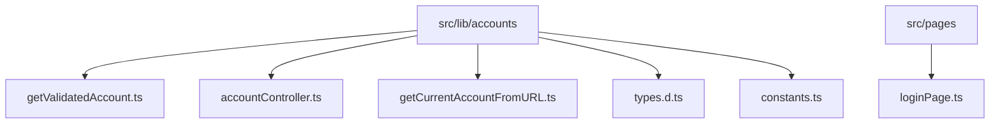
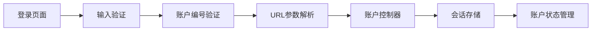
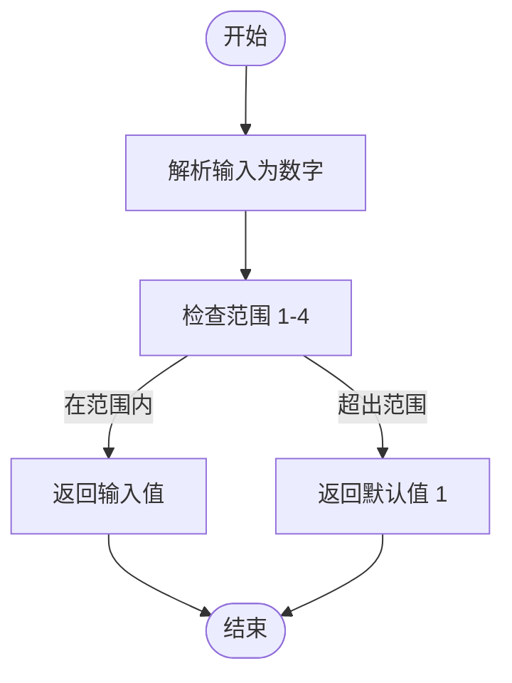
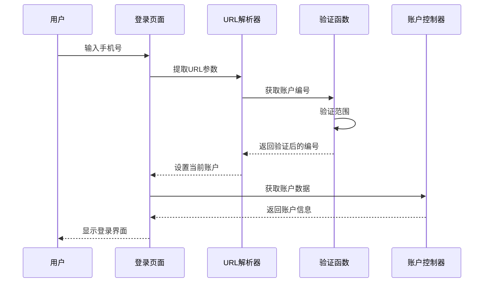
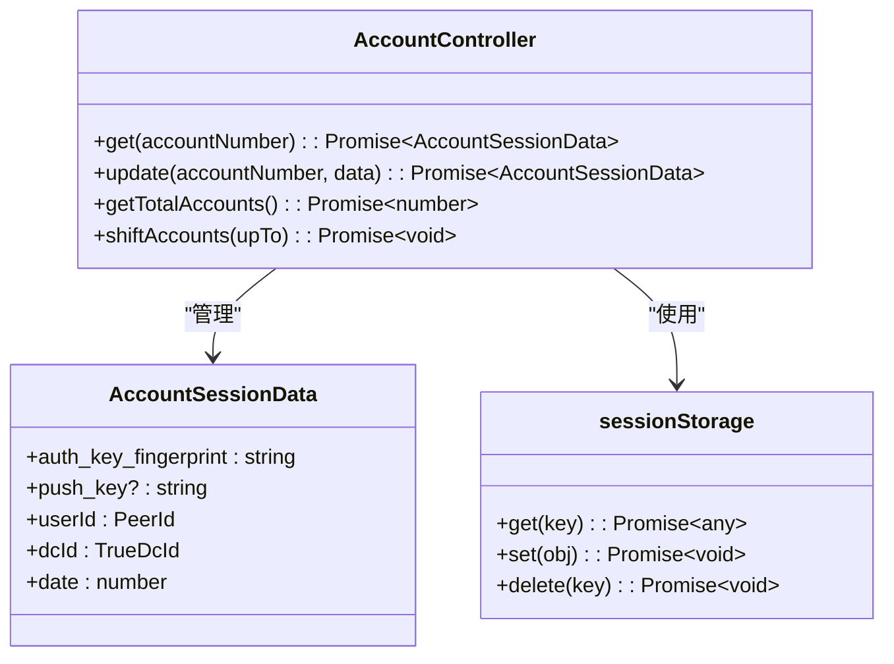
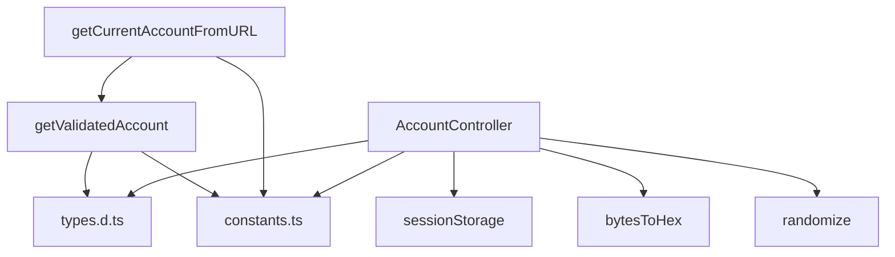

# 账户验证

<cite>
**本文档中引用的文件**  
- [getValidatedAccount.ts](file://src/lib/accounts/getValidatedAccount.ts)
- [accountController.ts](file://src/lib/accounts/accountController.ts)
- [getCurrentAccountFromURL.ts](file://src/lib/accounts/getCurrentAccountFromURL.ts)
- [types.d.ts](file://src/lib/accounts/types.d.ts)
- [constants.ts](file://src/lib/accounts/constants.ts)
- [loginPage.ts](file://src/pages/loginPage.ts)
</cite>

## 目录
1. [简介](#简介)
2. [项目结构](#项目结构)
3. [核心组件](#核心组件)
4. [架构概述](#架构概述)
5. [详细组件分析](#详细组件分析)
6. [依赖分析](#依赖分析)
7. [性能考虑](#性能考虑)
8. [故障排除指南](#故障排除指南)
9. [结论](#结论)

## 简介
本文档详细说明了账户验证系统的实现机制，重点分析了`getValidatedAccount`函数的逻辑，包括输入验证、状态检查和错误处理。文档还描述了账户验证流程在登录过程中的集成方式，从手机号输入到验证码确认的完整链路，以及验证状态的存储和管理机制。

## 项目结构
账户验证功能主要分布在`src/lib/accounts`目录下，相关组件包括账户控制器、验证函数和类型定义。登录界面位于`src/pages/loginPage.ts`，负责用户交互和初始验证流程。

**Diagram sources**
- [getValidatedAccount.ts](file://src/lib/accounts/getValidatedAccount.ts)
- [accountController.ts](file://src/lib/accounts/accountController.ts)
- [getCurrentAccountFromURL.ts](file://src/lib/accounts/getCurrentAccountFromURL.ts)
- [types.d.ts](file://src/lib/accounts/types.d.ts)
- [constants.ts](file://src/lib/accounts/constants.ts)
- [loginPage.ts](file://src/pages/loginPage.ts)

**Section sources**
- [getValidatedAccount.ts](file://src/lib/accounts/getValidatedAccount.ts)
- [accountController.ts](file://src/lib/accounts/accountController.ts)
- [getCurrentAccountFromURL.ts](file://src/lib/accounts/getCurrentAccountFromURL.ts)
- [types.d.ts](file://src/lib/accounts/types.d.ts)
- [constants.ts](file://src/lib/accounts/constants.ts)
- [loginPage.ts](file://src/pages/loginPage.ts)

## 核心组件
核心账户验证功能由`getValidatedAccount`函数实现，该函数负责验证和规范化账户编号输入。`AccountController`类管理账户数据的存储和检索，而`getCurrentAccountFromURL`函数处理URL参数中的账户信息提取。

**Section sources**
- [getValidatedAccount.ts](file://src/lib/accounts/getValidatedAccount.ts)
- [accountController.ts](file://src/lib/accounts/accountController.ts)
- [getCurrentAccountFromURL.ts](file://src/lib/accounts/getCurrentAccountFromURL.ts)

## 架构概述
账户验证系统采用分层架构，前端登录页面收集用户输入，通过验证函数处理后，由账户控制器管理持久化存储。系统通过URL参数传递账户上下文，确保跨会话的一致性。

**Diagram sources**
- [loginPage.ts](file://src/pages/loginPage.ts)
- [getValidatedAccount.ts](file://src/lib/accounts/getValidatedAccount.ts)
- [getCurrentAccountFromURL.ts](file://src/lib/accounts/getCurrentAccountFromURL.ts)
- [accountController.ts](file://src/lib/accounts/accountController.ts)

## 详细组件分析

### getValidatedAccount函数分析
`getValidatedAccount`函数是账户验证的核心，负责确保输入的账户编号在有效范围内。

**Diagram sources**
- [getValidatedAccount.ts](file://src/lib/accounts/getValidatedAccount.ts#L3-L6)

**Section sources**
- [getValidatedAccount.ts](file://src/lib/accounts/getValidatedAccount.ts#L1-L7)

### 账户验证流程分析
从用户输入到最终账户确认的完整验证流程。

**Diagram sources**
- [loginPage.ts](file://src/pages/loginPage.ts)
- [getCurrentAccountFromURL.ts](file://src/lib/accounts/getCurrentAccountFromURL.ts)
- [getValidatedAccount.ts](file://src/lib/accounts/getValidatedAccount.ts)
- [accountController.ts](file://src/lib/accounts/accountController.ts)

### 账户状态管理分析
账户状态的存储和管理机制。

**Diagram sources**
- [accountController.ts](file://src/lib/accounts/accountController.ts)
- [types.d.ts](file://src/lib/accounts/types.d.ts)

## 依赖分析
账户验证系统依赖于会话存储、URL解析和类型定义等核心模块。

**Diagram sources**
- [getValidatedAccount.ts](file://src/lib/accounts/getValidatedAccount.ts)
- [getCurrentAccountFromURL.ts](file://src/lib/accounts/getCurrentAccountFromURL.ts)
- [accountController.ts](file://src/lib/accounts/accountController.ts)
- [types.d.ts](file://src/lib/accounts/types.d.ts)
- [constants.ts](file://src/lib/accounts/constants.ts)

**Section sources**
- [getValidatedAccount.ts](file://src/lib/accounts/getValidatedAccount.ts)
- [getCurrentAccountFromURL.ts](file://src/lib/accounts/getCurrentAccountFromURL.ts)
- [accountController.ts](file://src/lib/accounts/accountController.ts)
- [types.d.ts](file://src/lib/accounts/types.d.ts)
- [constants.ts](file://src/lib/accounts/constants.ts)

## 性能考虑
账户验证系统设计考虑了性能优化，包括：
- 使用静态工具类避免实例化开销
- 异步操作的批量处理
- 缓存机制减少重复计算
- 轻量级验证逻辑确保快速响应

## 故障排除指南

### 常见验证失败场景
1. **无效账户编号**：输入超出1-4范围的数字
2. **URL参数缺失**：未提供账户查询参数
3. **会话数据损坏**：存储的账户数据不完整
4. **类型不匹配**：非数字输入导致解析失败

### 排查步骤
1. 检查URL中的账户参数格式
2. 验证输入是否为有效数字
3. 确认会话存储中的账户数据完整性
4. 检查浏览器存储权限设置

**Section sources**
- [getValidatedAccount.ts](file://src/lib/accounts/getValidatedAccount.ts)
- [accountController.ts](file://src/lib/accounts/accountController.ts)
- [getCurrentAccountFromURL.ts](file://src/lib/accounts/getCurrentAccountFromURL.ts)

## 结论
账户验证系统通过简洁有效的设计实现了可靠的身份验证功能。`getValidatedAccount`函数作为核心验证逻辑，确保了账户编号的有效性，而`AccountController`提供了完整的账户状态管理。系统与登录流程紧密集成，为用户提供流畅的验证体验。