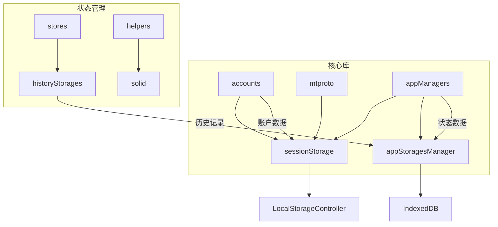
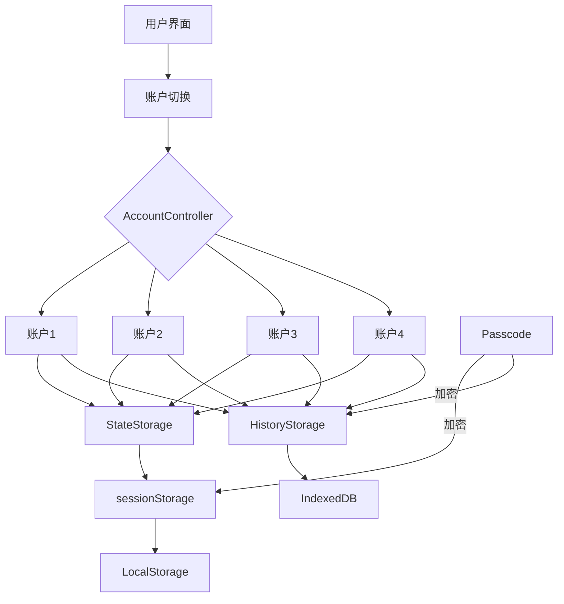
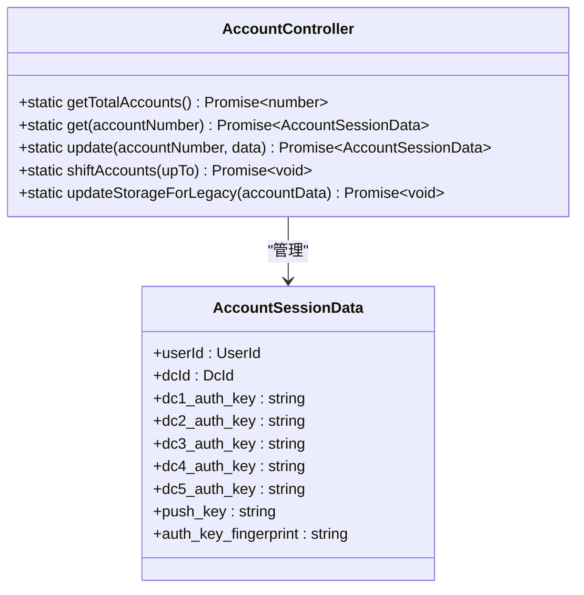
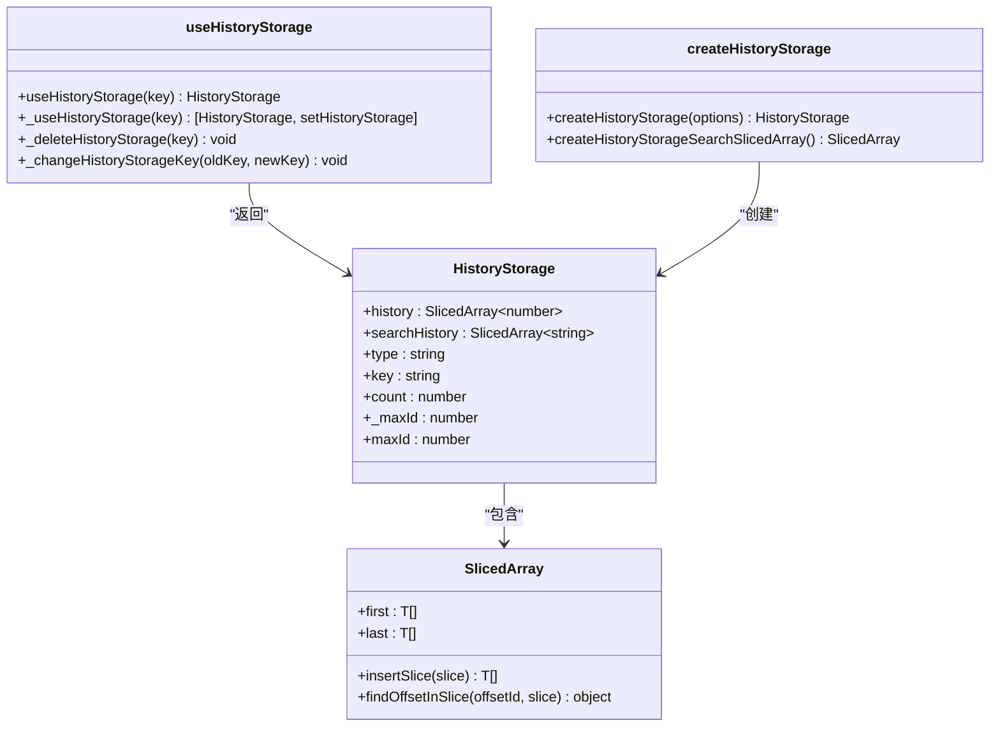
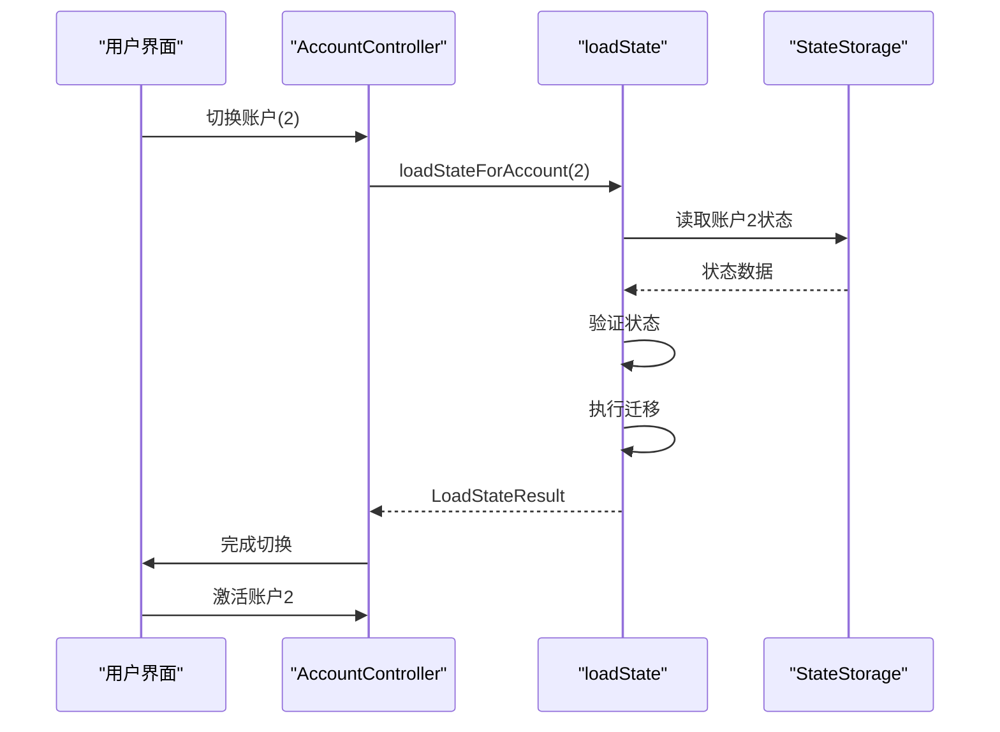
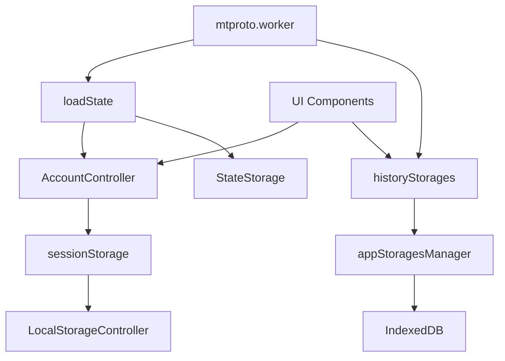

# 会话上下文隔离

<cite>
**本文档中引用的文件**  
- [accountController.ts](file://src/lib/accounts/accountController.ts)
- [sessionStorage.ts](file://src/lib/sessionStorage.ts)
- [loadState.ts](file://src/lib/appManagers/utils/state/loadState.ts)
- [historyStorages.ts](file://src/stores/historyStorages.ts)
- [createHistoryStorage.ts](file://src/lib/appManagers/utils/messages/createHistoryStorage.ts)
- [mtproto.worker.ts](file://src/lib/mtproto/mtproto.worker.ts)
- [appStoragesManager.ts](file://src/lib/appManagers/appStoragesManager.ts)
- [constants.ts](file://src/lib/accounts/constants.ts)
</cite>

## 目录
1. [简介](#简介)
2. [项目结构](#项目结构)
3. [核心组件](#核心组件)
4. [架构概述](#架构概述)
5. [详细组件分析](#详细组件分析)
6. [依赖分析](#依赖分析)
7. [性能考虑](#性能考虑)
8. [故障排除指南](#故障排除指南)
9. [结论](#结论)

## 简介
本文档详细描述了在多账户环境下会话上下文隔离的实现机制。系统通过独立的存储结构和状态管理，确保各账户的数据完全隔离，同时支持上下文切换时的状态保存与恢复。文档涵盖数据结构设计、存储机制、性能优化策略以及测试验证方法，全面保障会话上下文隔离的正确性和可靠性。

## 项目结构
项目采用分层架构，核心会话管理功能集中在`src/lib`目录下。账户管理、状态存储和上下文隔离相关代码分布在`accounts`、`mtproto`和`appManagers`等模块中。`src/stores`目录包含响应式状态管理实现，而`src/helpers`提供通用工具函数。这种结构确保了会话上下文隔离功能的模块化和可维护性。



**Diagram sources**  
- [accountController.ts](file://src/lib/accounts/accountController.ts#L1-L154)
- [sessionStorage.ts](file://src/lib/sessionStorage.ts#L1-L83)
- [historyStorages.ts](file://src/stores/historyStorages.ts#L1-L28)

**Section sources**
- [accountController.ts](file://src/lib/accounts/accountController.ts#L1-L154)
- [sessionStorage.ts](file://src/lib/sessionStorage.ts#L1-L83)

## 核心组件
系统通过`AccountController`管理多账户生命周期，每个账户拥有独立的会话数据。`sessionStorage`基于`LocalStorageController`实现数据隔离，而`historyStorages`使用`createHistoryStorage`为每个会话创建独立的历史记录存储。状态管理通过`StateStorage`和`CommonStateStorage`分离账户特定状态与共享状态，确保上下文隔离的完整性。

**Section sources**
- [accountController.ts](file://src/lib/accounts/accountController.ts#L15-L154)
- [sessionStorage.ts](file://src/lib/sessionStorage.ts#L71-L82)
- [loadState.ts](file://src/lib/appManagers/utils/state/loadState.ts#L243-L504)

## 架构概述
系统采用多层隔离架构，从账户层、会话层到数据层实现全面的上下文隔离。账户控制器管理账户切换，状态存储器处理状态持久化，历史存储器维护会话历史。各层通过明确的接口交互，确保数据流的清晰和隔离的可靠性。



**Diagram sources**  
- [accountController.ts](file://src/lib/accounts/accountController.ts#L15-L154)
- [sessionStorage.ts](file://src/lib/sessionStorage.ts#L71-L82)
- [historyStorages.ts](file://src/stores/historyStorages.ts#L10-L17)

## 详细组件分析

### 账户管理分析
`AccountController`是多账户系统的核心，负责账户的创建、读取、更新和删除操作。每个账户通过数字编号（1-4）标识，账户数据存储在独立的键值中，如`account1`、`account2`等。系统支持最多4个账户（免费用户3个），通过`MAX_ACCOUNTS`常量定义。



**Diagram sources**  
- [accountController.ts](file://src/lib/accounts/accountController.ts#L15-L154)
- [constants.ts](file://src/lib/accounts/constants.ts#L1-L6)

**Section sources**
- [accountController.ts](file://src/lib/accounts/accountController.ts#L15-L154)
- [constants.ts](file://src/lib/accounts/constants.ts#L1-L6)

### 状态存储分析
会话状态通过`sessionStorage`进行持久化存储，基于`LocalStorageController`实现。系统为每个账户分配独立的存储空间，关键数据包括认证密钥、服务器盐值、用户认证信息等。存储结构设计确保了账户间的数据完全隔离。

```mermaid
erDiagram
ACCOUNT_SESSIONS {
string account1 PK
string account2
string account3
string account4
string auth_key_fingerprint
string user_auth
string dc
number server_time_offset
string xt_instance
string kz_version
number number_of_accounts
number current_account
}
ACCOUNT_SESSIONS ||--o{ ACCOUNT1 : "包含"
ACCOUNT_SESSIONS ||--o{ ACCOUNT2 : "包含"
ACCOUNT_SESSIONS ||--o{ ACCOUNT3 : "包含"
ACCOUNT_SESSIONS ||--o{ ACCOUNT4 : "包含"
class ACCOUNT1 {
string dc1_auth_key
string dc2_auth_key
string dc3_auth_key
string dc4_auth_key
string dc5_auth_key
string dc1_server_salt
string dc2_server_salt
string dc3_server_salt
string dc4_server_salt
string dc5_server_salt
string encryption_key
}
class ACCOUNT2 {
string dc1_auth_key
string dc2_auth_key
string dc3_auth_key
string dc4_auth_key
string dc5_auth_key
string dc1_server_salt
string dc2_server_salt
string dc3_server_salt
string dc4_server_salt
string dc5_server_salt
string encryption_key
}
class ACCOUNT3 {
string dc1_auth_key
string dc2_auth_key
string dc3_auth_key
string dc4_auth_key
string dc5_auth_key
string dc1_server_salt
string dc2_server_salt
string dc3_server_salt
string dc4_server_salt
string dc5_server_salt
string encryption_key
}
class ACCOUNT4 {
string dc1_auth_key
string dc2_auth_key
string dc3_auth_key
string dc4_auth_key
string dc5_auth_key
string dc1_server_salt
string dc2_server_salt
string dc3_server_salt
string dc4_server_salt
string dc5_server_salt
string encryption_key
}
```

**Diagram sources**  
- [sessionStorage.ts](file://src/lib/sessionStorage.ts#L16-L69)

**Section sources**
- [sessionStorage.ts](file://src/lib/sessionStorage.ts#L1-L83)

### 历史记录分析
每个会话的历史记录通过`historyStorages`独立管理，使用`SlicedArray`数据结构高效存储消息历史。系统为每个会话创建独立的`HistoryStorage`实例，确保消息历史的完全隔离。历史记录存储支持搜索历史和普通历史两种模式。



**Diagram sources**  
- [historyStorages.ts](file://src/stores/historyStorages.ts#L1-L28)
- [createHistoryStorage.ts](file://src/lib/appManagers/utils/messages/createHistoryStorage.ts#L1-L49)

**Section sources**
- [historyStorages.ts](file://src/stores/historyStorages.ts#L1-L28)
- [createHistoryStorage.ts](file://src/lib/appManagers/utils/messages/createHistoryStorage.ts#L1-L49)

### 上下文切换分析
上下文切换涉及账户状态的保存和恢复，通过`loadStateForAccount`和`StateWriter`实现。系统在切换账户时，先保存当前账户状态，然后加载目标账户状态。状态验证和迁移逻辑确保了上下文切换的完整性和一致性。



**Diagram sources**  
- [loadState.ts](file://src/lib/appManagers/utils/state/loadState.ts#L243-L504)
- [accountController.ts](file://src/lib/accounts/accountController.ts#L15-L154)

**Section sources**
- [loadState.ts](file://src/lib/appManagers/utils/state/loadState.ts#L243-L504)

## 依赖分析
系统各组件间存在明确的依赖关系，确保会话上下文隔离的实现。`AccountController`依赖`sessionStorage`进行数据持久化，`loadState`模块依赖`AccountController`获取账户信息，`historyStorages`依赖`appStoragesManager`访问底层存储。



**Diagram sources**  
- [accountController.ts](file://src/lib/accounts/accountController.ts#L6-L8)
- [loadState.ts](file://src/lib/appManagers/utils/state/loadState.ts#L248-L251)
- [historyStorages.ts](file://src/stores/historyStorages.ts#L3-L3)

**Section sources**
- [accountController.ts](file://src/lib/accounts/accountController.ts#L1-L154)
- [loadState.ts](file://src/lib/appManagers/utils/state/loadState.ts#L1-L504)
- [historyStorages.ts](file://src/stores/historyStorages.ts#L1-L28)

## 性能考虑
系统在会话上下文隔离实现中考虑了多项性能优化策略。通过`SlicedArray`数据结构优化历史记录存储的内存使用，采用惰性加载和缓存机制减少I/O操作。状态迁移时使用批量操作提高效率，同时通过`recordPromise`监控关键操作性能。

**Section sources**
- [createHistoryStorage.ts](file://src/lib/appManagers/utils/messages/createHistoryStorage.ts#L2-L29)
- [loadState.ts](file://src/lib/appManagers/utils/state/loadState.ts#L285-L291)
- [cacheCallback.ts](file://src/helpers/cacheCallback.ts#L1-L9)

## 故障排除指南
当遇到会话上下文隔离问题时，可检查以下方面：确认`sessionStorage`中的账户数据完整性，验证`StateStorage`的状态版本兼容性，检查`historyStorages`的缓存一致性。启用`DEBUG`模式可获取详细的日志信息，帮助定位问题。

**Section sources**
- [loadState.ts](file://src/lib/appManagers/utils/state/loadState.ts#L26-L37)
- [debug.ts](file://src/config/debug.ts#L1-L13)
- [logger.ts](file://src/lib/logger.ts#L1-L10)

## 结论
本系统通过精心设计的多层架构实现了可靠的会话上下文隔离。从账户管理到状态存储，再到历史记录维护，每个环节都确保了数据的独立性和安全性。通过清晰的接口定义和模块化设计，系统不仅满足了多账户环境下的隔离需求，还提供了良好的扩展性和维护性。性能优化策略和完善的错误处理机制进一步增强了系统的稳定性和用户体验。