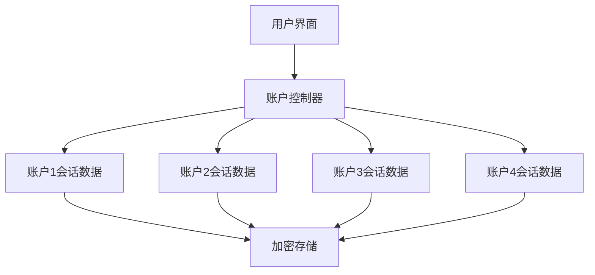
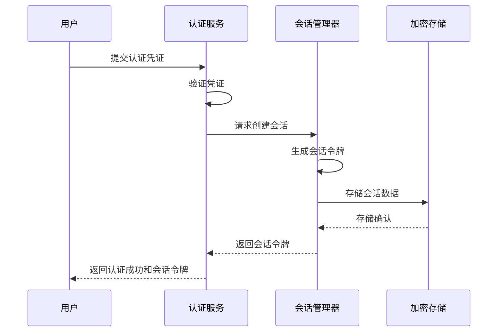
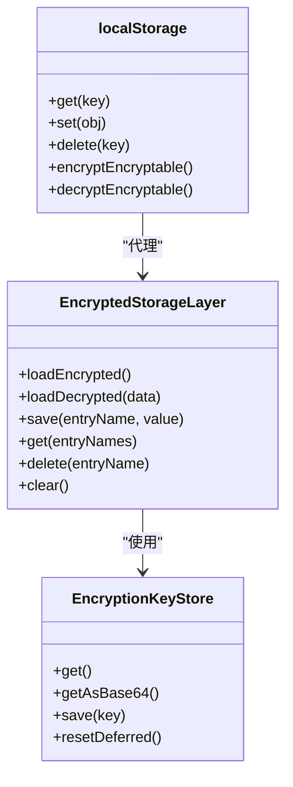
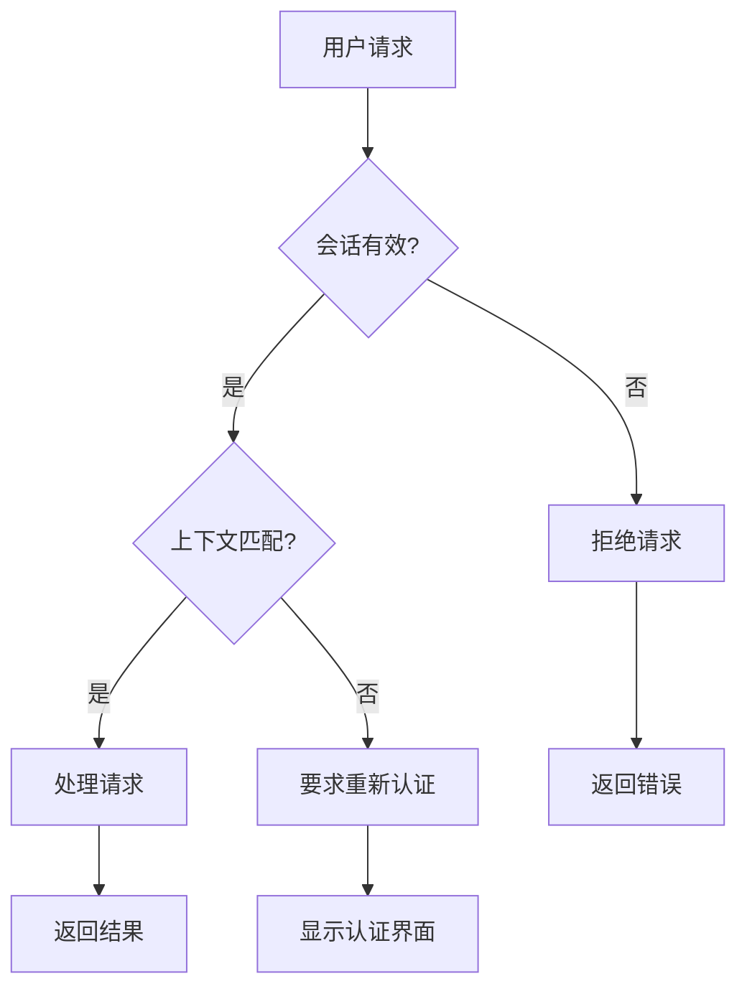
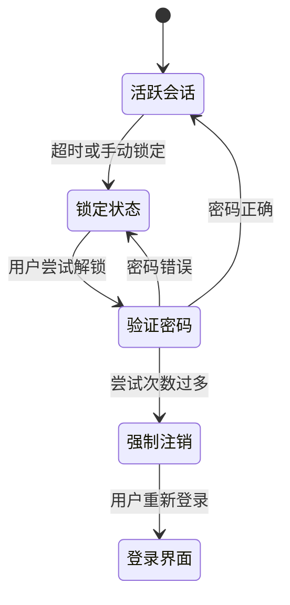
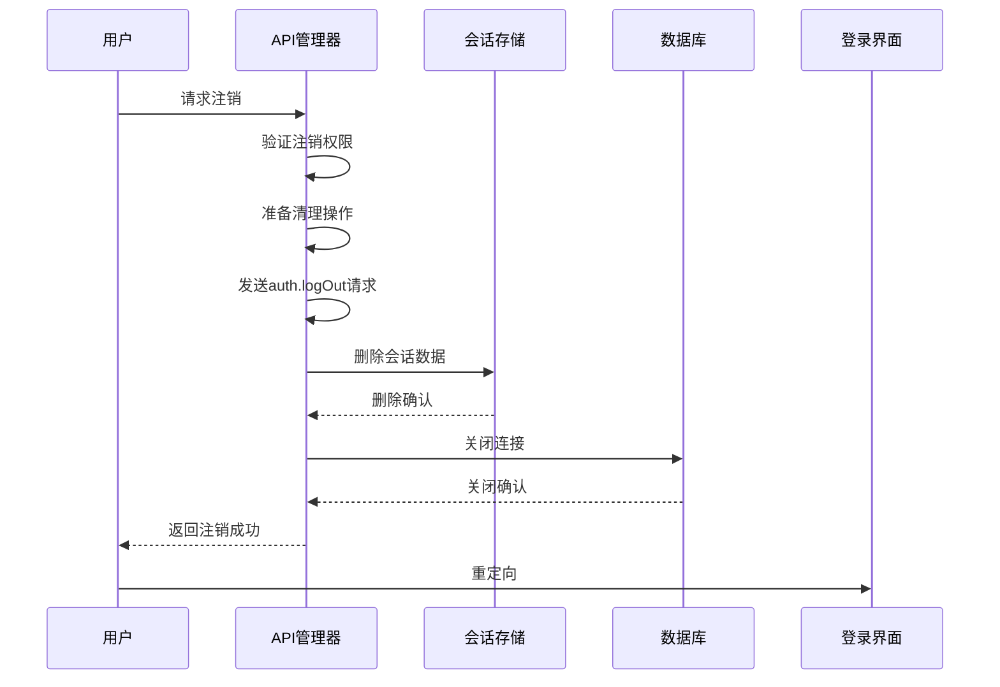

# 会话安全控制

<cite>
**本文档引用的文件**   
- [activeSessions.ts](file://src/components/sidebarLeft/tabs/activeSessions.ts)
- [accountController.ts](file://src/lib/accounts/accountController.ts)
- [passcodeLockScreen.tsx](file://src/components/passcodeLock/passcodeLockScreen.tsx)
- [passcodeLockScreenController.tsx](file://src/components/passcodeLock/passcodeLockScreenController.tsx)
- [encryptedStorageLayer.ts](file://src/lib/encryptedStorageLayer.ts)
- [localStorage.ts](file://src/lib/localStorage.ts)
- [sessionStorage.ts](file://src/lib/sessionStorage.ts)
- [actions.ts](file://src/lib/passcode/actions.ts)
- [keyStore.ts](file://src/lib/passcode/keyStore.ts)
- [apiManager.ts](file://src/lib/mtproto/apiManager.ts)
- [activeWebSessions.ts](file://src/components/sidebarLeft/tabs/activeWebSessions.ts)
</cite>

## 目录
1. [简介](#简介)
2. [多账户环境下的会话数据保护](#多账户环境下的会话数据保护)
3. [会话令牌的生成、存储与验证](#会话令牌的生成存储与验证)
4. [会话数据加密策略](#会话数据加密策略)
5. [防跨会话攻击措施](#防跨会话攻击措施)
6. [会话超时与自动注销](#会话超时与自动注销)
7. [用户主动注销流程](#用户主动注销流程)
8. [结论](#结论)

## 简介
本文档详细描述了在多账户环境下会话安全控制的实现机制。系统通过多层次的安全措施保护用户会话数据，包括会话令牌管理、数据加密、会话绑定和上下文验证等。文档涵盖了会话生命周期的各个方面，从会话创建到终止的完整安全控制流程。

## 多账户环境下的会话数据保护
系统支持多账户环境，每个账户的会话数据独立存储和管理。通过账户控制器(AccountController)实现账户数据的隔离和安全访问。

**图表来源**
- [accountController.ts](file://src/lib/accounts/accountController.ts#L15-L154)

**本节来源**
- [accountController.ts](file://src/lib/accounts/accountController.ts#L15-L154)

## 会话令牌的生成、存储与验证
系统实现了安全的会话令牌管理机制，确保会话的合法性和安全性。

### 会话令牌生成
会话令牌在用户成功认证后生成，包含唯一标识和时间戳信息。系统使用安全的随机数生成算法创建令牌，防止预测和重放攻击。

### 会话令牌存储
会话令牌存储在加密的本地存储中，与用户账户信息关联。系统使用分层存储架构，敏感信息存储在加密存储层。

**图表来源**
- [sessionStorage.ts](file://src/lib/sessionStorage.ts#L71-L82)
- [localStorage.ts](file://src/lib/localStorage.ts#L220-L341)

**本节来源**
- [sessionStorage.ts](file://src/lib/sessionStorage.ts#L71-L82)
- [localStorage.ts](file://src/lib/localStorage.ts#L220-L341)

## 会话数据加密策略
系统采用多层次的加密策略保护会话数据，确保敏感信息的安全。

### 敏感信息加密存储
敏感信息如认证密钥、服务器盐值等采用AES-GCM加密算法进行加密存储。加密密钥通过用户密码派生，确保只有授权用户才能解密数据。

**图表来源**
- [encryptedStorageLayer.ts](file://src/lib/encryptedStorageLayer.ts#L29-L230)
- [keyStore.ts](file://src/lib/passcode/keyStore.ts#L5-L39)
- [localStorage.ts](file://src/lib/localStorage.ts#L220-L341)

**本节来源**
- [encryptedStorageLayer.ts](file://src/lib/encryptedStorageLayer.ts#L29-L230)
- [keyStore.ts](file://src/lib/passcode/keyStore.ts#L5-L39)

## 防跨会话攻击措施
系统实施了多种措施防止跨会话攻击，确保会话的安全性和完整性。

### 会话绑定
每个会话与特定的设备和网络环境绑定，防止会话在不同设备间被滥用。系统记录会话的IP地址、设备型号和浏览器信息，用于会话验证。

### 上下文验证
系统在关键操作前进行上下文验证，确保操作发生在正确的会话环境中。验证包括时间戳检查、消息ID序列验证等。

**图表来源**
- [activeSessions.ts](file://src/components/sidebarLeft/tabs/activeSessions.ts#L34-L45)
- [activeWebSessions.ts](file://src/components/sidebarLeft/tabs/activeWebSessions.ts#L30-L47)

**本节来源**
- [activeSessions.ts](file://src/components/sidebarLeft/tabs/activeSessions.ts#L34-L45)
- [activeWebSessions.ts](file://src/components/sidebarLeft/tabs/activeWebSessions.ts#L30-L47)

## 会话超时与自动注销
系统实现了会话超时和自动注销机制，增强账户安全性。

### 会话超时设置
用户可以配置会话自动锁定时间，选项包括禁用、1分钟、5分钟、10分钟、15分钟和30分钟。系统在指定时间无活动后自动锁定会话。

### 自动注销流程
当会话超时或用户手动锁定时，系统进入锁定状态。用户需要输入密码才能解锁会话，恢复访问权限。

**图表来源**
- [passcodeLockScreen.tsx](file://src/components/passcodeLock/passcodeLockScreen.tsx#L142-L163)
- [passcodeLockScreenController.tsx](file://src/components/passcodeLock/passcodeLockScreenController.tsx#L55-L74)

**本节来源**
- [passcodeLockScreen.tsx](file://src/components/passcodeLock/passcodeLockScreen.tsx#L142-L163)
- [passcodeLockScreenController.tsx](file://src/components/passcodeLock/passcodeLockScreenController.tsx#L55-L74)

## 用户主动注销流程
用户可以主动注销当前会话，系统会清理相关数据并返回登录界面。

### 注销操作
用户通过界面选项触发注销流程，系统执行以下步骤：
1. 向服务器发送注销请求
2. 清理本地存储中的会话数据
3. 关闭数据库连接
4. 重定向到登录界面

### 多账户处理
在多账户环境下，用户可以选择注销当前账户或所有账户。系统根据选择执行相应的清理操作。

**图表来源**
- [apiManager.ts](file://src/lib/mtproto/apiManager.ts#L301-L368)
- [accountController.ts](file://src/lib/accounts/accountController.ts#L103-L111)

**本节来源**
- [apiManager.ts](file://src/lib/mtproto/apiManager.ts#L301-L368)

## 结论
本文档详细描述了会话安全控制的各个方面，包括多账户环境下的数据保护、会话令牌管理、数据加密策略、防攻击措施以及会话生命周期管理。系统通过多层次的安全机制确保用户会话的安全性，为用户提供可靠的安全保障。