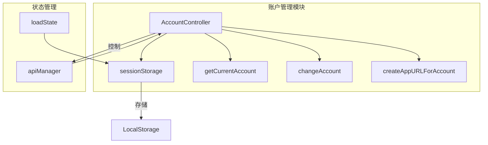
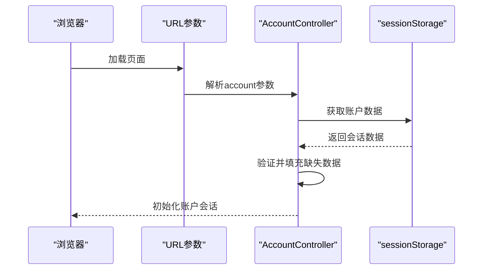
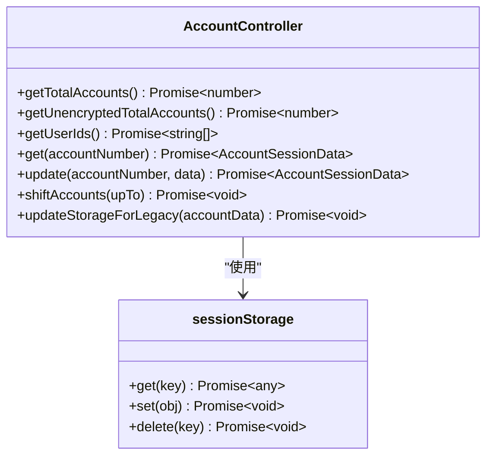
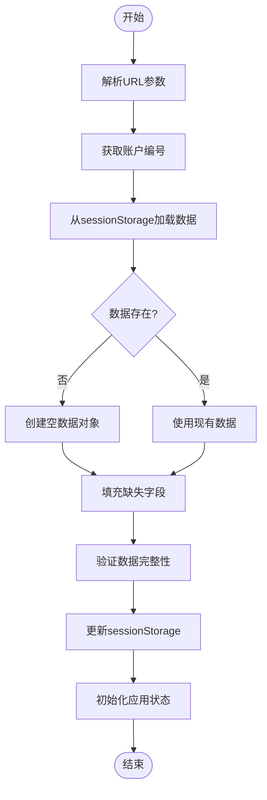
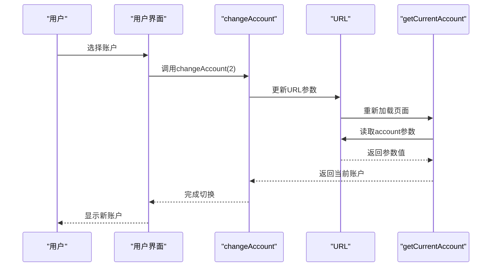
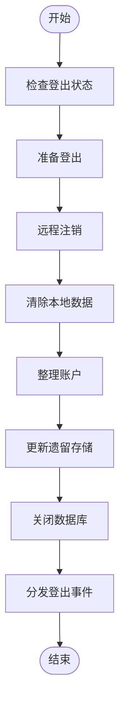
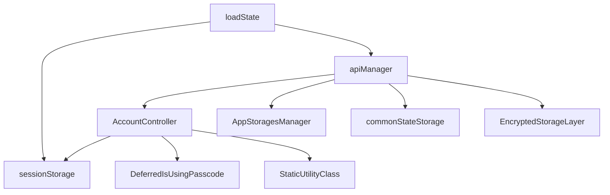

# 会话生命周期管理

<cite>
**本文档中引用的文件**  
- [accountController.ts](file://src/lib/accounts/accountController.ts)
- [sessionStorage.ts](file://src/lib/sessionStorage.ts)
- [apiManager.ts](file://src/lib/mtproto/apiManager.ts)
- [getCurrentAccount.ts](file://src/lib/accounts/getCurrentAccount.ts)
- [getCurrentAccountFromURL.ts](file://src/lib/accounts/getCurrentAccountFromURL.ts)
- [changeAccount.ts](file://src/lib/accounts/changeAccount.ts)
- [createAppURLForAccount.ts](file://src/lib/accounts/createAppURLForAccount.ts)
- [constants.ts](file://src/lib/accounts/constants.ts)
- [types.ts](file://src/lib/accounts/types.ts)
- [loadState.ts](file://src/lib/appManagers/utils/state/loadState.ts)
</cite>

## 目录
1. [简介](#简介)
2. [项目结构](#项目结构)
3. [核心组件](#核心组件)
4. [架构概述](#架构概述)
5. [详细组件分析](#详细组件分析)
6. [依赖分析](#依赖分析)
7. [性能考虑](#性能考虑)
8. [故障排除指南](#故障排除指南)
9. [结论](#结论)

## 简介
本文档详细描述了Telegram Web应用中的会话生命周期管理机制，重点分析多账户环境下的会话从创建到销毁的完整流程。文档涵盖了会话创建的触发条件和初始化流程、会话激活与切换机制、会话销毁条件与清理流程，以及会话状态持久化和异常恢复策略。

## 项目结构
Telegram Web应用采用模块化架构，会话管理相关代码主要集中在`src/lib/accounts`目录下。该目录包含账户控制器、状态管理、URL参数处理等核心功能。会话数据通过`sessionStorage`进行持久化存储，支持最多4个账户（免费用户3个，高级用户4个）。

**图表来源**  
- [accountController.ts](file://src/lib/accounts/accountController.ts)
- [sessionStorage.ts](file://src/lib/sessionStorage.ts)
- [getCurrentAccount.ts](file://src/lib/accounts/getCurrentAccount.ts)

**章节来源**  
- [accountController.ts](file://src/lib/accounts/accountController.ts#L1-L154)
- [sessionStorage.ts](file://src/lib/sessionStorage.ts#L45-L82)

## 核心组件
会话生命周期管理的核心组件包括账户控制器（AccountController）、会话存储（sessionStorage）、账户切换机制和状态加载器。这些组件协同工作，确保多账户环境下的会话管理既安全又高效。

**章节来源**  
- [accountController.ts](file://src/lib/accounts/accountController.ts#L15-L154)
- [sessionStorage.ts](file://src/lib/sessionStorage.ts#L71-L82)

## 架构概述
系统采用基于URL参数的账户识别机制，通过`account`查询参数确定当前活动账户。会话数据存储在浏览器的LocalStorage中，每个账户有独立的存储空间。账户切换通过URL重定向实现，确保会话状态的正确加载和隔离。

**图表来源**  
- [getCurrentAccountFromURL.ts](file://src/lib/accounts/getCurrentAccountFromURL.ts#L4-L7)
- [accountController.ts](file://src/lib/accounts/accountController.ts#L32-L40)

## 详细组件分析

### 账户控制器分析
账户控制器是会话管理的核心，负责账户数据的获取、更新和清理。它通过静态方法提供账户操作接口，确保单例模式下的数据一致性。

#### 类图

**图表来源**  
- [accountController.ts](file://src/lib/accounts/accountController.ts#L15-L154)
- [sessionStorage.ts](file://src/lib/sessionStorage.ts#L71-L82)

### 会话创建与初始化
会话创建通过URL参数触发，系统根据`account`查询参数确定目标账户。初始化流程包括账户数据加载、缺失字段填充和状态恢复。

#### 流程图

**图表来源**  
- [getCurrentAccount.ts](file://src/lib/accounts/getCurrentAccount.ts#L4-L7)
- [accountController.ts](file://src/lib/accounts/accountController.ts#L32-L37)

**章节来源**  
- [accountController.ts](file://src/lib/accounts/accountController.ts#L32-L40)
- [getCurrentAccount.ts](file://src/lib/accounts/getCurrentAccount.ts#L4-L7)

### 会话激活与切换
会话激活通过URL重定向实现，系统根据当前账户编号更新URL参数并重新加载页面。切换机制确保了账户上下文的正确隔离和状态恢复。

#### 序列图

**图表来源**  
- [changeAccount.ts](file://src/lib/accounts/changeAccount.ts#L6-L20)
- [getCurrentAccount.ts](file://src/lib/accounts/getCurrentAccount.ts#L4-L7)

### 会话销毁与清理
会话销毁通过`logOut`方法触发，系统执行完整的清理流程，包括远程注销、本地数据清除和存储整理。销毁条件包括用户主动登出、账户删除和会话过期。

#### 流程图

**图表来源**  
- [apiManager.ts](file://src/lib/mtproto/apiManager.ts#L301-L368)
- [accountController.ts](file://src/lib/accounts/accountController.ts#L103-L111)

## 依赖分析
会话管理模块依赖于多个核心组件，包括存储控制器、状态管理器和API管理器。这些依赖关系确保了会话生命周期的完整性和一致性。

**图表来源**  
- [accountController.ts](file://src/lib/accounts/accountController.ts#L6-L8)
- [apiManager.ts](file://src/lib/mtproto/apiManager.ts#L349-L353)

**章节来源**  
- [accountController.ts](file://src/lib/accounts/accountController.ts#L1-L154)
- [apiManager.ts](file://src/lib/mtproto/apiManager.ts#L301-L368)

## 性能考虑
会话管理在性能方面进行了优化，包括：
- 使用Promise.all并行获取多个账户数据
- 延迟计算当前账户编号
- 异步更新账户计数避免阻塞
- 批量操作LocalStorage减少I/O开销

## 故障排除指南
### 常见问题
1. **账户切换失败**：检查URL参数格式是否正确，确保account参数值在1-4范围内
2. **会话数据丢失**：验证LocalStorage是否被清除，检查浏览器隐私设置
3. **多账户显示异常**：确认MAX_ACCOUNTS常量设置正确，检查账户数据完整性

### 调试方法
- 使用浏览器开发者工具检查LocalStorage中的账户数据
- 监控网络请求中的auth.logOut调用
- 查看控制台日志中的ACC-前缀日志信息

**章节来源**  
- [accountController.ts](file://src/lib/accounts/accountController.ts#L16-L20)
- [apiManager.ts](file://src/lib/mtproto/apiManager.ts#L314-L318)

## 结论
Telegram Web应用的会话生命周期管理设计完善，通过URL参数、LocalStorage和模块化架构实现了多账户环境下的高效会话管理。系统在安全性、性能和用户体验之间取得了良好平衡，为多账户操作提供了可靠的基础支持。