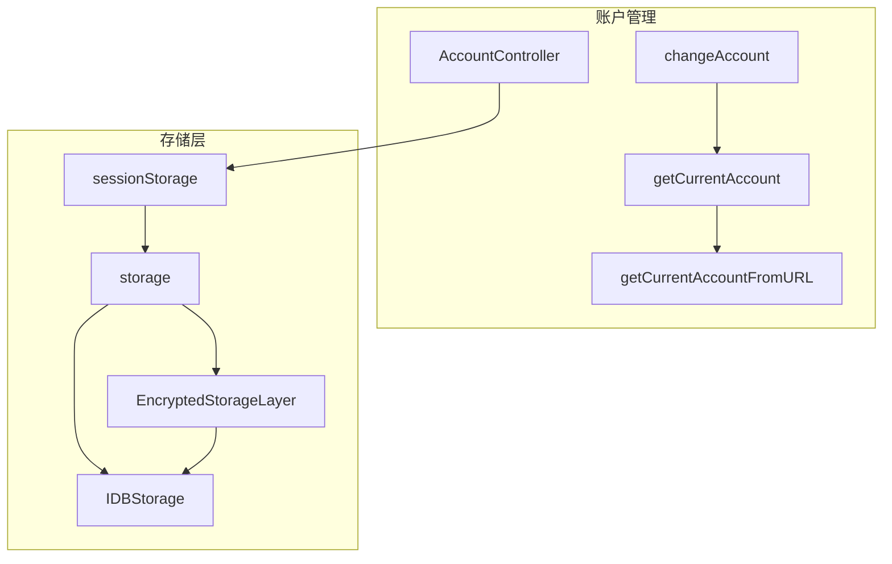
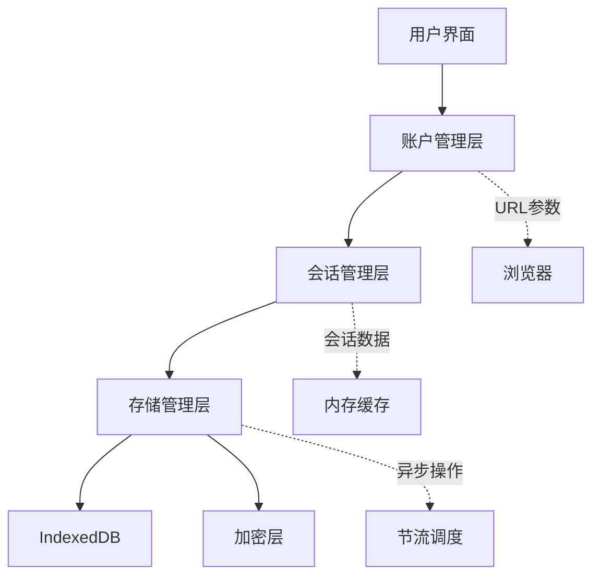
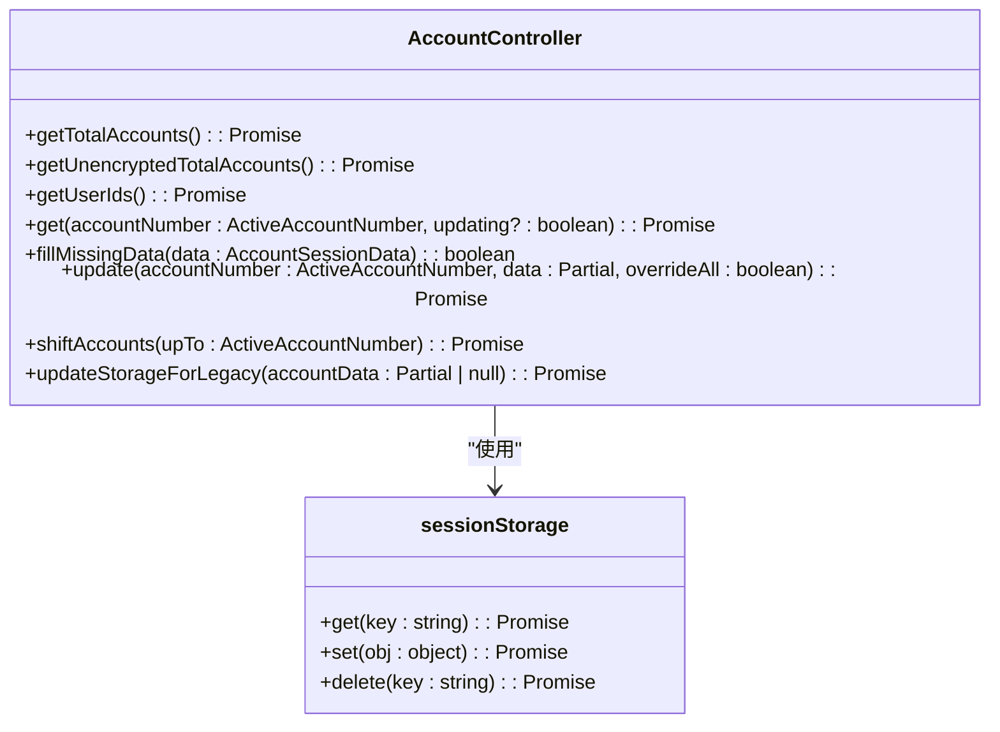
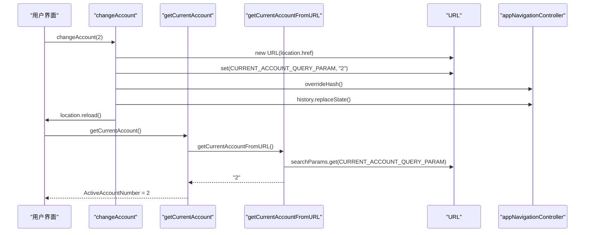
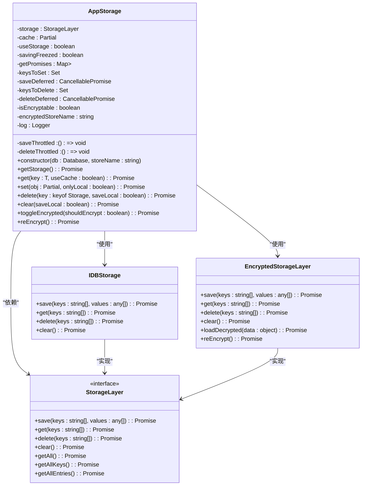
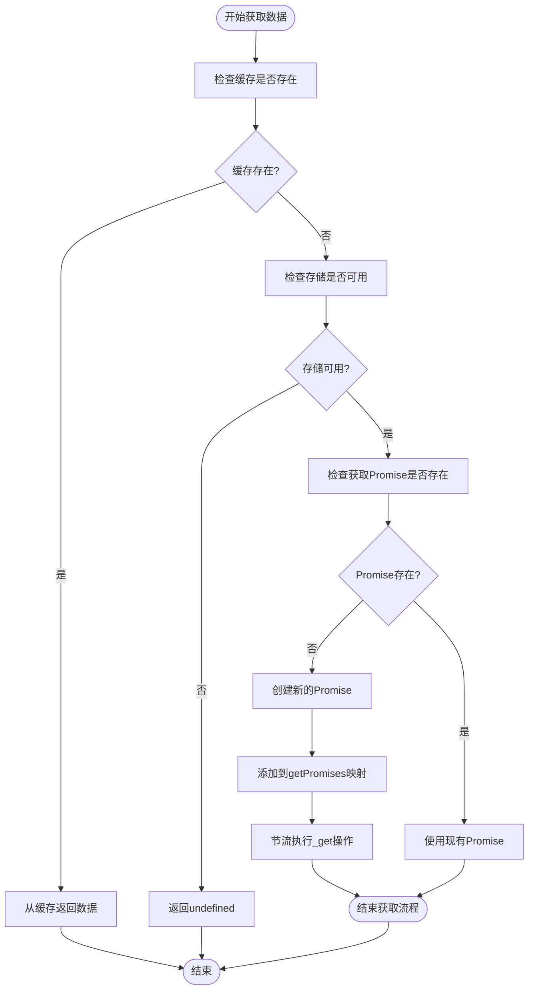
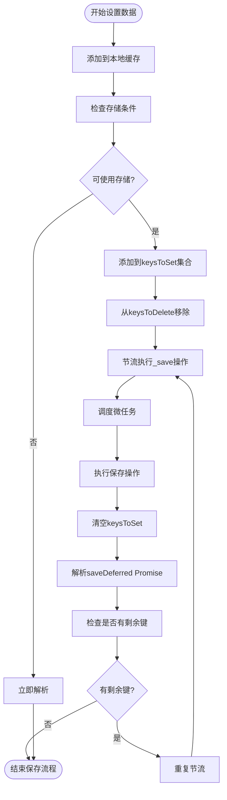
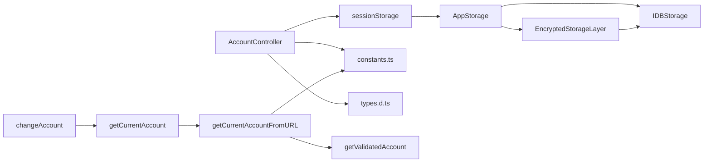

# 会话隔离策略

<cite>
**本文档中引用的文件**  
- [accountController.ts](file://src/lib/accounts/accountController.ts)
- [sessionStorage.ts](file://src/lib/sessionStorage.ts)
- [storage.ts](file://src/lib/storage.ts)
- [changeAccount.ts](file://src/lib/accounts/changeAccount.ts)
- [getCurrentAccount.ts](file://src/lib/accounts/getCurrentAccount.ts)
- [types.d.ts](file://src/lib/accounts/types.d.ts)
- [constants.ts](file://src/lib/accounts/constants.ts)
</cite>

## 目录
1. [简介](#简介)
2. [项目结构](#项目结构)
3. [核心组件](#核心组件)
4. [架构概述](#架构概述)
5. [详细组件分析](#详细组件分析)
6. [依赖分析](#依赖分析)
7. [性能考虑](#性能考虑)
8. [故障排除指南](#故障排除指南)
9. [结论](#结论)

## 简介
本文档详细描述了多账户环境下会话数据的隔离实现机制。系统支持最多四个账户（免费用户三个，高级用户四个），每个账户拥有独立的会话数据存储空间。会话隔离通过基于IndexedDB的分账户存储机制实现，结合URL参数进行账户切换控制。系统采用加密存储层保护敏感数据，并通过会话令牌管理确保账户间数据完全隔离。文档涵盖了会话生命周期管理、上下文隔离机制、安全策略以及性能优化建议。

## 项目结构
项目采用模块化设计，会话管理相关代码主要集中在`src/lib/accounts`和`src/lib/storages`目录下。账户管理逻辑与存储层分离，通过清晰的接口进行交互。系统使用TypeScript类型定义确保数据结构的一致性，并通过独立的存储控制器管理数据持久化。

**Diagram sources**
- [accountController.ts](file://src/lib/accounts/accountController.ts)
- [sessionStorage.ts](file://src/lib/sessionStorage.ts)
- [storage.ts](file://src/lib/storage.ts)

**Section sources**
- [accountController.ts](file://src/lib/accounts/accountController.ts)
- [sessionStorage.ts](file://src/lib/sessionStorage.ts)
- [storage.ts](file://src/lib/storage.ts)

## 核心组件
系统的核心会话隔离机制由账户控制器、会话存储和底层存储系统三部分组成。账户控制器管理账户的增删改查操作，会话存储提供账户特定的数据访问接口，底层存储系统负责数据的持久化和加密处理。这种分层架构确保了会话数据的隔离性和安全性。

**Section sources**
- [accountController.ts](file://src/lib/accounts/accountController.ts)
- [sessionStorage.ts](file://src/lib/sessionStorage.ts)
- [storage.ts](file://src/lib/storage.ts)

## 架构概述
系统采用分层架构实现会话隔离，从上到下分为账户管理层、会话管理层和存储管理层。账户管理层处理账户切换和验证，会话管理层管理账户特定的会话数据，存储管理层负责数据的持久化、加密和性能优化。各层之间通过明确定义的接口进行通信，确保系统的可维护性和扩展性。

**Diagram sources**
- [accountController.ts](file://src/lib/accounts/accountController.ts)
- [sessionStorage.ts](file://src/lib/sessionStorage.ts)
- [storage.ts](file://src/lib/storage.ts)

## 详细组件分析

### 账户管理分析
账户管理组件负责多账户环境下的会话生命周期管理，包括账户创建、激活、切换和销毁等操作。

#### 账户控制器类图

**Diagram sources**
- [accountController.ts](file://src/lib/accounts/accountController.ts)
- [sessionStorage.ts](file://src/lib/sessionStorage.ts)

#### 账户切换序列图

**Diagram sources**
- [changeAccount.ts](file://src/lib/accounts/changeAccount.ts)
- [getCurrentAccount.ts](file://src/lib/accounts/getCurrentAccount.ts)
- [getCurrentAccountFromURL.ts](file://src/lib/accounts/getCurrentAccountFromURL.ts)

**Section sources**
- [accountController.ts](file://src/lib/accounts/accountController.ts)
- [changeAccount.ts](file://src/lib/accounts/changeAccount.ts)
- [getCurrentAccount.ts](file://src/lib/accounts/getCurrentAccount.ts)

### 存储管理层分析
存储管理层负责会话数据的持久化、加密和性能优化，确保数据的安全性和访问效率。

#### 存储系统类图

**Diagram sources**
- [storage.ts](file://src/lib/storage.ts)

#### 会话数据获取流程图

**Diagram sources**
- [storage.ts](file://src/lib/storage.ts)

#### 数据写入节流机制

**Diagram sources**
- [storage.ts](file://src/lib/storage.ts)

**Section sources**
- [storage.ts](file://src/lib/storage.ts)
- [sessionStorage.ts](file://src/lib/sessionStorage.ts)

## 依赖分析
系统各组件之间存在清晰的依赖关系，确保会话隔离机制的正确实现。账户管理组件依赖会话存储组件，会话存储组件依赖底层存储系统，形成清晰的依赖链。加密存储层作为可选组件，仅在需要时被激活，减少了不必要的性能开销。

**Diagram sources**
- [accountController.ts](file://src/lib/accounts/accountController.ts)
- [sessionStorage.ts](file://src/lib/sessionStorage.ts)
- [storage.ts](file://src/lib/storage.ts)
- [constants.ts](file://src/lib/accounts/constants.ts)
- [types.d.ts](file://src/lib/accounts/types.d.ts)

**Section sources**
- [accountController.ts](file://src/lib/accounts/accountController.ts)
- [sessionStorage.ts](file://src/lib/sessionStorage.ts)
- [storage.ts](file://src/lib/storage.ts)

## 性能考虑
系统在会话管理方面采用了多项性能优化策略。通过内存缓存减少对IndexedDB的频繁访问，使用节流机制批量处理存储操作，避免了过多的I/O开销。异步操作的设计确保了UI线程的响应性，而微任务调度则优化了操作的执行时机。缓存和节流机制的结合使用，在保证数据一致性的同时最大化了性能表现。

## 故障排除指南
当遇到会话管理问题时，首先检查浏览器的存储权限设置，确保IndexedDB可用。查看控制台日志中的存储错误信息，特别是"NO_ENTRY_FOUND"和"STORAGE_OFFLINE"等错误类型。对于账户切换失败的问题，验证URL参数格式是否正确。如果遇到数据不一致的情况，检查存储层的加密状态是否匹配。在调试过程中，可以临时禁用节流机制以更清晰地观察数据流。

**Section sources**
- [storage.ts](file://src/lib/storage.ts)
- [sessionStorage.ts](file://src/lib/sessionStorage.ts)

## 结论
本系统通过分层架构和模块化设计实现了可靠的会话隔离机制。基于账户编号的存储分区确保了多账户环境下的数据独立性，而URL参数驱动的账户切换提供了无缝的用户体验。加密存储层的集成增强了数据安全性，节流和缓存机制则保证了系统的高性能表现。整体设计平衡了安全性、性能和用户体验，为多账户应用提供了稳健的会话管理解决方案。