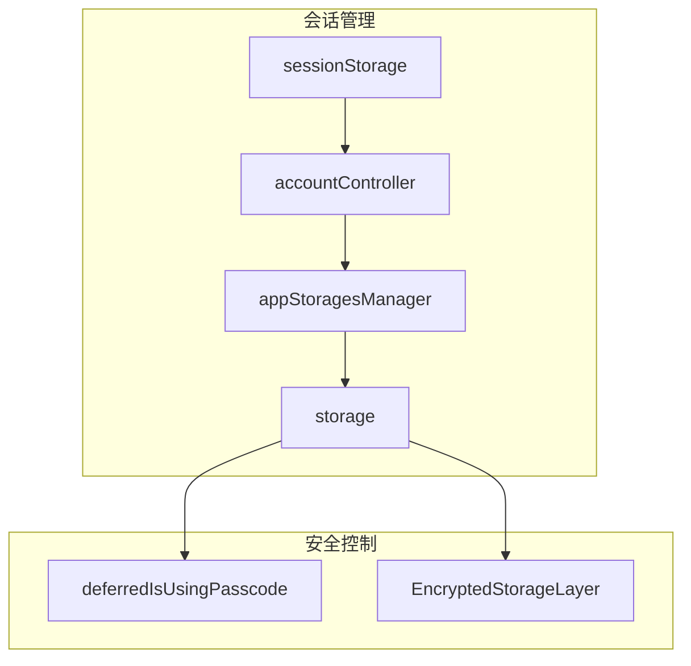
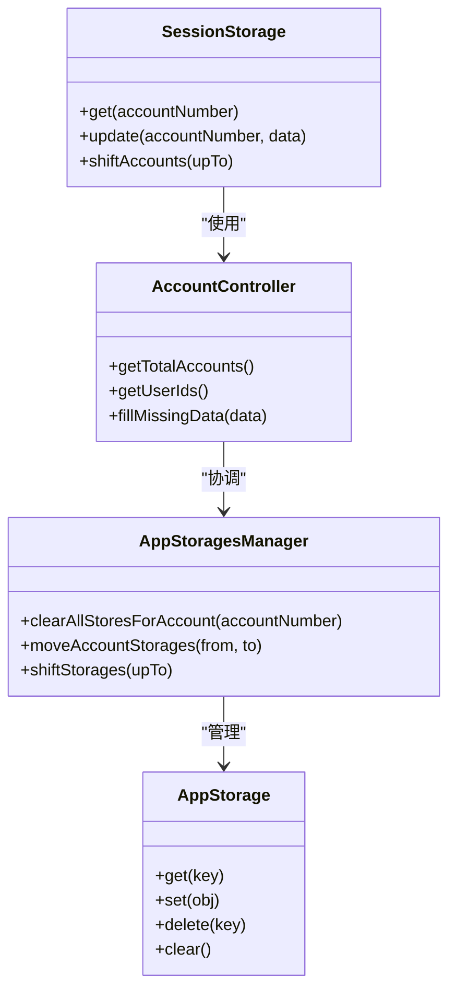
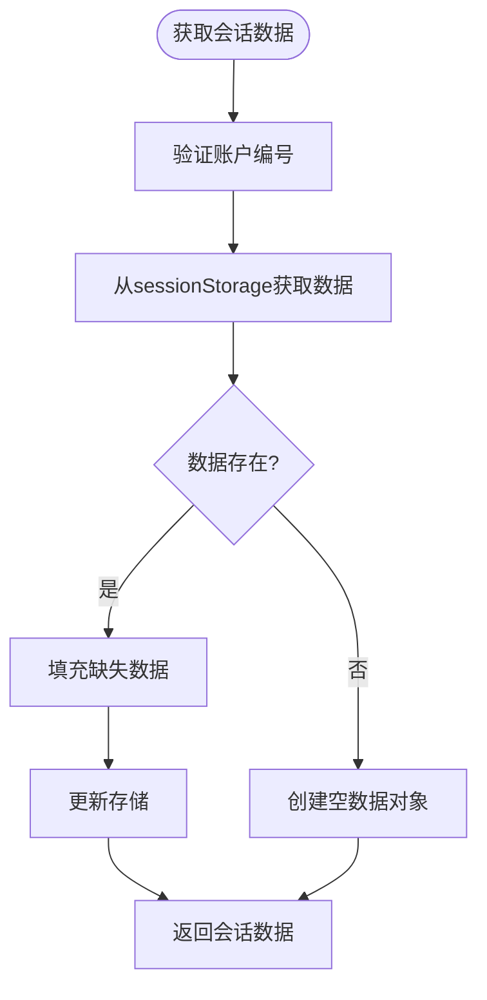
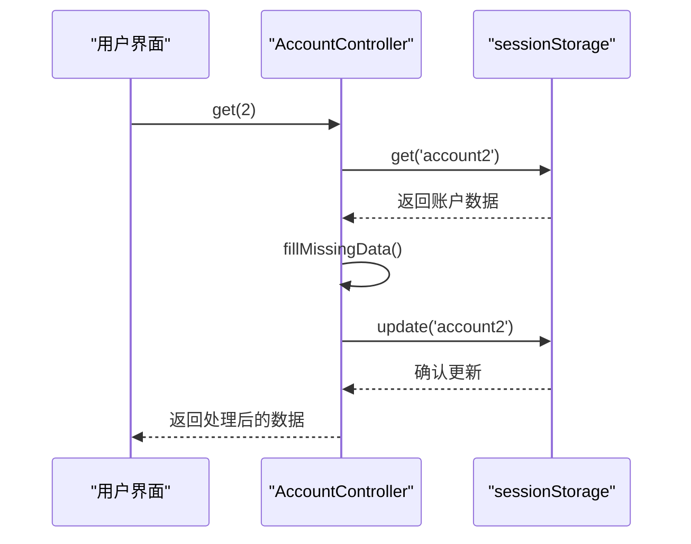
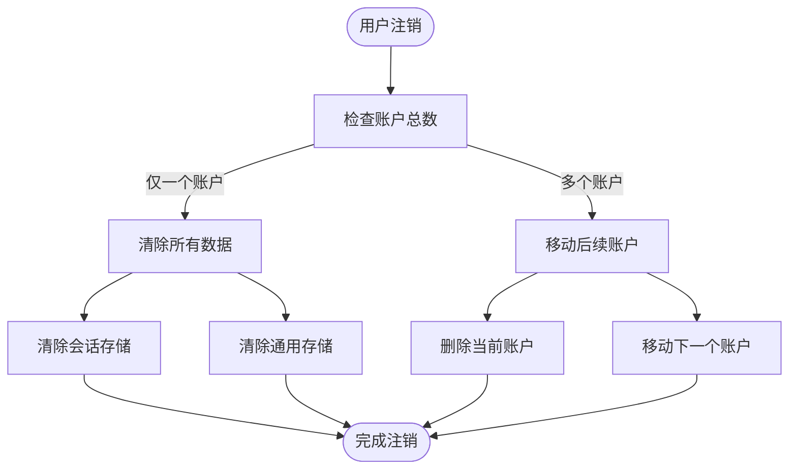
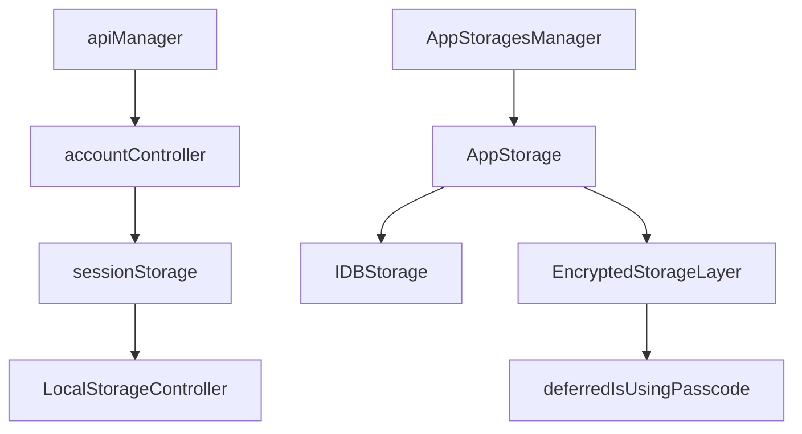

# 会话数据隔离

<cite>
**本文档中引用的文件**  
- [sessionStorage.ts](file://src/lib/sessionStorage.ts)
- [accountController.ts](file://src/lib/accounts/accountController.ts)
- [appStoragesManager.ts](file://src/lib/appManagers/appStoragesManager.ts)
- [storage.ts](file://src/lib/storage.ts)
- [deferredIsUsingPasscode.ts](file://src/lib/passcode/deferredIsUsingPasscode.ts)
- [session.ts](file://src/config/databases/session.ts)
</cite>

## 目录
1. [简介](#简介)
2. [项目结构](#项目结构)
3. [核心组件](#核心组件)
4. [架构概述](#架构概述)
5. [详细组件分析](#详细组件分析)
6. [依赖分析](#依赖分析)
7. [性能考虑](#性能考虑)
8. [故障排除指南](#故障排除指南)
9. [结论](#结论)

## 简介
本文档详细描述了在多账户环境下会话数据隔离的实现机制。系统通过独立的存储策略管理每个账户的认证令牌、连接状态和临时会话数据，确保不同账户之间的会话状态完全隔离。文档涵盖了会话数据在内存和持久化存储中的生命周期管理，账户切换时的上下文切换过程，以及相关的安全防护措施。

## 项目结构
项目采用分层架构设计，会话管理相关代码主要分布在`src/lib`目录下。核心会话存储由`sessionStorage.ts`实现，账户管理由`accountController.ts`负责，持久化存储由`storage.ts`提供支持。系统通过独立的存储实例为每个账户维护隔离的会话数据。

**Diagram sources**
- [sessionStorage.ts](file://src/lib/sessionStorage.ts#L71-L79)
- [accountController.ts](file://src/lib/accounts/accountController.ts#L15)
- [appStoragesManager.ts](file://src/lib/appManagers/appStoragesManager.ts#L16)
- [storage.ts](file://src/lib/storage.ts#L46)

**Section sources**
- [sessionStorage.ts](file://src/lib/sessionStorage.ts#L1-L83)
- [accountController.ts](file://src/lib/accounts/accountController.ts#L1-L155)

## 核心组件
系统通过`sessionStorage`管理所有账户的会话数据，每个账户拥有独立的存储空间。`accountController`负责账户的创建、读取、更新和删除操作，确保会话数据的完整性和一致性。当启用密码锁时，系统会自动加密敏感的会话数据，防止未经授权的访问。

**Section sources**
- [sessionStorage.ts](file://src/lib/sessionStorage.ts#L71-L82)
- [accountController.ts](file://src/lib/accounts/accountController.ts#L15-L154)

## 架构概述
系统采用多层存储架构实现会话数据隔离。顶层是`sessionStorage`，它为每个账户（account1-4）维护独立的会话数据容器。底层是`AppStorage`，它基于IndexedDB实现持久化存储，并支持加密功能。`accountController`作为中间层，协调账户操作和会话数据管理。

**Diagram sources**
- [sessionStorage.ts](file://src/lib/sessionStorage.ts#L71-L79)
- [accountController.ts](file://src/lib/accounts/accountController.ts#L15-L154)
- [appStoragesManager.ts](file://src/lib/appManagers/appStoragesManager.ts#L16-L103)
- [storage.ts](file://src/lib/storage.ts#L46-L490)

## 详细组件分析

### 会话存储分析
系统通过`LocalStorageController`为每个账户创建独立的会话存储空间。账户数据以`account1`、`account2`等键名存储，确保不同账户的会话状态完全隔离。

**Diagram sources**
- [sessionStorage.ts](file://src/lib/sessionStorage.ts#L71-L79)
- [accountController.ts](file://src/lib/accounts/accountController.ts#L32-L40)

### 账户管理分析
`accountController`提供了一套完整的账户管理API，包括获取账户总数、获取用户ID列表、读取特定账户数据等。当账户被删除时，系统会自动将后续账户向前移动，保持账户编号的连续性。

**Diagram sources**
- [accountController.ts](file://src/lib/accounts/accountController.ts#L32-L97)
- [sessionStorage.ts](file://src/lib/sessionStorage.ts#L71-L79)

### 存储管理分析
`AppStoragesManager`负责管理所有账户的持久化存储。它提供了清除特定账户所有存储、移动账户存储、切换账户存储等高级操作。当用户注销时，系统会根据情况选择清除数据或移动数据。

**Diagram sources**
- [appStoragesManager.ts](file://src/lib/appManagers/appStoragesManager.ts#L71-L102)
- [accountController.ts](file://src/lib/accounts/accountController.ts#L103-L111)

**Section sources**
- [appStoragesManager.ts](file://src/lib/appManagers/appStoragesManager.ts#L1-L103)
- [accountController.ts](file://src/lib/accounts/accountController.ts#L1-L155)

## 依赖分析
系统各组件之间存在明确的依赖关系。`sessionStorage`作为基础存储层被`accountController`直接依赖。`accountController`又被`apiManager`等高层组件依赖。`AppStorage`实现了实际的持久化存储，被`AppStoragesManager`用于管理所有存储实例。

**Diagram sources**
- [accountController.ts](file://src/lib/accounts/accountController.ts#L6)
- [sessionStorage.ts](file://src/lib/sessionStorage.ts#L12)
- [appStoragesManager.ts](file://src/lib/appManagers/appStoragesManager.ts#L9)
- [storage.ts](file://src/lib/storage.ts#L21-L22)

**Section sources**
- [accountController.ts](file://src/lib/accounts/accountController.ts#L1-L155)
- [sessionStorage.ts](file://src/lib/sessionStorage.ts#L1-L83)
- [appStoragesManager.ts](file://src/lib/appManagers/appStoragesManager.ts#L1-L103)

## 性能考虑
系统通过多种机制优化会话管理的性能。首先，使用`throttleWith`对存储操作进行节流，避免频繁的I/O操作。其次，实现本地缓存机制，减少对持久化存储的访问次数。最后，采用异步操作确保UI线程不被阻塞。

## 故障排除指南
当遇到会话管理问题时，可以检查以下方面：确认`sessionStorage`是否正常初始化，验证账户数据是否正确存储，检查加密状态是否一致。如果启用密码锁后出现数据访问问题，需要确保`deferredIsUsingPasscode`的状态正确同步。

**Section sources**
- [sessionStorage.ts](file://src/lib/sessionStorage.ts#L71-L79)
- [deferredIsUsingPasscode.ts](file://src/lib/passcode/deferredIsUsingPasscode.ts#L6-L32)

## 结论
本系统通过精心设计的多层架构实现了可靠的会话数据隔离。每个账户拥有独立的会话存储空间，确保了多账户环境下的数据安全和隐私保护。系统提供了完整的账户管理功能，包括账户切换、数据迁移和安全加密，为用户提供流畅的多账户使用体验。