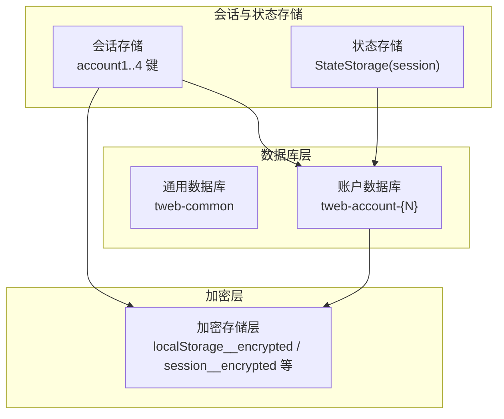
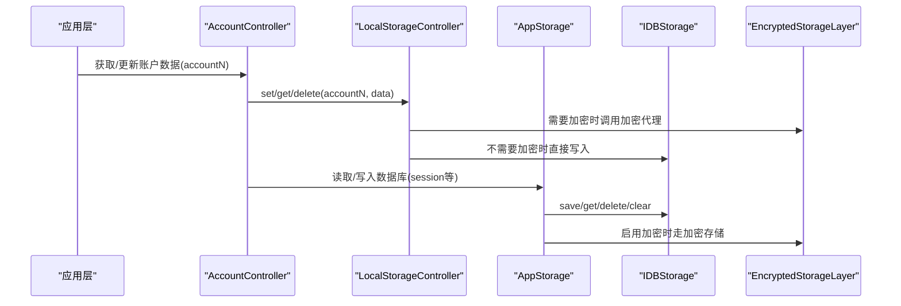
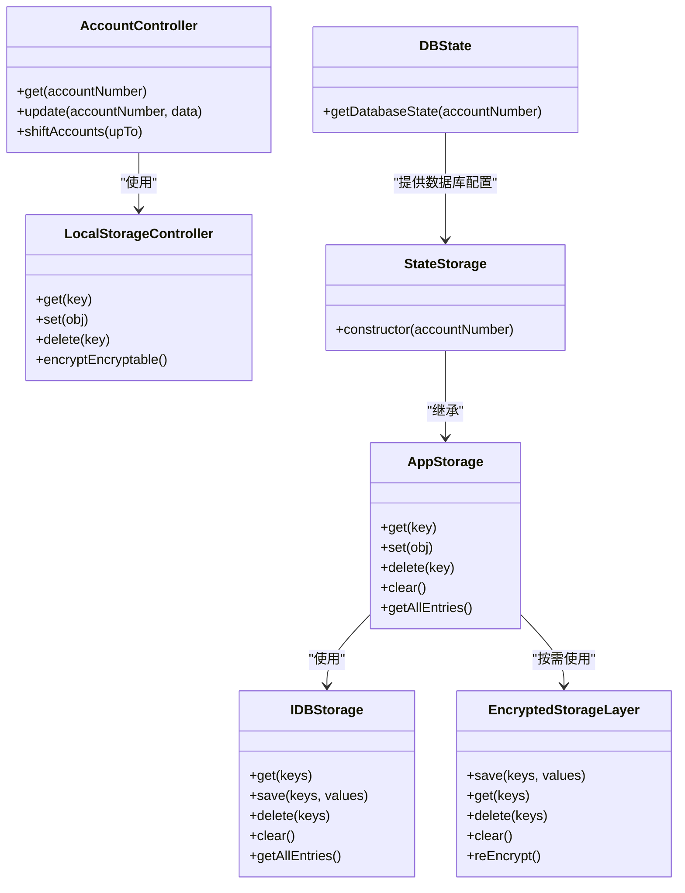

# 命名空间隔离

<cite>
**本文引用的文件**
- [src/lib/storage.ts](file://src/lib/storage.ts)
- [src/lib/localStorage.ts](file://src/lib/localStorage.ts)
- [src/lib/sessionStorage.ts](file://src/lib/sessionStorage.ts)
- [src/lib/stateStorage.ts](file://src/lib/stateStorage.ts)
- [src/config/databases/state.ts](file://src/config/databases/state.ts)
- [src/lib/files/idb.ts](file://src/lib/files/idb.ts)
- [src/lib/encryptedStorageLayer.ts](file://src/lib/encryptedStorageLayer.ts)
- [src/lib/accounts/accountController.ts](file://src/lib/accounts/accountController.ts)
- [src/lib/passcode/keyStore.ts](file://src/lib/passcode/keyStore.ts)
- [src/lib/passcode/utils.ts](file://src/lib/passcode/utils.ts)
- [src/lib/appManagers/appStoragesManager.ts](file://src/lib/appManagers/appStoragesManager.ts)
</cite>

## 目录
1. [简介](#简介)
2. [项目结构与命名空间概览](#项目结构与命名空间概览)
3. [核心组件与隔离机制](#核心组件与隔离机制)
4. [架构总览](#架构总览)
5. [关键组件详解](#关键组件详解)
6. [依赖关系分析](#依赖关系分析)
7. [性能与安全特性](#性能与安全特性)
8. [故障排查指南](#故障排查指南)
9. [结论](#结论)

## 简介
本文件系统性阐述该仓库中的“命名空间隔离”设计：以账户ID为命名空间前缀，分别在浏览器本地存储（LocalStorage）与IndexedDB中实现多账户数据的物理隔离。文档覆盖键名生成规则、命名规范、跨账户数据防泄漏的安全优势，以及在数据查询与管理时的性能影响，并提供可定位到源码路径的示例流程，帮助读者快速理解与落地。

## 项目结构与命名空间概览
- 账户会话与状态存储采用“账户前缀”的键名策略：
  - 在会话存储中，账户信息以 account1、account2、account3、account4 的键名存放。
- 数据库命名采用“账户后缀”的命名策略：
  - 数据库名称形如 tweb-account-{N}，每个账户拥有独立数据库实例，避免跨账户数据混存。
- 加密层与通用存储：
  - 对可加密的键值（如部分会话数据）在启用密码锁时，转由加密存储层写入 IndexedDB 的专用加密表，进一步降低泄露风险。

图表来源
- [src/lib/sessionStorage.ts](file://src/lib/sessionStorage.ts#L16-L83)
- [src/lib/stateStorage.ts](file://src/lib/stateStorage.ts#L14-L28)
- [src/config/databases/state.ts](file://src/config/databases/state.ts#L53-L91)
- [src/lib/encryptedStorageLayer.ts](file://src/lib/encryptedStorageLayer.ts#L33-L111)

章节来源
- [src/lib/sessionStorage.ts](file://src/lib/sessionStorage.ts#L16-L83)
- [src/lib/stateStorage.ts](file://src/lib/stateStorage.ts#L14-L28)
- [src/config/databases/state.ts](file://src/config/databases/state.ts#L53-L91)

## 核心组件与隔离机制
- 账户键名前缀
  - 会话存储通过 account1..4 的键名区分不同账户；更新、删除、迁移均基于该前缀进行。
- 数据库命名前缀
  - 每个账户拥有独立数据库实例，数据库名为 tweb-account-{N}，确保 IndexedDB 层面的物理隔离。
- 可加密键值的加密存储
  - 当启用密码锁时，指定可加密键值（如部分会话数据）写入加密存储层，使用 AES-GCM 加密并保存至对应加密表，避免明文暴露。
- 存储访问抽象
  - AppStorage 将 LocalStorage 与 IndexedDB 抽象为统一接口，按需选择存储介质与是否加密，屏蔽上层差异。

章节来源
- [src/lib/accounts/accountController.ts](file://src/lib/accounts/accountController.ts#L32-L121)
- [src/config/databases/state.ts](file://src/config/databases/state.ts#L53-L91)
- [src/lib/localStorage.ts](file://src/lib/localStorage.ts#L158-L341)
- [src/lib/storage.ts](file://src/lib/storage.ts#L105-L179)

## 架构总览
下图展示了从应用层到存储层的关键交互，体现命名空间隔离在不同存储介质中的落地方式。

图表来源
- [src/lib/accounts/accountController.ts](file://src/lib/accounts/accountController.ts#L32-L121)
- [src/lib/localStorage.ts](file://src/lib/localStorage.ts#L231-L309)
- [src/lib/storage.ts](file://src/lib/storage.ts#L105-L179)
- [src/lib/files/idb.ts](file://src/lib/files/idb.ts#L298-L320)
- [src/lib/encryptedStorageLayer.ts](file://src/lib/encryptedStorageLayer.ts#L133-L187)

## 关键组件详解

### 会话存储与账户键名前缀
- 键名构造规则
  - 使用 account1..4 作为账户键名前缀，例如 account1、account2 等。
- 访问模式
  - 读取：通过 LocalStorageController.get(accountN) 获取账户数据。
  - 写入：通过 LocalStorageController.set({accountN: data}) 写入账户数据。
  - 删除：通过 LocalStorageController.delete(accountN) 清理账户数据。
- 迁移与清理
  - 支持账户删除后的数据迁移（将后续账户向前移动），避免空洞键。
- 性能与可用性
  - LocalStorageController 提供缓存与批量写入节流，减少频繁 IO。

章节来源
- [src/lib/sessionStorage.ts](file://src/lib/sessionStorage.ts#L16-L83)
- [src/lib/accounts/accountController.ts](file://src/lib/accounts/accountController.ts#L32-L121)
- [src/lib/localStorage.ts](file://src/lib/localStorage.ts#L158-L341)

### 数据库命名与账户隔离
- 数据库命名规则
  - 数据库名称为 tweb-account-{N}，版本号与对象仓（stores）定义见数据库状态配置。
- 对象仓与加密映射
  - 每个对象仓可配置 encryptedName，用于启用加密存储时的加密表名。
- 访问模式
  - StateStorage 统一构造数据库与对象仓，AppStorage 作为上层抽象封装读写。
- 迁移与清理
  - 支持账户间迁移与清空，保证切换账户时的数据一致性。

章节来源
- [src/config/databases/state.ts](file://src/config/databases/state.ts#L53-L91)
- [src/lib/stateStorage.ts](file://src/lib/stateStorage.ts#L14-L28)
- [src/lib/storage.ts](file://src/lib/storage.ts#L105-L179)
- [src/lib/appManagers/appStoragesManager.ts](file://src/lib/appManagers/appStoragesManager.ts#L57-L102)

### 加密存储与可加密键值
- 加密触发条件
  - 当启用密码锁时，LocalStorageController 将可加密键值写入加密存储层。
- 加密存储层
  - 使用 AES-GCM 加密，密钥来自 EncryptionKeyStore；加密数据保存在对应的加密表中。
- 密钥派生与管理
  - 通过 PBKDF2 从用户口令派生加密密钥，支持重新派生与导出（仅内部使用）。

章节来源
- [src/lib/localStorage.ts](file://src/lib/localStorage.ts#L158-L341)
- [src/lib/encryptedStorageLayer.ts](file://src/lib/encryptedStorageLayer.ts#L33-L111)
- [src/lib/passcode/keyStore.ts](file://src/lib/passcode/keyStore.ts#L1-L38)
- [src/lib/passcode/utils.ts](file://src/lib/passcode/utils.ts#L1-L45)

### 存储抽象与错误处理
- AppStorage
  - 统一封装 get/set/delete/clear/getAllEntries 等操作，自动选择 LocalStorage 或 IndexedDB，并在需要时启用加密存储。
  - 提供缓存、批量写入节流、错误忽略与降级逻辑，提升稳定性。
- IDBStorage
  - 提供 IndexedDB 的读写封装，支持事务、索引、全量遍历与清空。
- 加密存储层
  - 以对象形式维护内存缓存，异步持久化，支持重加密与加载。

章节来源
- [src/lib/storage.ts](file://src/lib/storage.ts#L105-L179)
- [src/lib/storage.ts](file://src/lib/storage.ts#L236-L382)
- [src/lib/files/idb.ts](file://src/lib/files/idb.ts#L298-L320)
- [src/lib/files/idb.ts](file://src/lib/files/idb.ts#L417-L499)
- [src/lib/encryptedStorageLayer.ts](file://src/lib/encryptedStorageLayer.ts#L133-L187)

## 依赖关系分析
- 组件耦合
  - AccountController 依赖 LocalStorageController 与数据库状态配置，负责账户级键名前缀的读写与迁移。
  - AppStorage 依赖 IDBStorage 与加密存储层，向上提供统一接口。
  - 数据库状态配置集中定义账户数据库命名与对象仓映射。
- 外部依赖
  - IndexedDB 与 Web Crypto API（用于加密）。

图表来源
- [src/lib/accounts/accountController.ts](file://src/lib/accounts/accountController.ts#L32-L121)
- [src/lib/localStorage.ts](file://src/lib/localStorage.ts#L158-L341)
- [src/lib/storage.ts](file://src/lib/storage.ts#L105-L179)
- [src/lib/files/idb.ts](file://src/lib/files/idb.ts#L298-L320)
- [src/lib/encryptedStorageLayer.ts](file://src/lib/encryptedStorageLayer.ts#L133-L187)
- [src/lib/stateStorage.ts](file://src/lib/stateStorage.ts#L14-L28)
- [src/config/databases/state.ts](file://src/config/databases/state.ts#L53-L91)

## 性能与安全特性

### 键名生成与命名规范
- 会话存储键名
  - 使用 accountN 前缀，N ∈ {1..4}，确保账户间键冲突最小化。
- 数据库命名
  - 数据库名为 tweb-account-{N}，对象仓与加密表名遵循配置映射，避免跨账户数据混存。
- 可加密键值
  - 启用密码锁时，可加密键值写入加密表，避免明文泄露。

章节来源
- [src/lib/sessionStorage.ts](file://src/lib/sessionStorage.ts#L16-L83)
- [src/config/databases/state.ts](file://src/config/databases/state.ts#L53-L91)
- [src/lib/localStorage.ts](file://src/lib/localStorage.ts#L158-L341)

### 安全优势
- 防跨账户数据泄漏
  - 会话存储通过 accountN 前缀隔离；数据库通过 tweb-account-{N} 隔离；加密存储进一步保护敏感键值。
- 密码锁增强
  - 启用密码锁后，加密存储层接管可加密键值，密钥由 PBKDF2 派生，降低被窃取的风险。
- 最小暴露原则
  - 在启用密码锁场景下，不向窗口客户端暴露明文数据，避免误用导致泄露。

章节来源
- [src/lib/accounts/accountController.ts](file://src/lib/accounts/accountController.ts#L113-L121)
- [src/lib/localStorage.ts](file://src/lib/localStorage.ts#L158-L341)
- [src/lib/passcode/utils.ts](file://src/lib/passcode/utils.ts#L1-L45)

### 性能影响
- 读写节流
  - AppStorage 对批量写入与删除进行节流，减少频繁事务对 IndexedDB 的压力。
- 缓存命中
  - 本地缓存减少重复读取，提高热路径性能。
- 错误降级
  - 当存储不可用时，AppStorage 会记录错误并降级，避免阻塞主线程。
- 加密开销
  - 加密存储引入加解密与持久化成本，但仅对可加密键值生效，且通过重加密与懒加载优化。

章节来源
- [src/lib/storage.ts](file://src/lib/storage.ts#L105-L179)
- [src/lib/storage.ts](file://src/lib/storage.ts#L236-L382)
- [src/lib/encryptedStorageLayer.ts](file://src/lib/encryptedStorageLayer.ts#L133-L187)

## 故障排查指南
- 无法读取或写入存储
  - 检查 LocalStorageController.toggleStorage 是否被禁用；确认浏览器隐私设置未阻止存储。
- 账户数据错乱或缺失
  - 使用账户控制器的迁移方法（删除账户后向前移动）恢复数据顺序。
- 加密存储异常
  - 确认已正确保存加密密钥；必要时执行重加密或回退到明文存储。
- 数据库升级失败
  - 查看 IndexedDB 打开与升级回调日志，确认版本变更与对象仓创建成功。

章节来源
- [src/lib/localStorage.ts](file://src/lib/localStorage.ts#L158-L341)
- [src/lib/accounts/accountController.ts](file://src/lib/accounts/accountController.ts#L100-L121)
- [src/lib/encryptedStorageLayer.ts](file://src/lib/encryptedStorageLayer.ts#L133-L187)
- [src/lib/files/idb.ts](file://src/lib/files/idb.ts#L101-L191)

## 结论
该系统通过“账户前缀键名 + 账户后缀数据库”的双重命名空间策略，在会话存储与数据库层实现了强隔离；结合可选的加密存储与密码锁，进一步提升了安全性。同时，通过缓存、节流与错误降级等机制，兼顾了性能与稳定性。建议在新增账户相关键值时，严格遵循 accountN 前缀与数据库命名规范，确保隔离效果与可维护性。