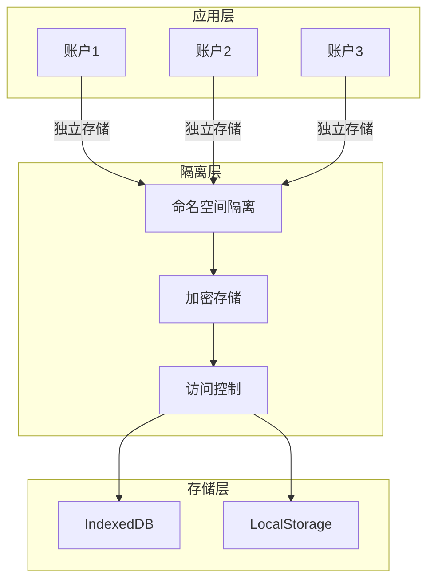
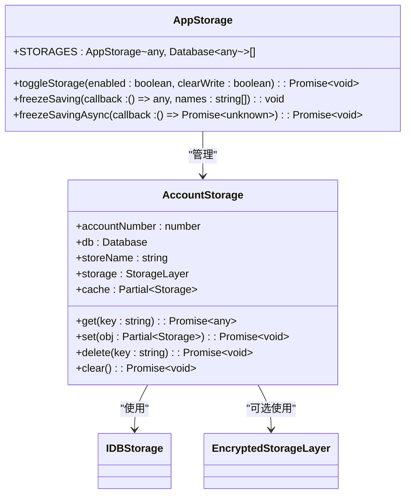
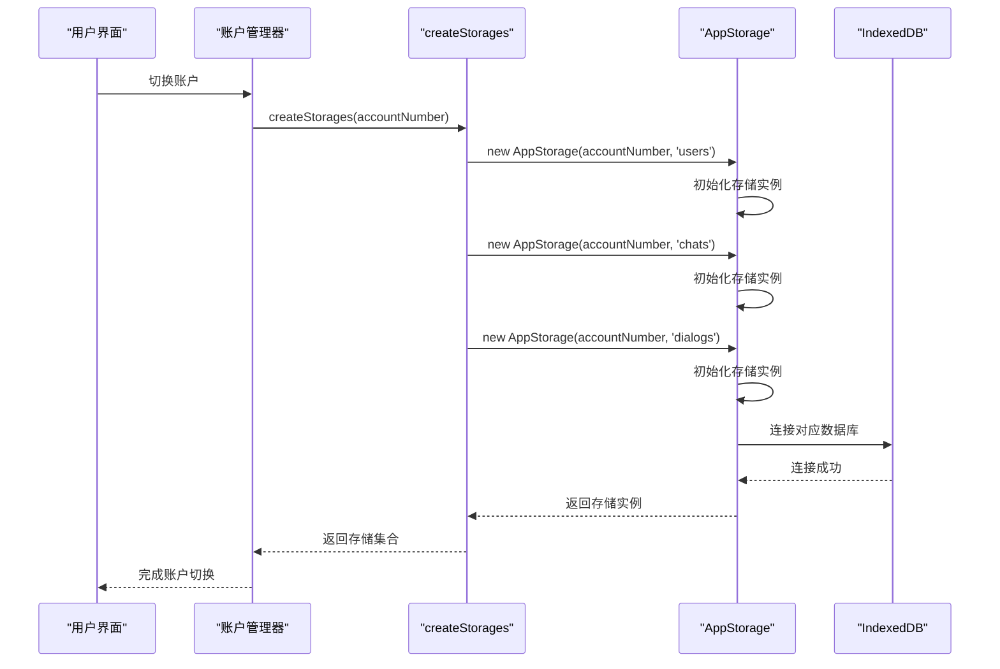
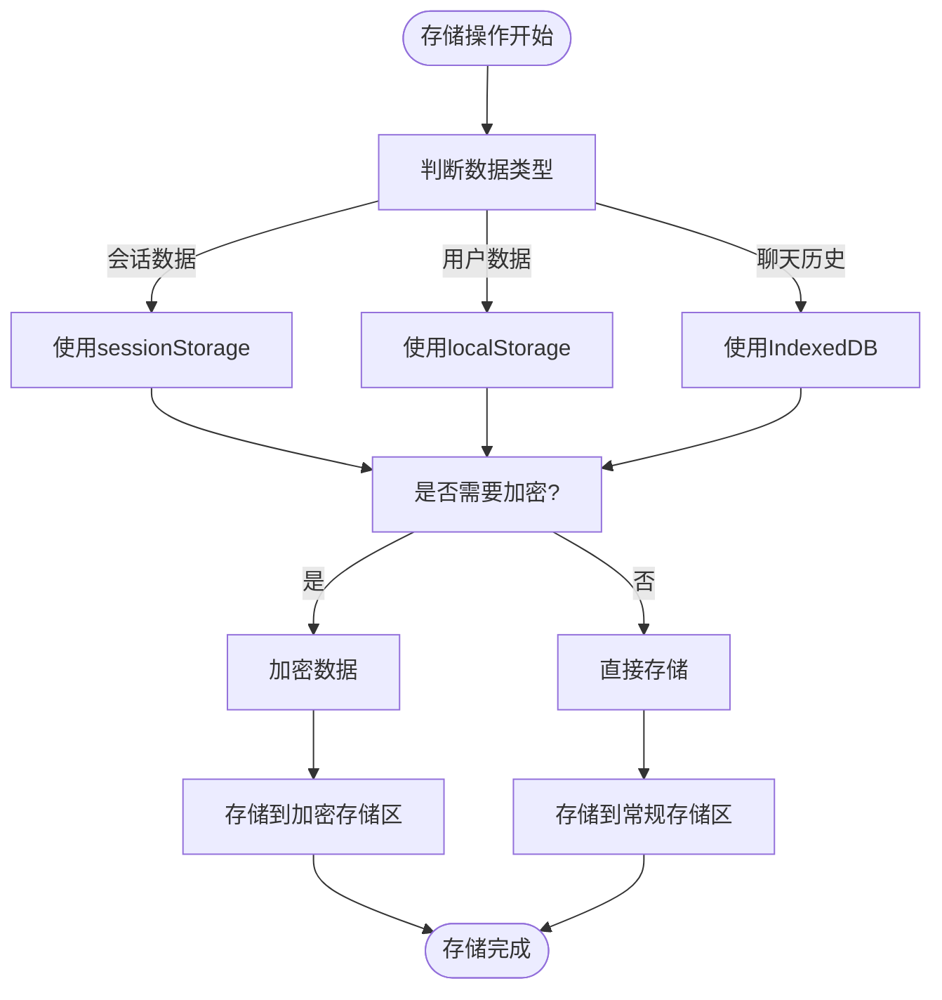
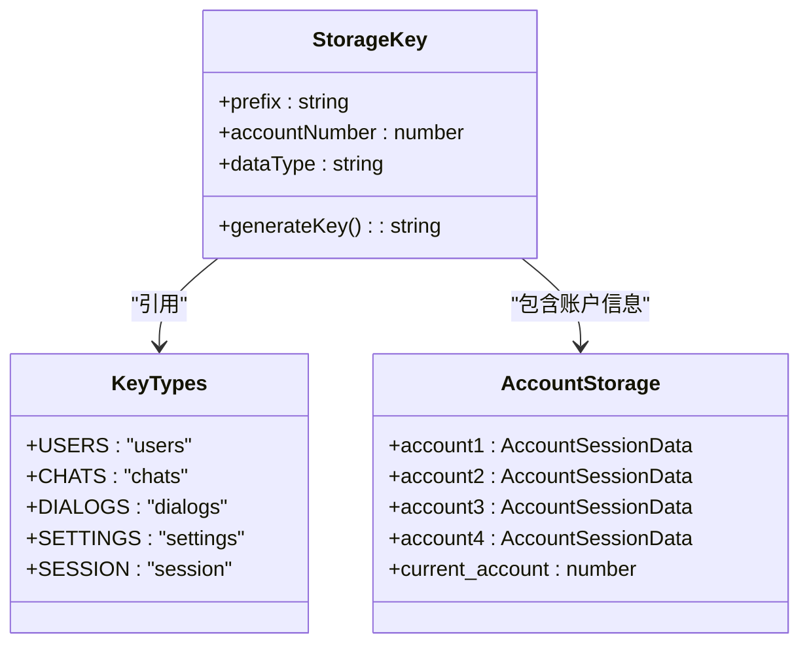
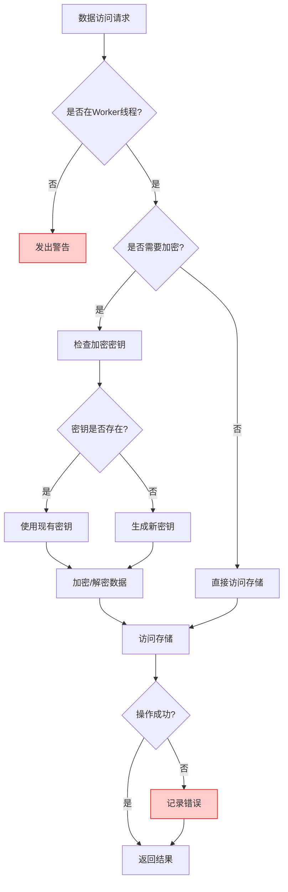
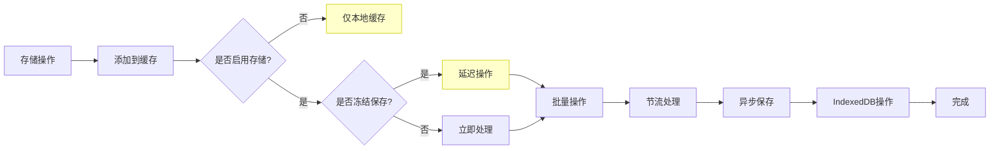

# 存储隔离机制

<cite>
**本文档中引用的文件**  
- [storage.ts](file://src/lib/storage.ts)
- [localStorage.ts](file://src/lib/localStorage.ts)
- [sessionStorage.ts](file://src/lib/sessionStorage.ts)
- [createStorages.ts](file://src/lib/appManagers/utils/storages/createStorages.ts)
- [encryptedStorageLayer.ts](file://src/lib/encryptedStorageLayer.ts)
- [dialogs.ts](file://src/lib/storages/dialogs.ts)
- [session.ts](file://src/config/databases/session.ts)
</cite>

## 目录
1. [引言](#引言)
2. [存储隔离架构](#存储隔离架构)
3. [多账户环境下的命名空间隔离](#多账户环境下的命名空间隔离)
4. [存储实例的创建与管理](#存储实例的创建与管理)
5. [LocalStorage与IndexedDB中的数据隔离实现](#localstorage与indexeddb中的数据隔离实现)
6. [存储键名的命名规范](#存储键名的命名规范)
7. [安全边界与防泄漏机制](#安全边界与防泄漏机制)
8. [性能考虑](#性能考虑)
9. [结论](#结论)

## 引言

本项目实现了一套完整的存储隔离机制，用于在多账户环境下确保数据存储的独立性和安全性。系统通过命名空间隔离、加密存储和访问控制等技术手段，实现了会话数据、聊天历史和用户设置等敏感信息的严格隔离。该机制不仅保障了用户数据的隐私安全，还优化了存储性能和数据管理效率。

## 存储隔离架构

系统采用分层的存储架构设计，结合IndexedDB和LocalStorage两种浏览器存储技术，通过命名空间和加密机制实现数据隔离。

**Diagram sources**
- [storage.ts](file://src/lib/storage.ts)
- [localStorage.ts](file://src/lib/localStorage.ts)

**Section sources**
- [storage.ts](file://src/lib/storage.ts)
- [localStorage.ts](file://src/lib/localStorage.ts)

## 多账户环境下的命名空间隔离

系统通过账户编号作为命名空间标识符，为每个账户创建独立的存储实例。当用户切换账户时，系统会自动切换到对应的命名空间，确保数据完全隔离。

**Diagram sources**
- [storage.ts](file://src/lib/storage.ts)
- [createStorages.ts](file://src/lib/appManagers/utils/storages/createStorages.ts)

**Section sources**
- [createStorages.ts](file://src/lib/appManagers/utils/storages/createStorages.ts)
- [storage.ts](file://src/lib/storage.ts)

## 存储实例的创建与管理

系统通过`createStorages`函数为每个账户创建独立的存储实例，包括用户、聊天和对话等不同类型的存储。

**Diagram sources**
- [createStorages.ts](file://src/lib/appManagers/utils/storages/createStorages.ts)
- [storage.ts](file://src/lib/storage.ts)

**Section sources**
- [createStorages.ts](file://src/lib/appManagers/utils/storages/createStorages.ts)

## LocalStorage与IndexedDB中的数据隔离实现

系统采用混合存储策略，将不同类型的敏感数据分别存储在LocalStorage和IndexedDB中，并通过加密机制增强安全性。

**Diagram sources**
- [localStorage.ts](file://src/lib/localStorage.ts)
- [encryptedStorageLayer.ts](file://src/lib/encryptedStorageLayer.ts)

**Section sources**
- [localStorage.ts](file://src/lib/localStorage.ts)
- [encryptedStorageLayer.ts](file://src/lib/encryptedStorageLayer.ts)

## 存储键名的命名规范

系统采用统一的键名命名规范，确保存储键的可读性和一致性。键名由功能模块、数据类型和账户标识符组成。

**Diagram sources**
- [sessionStorage.ts](file://src/lib/sessionStorage.ts)
- [localStorage.ts](file://src/lib/localStorage.ts)

**Section sources**
- [sessionStorage.ts](file://src/lib/sessionStorage.ts)

## 安全边界与防泄漏机制

系统通过多层次的安全机制防止跨账户数据访问和数据泄漏，包括访问控制、加密存储和运行时检查。

**Diagram sources**
- [encryptedStorageLayer.ts](file://src/lib/encryptedStorageLayer.ts)
- [localStorage.ts](file://src/lib/localStorage.ts)

**Section sources**
- [encryptedStorageLayer.ts](file://src/lib/encryptedStorageLayer.ts)

## 性能考虑

系统在存储性能方面进行了多项优化，包括批量操作、节流机制和缓存策略，以提高I/O效率和用户体验。

**Diagram sources**
- [storage.ts](file://src/lib/storage.ts)
- [encryptedStorageLayer.ts](file://src/lib/encryptedStorageLayer.ts)

**Section sources**
- [storage.ts](file://src/lib/storage.ts)

## 结论

本存储隔离机制通过命名空间隔离、加密存储和访问控制等技术手段，成功实现了多账户环境下的数据独立性和安全性。系统设计充分考虑了性能优化和用户体验，采用混合存储策略和批量处理机制，确保了高效的I/O操作。该机制为多账户应用提供了可靠的数据隔离解决方案，有效防止了跨账户数据访问和数据泄漏风险。