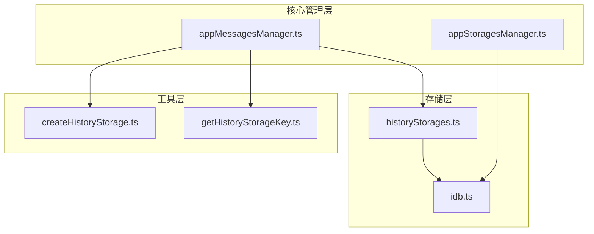
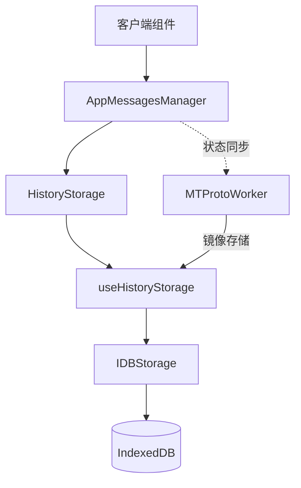
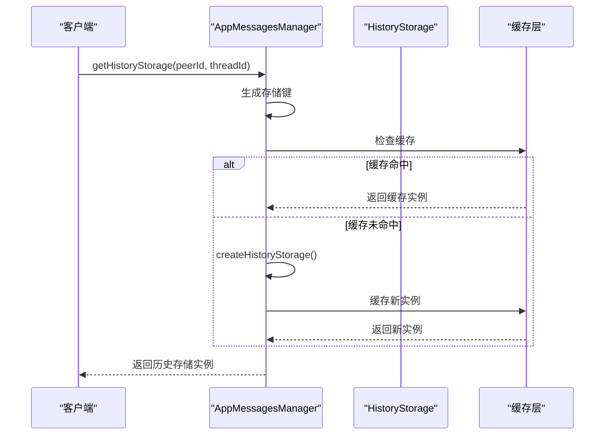
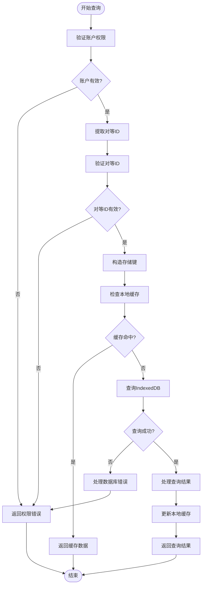
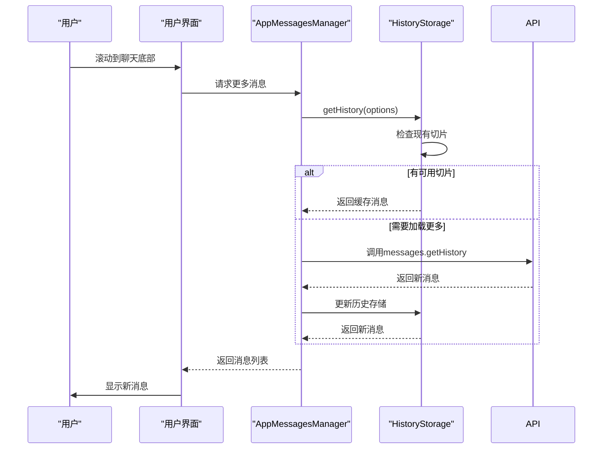
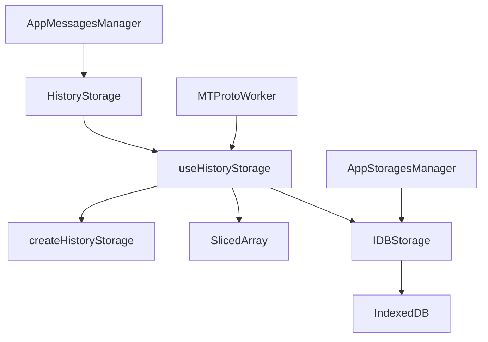

# 聊天历史隔离

<cite>
**本文档中引用的文件**  
- [appMessagesManager.ts](file://src/lib/appManagers/appMessagesManager.ts)
- [createHistoryStorage.ts](file://src/lib/appManagers/utils/messages/createHistoryStorage.ts)
- [getHistoryStorageKey.ts](file://src/lib/appManagers/utils/messages/getHistoryStorageKey.ts)
- [historyStorages.ts](file://src/stores/historyStorages.ts)
- [idb.ts](file://src/lib/files/idb.ts)
- [appStoragesManager.ts](file://src/lib/appManagers/appStoragesManager.ts)
</cite>

## 目录
1. [介绍](#介绍)
2. [项目结构](#项目结构)
3. [核心组件](#核心组件)
4. [架构概述](#架构概述)
5. [详细组件分析](#详细组件分析)
6. [依赖分析](#依赖分析)
7. [性能考虑](#性能考虑)
8. [故障恢复策略](#故障恢复策略)
9. [结论](#结论)

## 介绍
本文档详细描述了在Web Telegram客户端中实现的聊天历史隔离机制。系统通过IndexedDB为每个账户和聊天会话独立存储消息历史记录，确保数据的隔离性和安全性。文档涵盖了历史存储实例的生命周期管理、数据分区策略、索引结构、性能优化措施以及数据一致性保障机制。

## 项目结构
聊天历史隔离功能主要分布在以下几个目录中：
- `src/lib/appManagers/`：包含消息管理器和存储管理器的核心逻辑
- `src/lib/files/`：包含IndexedDB操作的底层实现
- `src/stores/`：包含历史存储的状态管理
- `src/lib/appManagers/utils/messages/`：包含历史存储相关的工具函数



**Diagram sources**
- [appMessagesManager.ts](file://src/lib/appManagers/appMessagesManager.ts)
- [createHistoryStorage.ts](file://src/lib/appManagers/utils/messages/createHistoryStorage.ts)
- [getHistoryStorageKey.ts](file://src/lib/appManagers/utils/messages/getHistoryStorageKey.ts)
- [historyStorages.ts](file://src/stores/historyStorages.ts)
- [idb.ts](file://src/lib/files/idb.ts)

**Section sources**
- [appMessagesManager.ts](file://src/lib/appManagers/appMessagesManager.ts)
- [createHistoryStorage.ts](file://src/lib/appManagers/utils/messages/createHistoryStorage.ts)
- [getHistoryStorageKey.ts](file://src/lib/appManagers/utils/messages/getHistoryStorageKey.ts)
- [historyStorages.ts](file://src/stores/historyStorages.ts)
- [idb.ts](file://src/lib/files/idb.ts)

## 核心组件
聊天历史隔离的核心组件包括历史存储管理器、IndexedDB操作层和状态管理器。系统为每个聊天会话创建独立的历史存储实例，通过唯一的键值进行标识和访问。历史存储实例包含消息ID的有序列表、计数器和元数据，支持高效的分页加载和搜索操作。

**Section sources**
- [appMessagesManager.ts](file://src/lib/appManagers/appMessagesManager.ts)
- [historyStorages.ts](file://src/stores/historyStorages.ts)

## 架构概述
系统采用分层架构设计，将业务逻辑与数据存储分离。消息管理器负责处理业务逻辑，历史存储管理器负责维护会话状态，IndexedDB操作层负责持久化存储。各层之间通过明确定义的接口进行通信，确保系统的可维护性和可扩展性。



**Diagram sources**
- [appMessagesManager.ts](file://src/lib/appManagers/appMessagesManager.ts)
- [historyStorages.ts](file://src/stores/historyStorages.ts)
- [idb.ts](file://src/lib/files/idb.ts)

## 详细组件分析

### 历史存储实例管理
系统通过`getHistoryStorage`方法创建和访问历史存储实例。每个实例由唯一的键值标识，键值由会话类型、对等ID和可选的线程ID组合而成。存储实例在首次访问时创建，并缓存在内存中以提高访问效率。



**Diagram sources**
- [appMessagesManager.ts](file://src/lib/appManagers/appMessagesManager.ts)
- [createHistoryStorage.ts](file://src/lib/appManagers/utils/messages/createHistoryStorage.ts)

### 数据分区与索引
系统采用基于对等ID和会话类型的数据分区策略。每个账户的聊天历史独立存储，通过不同的数据库实例进行隔离。历史存储使用SlicedArray数据结构维护消息ID的有序列表，支持高效的分页操作和范围查询。

```mermaid
classDiagram
class HistoryStorage {
+_maxId : number
+count : number | null
+history : SlicedArray<number>
+searchHistory : SlicedArray<`${PeerId}_${number}`>
+maxId : number
+type : 'history' | 'replies' | 'search'
+key : HistoryStorageKey
+wasFetched : boolean
}
class SlicedArray {
+first : Slice<T>
+last : Slice<T>
+slices : Slice<T>[]
+insertSlice(slice : T[]) : T[]
+slice(offsetId : number, addOffset : number, limit : number) : Slice<T>
+sliceMe(offsetId : number, addOffset : number, limit : number) : SlicedArraySliceResult<T>
+getEnds() : SliceEnds
}
class Slice {
+array : T[]
+setEnd(end : SliceEnd) : void
+isEnd(end : SliceEnd) : boolean
+getEnds() : SliceEnds
}
HistoryStorage --> SlicedArray : "包含"
SlicedArray --> Slice : "包含多个"
```

**Diagram sources**
- [appMessagesManager.ts](file://src/lib/appManagers/appMessagesManager.ts)
- [createHistoryStorage.ts](file://src/lib/appManagers/utils/messages/createHistoryStorage.ts)

### 跨账户历史数据查询限制
系统严格限制跨账户的历史数据查询，确保账户间的数据隔离。每个账户只能访问自己的聊天历史，无法查询其他账户的聊天记录。这种隔离机制通过为每个账户使用独立的数据库实例和存储键空间来实现。



**Diagram sources**
- [appMessagesManager.ts](file://src/lib/appManagers/appMessagesManager.ts)
- [idb.ts](file://src/lib/files/idb.ts)

### 消息分页加载与缓存管理
系统实现智能的消息分页加载机制，根据用户的滚动位置预加载相邻页面的消息。缓存管理器维护最近访问的历史存储实例，采用LRU（最近最少使用）策略在内存压力下释放不常用的实例。



**Diagram sources**
- [appMessagesManager.ts](file://src/lib/appManagers/appMessagesManager.ts)

## 依赖分析
系统各组件之间的依赖关系清晰明确，遵循依赖倒置原则。高层组件依赖于抽象接口而非具体实现，便于单元测试和组件替换。核心依赖包括消息管理器对存储管理器的依赖，以及状态管理器对底层IndexedDB操作的依赖。



**Diagram sources**
- [appMessagesManager.ts](file://src/lib/appManagers/appMessagesManager.ts)
- [historyStorages.ts](file://src/stores/historyStorages.ts)
- [idb.ts](file://src/lib/files/idb.ts)
- [appStoragesManager.ts](file://src/lib/appManagers/appStoragesManager.ts)

## 性能考虑
系统在设计时充分考虑了性能优化，采用多种技术手段确保流畅的用户体验。SlicedArray数据结构支持O(1)复杂度的切片操作，避免了大规模数组操作的性能瓶颈。批量操作和事务处理减少了IndexedDB的I/O开销，而智能缓存策略最小化了重复查询的开销。

## 故障恢复策略
系统实现健壮的故障恢复机制，确保数据的一致性和可靠性。在应用启动时，系统会验证存储状态并进行必要的修复操作。对于关键的写操作，系统使用事务确保原子性，而在发生错误时提供回滚机制。定期的存储清理和优化操作防止数据库膨胀。

**Section sources**
- [appStoragesManager.ts](file://src/lib/appManagers/appStoragesManager.ts)
- [idb.ts](file://src/lib/files/idb.ts)

## 结论
聊天历史隔离机制通过精心设计的架构和实现，为每个账户提供了安全、独立的消息存储空间。系统采用分层设计、数据分区和智能缓存等技术，平衡了性能、安全性和用户体验。未来可以进一步优化存储压缩算法和跨设备同步机制，提升整体系统效率。