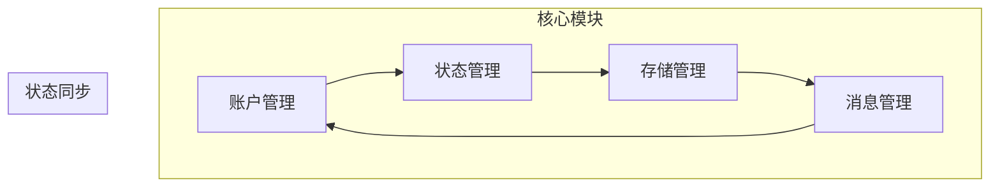
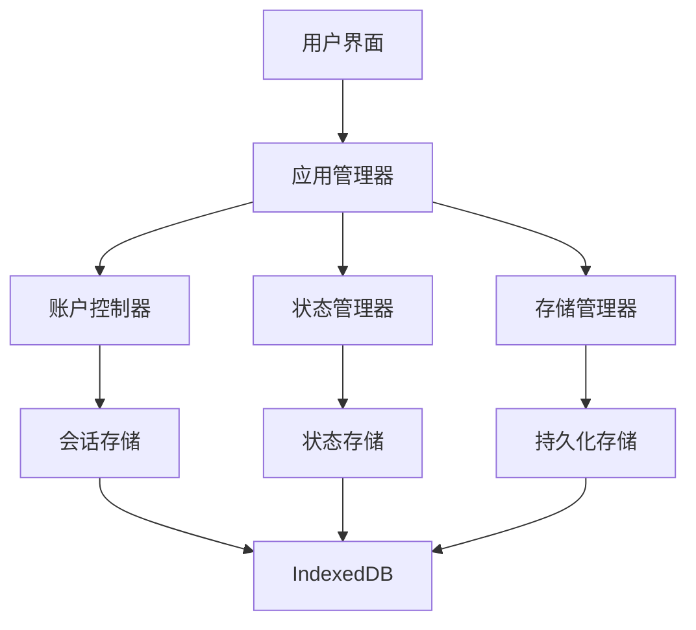
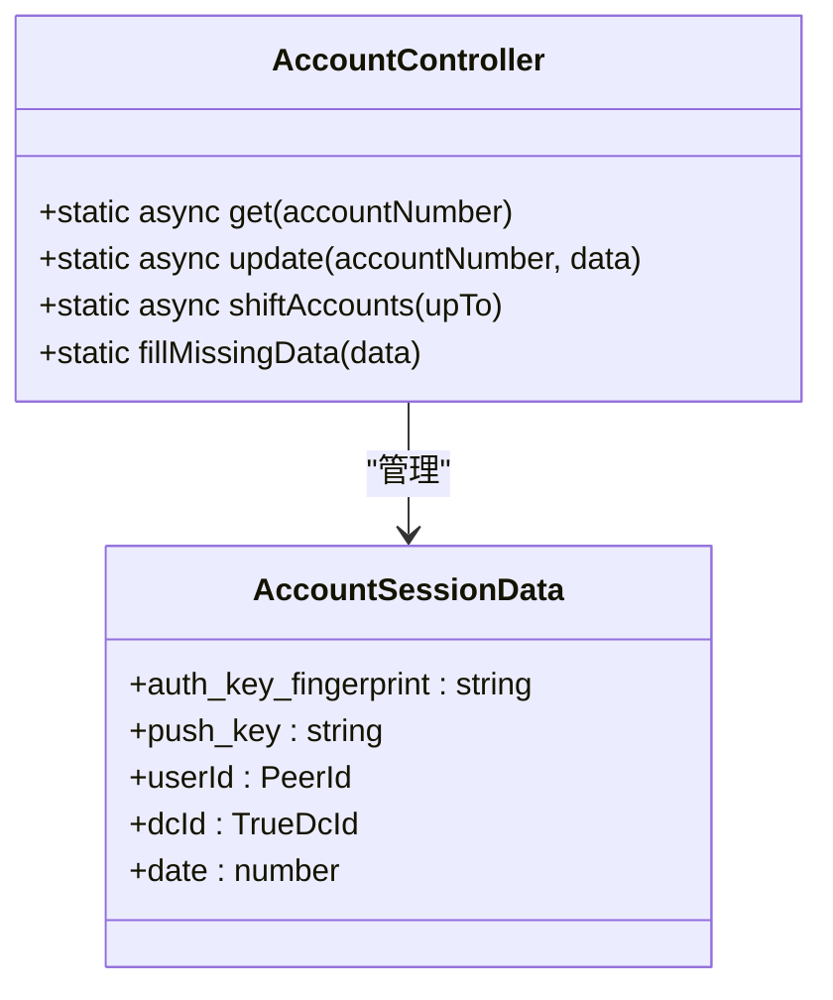
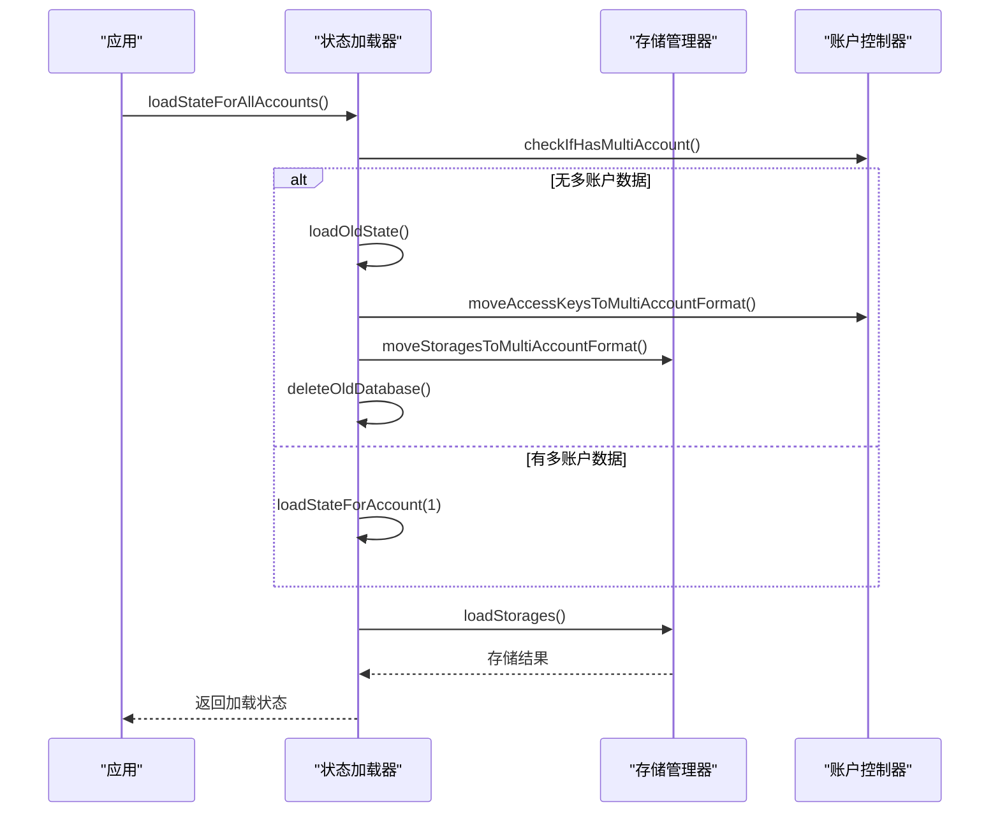
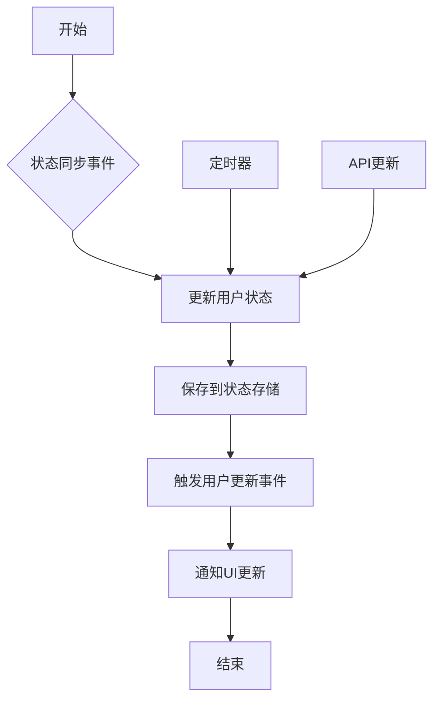
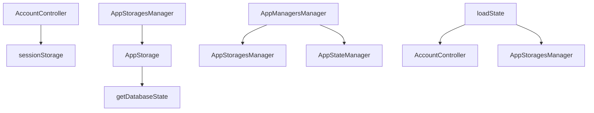

# 状态同步策略

<cite>
**本文档引用的文件**  
- [accountController.ts](file://src/lib/accounts/accountController.ts)
- [loadState.ts](file://src/lib/appManagers/utils/state/loadState.ts)
- [appStoragesManager.ts](file://src/lib/appManagers/appStoragesManager.ts)
- [sessionStorage.ts](file://src/lib/sessionStorage.ts)
- [appUsersManager.ts](file://src/lib/appManagers/appUsersManager.ts)
- [stateStorage.ts](file://src/lib/stateStorage.ts)
- [appMessagesManager.ts](file://src/lib/appManagers/appMessagesManager.ts)
- [historyStorages.ts](file://src/stores/historyStorages.ts)
- [appManagersManager.ts](file://src/lib/appManagers/appManagersManager.ts)
- [mtproto.worker.ts](file://src/lib/mtproto/mtproto.worker.ts)
</cite>

## 目录
1. [简介](#简介)
2. [项目结构](#项目结构)
3. [核心组件](#核心组件)
4. [架构概述](#架构概述)
5. [详细组件分析](#详细组件分析)
6. [依赖分析](#依赖分析)
7. [性能考虑](#性能考虑)
8. [故障排除指南](#故障排除指南)
9. [结论](#结论)

## 简介
本文档详细阐述了Telegram Web客户端中多账户切换时的状态同步策略。重点分析了历史记录存储和联系人状态的同步机制，描述了跨账户状态数据的持久化策略和同步边界，并说明了如何在保证账户隔离的同时实现必要的数据共享。文档包含实际代码示例，展示了状态同步的实现模式和最佳实践。

## 项目结构
项目采用模块化设计，核心状态管理功能分布在`src/lib`目录下的多个子模块中。账户管理、状态存储、消息管理等关键功能被组织在独立的文件夹中，通过清晰的接口进行交互。这种结构支持多账户的独立状态管理，同时允许在必要时进行数据同步。



**图表来源**
- [accountController.ts](file://src/lib/accounts/accountController.ts)
- [loadState.ts](file://src/lib/appManagers/utils/state/loadState.ts)
- [appStoragesManager.ts](file://src/lib/appManagers/appStoragesManager.ts)

**章节来源**
- [accountController.ts](file://src/lib/accounts/accountController.ts#L1-L155)
- [project_structure](file://project_structure#L1-L100)

## 核心组件
系统的核心组件包括账户控制器、状态管理器、存储管理器和用户管理器。这些组件协同工作，确保多账户环境下的状态一致性和数据隔离。账户控制器负责管理账户会话数据，状态管理器处理应用状态的加载和同步，存储管理器管理持久化存储，用户管理器则负责联系人状态的更新和同步。

**章节来源**
- [accountController.ts](file://src/lib/accounts/accountController.ts#L15-L155)
- [appStoragesManager.ts](file://src/lib/appManagers/appStoragesManager.ts#L16-L103)
- [appUsersManager.ts](file://src/lib/appManagers/appUsersManager.ts#L58-L1299)

## 架构概述
系统采用分层架构，将账户管理、状态管理和数据存储分离。每个账户拥有独立的状态存储空间，通过统一的接口进行访问。状态同步机制在账户切换时自动触发，确保用户状态和历史记录的正确加载。



**图表来源**
- [appManagersManager.ts](file://src/lib/appManagers/appManagersManager.ts#L30-L177)
- [sessionStorage.ts](file://src/lib/sessionStorage.ts#L71-L82)
- [stateStorage.ts](file://src/lib/stateStorage.ts#L14-L28)

## 详细组件分析

### 账户状态管理分析
账户状态管理是多账户系统的核心。系统通过`AccountController`类管理每个账户的会话数据，包括认证密钥、用户ID和设备信息。账户数据存储在`sessionStorage`中，以`account1`、`account2`等键名进行区分。



**图表来源**
- [accountController.ts](file://src/lib/accounts/accountController.ts#L15-L155)
- [types.d.ts](file://src/lib/accounts/types.d.ts#L1-L16)

#### 状态加载与同步流程
状态加载流程在应用启动时执行，负责加载所有账户的状态数据。系统首先检查是否存在多账户数据，如果不存在，则执行迁移操作，将旧的单账户数据转换为多账户格式。



**图表来源**
- [loadState.ts](file://src/lib/appManagers/utils/state/loadState.ts#L444-L498)
- [appStoragesManager.ts](file://src/lib/appManagers/appStoragesManager.ts#L33-L40)

### 历史记录存储分析
历史记录存储管理用户的聊天历史和消息状态。系统使用`HistoryStorage`类来管理每个对话的历史记录，通过`SlicedArray`数据结构实现高效的消息存储和检索。

```mermaid
classDiagram
class HistoryStorage {
+_maxId : number
+count : number | null
+history : SlicedArray<number>
+searchHistory : SlicedArray<string>
+maxId : number
+readPromise : Promise<void>
+type : 'history' | 'replies' | 'search'
+key : HistoryStorageKey
}
class SlicedArray {
+first : number[]
+last : number[]
+insertSlice(slice) : number[]
+getEnds() : {top : boolean, bottom : boolean}
}
HistoryStorage --> SlicedArray : "包含"
```

**图表来源**
- [appMessagesManager.ts](file://src/lib/appManagers/appMessagesManager.ts#L138-L165)
- [createHistoryStorage.ts](file://src/lib/appManagers/utils/messages/createHistoryStorage.ts#L9-L28)

### 联系人状态同步分析
联系人状态同步由`appUsersManager`负责，通过定期更新和事件驱动的方式保持用户状态的实时性。系统会监听用户状态更新事件，并相应地更新本地状态存储。



**图表来源**
- [appUsersManager.ts](file://src/lib/appManagers/appUsersManager.ts#L76-L90)
- [appUsersManager.ts](file://src/lib/appManagers/appUsersManager.ts#L1107-L1121)

**章节来源**
- [appUsersManager.ts](file://src/lib/appManagers/appUsersManager.ts#L58-L1299)

## 依赖分析
系统组件之间存在清晰的依赖关系。账户控制器依赖于会话存储，状态管理器依赖于存储管理器，而存储管理器又依赖于底层的数据库状态配置。这种分层依赖结构确保了组件的可维护性和可测试性。



**图表来源**
- [accountController.ts](file://src/lib/accounts/accountController.ts#L6-L7)
- [appStoragesManager.ts](file://src/lib/appManagers/appStoragesManager.ts#L7-L8)
- [appManagersManager.ts](file://src/lib/appManagers/appManagersManager.ts#L52-L57)

**章节来源**
- [accountController.ts](file://src/lib/accounts/accountController.ts#L1-L155)
- [appStoragesManager.ts](file://src/lib/appManagers/appStoragesManager.ts#L1-L103)

## 性能考虑
状态同步策略在设计时充分考虑了性能因素。系统采用惰性加载机制，只在需要时加载特定账户的状态数据。同时，通过批量操作和Promise.all()来优化异步操作的性能，减少I/O开销。

对于历史记录存储，系统使用分片数组（SlicedArray）来管理大量消息数据，避免一次性加载所有消息到内存中。这种设计既保证了数据访问的效率，又控制了内存使用。

## 故障排除指南
当遇到状态同步问题时，可以按照以下步骤进行排查：

1. 检查`sessionStorage`中是否存在正确的账户数据
2. 验证`IndexedDB`中的存储状态是否完整
3. 确认账户切换时的状态加载流程是否正常执行
4. 检查网络请求是否成功获取最新的用户状态

常见问题包括账户数据丢失、状态不同步和历史记录加载失败。这些问题通常可以通过清除缓存并重新登录来解决。

**章节来源**
- [accountController.ts](file://src/lib/accounts/accountController.ts#L86-L88)
- [appStoragesManager.ts](file://src/lib/appManagers/appStoragesManager.ts#L71-L78)
- [loadState.ts](file://src/lib/appManagers/utils/state/loadState.ts#L218-L221)

## 结论
本文档详细分析了Telegram Web客户端的多账户状态同步策略。系统通过精心设计的账户管理、状态存储和数据同步机制，实现了在多账户环境下的高效状态管理。关键优势包括：

- 清晰的账户隔离和数据持久化策略
- 高效的状态加载和同步流程
- 灵活的历史记录存储管理
- 实时的联系人状态同步

这些设计确保了用户在多账户切换时能够获得无缝的体验，同时保证了数据的安全性和一致性。