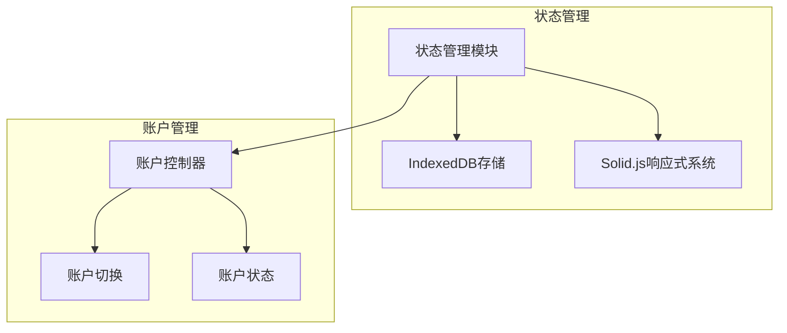
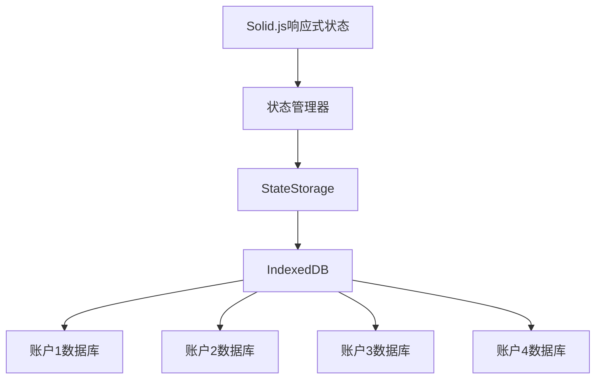
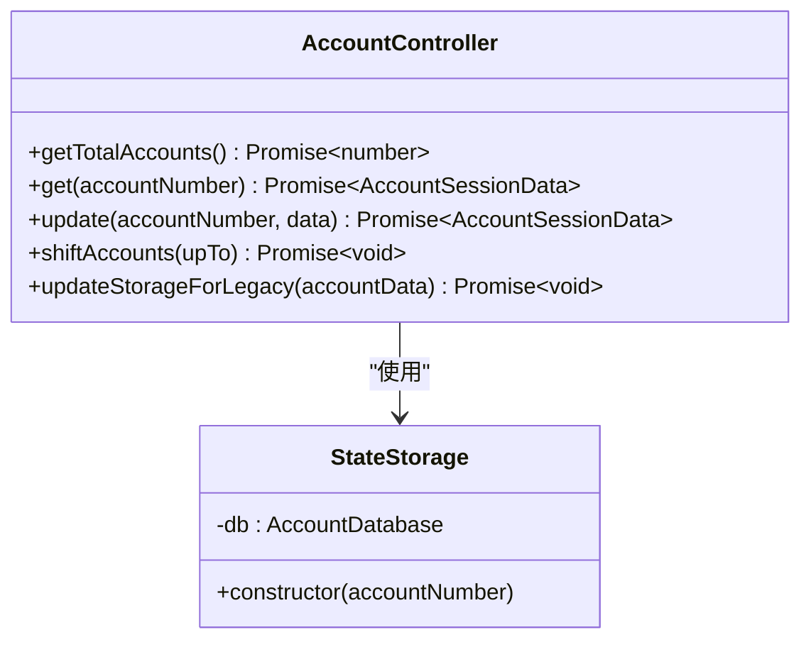
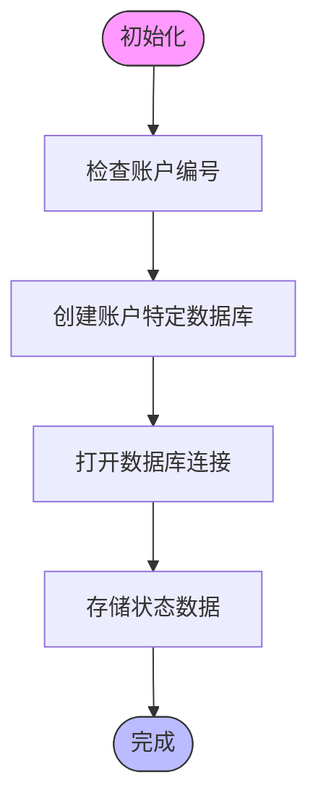
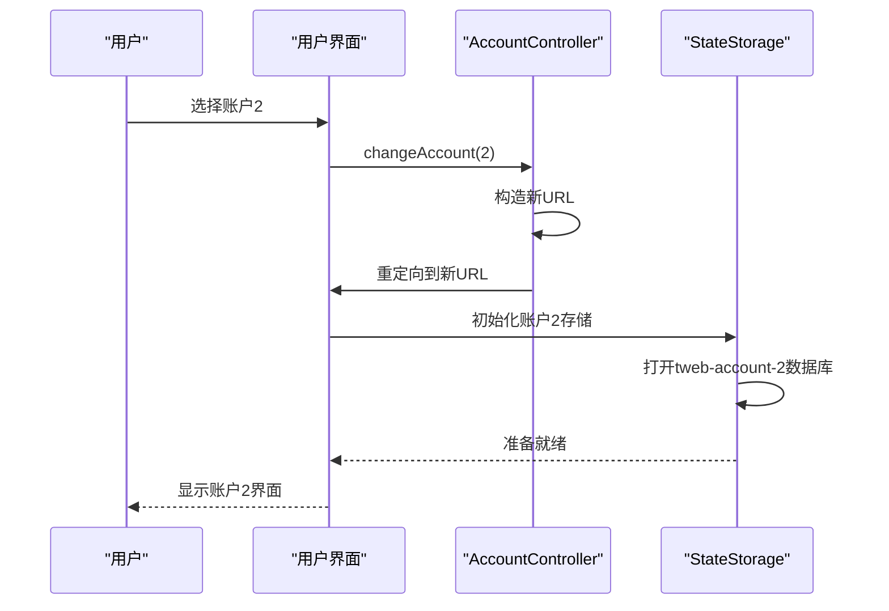
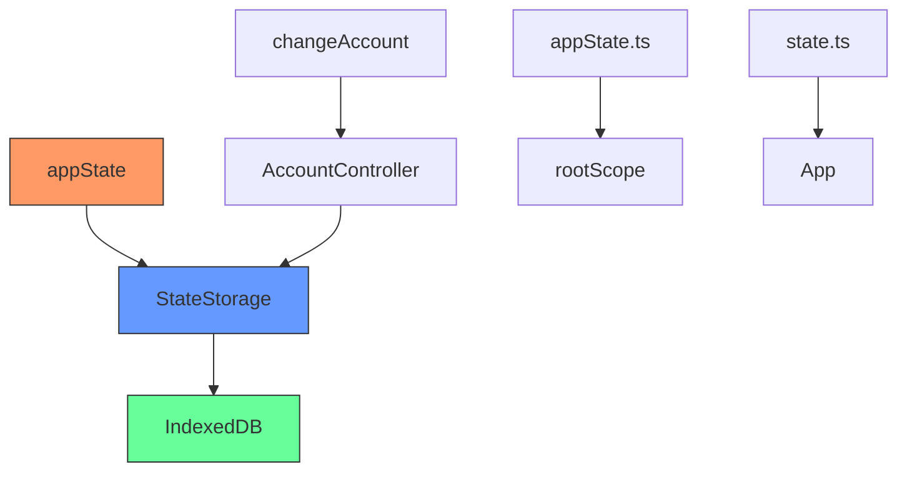

# 状态管理隔离

<cite>
**本文档中引用的文件**   
- [accountController.ts](file://src/lib/accounts/accountController.ts)
- [changeAccount.ts](file://src/lib/accounts/changeAccount.ts)
- [stateStorage.ts](file://src/lib/stateStorage.ts)
- [state.ts](file://src/config/state.ts)
- [appState.ts](file://src/stores/appState.ts)
- [types.d.ts](file://src/lib/accounts/types.d.ts)
- [constants.ts](file://src/lib/accounts/constants.ts)
- [state.ts](file://src/config/databases/state.ts)
</cite>

## 目录
1. [简介](#简介)
2. [项目结构](#项目结构)
3. [核心组件](#核心组件)
4. [架构概述](#架构概述)
5. [详细组件分析](#详细组件分析)
6. [依赖分析](#依赖分析)
7. [性能考虑](#性能考虑)
8. [故障排除指南](#故障排除指南)
9. [结论](#结论)

## 简介
本文档详细描述了Telegram Web客户端中多账户环境下应用状态隔离的实现策略。重点介绍基于Solid.js的状态管理机制，包括账户特定状态存储的创建、切换和销毁过程。文档还说明了全局状态与账户特定状态的区分，以及状态同步和隔离的边界，并记录了状态管理中的性能优化策略。

## 项目结构
项目采用模块化设计，状态管理相关代码主要分布在`src/lib`和`src/stores`目录中。多账户支持通过独立的IndexedDB数据库实现状态隔离，每个账户拥有独立的状态存储空间。

**Diagram sources**
- [stateStorage.ts](file://src/lib/stateStorage.ts#L1-L28)
- [accountController.ts](file://src/lib/accounts/accountController.ts#L1-L155)

**Section sources**
- [src/lib/accounts](file://src/lib/accounts)
- [src/config/databases](file://src/config/databases)

## 核心组件
核心状态管理组件包括基于Solid.js的响应式状态系统和基于IndexedDB的持久化存储机制。多账户状态隔离通过为每个账户创建独立的数据库实例实现，确保账户间状态完全隔离。

**Section sources**
- [appState.ts](file://src/stores/appState.ts#L1-L39)
- [stateStorage.ts](file://src/lib/stateStorage.ts#L1-L28)

## 架构概述
系统采用分层架构，上层使用Solid.js实现响应式状态管理，底层使用IndexedDB进行持久化存储。多账户支持通过动态数据库命名实现，每个账户对应独立的数据库实例。

**Diagram sources**
- [appState.ts](file://src/stores/appState.ts#L1-L39)
- [stateStorage.ts](file://src/lib/stateStorage.ts#L1-L28)
- [state.ts](file://src/config/databases/state.ts#L53-L88)

## 详细组件分析

### 账户状态管理分析
账户状态管理通过AccountController类实现，负责账户数据的获取、更新和管理。每个账户的状态存储在独立的IndexedDB数据库中，确保数据隔离。

**Diagram sources**
- [accountController.ts](file://src/lib/accounts/accountController.ts#L15-L155)
- [stateStorage.ts](file://src/lib/stateStorage.ts#L14-L27)

### 状态存储机制分析
状态存储机制基于IndexedDB实现，为每个账户创建独立的数据库实例。数据库名称包含账户编号，确保物理隔离。

**Diagram sources**
- [state.ts](file://src/config/databases/state.ts#L53-L88)
- [stateStorage.ts](file://src/lib/stateStorage.ts#L20-L26)

### 状态切换流程分析
账户切换通过URL参数控制，系统监听参数变化并重新加载对应账户的状态。

**Diagram sources**
- [changeAccount.ts](file://src/lib/accounts/changeAccount.ts#L6-L21)
- [stateStorage.ts](file://src/lib/stateStorage.ts#L20-L26)

**Section sources**
- [changeAccount.ts](file://src/lib/accounts/changeAccount.ts#L1-L21)
- [accountController.ts](file://src/lib/accounts/accountController.ts#L1-L155)

## 依赖分析
系统依赖关系清晰，上层组件依赖下层存储服务，各账户间无直接依赖，确保状态隔离。

**Diagram sources**
- [appState.ts](file://src/stores/appState.ts#L6-L13)
- [stateStorage.ts](file://src/lib/stateStorage.ts#L7-L12)
- [accountController.ts](file://src/lib/accounts/accountController.ts#L1-L155)

**Section sources**
- [src/stores/appState.ts](file://src/stores/appState.ts)
- [src/lib/stateStorage.ts](file://src/lib/stateStorage.ts)
- [src/lib/accounts/accountController.ts](file://src/lib/accounts/accountController.ts)

## 性能考虑
状态管理实现了多项性能优化：
- 懒加载：仅在需要时初始化账户状态
- 内存回收：及时清理非活动账户的状态
- 变更检测优化：使用Solid.js的高效响应式系统
- 数据库连接复用：避免频繁打开/关闭数据库

## 故障排除指南
常见状态管理问题及解决方案：
- 账户切换失败：检查URL参数格式
- 状态丢失：验证IndexedDB权限和存储空间
- 数据同步问题：检查账户数据库名称是否正确
- 性能下降：监控数据库大小和查询效率

**Section sources**
- [accountController.ts](file://src/lib/accounts/accountController.ts#L32-L40)
- [stateStorage.ts](file://src/lib/stateStorage.ts#L20-L26)

## 结论
Telegram Web客户端通过结合Solid.js响应式系统和IndexedDB持久化存储，实现了高效的多账户状态隔离。每个账户拥有独立的状态存储空间，确保数据安全和隔离。系统设计考虑了性能优化和可维护性，为多账户环境下的状态管理提供了可靠解决方案。