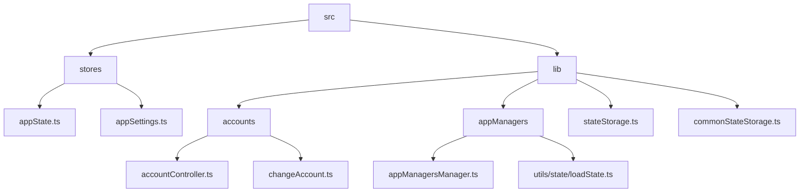
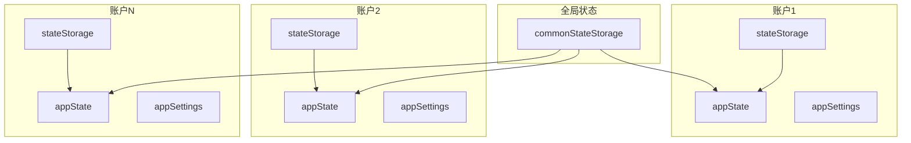
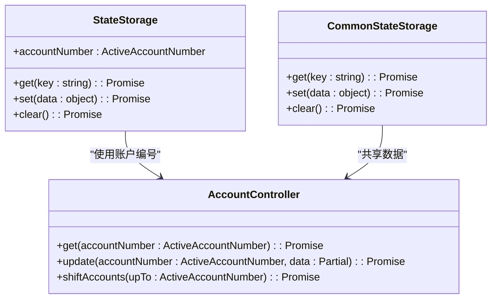
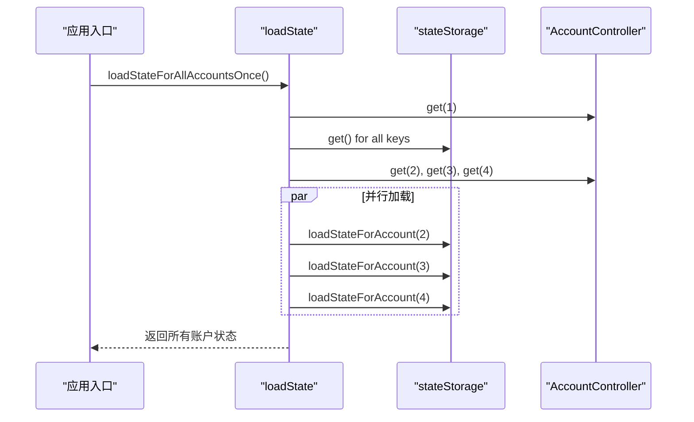
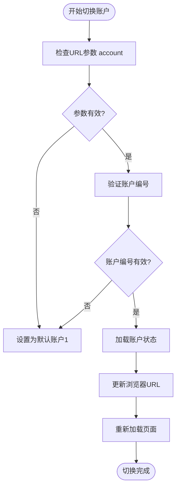
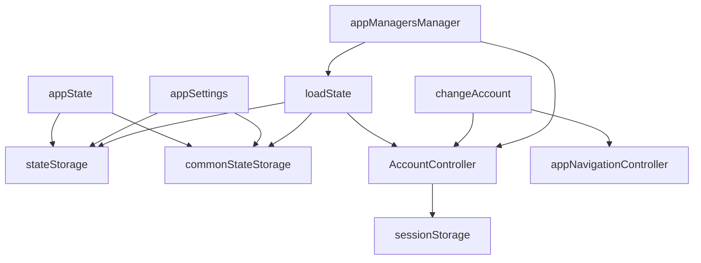

# 状态隔离机制

<cite>
**本文档中引用的文件**  
- [appState.ts](file://src/stores/appState.ts)
- [appSettings.ts](file://src/stores/appSettings.ts)
- [stateStorage.ts](file://src/lib/stateStorage.ts)
- [commonStateStorage.ts](file://src/lib/commonStateStorage.ts)
- [loadState.ts](file://src/lib/appManagers/utils/state/loadState.ts)
- [accountController.ts](file://src/lib/accounts/accountController.ts)
- [changeAccount.ts](file://src/lib/accounts/changeAccount.ts)
- [constants.ts](file://src/lib/accounts/constants.ts)
- [types.ts](file://src/lib/accounts/types.ts)
- [mtprotoworker.ts](file://src/lib/mtproto/mtprotoworker.ts)
- [appManagersManager.ts](file://src/lib/appManagers/appManagersManager.ts)
</cite>

## 目录
1. [简介](#简介)
2. [项目结构](#项目结构)
3. [核心组件](#核心组件)
4. [架构概述](#架构概述)
5. [详细组件分析](#详细组件分析)
6. [依赖分析](#依赖分析)
7. [性能考虑](#性能考虑)
8. [故障排除指南](#故障排除指南)
9. [结论](#结论)

## 简介
本文档详细阐述了在多账户环境下实现应用状态完全隔离的机制。系统基于Solid.js状态管理框架，实现了全局状态与账户特定状态的有效区分。文档将深入解析状态的创建、切换和销毁过程，以及相关的性能优化策略，包括状态懒加载、内存回收和变更检测优化。

## 项目结构
项目采用分层架构，将状态管理相关的逻辑集中于`src/lib`和`src/stores`目录下。`src/lib`包含核心的状态管理器和账户控制器，而`src/stores`则定义了应用状态和设置的存储结构。

**Diagram sources**
- [src/stores/appState.ts](file://src/stores/appState.ts)
- [src/stores/appSettings.ts](file://src/stores/appSettings.ts)
- [src/lib/stateStorage.ts](file://src/lib/stateStorage.ts)
- [src/lib/commonStateStorage.ts](file://src/lib/commonStateStorage.ts)
- [src/lib/accounts/accountController.ts](file://src/lib/accounts/accountController.ts)
- [src/lib/accounts/changeAccount.ts](file://src/lib/accounts/changeAccount.ts)
- [src/lib/appManagers/appManagersManager.ts](file://src/lib/appManagers/appManagersManager.ts)
- [src/lib/appManagers/utils/state/loadState.ts](file://src/lib/appManagers/utils/state/loadState.ts)

**Section sources**
- [src/stores/appState.ts](file://src/stores/appState.ts)
- [src/stores/appSettings.ts](file://src/stores/appSettings.ts)
- [src/lib/stateStorage.ts](file://src/lib/stateStorage.ts)
- [src/lib/commonStateStorage.ts](file://src/lib/commonStateStorage.ts)
- [src/lib/accounts/accountController.ts](file://src/lib/accounts/accountController.ts)
- [src/lib/accounts/changeAccount.ts](file://src/lib/accounts/changeAccount.ts)
- [src/lib/appManagers/appManagersManager.ts](file://src/lib/appManagers/appManagersManager.ts)
- [src/lib/appManagers/utils/state/loadState.ts](file://src/lib/appManagers/utils/state/loadState.ts)

## 核心组件
核心状态管理组件包括`appState`和`appSettings`，它们使用Solid.js的`createStore`来创建响应式状态。`stateStorage`和`commonStateStorage`负责将状态持久化到IndexedDB中。`accountController`管理多账户的生命周期，而`loadState`模块负责在应用启动时加载和初始化各个账户的状态。

**Section sources**
- [src/stores/appState.ts](file://src/stores/appState.ts)
- [src/stores/appSettings.ts](file://src/stores/appSettings.ts)
- [src/lib/stateStorage.ts](file://src/lib/stateStorage.ts)
- [src/lib/commonStateStorage.ts](file://src/lib/commonStateStorage.ts)
- [src/lib/accounts/accountController.ts](file://src/lib/accounts/accountController.ts)
- [src/lib/appManagers/utils/state/loadState.ts](file://src/lib/appManagers/utils/state/loadState.ts)

## 架构概述
系统采用多账户状态隔离架构，每个账户拥有独立的状态存储空间。全局状态（如应用配置）存储在`commonStateStorage`中，而账户特定状态（如聊天记录、用户信息）则存储在各自的`stateStorage`实例中。

**Diagram sources**
- [src/lib/commonStateStorage.ts](file://src/lib/commonStateStorage.ts)
- [src/lib/stateStorage.ts](file://src/lib/stateStorage.ts)
- [src/stores/appState.ts](file://src/stores/appState.ts)
- [src/stores/appSettings.ts](file://src/stores/appSettings.ts)

## 详细组件分析

### 状态管理组件分析
状态管理基于Solid.js的响应式系统实现。`appState`和`appSettings`通过`createStore`创建，确保了状态变更的高效检测和更新。

#### 状态存储机制

**Diagram sources**
- [src/lib/stateStorage.ts](file://src/lib/stateStorage.ts)
- [src/lib/commonStateStorage.ts](file://src/lib/commonStateStorage.ts)
- [src/lib/accounts/accountController.ts](file://src/lib/accounts/accountController.ts)

#### 状态加载流程

**Diagram sources**
- [src/lib/appManagers/utils/state/loadState.ts](file://src/lib/appManagers/utils/state/loadState.ts)
- [src/lib/accounts/accountController.ts](file://src/lib/accounts/accountController.ts)
- [src/lib/stateStorage.ts](file://src/lib/stateStorage.ts)

### 账户切换机制分析
账户切换通过URL参数`account`实现，系统会重新加载对应账户的状态。

#### 账户切换流程

**Diagram sources**
- [src/lib/accounts/changeAccount.ts](file://src/lib/accounts/changeAccount.ts)
- [src/lib/appManagers/utils/state/loadState.ts](file://src/lib/appManagers/utils/state/loadState.ts)

**Section sources**
- [src/lib/accounts/changeAccount.ts](file://src/lib/accounts/changeAccount.ts)
- [src/lib/appManagers/utils/state/loadState.ts](file://src/lib/appManagers/utils/state/loadState.ts)

## 依赖分析
系统各组件之间存在明确的依赖关系，确保了状态隔离的实现。

**Diagram sources**
- [src/stores/appState.ts](file://src/stores/appState.ts)
- [src/stores/appSettings.ts](file://src/stores/appSettings.ts)
- [src/lib/appManagers/utils/state/loadState.ts](file://src/lib/appManagers/utils/state/loadState.ts)
- [src/lib/accounts/accountController.ts](file://src/lib/accounts/accountController.ts)
- [src/lib/accounts/changeAccount.ts](file://src/lib/accounts/changeAccount.ts)
- [src/lib/appManagers/appManagersManager.ts](file://src/lib/appManagers/appManagersManager.ts)

**Section sources**
- [src/stores/appState.ts](file://src/stores/appState.ts)
- [src/stores/appSettings.ts](file://src/stores/appSettings.ts)
- [src/lib/appManagers/utils/state/loadState.ts](file://src/lib/appManagers/utils/state/loadState.ts)
- [src/lib/accounts/accountController.ts](file://src/lib/accounts/accountController.ts)
- [src/lib/accounts/changeAccount.ts](file://src/lib/accounts/changeAccount.ts)
- [src/lib/appManagers/appManagersManager.ts](file://src/lib/appManagers/appManagersManager.ts)

## 性能考虑
系统在状态管理方面实现了多项性能优化：

1. **状态懒加载**：非活动账户的状态在需要时才加载
2. **内存回收**：定期清理过期状态，减少内存占用
3. **变更检测优化**：利用Solid.js高效的响应式系统，最小化不必要的重新渲染
4. **并行加载**：多个账户的状态可以并行加载，提高启动速度

这些优化策略确保了即使在多账户环境下，应用也能保持流畅的用户体验。

## 故障排除指南
### 常见问题
- **账户状态丢失**：检查IndexedDB是否被清除，确认`stateStorage`和`commonStateStorage`的初始化是否正确
- **状态不同步**：确保`setAppState`和`setAppSettings`方法正确调用，触发状态持久化
- **账户切换失败**：验证URL参数`account`的格式和范围，确保在1-4之间

### 调试技巧
- 使用浏览器开发者工具检查IndexedDB中的状态存储
- 监控`loadStateForAllAccounts`的执行时间和返回结果
- 检查`AccountController`的`get`和`update`方法调用日志

**Section sources**
- [src/lib/appManagers/utils/state/loadState.ts](file://src/lib/appManagers/utils/state/loadState.ts)
- [src/lib/accounts/accountController.ts](file://src/lib/accounts/accountController.ts)
- [src/stores/appState.ts](file://src/stores/appState.ts)
- [src/stores/appSettings.ts](file://src/stores/appSettings.ts)

## 结论
本系统通过精心设计的状态隔离机制，成功实现了多账户环境下的应用状态管理。基于Solid.js的响应式系统，结合IndexedDB的持久化存储，确保了每个账户状态的独立性和安全性。账户切换流程简洁高效，性能优化策略有效提升了用户体验。该架构为多账户应用提供了可扩展、高性能的状态管理解决方案。