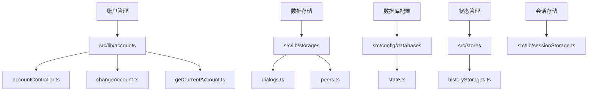
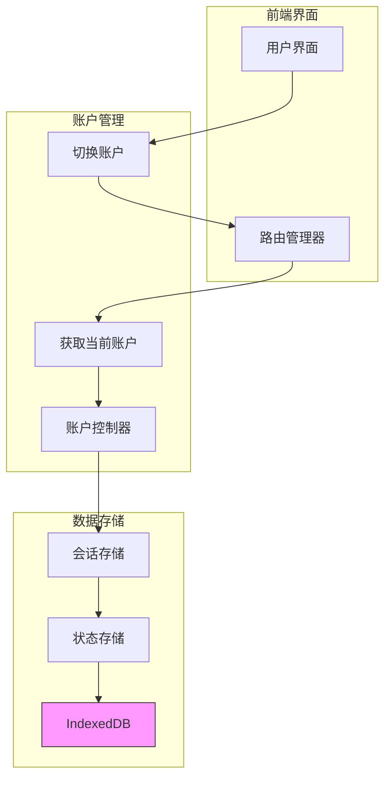
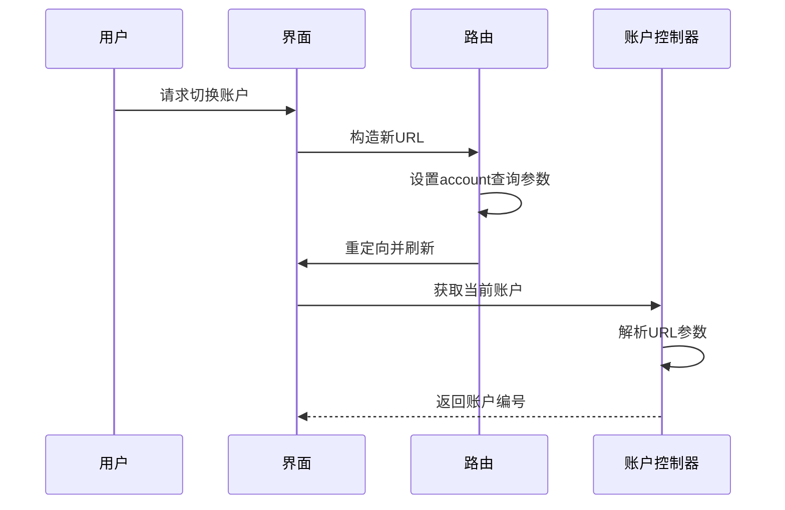
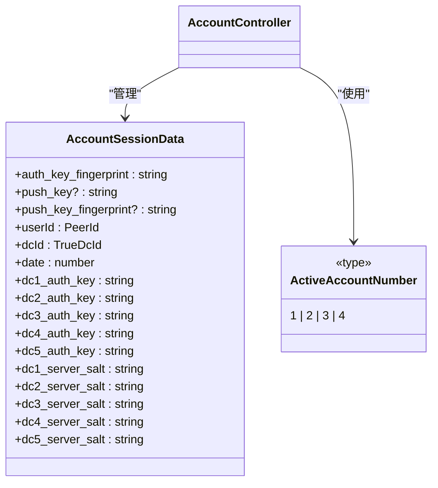
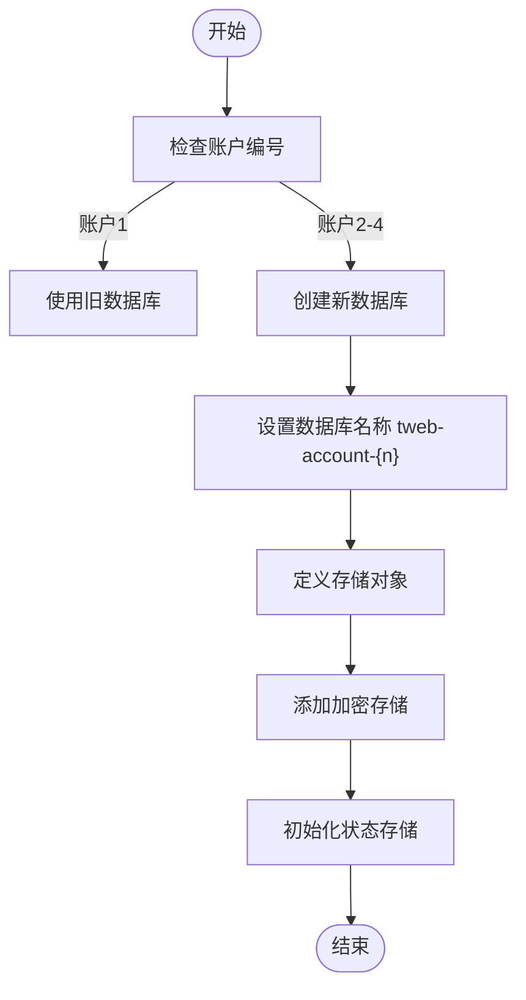
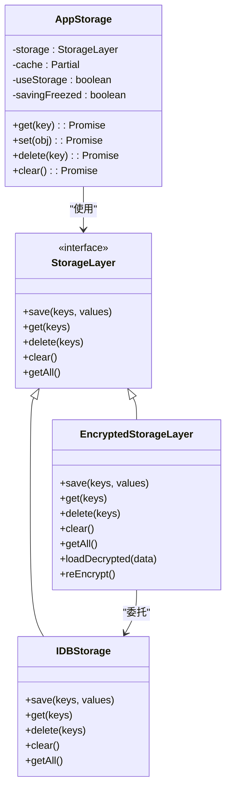
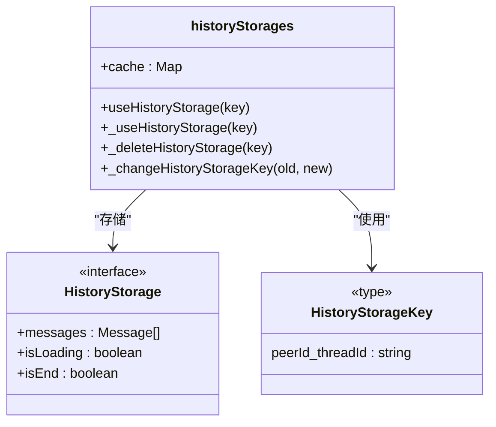
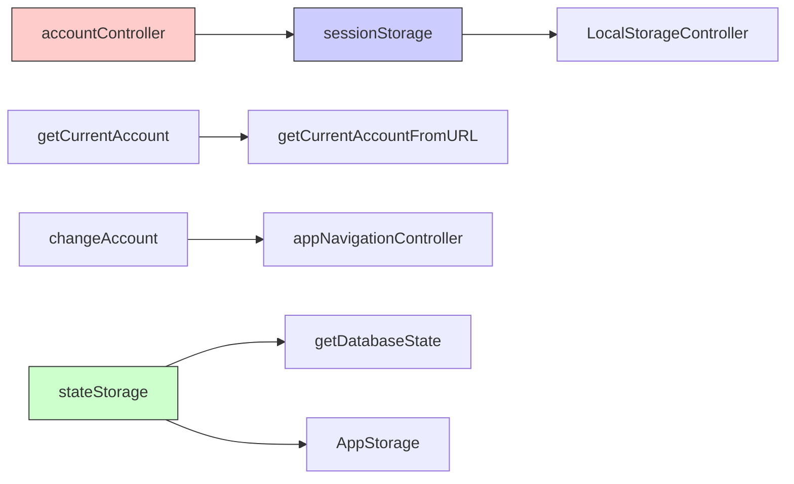

# 账户数据隔离

<cite>
**本文档中引用的文件**  
- [storage.ts](file://src/lib/storage.ts)
- [stateStorage.ts](file://src/lib/stateStorage.ts)
- [accountController.ts](file://src/lib/accounts/accountController.ts)
- [changeAccount.ts](file://src/lib/accounts/changeAccount.ts)
- [getCurrentAccount.ts](file://src/lib/accounts/getCurrentAccount.ts)
- [types.d.ts](file://src/lib/accounts/types.d.ts)
- [state.ts](file://src/config/databases/state.ts)
- [historyStorages.ts](file://src/stores/historyStorages.ts)
- [sessionStorage.ts](file://src/lib/sessionStorage.ts)
- [accounts](file://src/lib/accounts)
- [storages](file://src/lib/storages)
</cite>

## 目录
1. [简介](#简介)
2. [项目结构](#项目结构)
3. [核心组件](#核心组件)
4. [架构概述](#架构概述)
5. [详细组件分析](#详细组件分析)
6. [依赖分析](#依赖分析)
7. [性能考虑](#性能考虑)
8. [故障排除指南](#故障排除指南)
9. [结论](#结论)

## 简介
本文档详细描述了多账户环境下账户数据隔离的实现策略。系统通过独立的数据库实例、基于查询参数的账户路由和命名空间隔离机制，确保不同账户之间的会话数据、聊天历史和用户设置完全隔离。文档涵盖了数据存储的命名空间管理、跨账户数据共享的安全边界、隔离级别以及相关的性能优化策略。

## 项目结构
项目采用模块化设计，将账户管理、数据存储和状态管理分离到不同的目录中。账户相关逻辑位于`src/lib/accounts`目录，数据存储实现位于`src/lib/storages`和`src/lib/storage.ts`，而数据库配置则在`src/config/databases`中定义。这种结构化的组织方式支持清晰的数据隔离边界。

**Diagram sources**
- [accounts](file://src/lib/accounts)
- [storages](file://src/lib/storages)
- [state.ts](file://src/config/databases/state.ts)
- [historyStorages.ts](file://src/stores/historyStorages.ts)

**Section sources**
- [accounts](file://src/lib/accounts)
- [storages](file://src/lib/storages)
- [state.ts](file://src/config/databases/state.ts)

## 核心组件
系统的核心组件包括账户控制器、状态存储和会话存储，它们共同实现了多账户数据隔离。账户控制器管理账户的创建、更新和删除操作，状态存储为每个账户提供独立的数据库实例，而会话存储则处理账户间的临时数据交换。

**Section sources**
- [accountController.ts](file://src/lib/accounts/accountController.ts)
- [stateStorage.ts](file://src/lib/stateStorage.ts)
- [sessionStorage.ts](file://src/lib/sessionStorage.ts)

## 架构概述
系统采用基于IndexedDB的多数据库实例架构，为每个账户创建独立的数据库。账户隔离通过URL查询参数实现，当前账户由`CURRENT_ACCOUNT_QUERY_PARAM`参数确定。数据存储层使用加密存储层来保护敏感数据，并通过节流机制优化存储性能。

**Diagram sources**
- [accountController.ts](file://src/lib/accounts/accountController.ts)
- [changeAccount.ts](file://src/lib/accounts/changeAccount.ts)
- [getCurrentAccount.ts](file://src/lib/accounts/getCurrentAccount.ts)
- [stateStorage.ts](file://src/lib/stateStorage.ts)
- [sessionStorage.ts](file://src/lib/sessionStorage.ts)

## 详细组件分析
本节深入分析账户数据隔离的关键组件，包括账户管理、状态存储和历史存储机制。

### 账户管理分析
账户管理组件负责处理多账户环境下的账户操作，包括账户切换、数据更新和账户迁移。

#### 账户切换机制

**Diagram sources**
- [changeAccount.ts](file://src/lib/accounts/changeAccount.ts)
- [getCurrentAccount.ts](file://src/lib/accounts/getCurrentAccount.ts)

#### 账户数据结构

**Diagram sources**
- [types.d.ts](file://src/lib/accounts/types.d.ts)
- [accountController.ts](file://src/lib/accounts/accountController.ts)

**Section sources**
- [accountController.ts](file://src/lib/accounts/accountController.ts)
- [types.d.ts](file://src/lib/accounts/types.d.ts)
- [constants.ts](file://src/lib/accounts/constants.ts)

### 状态存储分析
状态存储组件为每个账户提供独立的数据存储空间，确保数据隔离。

#### 状态存储初始化

**Diagram sources**
- [state.ts](file://src/config/databases/state.ts)
- [stateStorage.ts](file://src/lib/stateStorage.ts)

#### 存储层架构

**Diagram sources**
- [storage.ts](file://src/lib/storage.ts)
- [encryptedStorageLayer.ts](file://src/lib/encryptedStorageLayer.ts)
- [files/idb.ts](file://src/lib/files/idb.ts)

**Section sources**
- [storage.ts](file://src/lib/storage.ts)
- [stateStorage.ts](file://src/lib/stateStorage.ts)

### 历史存储分析
历史存储组件管理聊天历史的内存缓存，提供高效的访问性能。

**Diagram sources**
- [historyStorages.ts](file://src/stores/historyStorages.ts)

**Section sources**
- [historyStorages.ts](file://src/stores/historyStorages.ts)

## 依赖分析
系统组件之间的依赖关系清晰，确保了数据隔离的完整性。

**Diagram sources**
- [accountController.ts](file://src/lib/accounts/accountController.ts)
- [getCurrentAccount.ts](file://src/lib/accounts/getCurrentAccount.ts)
- [changeAccount.ts](file://src/lib/accounts/changeAccount.ts)
- [stateStorage.ts](file://src/lib/stateStorage.ts)
- [sessionStorage.ts](file://src/lib/sessionStorage.ts)

**Section sources**
- [accountController.ts](file://src/lib/accounts/accountController.ts)
- [getCurrentAccount.ts](file://src/lib/accounts/getCurrentAccount.ts)
- [changeAccount.ts](file://src/lib/accounts/changeAccount.ts)

## 性能考虑
系统在数据隔离的同时考虑了性能优化，通过缓存、节流和异步操作来提高响应速度。

- **缓存策略**：AppStorage使用内存缓存来减少数据库访问频率
- **节流机制**：存储操作使用throttleWith进行节流，避免频繁的I/O操作
- **异步处理**：所有存储操作都是异步的，不会阻塞主线程
- **内存管理**：历史存储使用WeakMap-like结构，便于垃圾回收
- **批量操作**：支持批量获取和设置操作，减少数据库事务开销

## 故障排除指南
当遇到账户数据隔离相关问题时，可以参考以下排查步骤：

1. 检查URL中的account查询参数是否正确
2. 验证IndexedDB数据库名称是否符合tweb-account-{n}格式
3. 确认AppStorage实例是否使用正确的数据库实例
4. 检查加密存储层的状态是否与账户设置匹配
5. 验证会话存储中的账户数据是否完整

**Section sources**
- [storage.ts](file://src/lib/storage.ts)
- [stateStorage.ts](file://src/lib/stateStorage.ts)
- [sessionStorage.ts](file://src/lib/sessionStorage.ts)

## 结论
该系统通过精心设计的多账户数据隔离架构，实现了安全、高效的数据管理。每个账户拥有独立的数据库实例，通过URL参数进行路由，确保了数据的完全隔离。加密存储层提供了额外的安全保护，而合理的缓存和节流策略保证了良好的性能表现。这种架构既满足了多账户功能的需求，又维护了数据安全和系统性能的平衡。