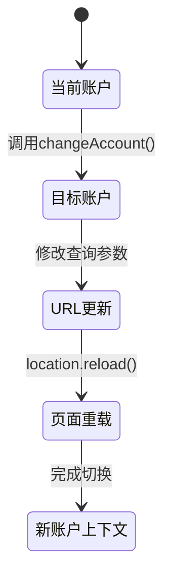
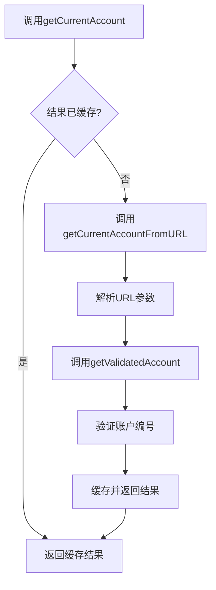
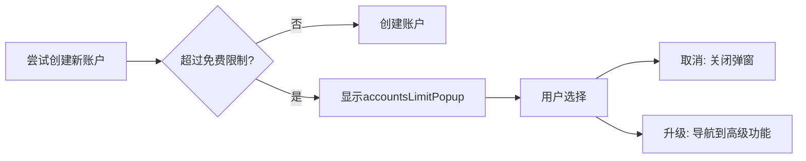

# 账户切换

<cite>
**本文档中引用的文件**  
- [changeAccount.ts](file://src/lib/accounts/changeAccount.ts)
- [getCurrentAccount.ts](file://src/lib/accounts/getCurrentAccount.ts)
- [getCurrentAccountFromURL.ts](file://src/lib/accounts/getCurrentAccountFromURL.ts)
- [getValidatedAccount.ts](file://src/lib/accounts/getValidatedAccount.ts)
- [accountController.ts](file://src/lib/accounts/accountController.ts)
- [constants.ts](file://src/lib/accounts/constants.ts)
- [types.d.ts](file://src/lib/accounts/types.d.ts)
- [accountsLimitPopup.ts](file://src/components/sidebarLeft/accountsLimitPopup.ts)
- [accountsLimitPopupContent.tsx](file://src/components/sidebarLeft/accountsLimitPopupContent.tsx)
</cite>

## 目录
1. [简介](#简介)
2. [核心组件](#核心组件)
3. [账户切换机制](#账户切换机制)
4. [当前账户获取逻辑](#当前账户获取逻辑)
5. [账户限制弹窗](#账户限制弹窗)
6. [性能优化与错误恢复](#性能优化与错误恢复)
7. [结论](#结论)

## 简介
本文档详细描述了多账户系统中的账户切换功能实现机制。重点分析了`changeAccount`函数的状态转换逻辑、`getCurrentAccount`的获取策略、账户切换过程中的数据管理以及账户数量限制的处理流程。文档还涵盖了性能优化技巧和异常情况下的恢复机制，为开发者提供完整的账户切换功能技术参考。

## 核心组件

账户切换功能由多个核心组件协同工作，包括账户控制器、状态管理、URL参数处理和用户界面交互。这些组件共同实现了无缝的账户切换体验。

**Section sources**
- [accountController.ts](file://src/lib/accounts/accountController.ts#L1-L155)
- [constants.ts](file://src/lib/accounts/constants.ts#L1-L6)
- [types.d.ts](file://src/lib/accounts/types.d.ts#L1-L17)

## 账户切换机制

账户切换功能通过`changeAccount`函数实现，该函数负责处理账户状态的转换和页面重载。函数接收目标账户编号和是否在新标签页打开的参数。

当调用`changeAccount`时，系统会根据目标账户编号修改URL中的查询参数。对于主账户（账户1），系统会删除账户查询参数；对于其他账户，则设置相应的账户编号参数。切换操作支持两种模式：在当前标签页重载或在新标签页打开。

在当前标签页切换时，系统会先覆盖哈希值，然后使用`history.replaceState`更新URL而不产生历史记录，最后通过`location.reload()`重新加载页面以应用新的账户上下文。

**Diagram sources**
- [changeAccount.ts](file://src/lib/accounts/changeAccount.ts#L6-L20)

**Section sources**
- [changeAccount.ts](file://src/lib/accounts/changeAccount.ts#L6-L20)

## 当前账户获取逻辑

`getCurrentAccount`函数采用惰性求值和缓存策略来获取当前活动账户。该函数通过立即执行函数表达式（IIFE）创建了一个闭包，用于缓存计算结果。

获取流程首先从URL中提取账户参数，然后通过`getValidatedAccount`函数进行验证和标准化。系统会对结果进行缓存，避免重复解析相同的URL，从而提高性能。

`getCurrentAccountFromURL`函数负责解析URL中的查询参数，并委托给`getValidatedAccount`进行验证。验证函数确保输入的账户编号在有效范围内（1-4），并返回标准化的账户编号。

**Diagram sources**
- [getCurrentAccount.ts](file://src/lib/accounts/getCurrentAccount.ts#L4-L7)
- [getCurrentAccountFromURL.ts](file://src/lib/accounts/getCurrentAccountFromURL.ts#L4-L7)
- [getValidatedAccount.ts](file://src/lib/accounts/getValidatedAccount.ts#L3-L6)

**Section sources**
- [getCurrentAccount.ts](file://src/lib/accounts/getCurrentAccount.ts#L4-L7)
- [getCurrentAccountFromURL.ts](file://src/lib/accounts/getCurrentAccountFromURL.ts#L4-L7)
- [getValidatedAccount.ts](file://src/lib/accounts/getValidatedAccount.ts#L3-L6)

## 账户限制弹窗

账户限制弹窗（accountsLimitPopup）在用户尝试创建超过免费账户限制的账户时触发。系统通过`MAX_ACCOUNTS_FREE`和`MAX_ACCOUNTS_PREMIUM`常量定义了免费和高级用户的账户数量限制。

当检测到账户数量达到免费限制时，系统会显示`AccountsLimitPopup`，提示用户升级到高级账户以增加账户数量。弹窗包含取消按钮和升级按钮，点击升级按钮会导航到高级功能页面。

弹窗内容由`AccountsLimitPopupContent`组件渲染，显示当前限制（3个免费账户）和升级后的限制（4个账户），并提供清晰的描述文本和操作按钮。

**Diagram sources**
- [accountsLimitPopup.ts](file://src/components/sidebarLeft/accountsLimitPopup.ts#L5-L23)
- [accountsLimitPopupContent.tsx](file://src/components/sidebarLeft/accountsLimitPopupContent.tsx#L7-L41)
- [constants.ts](file://src/lib/accounts/constants.ts#L3-L5)

**Section sources**
- [accountsLimitPopup.ts](file://src/components/sidebarLeft/accountsLimitPopup.ts#L5-L23)
- [accountsLimitPopupContent.tsx](file://src/components/sidebarLeft/accountsLimitPopupContent.tsx#L7-L41)

## 性能优化与错误恢复

账户切换系统采用了多种性能优化策略。`getCurrentAccount`的缓存机制避免了重复的URL解析操作，提高了频繁调用时的性能表现。`AccountController`类中的异步操作被合理地批处理，减少了对存储系统的访问次数。

在错误恢复方面，系统通过`getValidatedAccount`函数确保账户编号的有效性，防止无效输入导致的异常。当存储数据缺失关键字段时，`AccountController`会自动填充指纹和推送密钥等必要信息，保证账户数据的完整性。

对于网络异常情况，系统依赖于浏览器的原生机制进行处理。由于账户切换主要涉及本地存储和页面重载，网络问题通常不会影响核心功能。但在数据同步场景下，建议实现重试机制和离线缓存策略。

**Section sources**
- [accountController.ts](file://src/lib/accounts/accountController.ts#L15-L155)
- [getValidatedAccount.ts](file://src/lib/accounts/getValidatedAccount.ts#L3-L6)

## 结论
账户切换功能通过精心设计的状态管理和URL参数处理机制，实现了流畅的多账户体验。系统采用缓存、验证和自动修复等技术确保了功能的稳定性和性能表现。账户限制机制合理地平衡了免费用户和高级用户的权益，为产品商业化提供了技术支持。整体设计充分考虑了用户体验和系统可靠性，为多账户应用提供了可复用的解决方案。