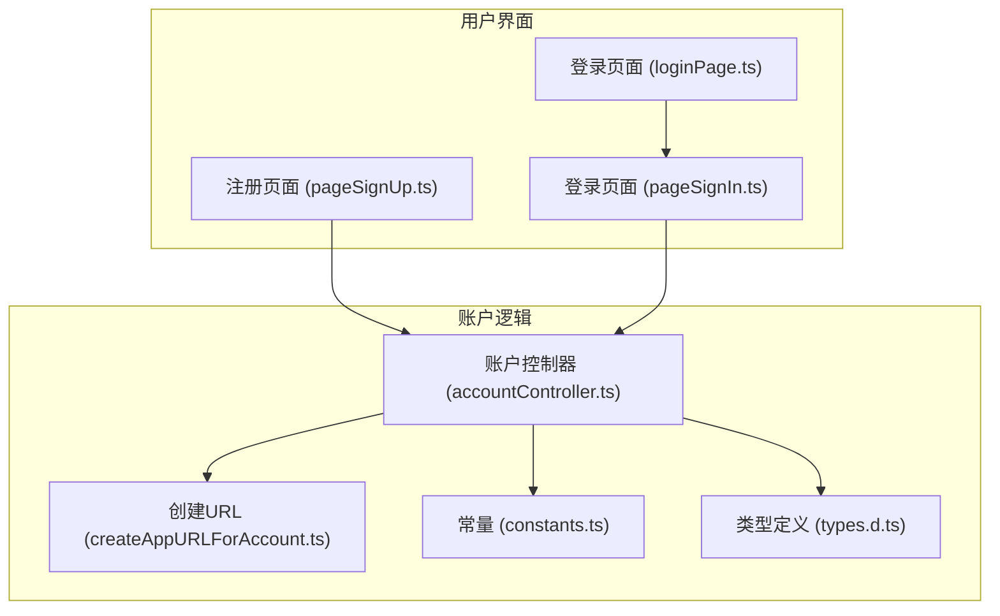
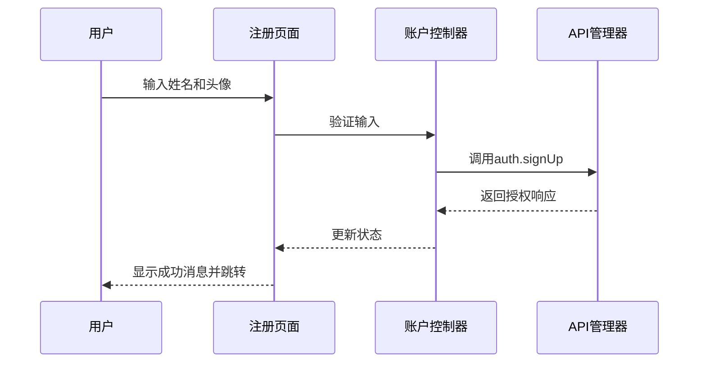
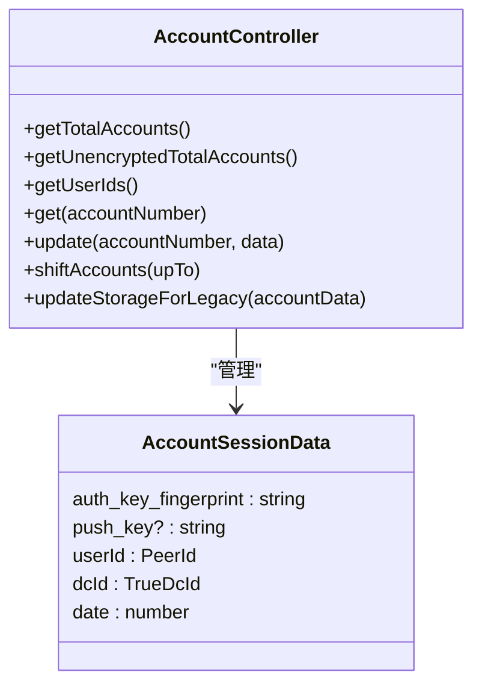
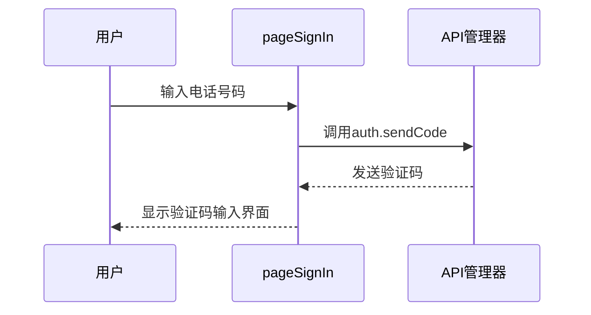
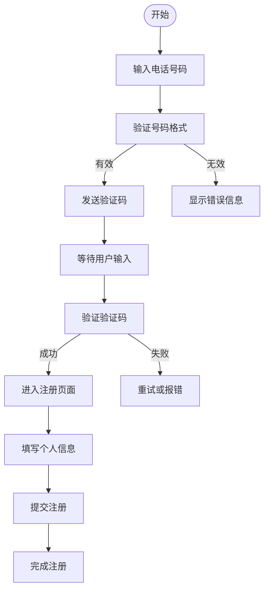
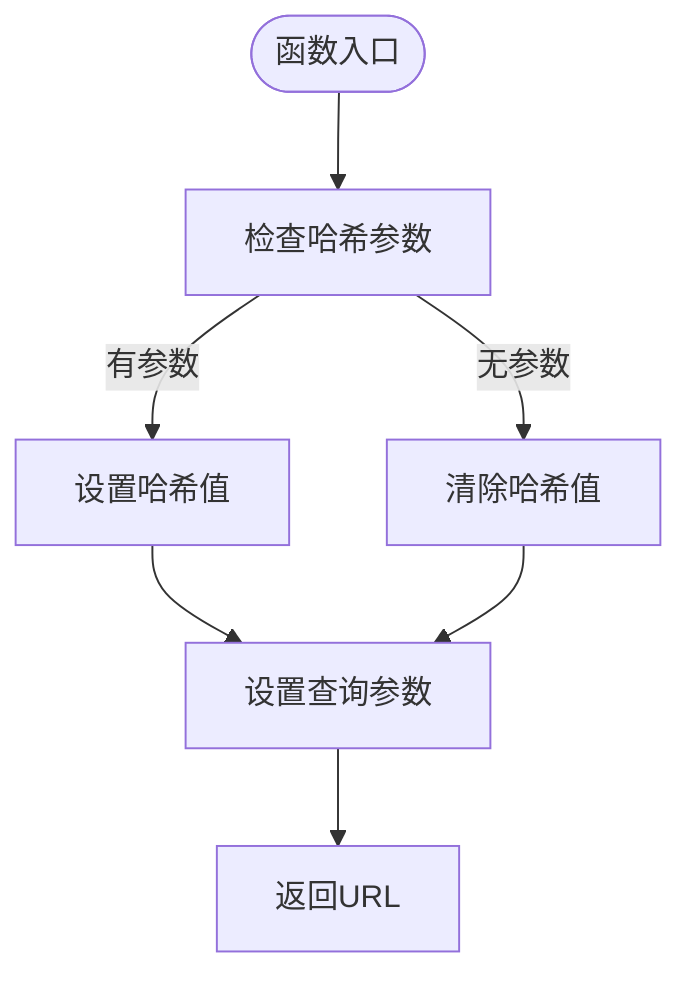
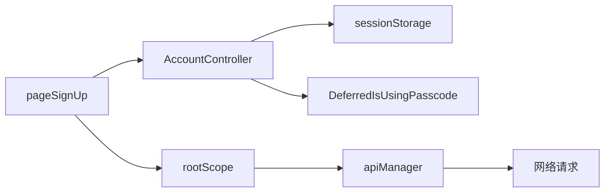

# 账户创建

<cite>
**本文档中引用的文件**  
- [createAppURLForAccount.ts](file://src/lib/accounts/createAppURLForAccount.ts)
- [accountController.ts](file://src/lib/accounts/accountController.ts)
- [pageSignUp.ts](file://src/pages/pageSignUp.ts)
- [pageSignIn.ts](file://src/pages/pageSignIn.ts)
- [types.d.ts](file://src/lib/accounts/types.d.ts)
- [constants.ts](file://src/lib/accounts/constants.ts)
</cite>

## 目录
1. [简介](#简介)
2. [项目结构](#项目结构)
3. [核心组件](#核心组件)
4. [架构概述](#架构概述)
5. [详细组件分析](#详细组件分析)
6. [依赖分析](#依赖分析)
7. [性能考虑](#性能考虑)
8. [故障排除指南](#故障排除指南)
9. [结论](#结论)

## 简介
本文档详细描述了账户创建功能的实现机制，包括新账户注册流程、手机号验证、验证码输入、账户信息初始化以及账户验证和激活的完整流程。文档还解释了 `createAppURLForAccount` 函数如何生成唯一的账户URL标识符，并提供了用户界面与后端逻辑集成的细节，包括注册表单的验证规则和状态管理。

## 项目结构
该应用程序的结构遵循模块化设计原则，将功能划分为不同的目录，如 `components`、`lib`、`pages` 和 `src`。账户相关功能主要位于 `src/lib/accounts` 目录下，而用户界面组件则分布在 `src/components` 和 `src/pages` 中。

**Diagram sources**
- [pageSignUp.ts](file://src/pages/pageSignUp.ts)
- [pageSignIn.ts](file://src/pages/pageSignIn.ts)
- [accountController.ts](file://src/lib/accounts/accountController.ts)
- [createAppURLForAccount.ts](file://src/lib/accounts/createAppURLForAccount.ts)

**Section sources**
- [pageSignUp.ts](file://src/pages/pageSignUp.ts)
- [pageSignIn.ts](file://src/pages/pageSignIn.ts)
- [accountController.ts](file://src/lib/accounts/accountController.ts)

## 核心组件
核心组件包括账户控制器（AccountController）、注册页面（pageSignUp.ts）、登录页面（pageSignIn.ts）以及用于生成账户URL的函数（createAppURLForAccount）。这些组件协同工作以实现完整的账户创建和管理流程。

**Section sources**
- [accountController.ts](file://src/lib/accounts/accountController.ts)
- [pageSignUp.ts](file://src/pages/pageSignUp.ts)
- [pageSignIn.ts](file://src/pages/pageSignIn.ts)
- [createAppURLForAccount.ts](file://src/lib/accounts/createAppURLForAccount.ts)

## 架构概述
系统架构采用分层设计，前端页面通过事件驱动与后端服务进行交互。账户创建流程从用户在注册页面输入信息开始，经过验证后调用API完成注册，并通过账户控制器管理账户状态。

**Diagram sources**
- [pageSignUp.ts](file://src/pages/pageSignUp.ts)
- [accountController.ts](file://src/lib/accounts/accountController.ts)

## 详细组件分析

### 账户创建流程分析
注册流程包括手机号验证、验证码输入和账户信息初始化。用户首先在登录页面输入电话号码，系统发送验证码；随后用户输入验证码并通过验证后进入注册页面填写个人信息。

#### 对象导向组件：

**Diagram sources**
- [accountController.ts](file://src/lib/accounts/accountController.ts)
- [types.d.ts](file://src/lib/accounts/types.d.ts)

#### API/服务组件：

**Diagram sources**
- [pageSignIn.ts](file://src/pages/pageSignIn.ts)

#### 复杂逻辑组件：

**Diagram sources**
- [pageSignIn.ts](file://src/pages/pageSignIn.ts)
- [pageSignUp.ts](file://src/pages/pageSignUp.ts)

**Section sources**
- [pageSignIn.ts](file://src/pages/pageSignIn.ts)
- [pageSignUp.ts](file://src/pages/pageSignUp.ts)

### createAppURLForAccount 函数分析
该函数负责生成唯一的账户URL标识符，基于账户编号和其他参数构建URL。

**Diagram sources**
- [createAppURLForAccount.ts](file://src/lib/accounts/createAppURLForAccount.ts)

**Section sources**
- [createAppURLForAccount.ts](file://src/lib/accounts/createAppURLForAccount.ts)

## 依赖分析
账户创建功能依赖于多个核心模块，包括API管理器、会话存储、根作用域等。这些依赖关系确保了数据的一致性和功能的完整性。

**Diagram sources**
- [accountController.ts](file://src/lib/accounts/accountController.ts)
- [pageSignUp.ts](file://src/pages/pageSignUp.ts)

**Section sources**
- [accountController.ts](file://src/lib/accounts/accountController.ts)
- [pageSignUp.ts](file://src/pages/pageSignUp.ts)

## 性能考虑
账户创建流程经过优化，减少了不必要的网络请求和DOM操作。使用异步加载和预加载技术提升用户体验。

## 故障排除指南
常见问题包括验证码接收延迟、输入验证失败等。解决方案包括检查网络连接、确认电话号码格式正确、清除浏览器缓存等。

**Section sources**
- [pageSignIn.ts](file://src/pages/pageSignIn.ts)
- [pageSignUp.ts](file://src/pages/pageSignUp.ts)

## 结论
本文档全面介绍了账户创建功能的实现细节，涵盖了从用户界面到后端逻辑的各个方面。通过理解这些组件和流程，开发者可以更好地维护和扩展账户系统。