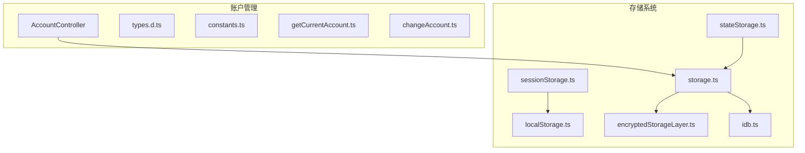
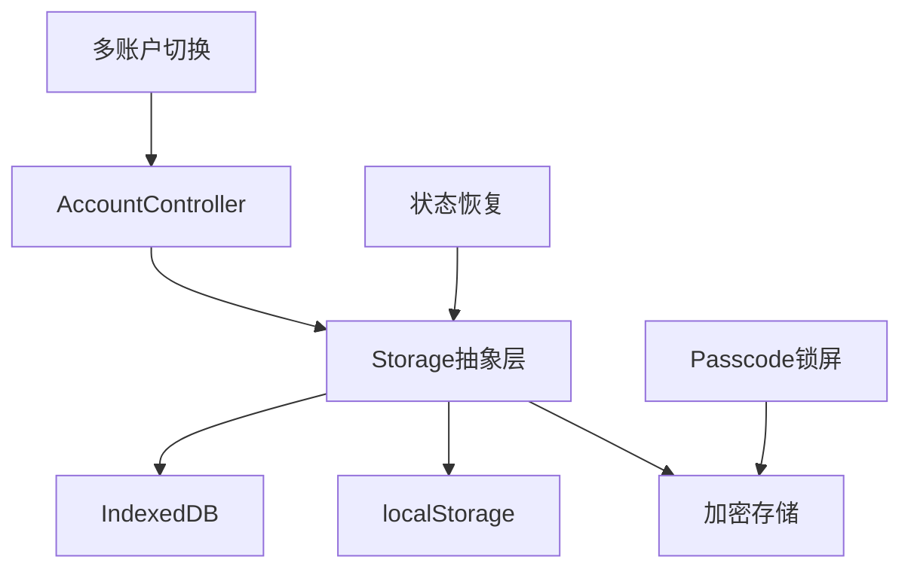
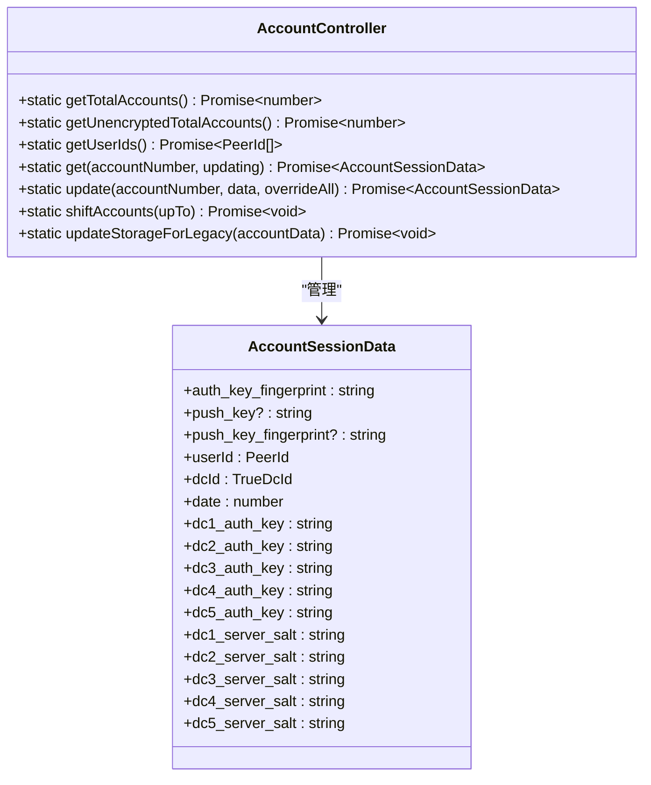
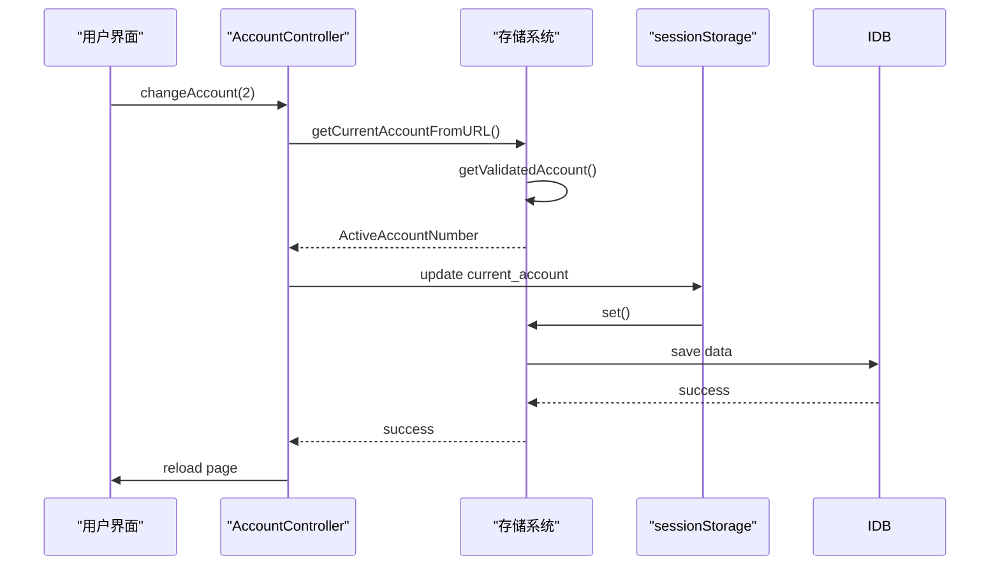
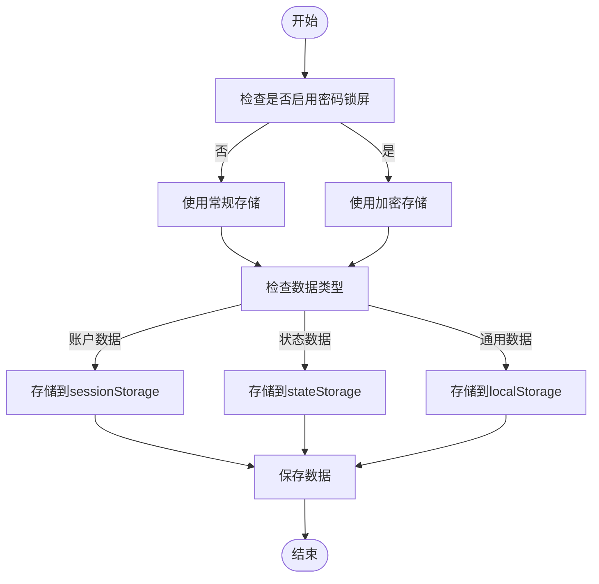
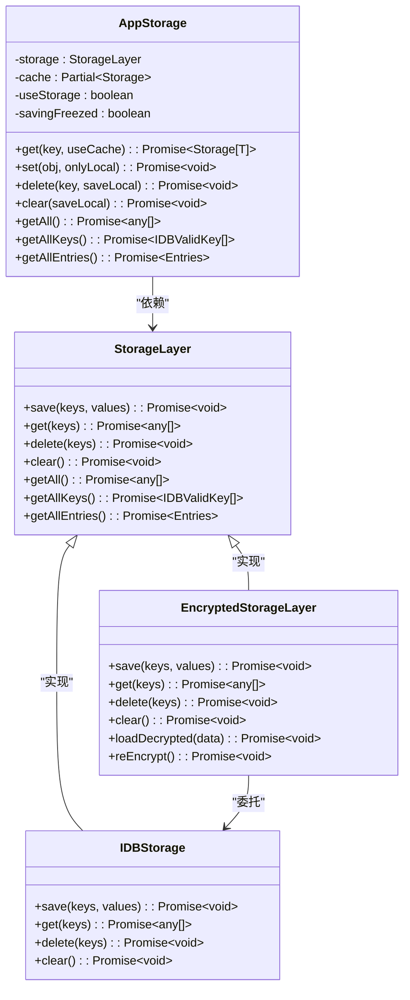
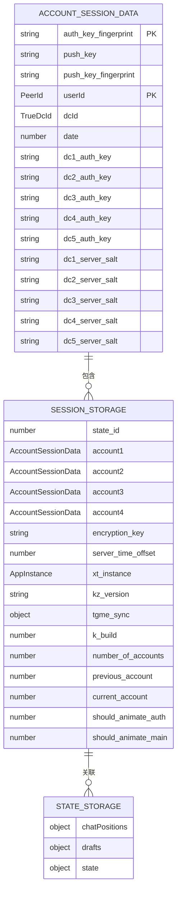
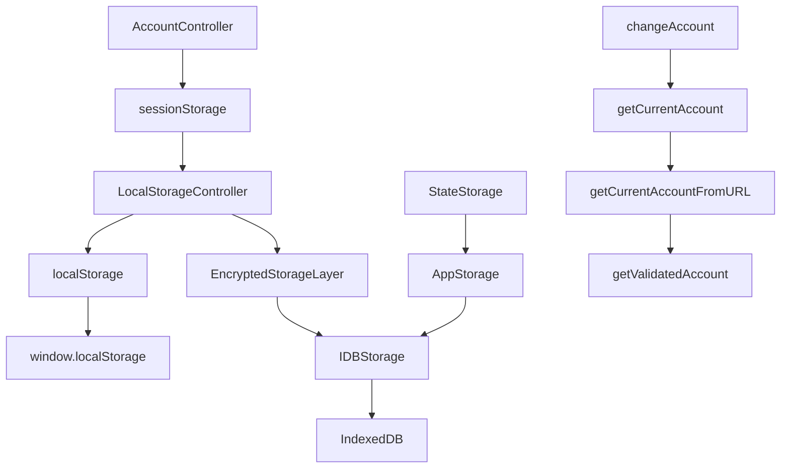
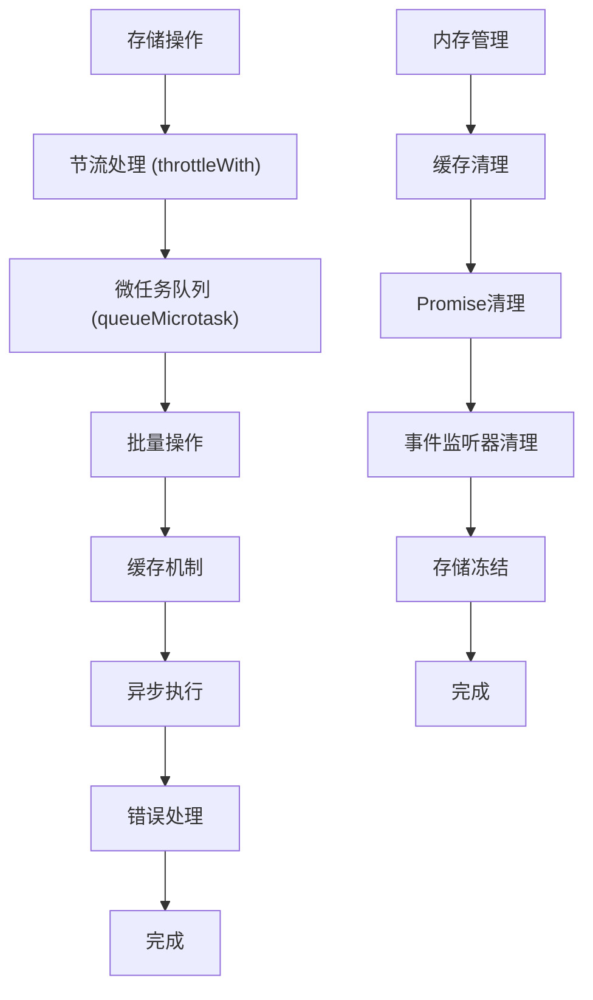
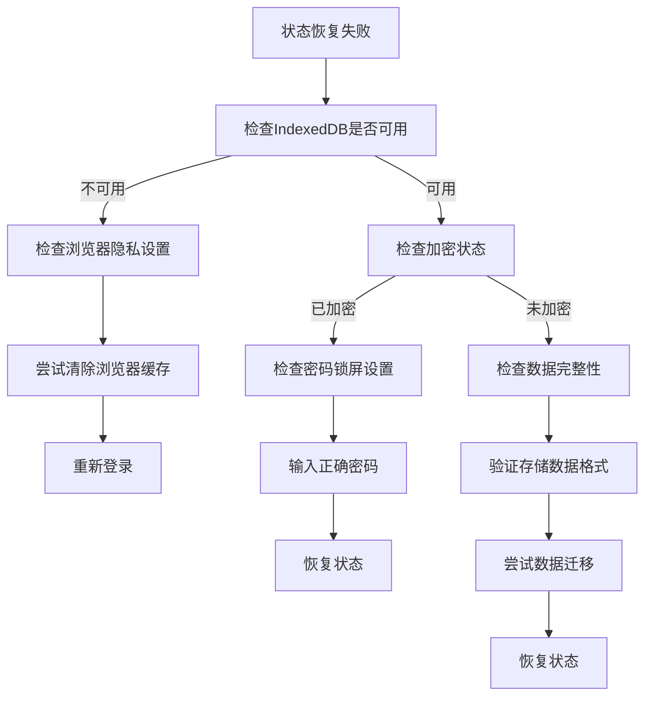

# 账户状态管理

<cite>
**本文档引用的文件**
- [accountController.ts](file://src/lib/accounts/accountController.ts)
- [types.d.ts](file://src/lib/accounts/types.d.ts)
- [constants.ts](file://src/lib/accounts/constants.ts)
- [getCurrentAccount.ts](file://src/lib/accounts/getCurrentAccount.ts)
- [getCurrentAccountFromURL.ts](file://src/lib/accounts/getCurrentAccountFromURL.ts)
- [getValidatedAccount.ts](file://src/lib/accounts/getValidatedAccount.ts)
- [changeAccount.ts](file://src/lib/accounts/changeAccount.ts)
- [createAppURLForAccount.ts](file://src/lib/accounts/createAppURLForAccount.ts)
- [storage.ts](file://src/lib/storage.ts)
- [stateStorage.ts](file://src/lib/stateStorage.ts)
- [localStorage.ts](file://src/lib/localStorage.ts)
- [sessionStorage.ts](file://src/lib/sessionStorage.ts)
- [encryptedStorageLayer.ts](file://src/lib/encryptedStorageLayer.ts)
- [idb.ts](file://src/lib/files/idb.ts)
- [config/databases/state.ts](file://src/config/databases/state.ts)
</cite>

## 目录
1. [简介](#简介)
2. [项目结构](#项目结构)
3. [核心组件](#核心组件)
4. [架构概述](#架构概述)
5. [详细组件分析](#详细组件分析)
6. [依赖分析](#依赖分析)
7. [性能考虑](#性能考虑)
8. [故障排除指南](#故障排除指南)
9. [结论](#结论)

## 简介
本文档深入解析账户状态管理系统的架构设计和实现机制。系统通过AccountController类管理多账户环境下的状态，采用localStorage和IndexedDB进行数据持久化，并实现了完善的状态隔离和数据保护机制。文档详细说明了账户配置数据的存储结构、序列化格式以及状态恢复、数据迁移和版本兼容性的实现细节。

## 项目结构
账户状态管理系统主要由以下几个核心模块组成：
- `src/lib/accounts/`：账户管理核心逻辑
- `src/lib/storage/`：存储抽象层
- `src/lib/sessionStorage.ts`：会话存储控制器
- `src/lib/encryptedStorageLayer.ts`：加密存储层
- `src/lib/files/idb.ts`：IndexedDB实现



**图示来源**
- [accountController.ts](file://src/lib/accounts/accountController.ts)
- [storage.ts](file://src/lib/storage.ts)
- [sessionStorage.ts](file://src/lib/sessionStorage.ts)
- [localStorage.ts](file://src/lib/localStorage.ts)

**本节来源**
- [src/lib/accounts/](file://src/lib/accounts/)
- [src/lib/storage/](file://src/lib/storage/)

## 核心组件
账户状态管理系统的核心组件包括AccountController类、存储抽象层和会话管理器。AccountController负责账户的增删改查操作，存储抽象层提供统一的存储接口，会话管理器协调不同存储介质的使用。

**本节来源**
- [accountController.ts](file://src/lib/accounts/accountController.ts)
- [storage.ts](file://src/lib/storage.ts)
- [sessionStorage.ts](file://src/lib/sessionStorage.ts)

## 架构概述
系统采用分层架构设计，上层为账户管理逻辑，中层为存储抽象层，底层为具体存储实现。这种设计实现了业务逻辑与存储细节的解耦，提高了系统的可维护性和可扩展性。



**图示来源**
- [accountController.ts](file://src/lib/accounts/accountController.ts)
- [storage.ts](file://src/lib/storage.ts)
- [encryptedStorageLayer.ts](file://src/lib/encryptedStorageLayer.ts)

## 详细组件分析

### AccountController分析
AccountController类是账户状态管理的核心，负责管理最多4个账户的状态。它提供了账户数据的获取、更新、删除和账户切换等功能。



**图示来源**
- [accountController.ts](file://src/lib/accounts/accountController.ts)
- [types.d.ts](file://src/lib/accounts/types.d.ts)

#### 状态管理流程
账户状态管理涉及多个步骤，包括账户切换、状态更新和数据持久化。



**图示来源**
- [accountController.ts](file://src/lib/accounts/accountController.ts)
- [getCurrentAccountFromURL.ts](file://src/lib/accounts/getCurrentAccountFromURL.ts)
- [getValidatedAccount.ts](file://src/lib/accounts/getValidatedAccount.ts)
- [changeAccount.ts](file://src/lib/accounts/changeAccount.ts)

#### 存储策略
系统采用混合存储策略，根据数据敏感程度选择不同的存储方式。



**图示来源**
- [storage.ts](file://src/lib/storage.ts)
- [sessionStorage.ts](file://src/lib/sessionStorage.ts)
- [stateStorage.ts](file://src/lib/stateStorage.ts)
- [localStorage.ts](file://src/lib/localStorage.ts)

**本节来源**
- [accountController.ts](file://src/lib/accounts/accountController.ts)
- [storage.ts](file://src/lib/storage.ts)
- [sessionStorage.ts](file://src/lib/sessionStorage.ts)

### 存储系统分析
存储系统是账户状态管理的基础，提供了统一的存储接口和多种存储实现。

#### 存储抽象层
AppStorage类提供了统一的存储接口，屏蔽了底层存储实现的差异。



**图示来源**
- [storage.ts](file://src/lib/storage.ts)
- [idb.ts](file://src/lib/files/idb.ts)
- [encryptedStorageLayer.ts](file://src/lib/encryptedStorageLayer.ts)

#### 数据存储结构
账户配置数据采用特定的结构进行存储，确保数据的完整性和一致性。



**图示来源**
- [types.d.ts](file://src/lib/accounts/types.d.ts)
- [sessionStorage.ts](file://src/lib/sessionStorage.ts)
- [stateStorage.ts](file://src/lib/stateStorage.ts)

**本节来源**
- [storage.ts](file://src/lib/storage.ts)
- [sessionStorage.ts](file://src/lib/sessionStorage.ts)
- [stateStorage.ts](file://src/lib/stateStorage.ts)

## 依赖分析
账户状态管理系统各组件之间的依赖关系清晰，形成了良好的分层结构。



**图示来源**
- [accountController.ts](file://src/lib/accounts/accountController.ts)
- [sessionStorage.ts](file://src/lib/sessionStorage.ts)
- [localStorage.ts](file://src/lib/localStorage.ts)
- [encryptedStorageLayer.ts](file://src/lib/encryptedStorageLayer.ts)
- [storage.ts](file://src/lib/storage.ts)
- [idb.ts](file://src/lib/files/idb.ts)
- [changeAccount.ts](file://src/lib/accounts/changeAccount.ts)
- [getCurrentAccount.ts](file://src/lib/accounts/getCurrentAccount.ts)

**本节来源**
- [src/lib/accounts/](file://src/lib/accounts/)
- [src/lib/storage/](file://src/lib/storage/)
- [src/lib/sessionStorage.ts](file://src/lib/sessionStorage.ts)

## 性能考虑
系统在设计时充分考虑了性能优化，采取了多种措施来提高存储操作的效率并防止内存泄漏。

### 性能优化措施
系统采用了一系列性能优化策略，确保在高频率存储操作下的性能表现。



**图示来源**
- [storage.ts](file://src/lib/storage.ts)
- [helpers/schedulers/throttleWith.ts](file://src/helpers/schedulers/throttleWith.ts)

### 内存泄漏防范
系统通过多种机制防止内存泄漏，确保长时间运行的稳定性。

```mermaid
classDiagram
class AppStorage {
-getPromises : Map~keyof Storage, CancellablePromise~
-keysToSet : Set~keyof Storage~
-keysToDelete : Set~keyof Storage~
+_get() : void
+_save() : void
+_delete() : void
}
class CancellablePromise {
+resolve() : void
+reject() : void
+clear() : void
}
AppStorage --> CancellablePromise : "使用"
note right of AppStorage
定期清理已完成的Promise
及时清除已处理的键值
避免引用循环
end note
```

**图示来源**
- [storage.ts](file://src/lib/storage.ts)
- [helpers/cancellablePromise.ts](file://src/helpers/cancellablePromise.ts)

**本节来源**
- [storage.ts](file://src/lib/storage.ts)
- [helpers/cancellablePromise.ts](file://src/helpers/cancellablePromise.ts)

## 故障排除指南
本节提供账户状态管理系统的常见问题和解决方案。

### 状态恢复问题
当账户状态无法正常恢复时，可以按照以下步骤进行排查：



**本节来源**
- [storage.ts](file://src/lib/storage.ts)
- [sessionStorage.ts](file://src/lib/sessionStorage.ts)
- [encryptedStorageLayer.ts](file://src/lib/encryptedStorageLayer.ts)

### 数据迁移问题
在版本升级或环境迁移时可能遇到数据迁移问题：

```mermaid
flowchart TD
A[数据迁移问题] --> B["检查数据库版本"]
B --> C["验证数据结构兼容性"]
C --> D["执行迁移脚本"]
D --> E["验证迁移结果"]
E --> F["更新版本标记"]
F --> G["完成迁移"]
note right of C
检查字段是否存在
验证数据类型匹配
确保默认值设置
end note
```

**本节来源**
- [storage.ts](file://src/lib/storage.ts)
- [config/databases/state.ts](file://src/config/databases/state.ts)
- [scripts/transfer_indexeddb.js](file://src/scripts/transfer_indexeddb.js)

## 结论
账户状态管理系统通过精心设计的架构和实现，提供了稳定可靠的多账户管理功能。系统采用分层设计，将业务逻辑与存储细节分离，提高了代码的可维护性。通过混合存储策略，系统在安全性和性能之间取得了良好平衡。完善的错误处理和内存管理机制确保了系统的长期稳定性。未来可以进一步优化存储性能，增加更多的数据备份和恢复选项。