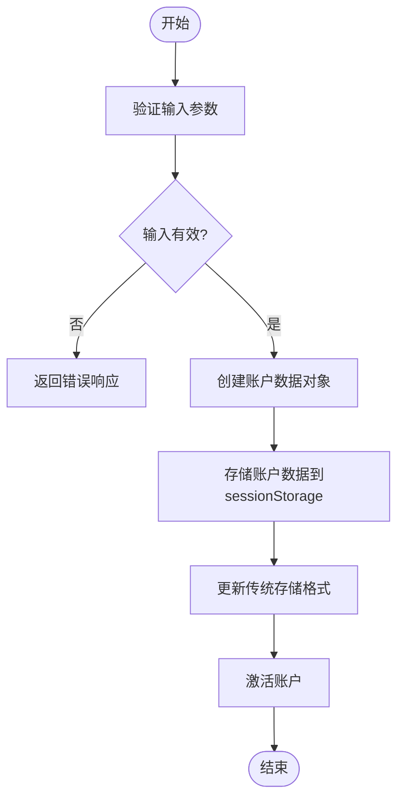
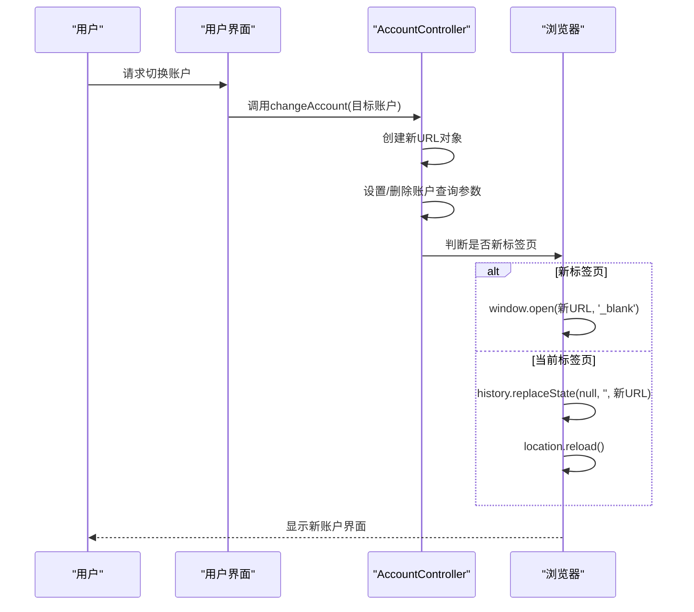
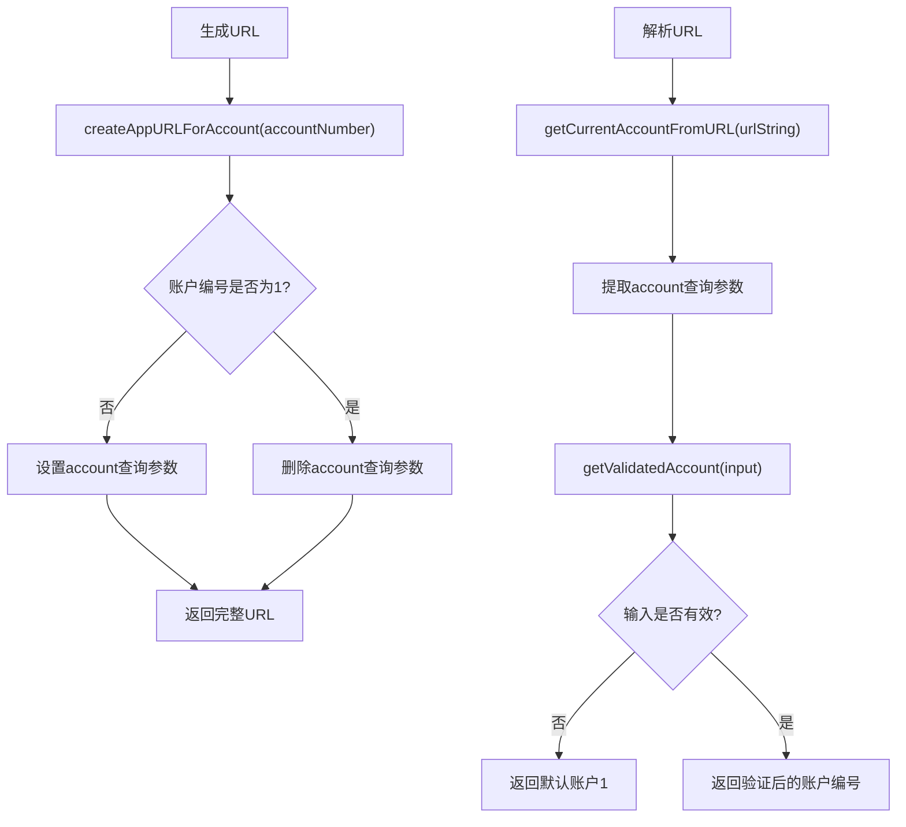
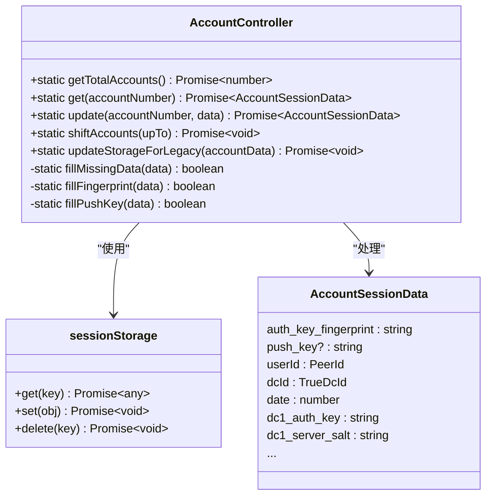
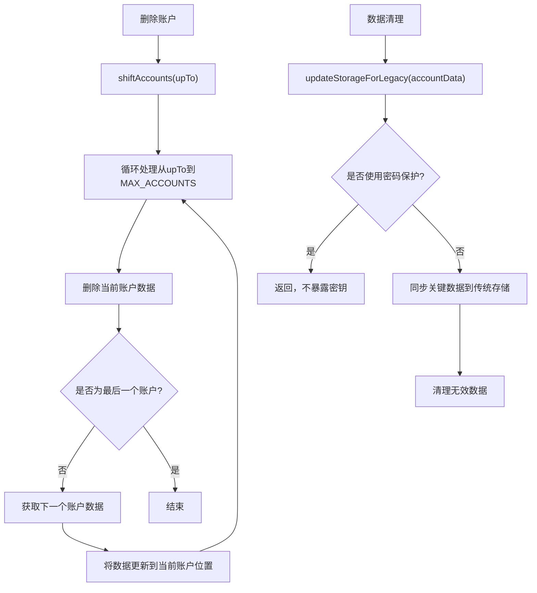
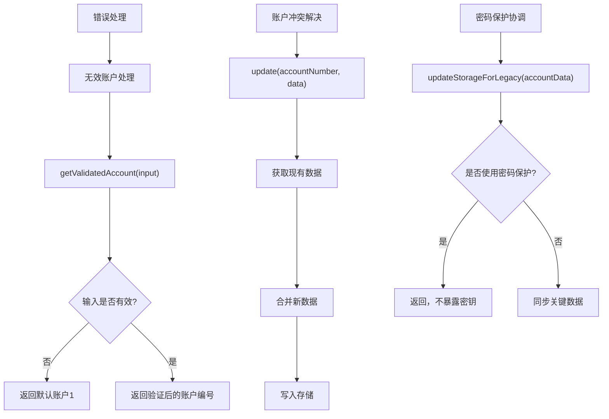

# 账户生命周期管理

<cite>
**本文档引用的文件**   
- [accountController.ts](file://src/lib/accounts/accountController.ts)
- [createAppURLForAccount.ts](file://src/lib/accounts/createAppURLForAccount.ts)
- [getCurrentAccount.ts](file://src/lib/accounts/getCurrentAccount.ts)
- [getCurrentAccountFromURL.ts](file://src/lib/accounts/getCurrentAccountFromURL.ts)
- [getValidatedAccount.ts](file://src/lib/accounts/getValidatedAccount.ts)
- [changeAccount.ts](file://src/lib/accounts/changeAccount.ts)
- [constants.ts](file://src/lib/accounts/constants.ts)
- [types.d.ts](file://src/lib/accounts/types.d.ts)
- [sessionStorage.ts](file://src/lib/sessionStorage.ts)
- [passcodeLockScreen.tsx](file://src/components/passcodeLock/passcodeLockScreen.tsx)
</cite>

## 目录
1. [简介](#简介)
2. [账户创建与激活](#账户创建与激活)
3. [账户切换机制](#账户切换机制)
4. [账户URL生成与解析](#账户url生成与解析)
5. [账户状态持久化与恢复](#账户状态持久化与恢复)
6. [账户删除与数据清理](#账户删除与数据清理)
7. [错误处理机制](#错误处理机制)
8. [结论](#结论)

## 简介
账户生命周期管理是本系统的核心功能之一，负责管理用户账户的创建、激活、切换和删除等完整流程。该系统通过AccountController类实现账户状态管理，支持多账户环境下的无缝切换。账户数据通过sessionStorage进行持久化存储，并通过URL参数实现账户状态的解析和传递。系统还实现了完善的错误处理机制，确保账户操作的稳定性和安全性。

## 账户创建与激活
账户创建过程始于用户首次登录系统。当用户成功通过身份验证后，系统会创建一个新的账户数据对象并存储在sessionStorage中。AccountController类的`update`方法负责将账户数据写入存储，同时确保数据的完整性和一致性。

账户激活是通过URL参数实现的。系统使用`CURRENT_ACCOUNT_QUERY_PARAM`常量定义的"account"查询参数来指定当前激活的账户。当用户访问带有特定账户参数的URL时，系统会自动激活对应的账户。对于主账户（账户1），系统会删除查询参数以保持URL简洁。

**Diagram sources**
- [accountController.ts](file://src/lib/accounts/accountController.ts#L72-L97)
- [constants.ts](file://src/lib/accounts/constants.ts#L1)

**Section sources**
- [accountController.ts](file://src/lib/accounts/accountController.ts#L15-L97)
- [constants.ts](file://src/lib/accounts/constants.ts#L1)

## 账户切换机制
账户切换是通过`changeAccount`函数实现的，该函数接受目标账户编号作为参数，并可选择在新标签页中打开。切换过程包括更新URL参数、修改浏览器历史记录和重新加载页面以激活新账户。

当用户请求切换账户时，系统会创建一个新的URL对象，根据目标账户编号设置或删除`CURRENT_ACCOUNT_QUERY_PARAM`查询参数。如果请求在新标签页中打开，系统会使用`window.open`方法；否则，会使用`history.replaceState`方法更新当前页面的URL，并调用`location.reload()`重新加载页面以完成账户切换。

**Diagram sources**
- [changeAccount.ts](file://src/lib/accounts/changeAccount.ts#L6-L20)
- [accountController.ts](file://src/lib/accounts/accountController.ts#L15)

**Section sources**
- [changeAccount.ts](file://src/lib/accounts/changeAccount.ts#L1-L21)
- [accountController.ts](file://src/lib/accounts/accountController.ts#L15)

## 账户URL生成与解析
账户URL的生成和解析是账户管理系统的关键功能。系统通过`createAppURLForAccount`函数生成包含账户信息的URL，该函数接受目标账户编号、哈希参数和是否保留哈希的标志作为参数。

URL解析过程由`getCurrentAccountFromURL`函数实现，该函数从URL的查询参数中提取账户编号，并通过`getValidatedAccount`函数进行验证和标准化。验证过程确保账户编号在有效范围内（1-4），无效的输入将默认返回主账户（账户1）。

**Diagram sources**
- [createAppURLForAccount.ts](file://src/lib/accounts/createAppURLForAccount.ts#L4-L28)
- [getCurrentAccountFromURL.ts](file://src/lib/accounts/getCurrentAccountFromURL.ts#L4-L7)
- [getValidatedAccount.ts](file://src/lib/accounts/getValidatedAccount.ts#L3-L6)

**Section sources**
- [createAppURLForAccount.ts](file://src/lib/accounts/createAppURLForAccount.ts#L1-L29)
- [getCurrentAccountFromURL.ts](file://src/lib/accounts/getCurrentAccountFromURL.ts#L1-L8)
- [getValidatedAccount.ts](file://src/lib/accounts/getValidatedAccount.ts#L1-L7)

## 账户状态持久化与恢复
账户状态的持久化通过sessionStorage实现，每个账户的数据存储在独立的键中（如"account1"、"account2"等）。AccountController类提供了`get`和`update`方法来读取和写入账户数据，确保数据的一致性和完整性。

当读取账户数据时，系统会自动填充缺失的关键信息，如认证密钥指纹和推送密钥。`fillMissingData`方法协调`fillFingerprint`和`fillPushKey`两个子方法，确保账户数据的完整性。对于主账户（账户1），系统还会维护传统存储格式的兼容性，通过`updateStorageForLegacy`方法同步关键数据到全局存储位置。

**Diagram sources**
- [accountController.ts](file://src/lib/accounts/accountController.ts#L15-L154)
- [types.d.ts](file://src/lib/accounts/types.d.ts#L3-L17)
- [sessionStorage.ts](file://src/lib/sessionStorage.ts#L1)

**Section sources**
- [accountController.ts](file://src/lib/accounts/accountController.ts#L15-L154)
- [types.d.ts](file://src/lib/accounts/types.d.ts#L1-L17)

## 账户删除与数据清理
账户删除通过`shiftAccounts`方法实现，该方法支持从指定账户开始的批量删除。删除过程是原子性的，确保数据的一致性。当删除某个账户时，系统会将其后的所有账户向前移动一位，保持账户编号的连续性。

数据清理在多个场景下自动触发。当启用密码保护时，系统会调用`updateStorageForLegacy`方法清除传统存储格式中的敏感数据。账户切换时，系统会清理旧账户的缓存数据，确保新账户的纯净环境。此外，系统还实现了智能的存储管理，通过`getTotalAccounts`方法动态更新账户总数，保持存储状态的准确性。

**Diagram sources**
- [accountController.ts](file://src/lib/accounts/accountController.ts#L103-L111)
- [accountController.ts](file://src/lib/accounts/accountController.ts#L116-L149)

**Section sources**
- [accountController.ts](file://src/lib/accounts/accountController.ts#L103-L149)

## 错误处理机制
系统实现了多层次的错误处理机制，确保账户操作的稳定性和用户体验。对于无效账户处理，`getValidatedAccount`函数提供了输入验证和默认值回退，确保任何无效输入都会安全地返回主账户。

账户冲突解决主要通过原子性操作和数据验证实现。`update`方法在更新账户数据时会先获取现有数据，然后合并新数据，最后写入存储，避免了并发修改导致的数据冲突。`fillMissingData`方法确保账户数据的完整性，自动填充缺失的关键字段。

在密码保护场景下，系统通过`DeferredIsUsingPasscode`机制协调数据访问，确保在密码保护启用时不会暴露敏感的认证密钥。`updateStorageForLegacy`方法会检查密码保护状态，只有在未启用密码保护时才允许同步敏感数据。

**Diagram sources**
- [getValidatedAccount.ts](file://src/lib/accounts/getValidatedAccount.ts#L3-L6)
- [accountController.ts](file://src/lib/accounts/accountController.ts#L72-L97)
- [accountController.ts](file://src/lib/accounts/accountController.ts#L116-L149)

**Section sources**
- [getValidatedAccount.ts](file://src/lib/accounts/getValidatedAccount.ts#L1-L7)
- [accountController.ts](file://src/lib/accounts/accountController.ts#L72-L149)

## 结论
账户生命周期管理系统通过AccountController类提供了一套完整的账户管理解决方案。系统支持最多4个账户的创建、激活、切换和删除操作，通过URL参数实现账户状态的传递，利用sessionStorage进行数据持久化。账户切换时的数据加载和缓存清理机制确保了用户体验的流畅性。系统还实现了完善的错误处理和冲突解决机制，保证了账户操作的稳定性和安全性。整体设计考虑了向后兼容性，通过传统存储格式的同步机制确保了系统的平滑升级。