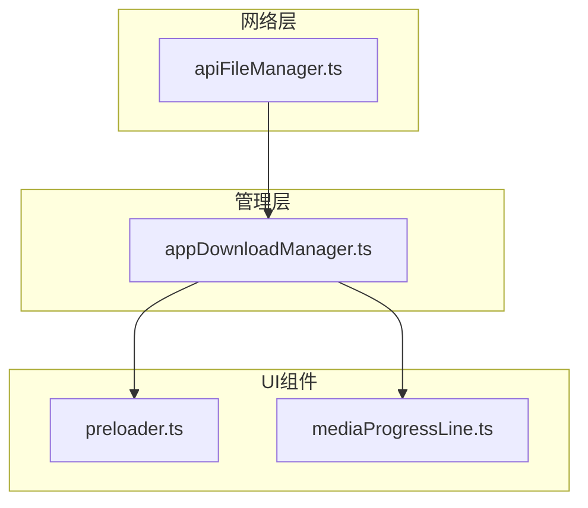
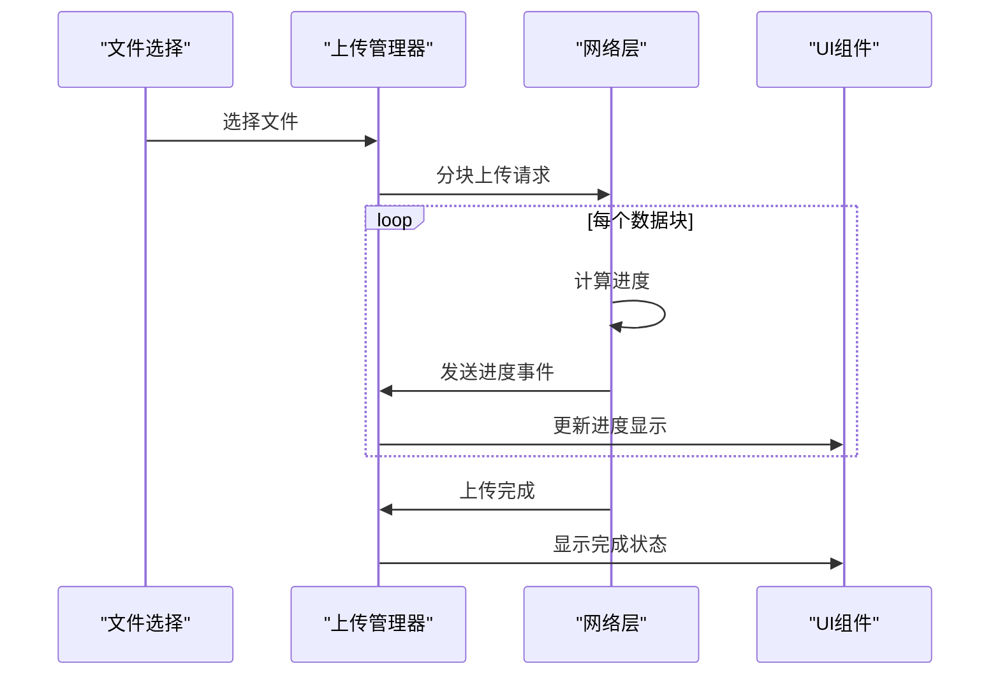
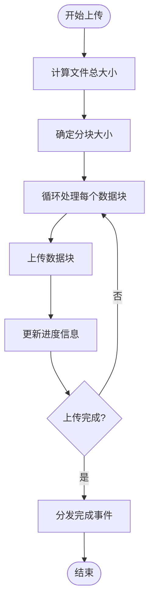
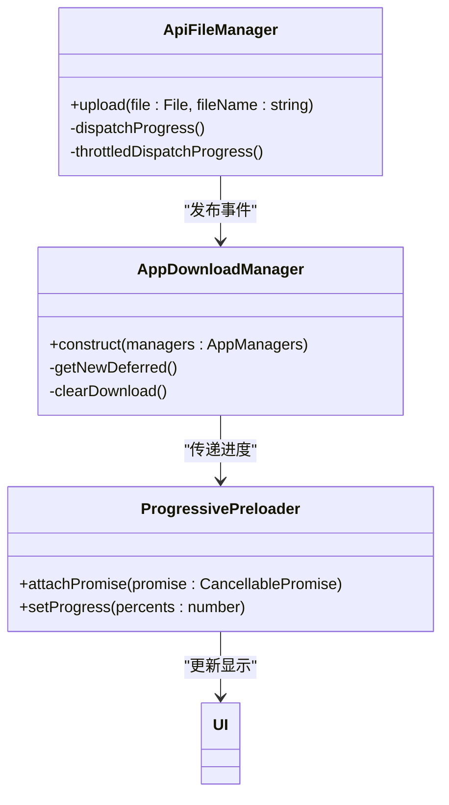
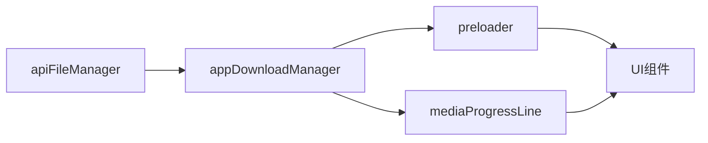

# 上传进度跟踪

<cite>
**本文档引用的文件**
- [apiFileManager.ts](file://src/lib/mtproto/apiFileManager.ts)
- [appDownloadManager.ts](file://src/lib/appManagers/appDownloadManager.ts)
- [preloader.ts](file://src/components/preloader.ts)
- [mediaProgressLine.ts](file://src/components/mediaProgressLine.ts)
- [cancellablePromise.ts](file://src/helpers/cancellablePromise.ts)
- [document.ts](file://src/components/wrappers/document.ts)
</cite>

## 目录
1. [简介](#简介)
2. [项目结构](#项目结构)
3. [核心组件](#核心组件)
4. [架构概述](#架构概述)
5. [详细组件分析](#详细组件分析)
6. [依赖分析](#依赖分析)
7. [性能考虑](#性能考虑)
8. [故障排除指南](#故障排除指南)
9. [结论](#结论)

## 简介
本文档详细说明了Telegram Web客户端中上传进度跟踪功能的实现机制。文档涵盖了进度信息的收集、事件传播、UI更新优化以及在不同网络条件下的处理策略。通过分析核心组件和数据流，为开发者提供了全面的理解和实现参考。

## 项目结构
项目结构显示了上传进度跟踪功能分布在多个模块中，主要涉及网络层、管理层和UI组件。核心功能位于`src/lib/mtproto`目录下的`apiFileManager.ts`文件中，负责处理底层文件上传和进度计算。UI相关的预加载器组件位于`src/components`目录下。

**Diagram sources**
- [apiFileManager.ts](file://src/lib/mtproto/apiFileManager.ts)
- [appDownloadManager.ts](file://src/lib/appManagers/appDownloadManager.ts)
- [preloader.ts](file://src/components/preloader.ts)
- [mediaProgressLine.ts](file://src/components/mediaProgressLine.ts)

**Section sources**
- [apiFileManager.ts](file://src/lib/mtproto/apiFileManager.ts)
- [appDownloadManager.ts](file://src/lib/appManagers/appDownloadManager.ts)
- [preloader.ts](file://src/components/preloader.ts)

## 核心组件
核心组件包括`ApiFileManager`类，负责处理文件上传的底层逻辑，以及`ProgressivePreloader`类，负责UI层面的进度显示。这些组件通过事件系统进行通信，确保进度信息能够实时更新。

**Section sources**
- [apiFileManager.ts](file://src/lib/mtproto/apiFileManager.ts#L1072-L1158)
- [preloader.ts](file://src/components/preloader.ts#L17-L320)

## 架构概述
系统架构采用分层设计，从底层网络请求到上层UI显示形成清晰的数据流。上传进度的计算和传播遵循特定的事件驱动模式，确保了系统的响应性和可维护性。

**Diagram sources**
- [apiFileManager.ts](file://src/lib/mtproto/apiFileManager.ts#L1072-L1158)
- [appDownloadManager.ts](file://src/lib/appManagers/appDownloadManager.ts#L53-L66)
- [preloader.ts](file://src/components/preloader.ts#L214-L224)

## 详细组件分析

### 进度收集机制分析
上传进度的收集机制基于分块上传策略，系统实时计算已上传字节数、总字节数和上传速度。进度信息通过事件系统进行传播。

#### 进度计算实现

**Diagram sources**
- [apiFileManager.ts](file://src/lib/mtproto/apiFileManager.ts#L1078-L1109)
- [appDownloadManager.ts](file://src/lib/appManagers/appDownloadManager.ts#L61-L65)

### 进度事件传播机制分析
进度事件的传播机制采用发布-订阅模式，确保进度信息能够从底层网络层有效传递到UI组件。

#### 事件传播流程

**Diagram sources**
- [apiFileManager.ts](file://src/lib/mtproto/apiFileManager.ts#L1131-L1134)
- [appDownloadManager.ts](file://src/lib/appManagers/appDownloadManager.ts#L53-L66)
- [preloader.ts](file://src/components/preloader.ts#L214-L224)

### UI更新优化策略分析
UI更新采用优化策略，包括进度平滑处理、速率预测和剩余时间估算，提升用户体验。

#### 进度平滑处理

**Diagram sources**
- [preloader.ts](file://src/components/preloader.ts#L302-L317)
- [cancellablePromise.ts](file://src/helpers/cancellablePromise.ts#L32-L36)

## 依赖分析
系统依赖关系清晰，各组件之间通过定义良好的接口进行交互，降低了耦合度。

**Diagram sources**
- [apiFileManager.ts](file://src/lib/mtproto/apiFileManager.ts)
- [appDownloadManager.ts](file://src/lib/appManagers/appDownloadManager.ts)
- [preloader.ts](file://src/components/preloader.ts)

**Section sources**
- [apiFileManager.ts](file://src/lib/mtproto/apiFileManager.ts)
- [appDownloadManager.ts](file://src/lib/appManagers/appDownloadManager.ts)
- [preloader.ts](file://src/components/preloader.ts)

## 性能考虑
系统在性能方面进行了多项优化，包括节流处理、异步操作和资源管理，确保在各种网络条件下都能提供流畅的用户体验。

## 故障排除指南
当遇到上传进度问题时，可以检查以下方面：
- 网络连接状态
- 文件大小限制
- 浏览器兼容性
- 事件监听器是否正确绑定

**Section sources**
- [apiFileManager.ts](file://src/lib/mtproto/apiFileManager.ts#L264-L273)
- [preloader.ts](file://src/components/preloader.ts#L197-L204)

## 结论
上传进度跟踪功能通过分层架构和事件驱动模式实现了高效、可靠的进度监控。系统设计考虑了性能优化和用户体验，为文件上传提供了完整的解决方案。