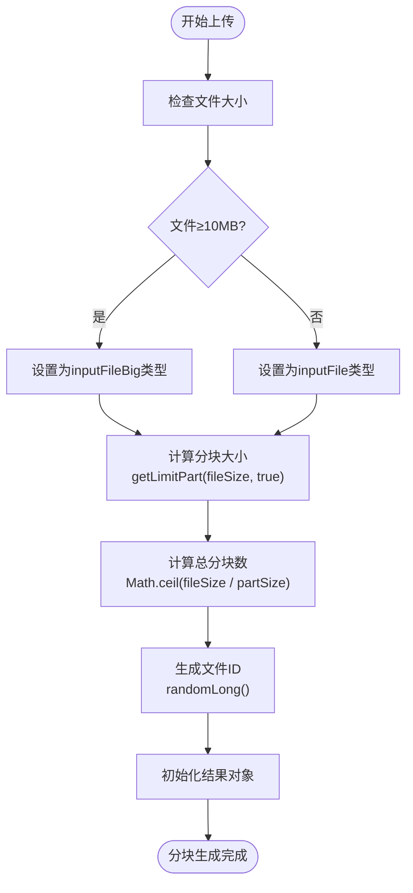
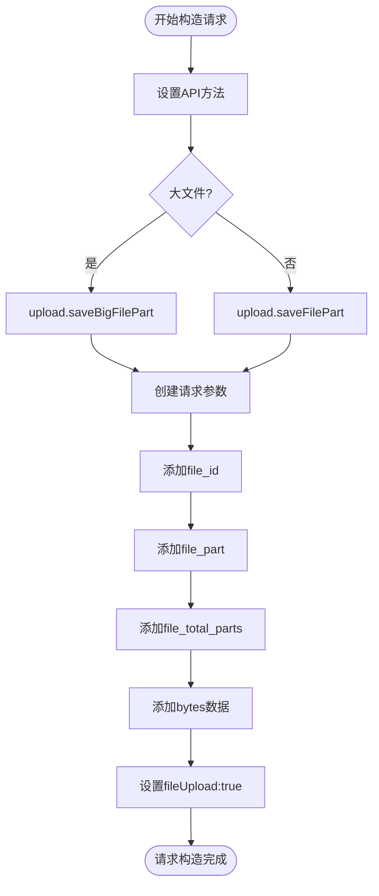
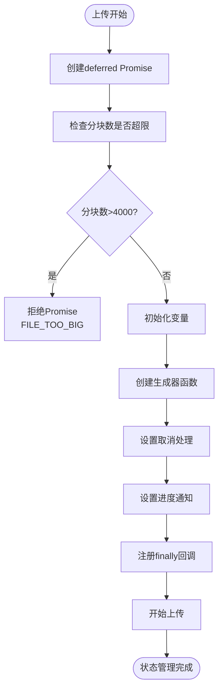

# 分块上传机制

<cite>
**本文档引用的文件**   
- [apiFileManager.ts](file://src/lib/mtproto/apiFileManager.ts)
- [mtproto_config.ts](file://src/lib/mtproto/mtproto_config.ts)
- [appDownloadManager.ts](file://src/lib/appManagers/appDownloadManager.ts)
- [readBlobAsArrayBuffer.ts](file://src/helpers/blob/readBlobAsArrayBuffer.ts)
</cite>

## 目录
1. [简介](#简介)
2. [分块策略](#分块策略)
3. [并发控制机制](#并发控制机制)
4. [分块校验机制](#分块校验机制)
5. [代码实现示例](#代码实现示例)
6. [分块重组策略](#分块重组策略)
7. [结论](#结论)

## 简介
分块上传机制是现代Web应用中处理大文件上传的核心技术。该机制通过将大文件分割成较小的数据块进行上传，有效解决了传统单次上传方式在处理大文件时可能出现的内存溢出、网络中断导致上传失败等问题。本文档详细阐述了分块上传机制的实现细节，包括分块策略、并发控制、校验机制和重组策略。

**Section sources**
- [apiFileManager.ts](file://src/lib/mtproto/apiFileManager.ts#L1-L100)

## 分块策略

### 分块大小确定原则
分块大小的确定遵循动态调整原则，主要考虑文件大小和系统配置。根据代码实现，分块大小的计算逻辑如下：

1. **基础参数**：
   - 最小分块大小（MIN_PART_SIZE）：64KB
   - 平均分块大小（AVG_PART_SIZE）：512KB
   - 最大上传分块大小（MAX_UPLOAD_FILE_PART_SIZE）：512KB

2. **动态调整算法**：
   - 对于大小为0的文件（如头像、网络文档），使用平均分块大小（512KB）
   - 对于其他文件，从最小分块大小开始，逐步倍增直到满足以下任一条件：
     - 分块数量不超过最大允许分块数
     - 分块大小达到最大分块大小限制

3. **文件类型区分**：
   - 大文件（≥10MB）使用`inputFileBig`类型
   - 小文件使用`inputFile`类型

这种策略确保了在不同文件大小下都能获得最优的上传性能，同时避免了分块过多导致的管理开销。

### 分块序号管理
分块序号从0开始递增，每个分块在上传时携带其序号信息。系统通过`_part`变量跟踪当前处理的分块序号，在循环中递增。分块序号与文件偏移量直接相关，偏移量等于分块序号乘以分块大小。

### 分块元数据维护
每个分块的元数据包括：
- `file_id`：文件唯一标识符
- `file_part`：分块序号
- `file_total_parts`：总分块数
- `bytes`：分块数据

这些元数据在上传请求中一并发送，确保服务器能够正确识别和处理每个分块。

**Section sources**
- [apiFileManager.ts](file://src/lib/mtproto/apiFileManager.ts#L461-L481)
- [apiFileManager.ts](file://src/lib/mtproto/apiFileManager.ts#L1077-L1079)

## 并发控制机制

### 并发上传限制
系统通过`downloadRequest`方法实现并发控制，主要机制包括：

1. **下载队列管理**：
   - 每个DC（数据中心）维护独立的下载队列（`downloadPulls`）
   - 队列中的请求按优先级排序处理

2. **活动请求数控制**：
   - 使用`downloadActives`对象跟踪每个DC的活动请求数
   - 设置下载限制（`downloadLimit`），根据用户是否为高级账户动态调整
   - 当活动请求数达到限制时，暂停新请求的处理

3. **优先级调度**：
   - 高优先级请求优先处理
   - 队列0的请求优先于当前队列的请求

### 资源消耗平衡
系统通过以下方式平衡性能和资源消耗：

1. **动态并发数**：
   - 普通用户：9 * 512KB / 64KB = 72个并发请求
   - 高级用户：56 * 512KB / 64KB = 448个并发请求

2. **错误处理**：
   - 忽略特定类型的错误（如取消下载、取消上传）
   - 错误发生时减少活动请求数并继续处理队列

3. **请求调度**：
   - 使用`insertInDescendSortedArray`方法确保高优先级请求优先处理
   - 通过`findAndSplice`方法实现队列间的优先级切换

这种并发控制机制既保证了上传性能，又避免了过度消耗系统资源。

**Section sources**
- [apiFileManager.ts](file://src/lib/mtproto/apiFileManager.ts#L239-L275)
- [apiFileManager.ts](file://src/lib/mtproto/apiFileManager.ts#L173-L175)

## 分块校验机制

### 客户端分块完整性检查
客户端在上传前进行完整性检查，确保分块数据的正确性：

1. **数据读取验证**：
   - 使用`readBlobAsArrayBuffer`方法读取分块数据
   - 通过`checkCancel`函数检查上传是否被取消

2. **分块边界检查**：
   - 确保分块偏移量和大小在文件范围内
   - 验证最后一个分块的大小是否正确

3. **进度跟踪**：
   - 实时更新上传进度
   - 通过`deferred.notify`方法通知进度变化

### 服务器端分块验证
服务器端通过以下机制验证分块的正确性：

1. **分块元数据验证**：
   - 验证`file_id`的有效性
   - 检查`file_part`序号的连续性
   - 验证`file_total_parts`的准确性

2. **数据完整性检查**：
   - 验证分块数据的完整性
   - 检查分块大小是否符合预期
   - 确保所有分块最终能正确拼接

3. **错误处理**：
   - 服务器返回错误时，客户端会进行重试
   - 特殊错误类型（如`FILE_REFERENCE_EXPIRED`）会触发引用刷新

这种双重校验机制确保了上传数据的完整性和可靠性。

**Section sources**
- [apiFileManager.ts](file://src/lib/mtproto/apiFileManager.ts#L1086-L1088)
- [apiFileManager.ts](file://src/lib/mtproto/apiFileManager.ts#L1104-L1107)

## 代码实现示例

### 分块生成
分块生成通过文件切片实现：

**Diagram sources**
- [apiFileManager.ts](file://src/lib/mtproto/apiFileManager.ts#L1041-L1053)

### 上传请求构造
上传请求的构造过程如下：

**Diagram sources**
- [apiFileManager.ts](file://src/lib/mtproto/apiFileManager.ts#L1092-L1098)

### 分块状态管理
分块状态管理通过Promise机制实现：

**Diagram sources**
- [apiFileManager.ts](file://src/lib/mtproto/apiFileManager.ts#L1055-L1058)
- [apiFileManager.ts](file://src/lib/mtproto/apiFileManager.ts#L1119-L1140)

## 分块重组策略

### 重组条件
分块重组在以下条件下触发：
1. 所有分块都已成功上传
2. 服务器确认所有分块接收完毕
3. 客户端收到完成通知

### 重组过程
重组过程如下：

1. **完成检测**：
   - 通过`doneParts`计数器跟踪已完成的分块数
   - 当`doneParts >= totalParts`时，认为所有分块上传完成

2. **结果解析**：
   - 解析服务器返回的结果
   - 验证重组后的文件完整性

3. **通知机制**：
   - 通过`deferred.resolve`方法解析主Promise
   - 触发`download_progress`事件通知上层应用

4. **资源清理**：
   - 从`uploadPromises`中删除已完成的上传任务
   - 释放相关资源

### 错误处理
重组过程中可能遇到的错误及处理方式：

1. **分块缺失**：
   - 服务器检测到分块序号不连续
   - 客户端重新上传缺失的分块

2. **数据损坏**：
   - 服务器验证分块数据完整性失败
   - 客户端重新上传损坏的分块

3. **超时**：
   - 上传过程超时
   - 客户端取消上传并清理资源

这种重组策略确保了文件的完整性和一致性，即使在网络不稳定的情况下也能可靠地完成文件上传。

**Section sources**
- [apiFileManager.ts](file://src/lib/mtproto/apiFileManager.ts#L1108-L1110)
- [apiFileManager.ts](file://src/lib/mtproto/apiFileManager.ts#L1137-L1139)

## 结论
分块上传机制通过科学的分块策略、有效的并发控制、严格的校验机制和可靠的重组策略，实现了大文件的高效、稳定上传。该机制不仅提高了上传成功率，还优化了资源利用，为用户提供流畅的文件上传体验。通过动态调整分块大小、智能管理并发请求和完善的错误处理，系统能够在各种网络条件下保持良好的性能表现。