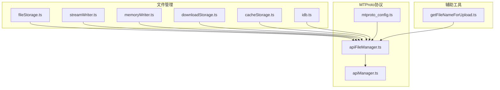
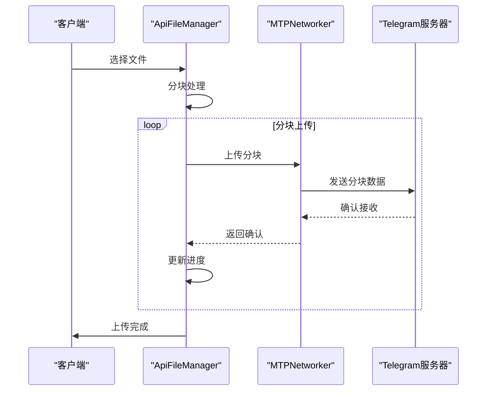
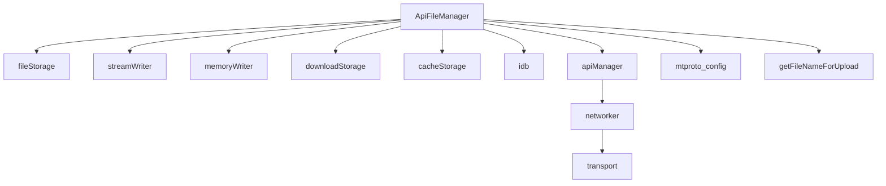

# 媒体上传

<cite>
**本文档中引用的文件**  
- [fileStorage.ts](file://src\lib\files\fileStorage.ts)
- [streamWriter.ts](file://src\lib\files\streamWriter.ts)
- [memoryWriter.ts](file://src\lib\files\memoryWriter.ts)
- [apiFileManager.ts](file://src\lib\mtproto\apiFileManager.ts)
- [apiManager.ts](file://src\lib\mtproto\apiManager.ts)
- [mtproto_config.ts](file://src\lib\mtproto\mtproto_config.ts)
- [getFileNameForUpload.ts](file://src\helpers\getFileNameForUpload.ts)
- [downloadStorage.ts](file://src\lib\files\downloadStorage.ts)
- [cacheStorage.ts](file://src\lib\files\cacheStorage.ts)
- [idb.ts](file://src\lib\files\idb.ts)
</cite>

## 目录
1. [介绍](#介绍)
2. [项目结构](#项目结构)
3. [核心组件](#核心组件)
4. [架构概述](#架构概述)
5. [详细组件分析](#详细组件分析)
6. [依赖分析](#依赖分析)
7. [性能考虑](#性能考虑)
8. [故障排除指南](#故障排除指南)
9. [结论](#结论)

## 介绍
本文档详细说明了基于MTProto协议的媒体上传功能实现，重点介绍文件分块上传机制、上传进度跟踪、并发控制以及断点续传功能。文档涵盖了从文件选择到最终确认的完整上传流程，包括网络中断处理、大文件优化策略和安全性考虑。通过分析代码库中的关键组件，展示了如何实现高效、可靠的媒体上传功能。

## 项目结构
项目结构显示了媒体上传功能分布在多个目录中，主要集中在`src/lib/files`和`src/lib/mtproto`目录下。这些组件协同工作，实现了完整的文件上传和下载功能。



**图示来源**
- [fileStorage.ts](file://src\lib\files\fileStorage.ts)
- [streamWriter.ts](file://src\lib\files\streamWriter.ts)
- [memoryWriter.ts](file://src\lib\files\memoryWriter.ts)
- [downloadStorage.ts](file://src\lib\files\downloadStorage.ts)
- [cacheStorage.ts](file://src\lib\files\cacheStorage.ts)
- [idb.ts](file://src\lib\files\idb.ts)
- [apiFileManager.ts](file://src\lib\mtproto\apiFileManager.ts)
- [apiManager.ts](file://src\lib\mtproto\apiManager.ts)
- [mtproto_config.ts](file://src\lib\mtproto\mtproto_config.ts)
- [getFileNameForUpload.ts](file://src\helpers\getFileNameForUpload.ts)

**章节来源**
- [fileStorage.ts](file://src\lib\files\fileStorage.ts)
- [streamWriter.ts](file://src\lib\files\streamWriter.ts)
- [memoryWriter.ts](file://src\lib\files\memoryWriter.ts)
- [downloadStorage.ts](file://src\lib\files\downloadStorage.ts)
- [cacheStorage.ts](file://src\lib\files\cacheStorage.ts)
- [idb.ts](file://src\lib\files\idb.ts)
- [apiFileManager.ts](file://src\lib\mtproto\apiFileManager.ts)
- [apiManager.ts](file://src\lib\mtproto\apiManager.ts)
- [mtproto_config.ts](file://src\lib\mtproto\mtproto_config.ts)
- [getFileNameForUpload.ts](file://src\helpers\getFileNameForUpload.ts)

## 核心组件
媒体上传功能的核心组件包括文件存储管理、流式写入器、内存写入器和API文件管理器。这些组件共同实现了分块上传、进度跟踪和断点续传功能。

**章节来源**
- [fileStorage.ts](file://src\lib\files\fileStorage.ts)
- [streamWriter.ts](file://src\lib\files\streamWriter.ts)
- [memoryWriter.ts](file://src\lib\files\memoryWriter.ts)
- [apiFileManager.ts](file://src\lib\mtproto\apiFileManager.ts)

## 架构概述
媒体上传功能的架构基于MTProto协议，采用分层设计，从文件选择到最终确认的完整流程。系统通过分块上传机制处理大文件，支持并发控制和进度跟踪。



**图示来源**
- [apiFileManager.ts](file://src\lib\mtproto\apiFileManager.ts)
- [apiManager.ts](file://src\lib\mtproto\apiManager.ts)

## 详细组件分析
### 文件存储管理分析
文件存储管理组件提供了抽象的文件存储接口，支持不同的存储后端实现。

```mermaid
classDiagram
class FileStorage {
+abstract getFile(fileName : string) : Promise~any~
+abstract prepareWriting(...args : any[]) : {deferred : CancellablePromise~any~, getWriter : () => StreamWriter}
}
class StreamWriter {
+abstract write(part : Uint8Array, offset? : number) : Promise~any~
+abstract truncate?() : void
+abstract trim?(size : number) : void
+abstract finalize(saveToStorage? : boolean) : Promise~Blob~ | Blob
+abstract getParts?() : Uint8Array
+abstract replaceParts?(parts : Uint8Array) : void
}
class MemoryWriter {
-bytes : Uint8Array
+constructor(mimeType : string, size : number, saveFileCallback? : (blob : Blob) => Promise~Blob~)
+write(part : Uint8Array, offset : number) : Promise~any~
+truncate() : void
+trim(size : number) : void
+finalize(saveToStorage : boolean) : Blob
+getParts() : Uint8Array
+replaceParts(parts : Uint8Array) : void
}
FileStorage <|-- MemoryWriter : "实现"
StreamWriter <|-- MemoryWriter : "实现"
```

**图示来源**
- [fileStorage.ts](file://src\lib\files\fileStorage.ts#L10-L14)
- [streamWriter.ts](file://src\lib\files\streamWriter.ts#L7-L15)
- [memoryWriter.ts](file://src\lib\files\memoryWriter.ts#L10-L59)

**章节来源**
- [fileStorage.ts](file://src\lib\files\fileStorage.ts)
- [streamWriter.ts](file://src\lib\files\streamWriter.ts)
- [memoryWriter.ts](file://src\lib\files\memoryWriter.ts)

### API文件管理器分析
API文件管理器组件负责处理文件上传和下载的核心逻辑，包括分块大小策略、并发控制和错误恢复。


**图示来源**
- [apiFileManager.ts](file://src\lib\mtproto\apiFileManager.ts)

**章节来源**
- [apiFileManager.ts](file://src\lib\mtproto\apiFileManager.ts)

## 依赖分析
媒体上传功能依赖于多个核心组件，包括文件存储、流式写入、网络通信和MTProto协议处理。



**图示来源**
- [apiFileManager.ts](file://src\lib\mtproto\apiFileManager.ts)
- [fileStorage.ts](file://src\lib\files\fileStorage.ts)
- [streamWriter.ts](file://src\lib\files\streamWriter.ts)
- [memoryWriter.ts](file://src\lib\files\memoryWriter.ts)
- [downloadStorage.ts](file://src\lib\files\downloadStorage.ts)
- [cacheStorage.ts](file://src\lib\files\cacheStorage.ts)
- [idb.ts](file://src\lib\files\idb.ts)
- [apiManager.ts](file://src\lib\mtproto\apiManager.ts)
- [mtproto_config.ts](file://src\lib\mtproto\mtproto_config.ts)
- [getFileNameForUpload.ts](file://src\helpers\getFileNameForUpload.ts)

**章节来源**
- [apiFileManager.ts](file://src\lib\mtproto\apiFileManager.ts)
- [fileStorage.ts](file://src\lib\files\fileStorage.ts)
- [streamWriter.ts](file://src\lib\files\streamWriter.ts)
- [memoryWriter.ts](file://src\lib\files\memoryWriter.ts)
- [downloadStorage.ts](file://src\lib\files\downloadStorage.ts)
- [cacheStorage.ts](file://src\lib\files\cacheStorage.ts)
- [idb.ts](file://src\lib\files\idb.ts)
- [apiManager.ts](file://src\lib\mtproto\apiManager.ts)
- [mtproto_config.ts](file://src\lib\mtproto\mtproto_config.ts)
- [getFileNameForUpload.ts](file://src\helpers\getFileNameForUpload.ts)

## 性能考虑
媒体上传功能在设计时考虑了多种性能优化策略，包括分块大小自适应、并发控制和内存管理。

**章节来源**
- [apiFileManager.ts](file://src\lib\mtproto\apiFileManager.ts)
- [memoryWriter.ts](file://src\lib\files\memoryWriter.ts)

## 故障排除指南
当上传过程中出现网络中断或错误时，系统会自动处理并尝试恢复上传。

**章节来源**
- [apiFileManager.ts](file://src\lib\mtproto\apiFileManager.ts)
- [apiManager.ts](file://src\lib\mtproto\apiManager.ts)

## 结论
本文档详细介绍了基于MTProto协议的媒体上传功能实现。通过分析核心组件和架构设计，展示了如何实现高效、可靠的文件上传功能，包括分块上传、进度跟踪、并发控制和断点续传等关键特性。