# 错误恢复与断点续传

<cite>
**本文档引用的文件**   
- [apiFileManager.ts](file://src/lib/mtproto/apiFileManager.ts)
- [networker.ts](file://src/lib/mtproto/networker.ts)
- [appDownloadManager.ts](file://src/lib/appManagers/appDownloadManager.ts)
- [downloadStorage.ts](file://src/lib/files/downloadStorage.ts)
- [fileStorage.ts](file://src/lib/files/fileStorage.ts)
- [makeError.ts](file://src/helpers/makeError.ts)
- [timeout.ts](file://src/lib/serviceWorker/timeout.ts)
- [connectionStatus.ts](file://src/components/connectionStatus.ts)
- [rtmp.ts](file://src/lib/serviceWorker/rtmp.ts)
</cite>

## 目录
1. [引言](#引言)
2. [网络中断检测机制](#网络中断检测机制)
3. [断点信息持久化策略](#断点信息持久化策略)
4. [错误恢复流程](#错误恢复流程)
5. [错误场景处理策略](#错误场景处理策略)
6. [代码实现示例](#代码实现示例)
7. [结论](#结论)

## 引言
本文档详细阐述了文件上传过程中的错误恢复与断点续传功能的实现机制。系统通过先进的网络状态监控、智能的错误分类和可靠的断点信息存储，确保了在各种网络环境下文件传输的可靠性和用户体验。文档将深入分析网络中断检测、断点信息持久化、错误恢复流程以及不同错误场景的处理策略。

## 网络中断检测机制

系统实现了多层次的网络中断检测机制，确保能够及时识别连接问题并采取相应措施。

### 超时判断
系统通过`ping_delay_disconnect`机制实现超时判断。当发送ping请求后，在指定的超时时间内未收到响应，系统将判定连接已中断并关闭连接。

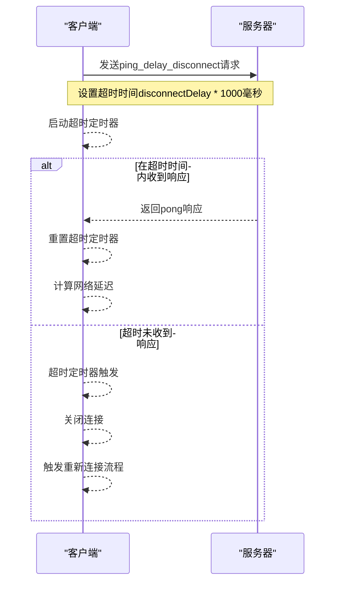

**Diagram sources**
- [networker.ts](file://src/lib/mtproto/networker.ts#L613-L671)

### 连接丢失识别
系统通过`checkConnection`方法持续监控连接状态。当检测到连接问题时，会启动重试机制，并逐步增加重试间隔。

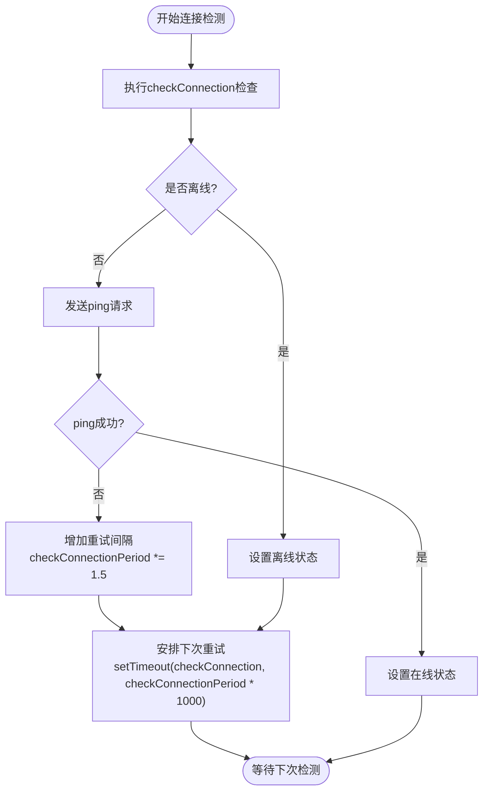

**Diagram sources**
- [networker.ts](file://src/lib/mtproto/networker.ts#L774-L783)

### 错误类型分类
系统对错误进行了详细的分类，以便采取不同的处理策略。主要错误类型包括：

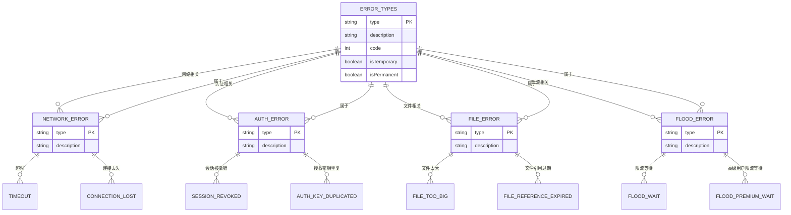

**Diagram sources**
- [makeError.ts](file://src/helpers/makeError.ts#L1-L9)
- [networker.ts](file://src/lib/mtproto/networker.ts#L1680-L1689)

**Section sources**
- [makeError.ts](file://src/helpers/makeError.ts#L1-L9)
- [networker.ts](file://src/lib/mtproto/networker.ts#L613-L783)

## 断点信息持久化策略

系统通过安全的存储机制来持久化已成功上传的分块信息，确保在中断后能够准确恢复上传。

### 存储机制
系统使用`FileStorage`抽象类定义了文件存储接口，并通过具体的实现类来处理不同类型的存储需求。

```mermaid
classDiagram
class FileStorage {
<<abstract>>
+getFile(fileName : string) : Promise~any~
+prepareWriting(...args : any[]) : {deferred : CancellablePromise~any~, getWriter : () => StreamWriter}
}
class CacheStorageController {
-cache : Map~string, any~
+getFile(fileName : string) : Promise~any~
+prepareWriting(fileName : string, size : number, mimeType : MTMimeType) : {deferred : CancellablePromise~any~, getWriter : () => StreamWriter}
+delete(fileName : string) : Promise~void~
}
class DownloadStorage {
+getFile(fileName : string) : Promise~any~
+prepareWriting(options : {fileName : string, downloadId : string, size : number}) : {deferred : CancellablePromise~void~, getWriter : () => DownloadWriter}
}
class StreamWriter {
+write(bytes : Uint8Array, offset : number) : Promise~void~
+truncate() : void
}
class DownloadWriter {
+write(bytes : Uint8Array, offset : number) : Promise~void~
}
FileStorage <|-- CacheStorageController : "实现"
FileStorage <|-- DownloadStorage : "实现"
StreamWriter <|-- DownloadWriter : "继承"
```

**Diagram sources**
- [fileStorage.ts](file://src/lib/files/fileStorage.ts#L10-L13)
- [downloadStorage.ts](file://src/lib/files/downloadStorage.ts#L14-L57)
- [apiFileManager.ts](file://src/lib/mtproto/apiFileManager.ts#L106-L107)

### 断点信息存储
在文件上传过程中，系统会为每个文件创建一个`deferred`对象来跟踪上传进度，并将相关信息存储在内存中。

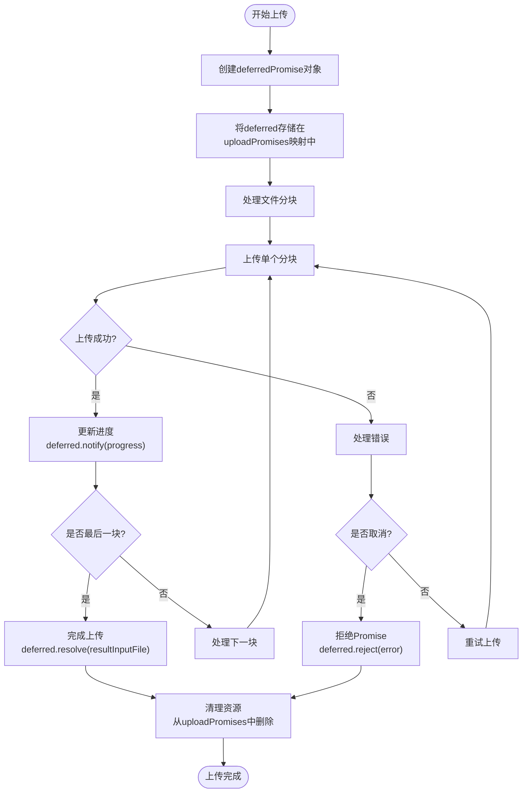

**Diagram sources**
- [apiFileManager.ts](file://src/lib/mtproto/apiFileManager.ts#L1038-L1158)

**Section sources**
- [fileStorage.ts](file://src/lib/files/fileStorage.ts#L10-L13)
- [downloadStorage.ts](file://src/lib/files/downloadStorage.ts#L14-L57)
- [apiFileManager.ts](file://src/lib/mtproto/apiFileManager.ts#L106-L1158)

## 错误恢复流程

系统实现了完整的错误恢复流程，从检测中断到重新建立连接并继续上传。

### 恢复流程概述
当检测到网络中断或上传错误时，系统会按照以下流程进行恢复：

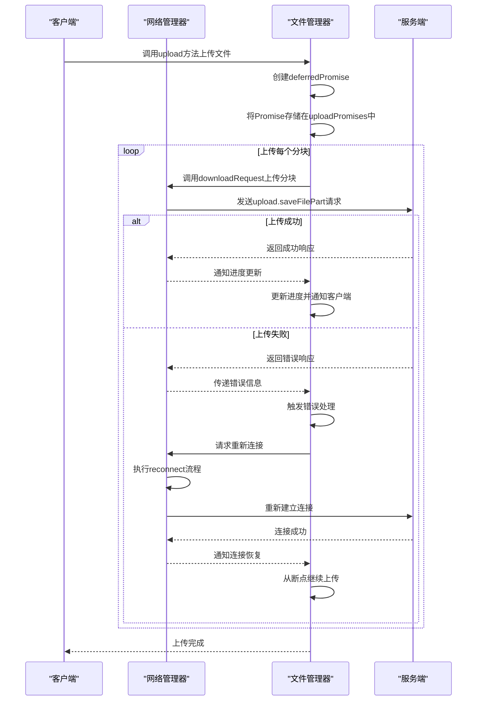

**Diagram sources**
- [apiFileManager.ts](file://src/lib/mtproto/apiFileManager.ts#L1038-L1158)
- [networker.ts](file://src/lib/mtproto/networker.ts#L1692-L1707)

### 重新连接机制
当连接中断时，系统会自动尝试重新连接，并在恢复后继续上传任务。

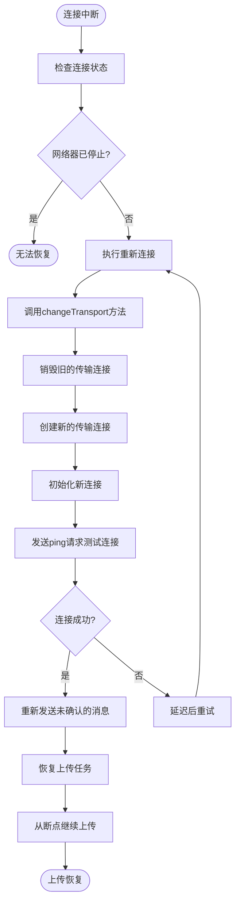

**Diagram sources**
- [networker.ts](file://src/lib/mtproto/networker.ts#L456-L521)

**Section sources**
- [apiFileManager.ts](file://src/lib/mtproto/apiFileManager.ts#L1038-L1158)
- [networker.ts](file://src/lib/mtproto/networker.ts#L456-L521)

## 错误场景处理策略

系统针对不同类型的错误场景采用了不同的处理策略，以确保最佳的用户体验。

### 临时性错误自动重试
对于临时性错误，系统会自动进行重试，无需用户干预。

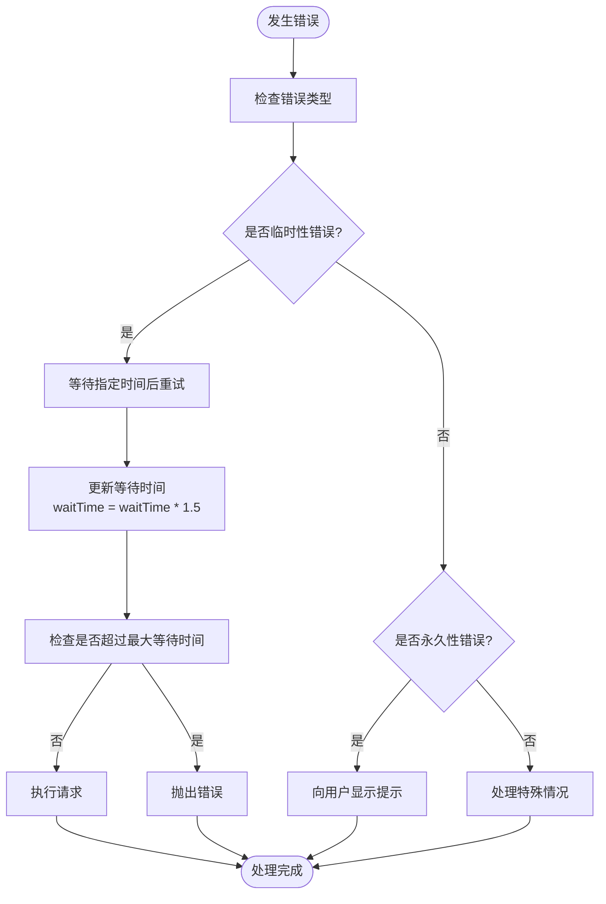

**Diagram sources**
- [apiManager.ts](file://src/lib/mtproto/apiManager.ts#L762-L768)

### 永久性错误用户提示
对于永久性错误，系统会向用户显示适当的提示信息。

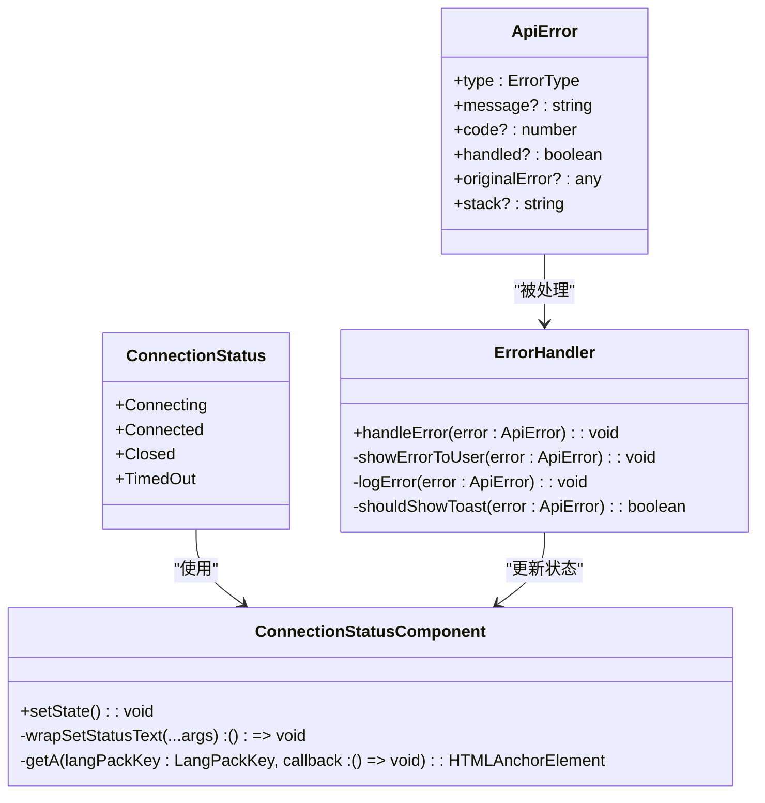

**Diagram sources**
- [apiManager.ts](file://src/lib/mtproto/apiManager.ts#L627-L663)
- [connectionStatus.ts](file://src/components/connectionStatus.ts#L154-L196)

### 特殊错误处理
系统还处理了一些特殊的错误情况，如文件引用过期等。

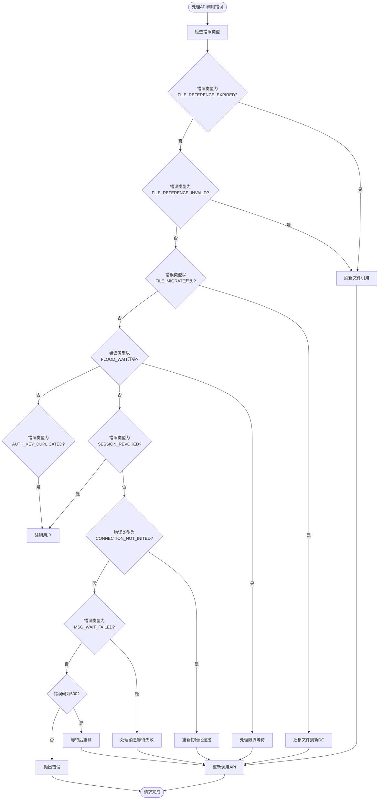

**Diagram sources**
- [apiManager.ts](file://src/lib/mtproto/apiManager.ts#L688-L776)

**Section sources**
- [apiManager.ts](file://src/lib/mtproto/apiManager.ts#L627-L776)
- [connectionStatus.ts](file://src/components/connectionStatus.ts#L154-L196)

## 代码实现示例

以下代码示例展示了错误处理逻辑、重试机制和状态恢复的实现细节。

### 上传方法实现
`upload`方法是文件上传的核心实现，包含了错误处理和进度通知机制。

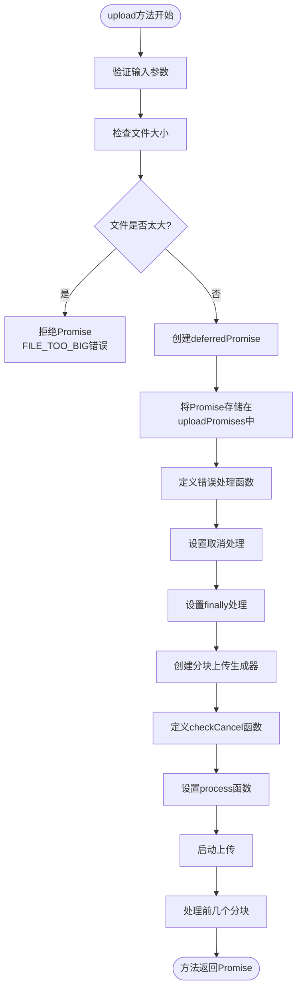

**Diagram sources**
- [apiFileManager.ts](file://src/lib/mtproto/apiFileManager.ts#L1038-L1158)

### 错误处理实现
错误处理机制确保了在发生错误时能够正确地通知和清理资源。

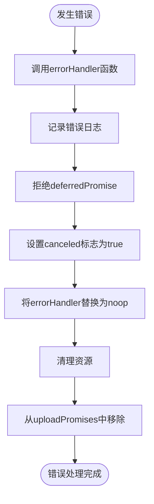

**Diagram sources**
- [apiFileManager.ts](file://src/lib/mtproto/apiFileManager.ts#L1062-L1070)

### 状态恢复实现
状态恢复机制确保了在中断后能够从断点继续上传。

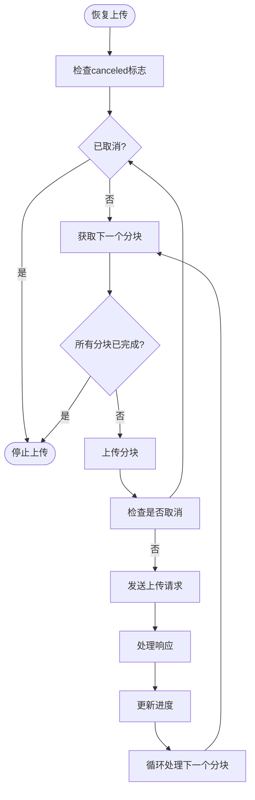

**Diagram sources**
- [apiFileManager.ts](file://src/lib/mtproto/apiFileManager.ts#L1144-L1155)

**Section sources**
- [apiFileManager.ts](file://src/lib/mtproto/apiFileManager.ts#L1038-L1158)

## 结论
本文档详细介绍了文件上传过程中的错误恢复与断点续传功能的实现。系统通过多层次的网络中断检测、安全的断点信息持久化、完整的错误恢复流程以及针对不同错误场景的处理策略，确保了文件传输的可靠性和用户体验。核心机制包括：

1. **网络中断检测**：通过ping机制和连接状态监控，及时识别网络问题。
2. **断点信息存储**：使用内存映射存储上传进度，确保断点信息的安全。
3. **错误恢复流程**：自动重新连接并从断点继续上传，最小化用户干预。
4. **智能错误处理**：根据错误类型采取不同的处理策略，包括自动重试和用户提示。

这些机制共同作用，使得文件上传功能在各种网络条件下都能保持高可靠性和良好的用户体验。