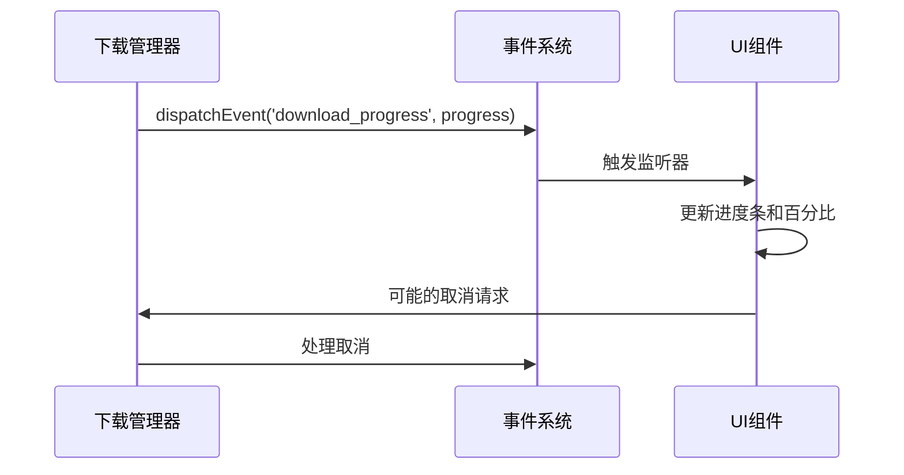
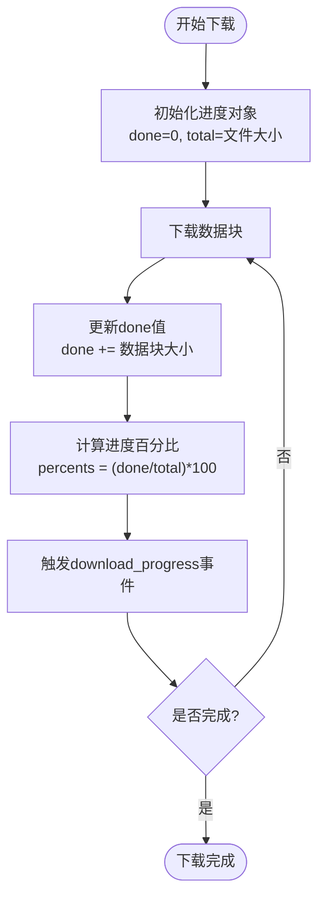
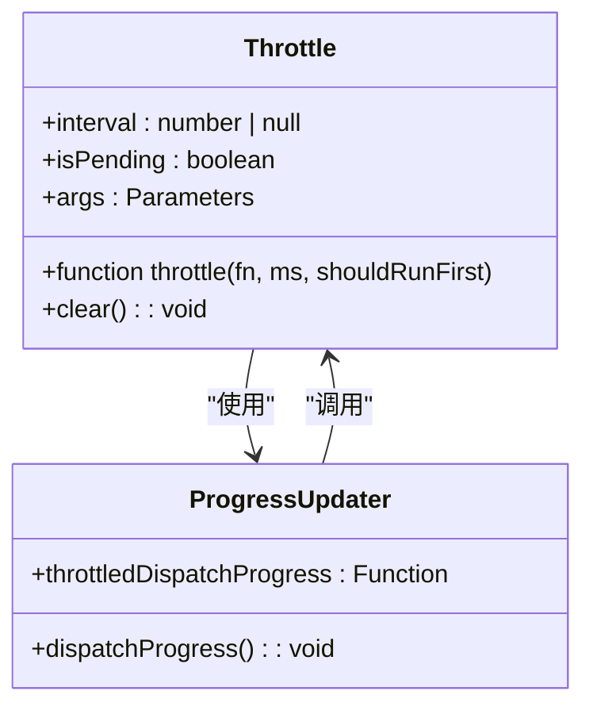
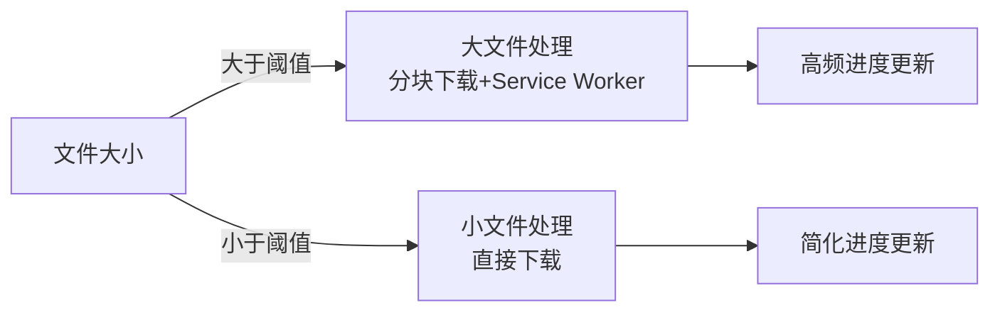
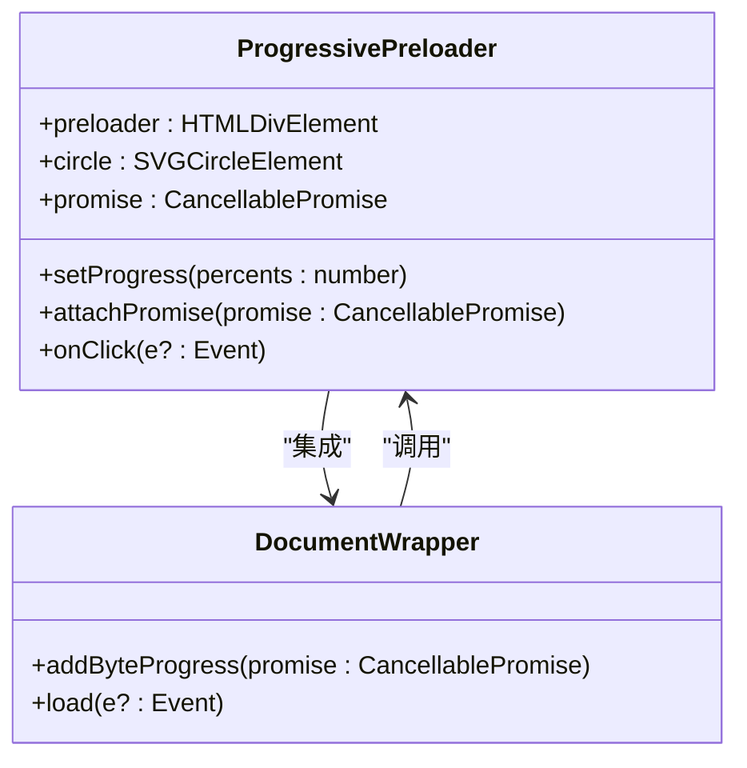
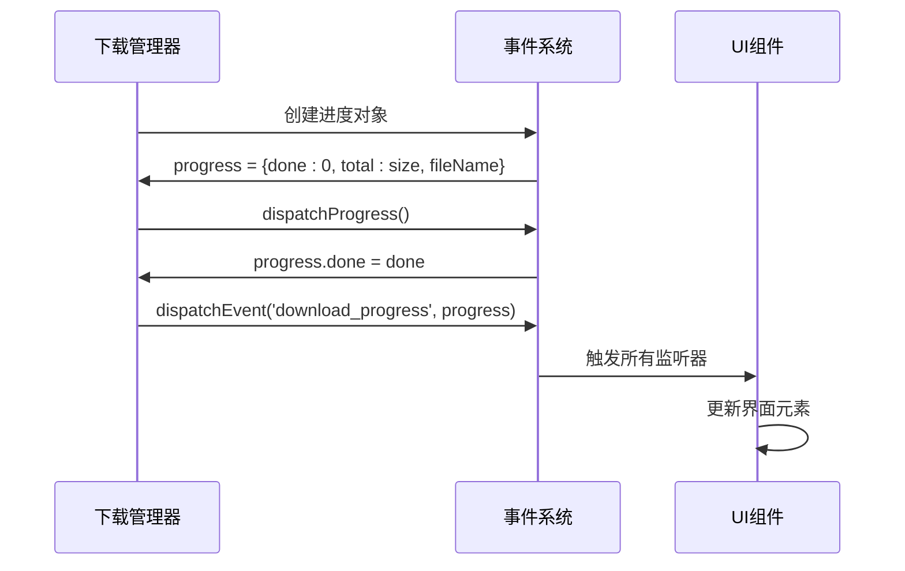

# 下载进度跟踪

<cite>
**本文档引用的文件**
- [appDownloadManager.ts](file://src/lib/appManagers/appDownloadManager.ts)
- [apiFileManager.ts](file://src/lib/mtproto/apiFileManager.ts)
- [preloader.ts](file://src/components/preloader.ts)
- [document.ts](file://src/components/wrappers/document.ts)
- [cancellablePromise.ts](file://src/helpers/cancellablePromise.ts)
- [throttle.ts](file://src/helpers/schedulers/throttle.ts)
</cite>

## 目录
1. [简介](#简介)
2. [事件系统与进度更新机制](#事件系统与进度更新机制)
3. [进度计算算法](#进度计算算法)
4. [UI更新频率控制](#ui更新频率控制)
5. [大文件与小文件的不同策略](#大文件与小文件的不同策略)
6. [用户界面集成](#用户界面集成)
7. [代码示例](#代码示例)

## 简介
本文档详细说明了Telegram Web客户端中下载进度跟踪机制的实现。该机制通过事件系统实时更新下载进度，精确计算进度百分比，并智能控制UI更新频率。系统能够根据文件大小采用不同的更新策略，并与用户界面无缝集成，提供进度条、百分比显示和预计剩余时间等信息。

**Section sources**
- [appDownloadManager.ts](file://src/lib/appManagers/appDownloadManager.ts#L1-L400)

## 事件系统与进度更新机制
下载进度跟踪机制基于事件驱动架构，通过`rootScope.dispatchEvent`和`addEventListener`实现进度信息的广播和监听。当下载进行时，系统会定期触发`download_progress`事件，携带进度详情。

核心事件流程如下：
1. 下载管理器在下载过程中创建进度对象
2. 通过`dispatchEvent`广播进度更新
3. UI组件通过`addEventListener`监听进度事件
4. 进度监听器更新界面元素

**Diagram sources**
- [appDownloadManager.ts](file://src/lib/appManagers/appDownloadManager.ts#L53-L66)
- [apiFileManager.ts](file://src/lib/mtproto/apiFileManager.ts#L861-L862)

**Section sources**
- [appDownloadManager.ts](file://src/lib/appManagers/appDownloadManager.ts#L53-L66)
- [apiFileManager.ts](file://src/lib/mtproto/apiFileManager.ts#L856-L862)

## 进度计算算法
进度计算基于已下载字节数与总文件大小的比例。系统维护一个`Progress`接口，包含`done`（已完成字节数）、`total`（总字节数）和`fileName`（文件名）等属性。

核心计算逻辑：
- 进度百分比 = (done / total) × 100
- 实时更新`done`值，反映实际下载量
- 处理边界情况，如文件大小未知时的动态调整

**Diagram sources**
- [apiFileManager.ts](file://src/lib/mtproto/apiFileManager.ts#L867-L907)
- [preloader.ts](file://src/components/preloader.ts#L222-L223)

**Section sources**
- [apiFileManager.ts](file://src/lib/mtproto/apiFileManager.ts#L856-L907)

## UI更新频率控制
为避免频繁的UI重绘影响性能，系统采用节流（throttle）机制控制进度更新频率。通过`throttle`函数将高频的进度事件限制在可接受的更新间隔内。

关键控制参数：
- 更新间隔：50毫秒
- 节流函数：`throttle(dispatchProgress, 50, true)`
- 平衡实时性与性能消耗

**Diagram sources**
- [apiFileManager.ts](file://src/lib/mtproto/apiFileManager.ts#L865-L866)
- [throttle.ts](file://src/helpers/schedulers/throttle.ts#L1-L46)

**Section sources**
- [apiFileManager.ts](file://src/lib/mtproto/apiFileManager.ts#L864-L866)
- [throttle.ts](file://src/helpers/schedulers/throttle.ts#L1-L46)

## 大文件与小文件的不同策略
系统根据文件大小采用不同的进度更新策略，优化用户体验和性能表现。

### 大文件策略
- 采用分块下载，每块大小动态计算
- 使用服务工作线程（Service Worker）进行后台下载
- 进度更新更频繁，提供更精确的反馈

### 小文件策略
- 直接下载，无需分块
- 简化进度跟踪，减少开销
- 快速完成，提供即时反馈

**Diagram sources**
- [appDownloadManager.ts](file://src/lib/appManagers/appDownloadManager.ts#L247-L275)
- [apiFileManager.ts](file://src/lib/mtproto/apiFileManager.ts#L735-L737)

**Section sources**
- [appDownloadManager.ts](file://src/lib/appManagers/appDownloadManager.ts#L247-L275)

## 用户界面集成
下载进度与用户界面深度集成，通过`ProgressivePreloader`组件实现视觉反馈。该组件提供圆形进度条、取消按钮和重试功能。

集成要点：
- 进度条：SVG圆形路径的`strokeDasharray`属性控制
- 百分比显示：实时更新文本内容
- 预计剩余时间：基于下载速度计算
- 交互功能：点击取消或重试

**Diagram sources**
- [preloader.ts](file://src/components/preloader.ts#L17-L319)
- [document.ts](file://src/components/wrappers/document.ts#L285-L311)

**Section sources**
- [preloader.ts](file://src/components/preloader.ts#L17-L319)
- [document.ts](file://src/components/wrappers/document.ts#L285-L311)

## 代码示例
以下代码示例展示了进度事件的触发和监听实现：

**Diagram sources**
- [apiFileManager.ts](file://src/lib/mtproto/apiFileManager.ts#L856-L862)
- [appDownloadManager.ts](file://src/lib/appManagers/appDownloadManager.ts#L61-L65)

**Section sources**
- [apiFileManager.ts](file://src/lib/mtproto/apiFileManager.ts#L856-L862)
- [appDownloadManager.ts](file://src/lib/appManagers/appDownloadManager.ts#L61-L65)