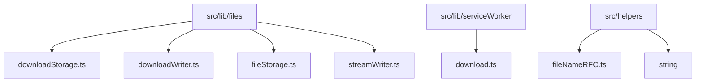
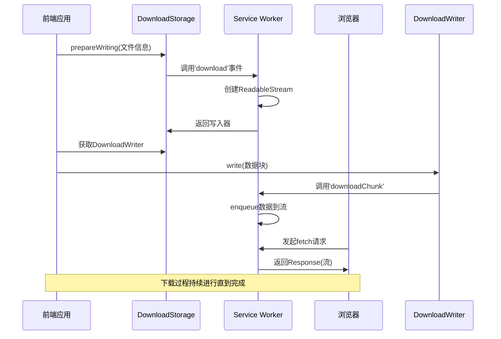
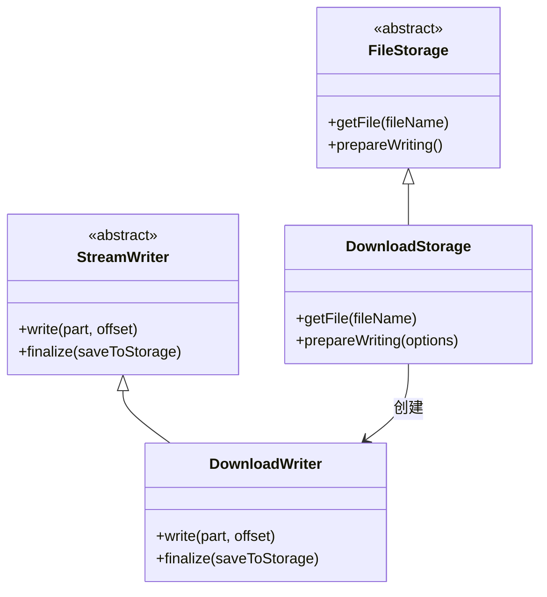
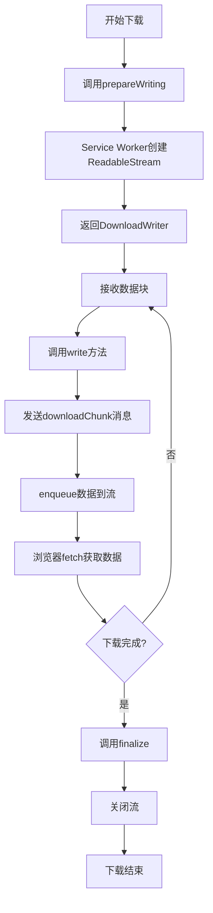
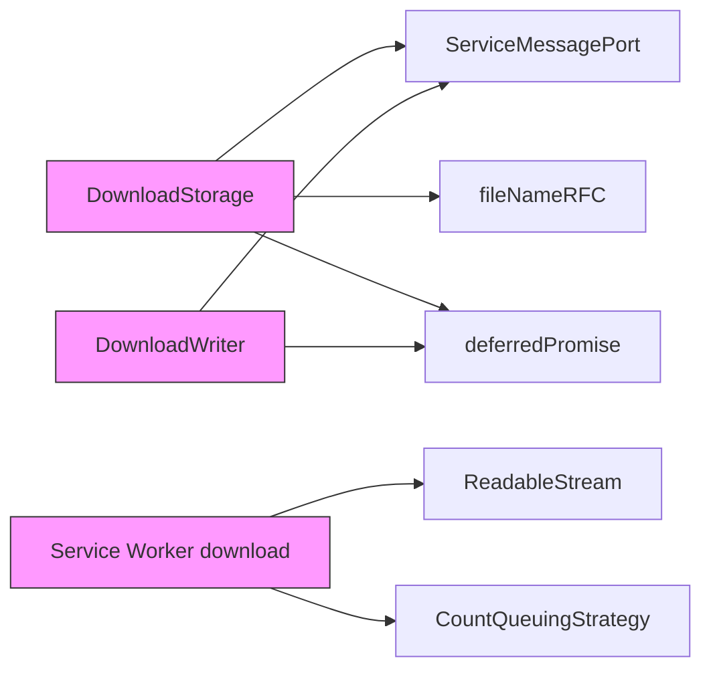
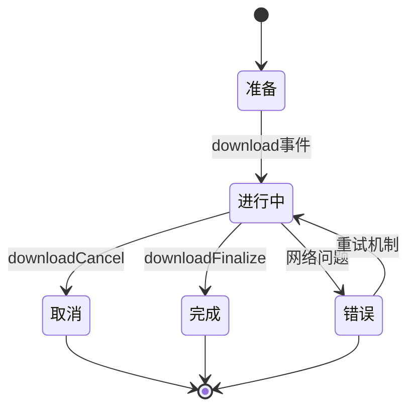

# 媒体下载

<cite>
**本文档中引用的文件**  
- [downloadStorage.ts](file://src/lib/files/downloadStorage.ts)
- [downloadWriter.ts](file://src/lib/files/downloadWriter.ts)
- [download.ts](file://src/lib/serviceWorker/download.ts)
- [getDownloadFileNameFromOptions.ts](file://src/lib/appManagers/utils/download/getDownloadFileNameFromOptions.ts)
- [fileStorage.ts](file://src/lib/files/fileStorage.ts)
- [streamWriter.ts](file://src/lib/files/streamWriter.ts)
- [memoryWriter.ts](file://src/lib/files/memoryWriter.ts)
- [fileNameRFC.ts](file://src/helpers/string/fileNameRFC.ts)
- [serviceMessagePort.ts](file://src/lib/serviceWorker/serviceMessagePort.ts)
</cite>

## 目录
1. [简介](#简介)
2. [项目结构](#项目结构)
3. [核心组件](#核心组件)
4. [架构概述](#架构概述)
5. [详细组件分析](#详细组件分析)
6. [依赖分析](#依赖分析)
7. [性能考虑](#性能考虑)
8. [故障排除指南](#故障排除指南)
9. [结论](#结论)

## 简介
本文档详细说明了tweb项目中媒体下载功能的实现机制。该功能支持文件的分块下载、断点续传、进度跟踪和本地存储，同时具备网络中断恢复、错误处理和重试机制。系统通过Service Worker和流式传输技术实现高效下载，并确保传输安全和文件完整性。

## 项目结构
媒体下载功能主要分布在`src/lib/files`和`src/lib/serviceWorker`目录中，相关工具函数位于`src/helpers`目录。核心组件包括下载存储管理、写入器实现和Service Worker事件处理。

**图示来源**  
- [downloadStorage.ts](file://src/lib/files/downloadStorage.ts)
- [download.ts](file://src/lib/serviceWorker/download.ts)
- [fileNameRFC.ts](file://src/helpers/string/fileNameRFC.ts)

**本节来源**  
- [src/lib/files](file://src/lib/files)
- [src/lib/serviceWorker](file://src/lib/serviceWorker)
- [src/helpers/string](file://src/helpers/string)

## 核心组件
媒体下载系统由多个核心组件构成：`DownloadStorage`负责下载准备和管理，`DownloadWriter`处理数据写入，Service Worker中的`download`模块管理流式传输，`FileStorage`提供抽象存储接口。

**本节来源**  
- [downloadStorage.ts](file://src/lib/files/downloadStorage.ts)
- [downloadWriter.ts](file://src/lib/files/downloadWriter.ts)
- [download.ts](file://src/lib/serviceWorker/download.ts)
- [fileStorage.ts](file://src/lib/files/fileStorage.ts)

## 架构概述
媒体下载功能采用分层架构，前端通过API请求触发下载，Service Worker拦截下载请求并管理数据流，下载数据通过流式传输逐步写入。

**图示来源**  
- [downloadStorage.ts](file://src/lib/files/downloadStorage.ts#L19-L54)
- [downloadWriter.ts](file://src/lib/files/downloadWriter.ts#L19-L23)
- [download.ts](file://src/lib/serviceWorker/download.ts#L37-L102)

## 详细组件分析

### 下载存储管理分析
`DownloadStorage`类实现了`FileStorage`接口，负责初始化下载过程并创建相应的写入器。

**图示来源**  
- [fileStorage.ts](file://src/lib/files/fileStorage.ts)
- [downloadStorage.ts](file://src/lib/files/downloadStorage.ts)
- [streamWriter.ts](file://src/lib/files/streamWriter.ts)
- [downloadWriter.ts](file://src/lib/files/downloadWriter.ts)

### 下载流程分析
下载过程涉及多个步骤的协调，从请求构建到数据写入的完整流程。

**图示来源**  
- [downloadStorage.ts](file://src/lib/files/downloadStorage.ts)
- [downloadWriter.ts](file://src/lib/files/downloadWriter.ts)
- [download.ts](file://src/lib/serviceWorker/download.ts)

**本节来源**  
- [downloadStorage.ts](file://src/lib/files/downloadStorage.ts)
- [downloadWriter.ts](file://src/lib/files/downloadWriter.ts)
- [download.ts](file://src/lib/serviceWorker/download.ts)

## 依赖分析
媒体下载功能依赖于多个核心模块，包括Service Worker通信、流式传输API和文件名处理工具。

**图示来源**  
- [downloadStorage.ts](file://src/lib/files/downloadStorage.ts)
- [downloadWriter.ts](file://src/lib/files/downloadWriter.ts)
- [download.ts](file://src/lib/serviceWorker/download.ts)
- [serviceMessagePort.ts](file://src/lib/serviceWorker/serviceMessagePort.ts)

**本节来源**  
- [downloadStorage.ts](file://src/lib/files/downloadStorage.ts)
- [downloadWriter.ts](file://src/lib/files/downloadWriter.ts)
- [download.ts](file://src/lib/serviceWorker/download.ts)

## 性能考虑
系统通过流式传输和分块处理优化下载性能，使用`CountQueuingStrategy`控制缓冲区大小，避免内存过度占用。下载过程在Service Worker中运行，不影响主线程性能。

## 故障排除指南
下载功能包含完善的错误处理机制，包括下载取消、网络中断恢复和错误传播。

**本节来源**  
- [download.ts](file://src/lib/serviceWorker/download.ts)
- [downloadStorage.ts](file://src/lib/files/downloadStorage.ts)

## 结论
tweb的媒体下载功能通过Service Worker和流式API实现了高效、可靠的文件下载机制。系统支持分块下载、断点续传和进度跟踪，具有良好的错误处理和恢复能力。架构设计合理，职责分离清晰，为用户提供流畅的下载体验。