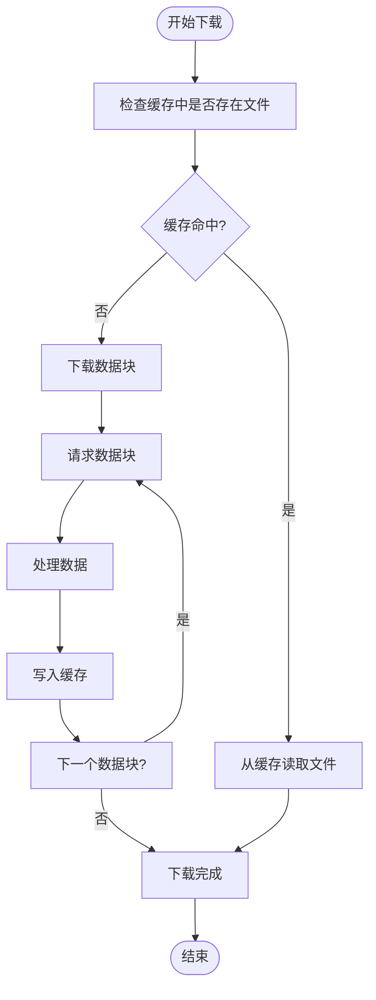
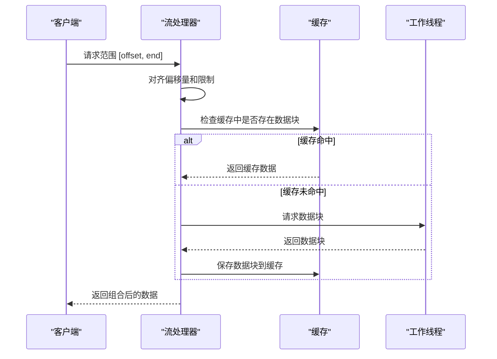
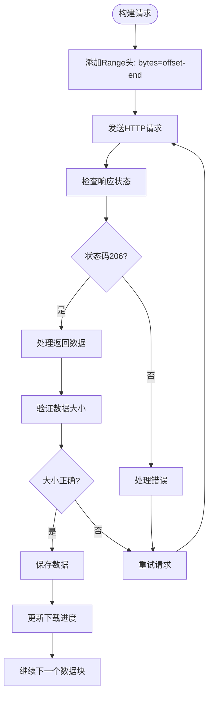

# 断点续传

<cite>
**本文档中引用的文件**  
- [apiFileManager.ts](file://src/lib/mtproto/apiFileManager.ts)
- [stream.ts](file://src/lib/serviceWorker/stream.ts)
- [cacheStorage.ts](file://src/lib/files/cacheStorage.ts)
- [memoryWriter.ts](file://src/lib/files/memoryWriter.ts)
- [fileStorage.ts](file://src/lib/files/fileStorage.ts)
</cite>

## 目录
1. [引言](#引言)
2. [断点续传核心机制](#断点续传核心机制)
3. [分块下载实现](#分块下载实现)
4. [范围请求构建](#范围请求构建)
5. [下载状态持久化](#下载状态持久化)
6. [服务器交互协议](#服务器交互协议)
7. [核心代码逻辑示例](#核心代码逻辑示例)
8. [结论](#结论)

## 引言

断点续传功能是现代Web应用中处理大文件下载的关键技术。本文档详细阐述了Telegram Web客户端中实现断点续传的完整机制，包括分块下载、范围请求、状态持久化和数据完整性验证等核心组件。通过分析源码，我们将深入理解如何高效、可靠地实现大文件的断点续传功能。

## 断点续传核心机制

断点续传的核心思想是将大文件分割成多个小块进行下载，并记录已下载的字节范围。当下载中断后，可以从上次中断的位置继续下载，而不是重新开始。这种机制显著提高了大文件下载的可靠性和效率。

在Telegram Web客户端中，断点续传通过`apiFileManager.ts`中的`download`方法实现。该方法首先检查缓存中是否已存在部分下载的文件，如果存在则从断点处继续下载；如果不存在则开始新的下载任务。下载过程通过分块方式进行，每个块的大小根据文件大小动态调整。

**Section sources**
- [apiFileManager.ts](file://src/lib/mtproto/apiFileManager.ts#L680-L900)

## 分块下载实现

分块下载是断点续传的基础。系统将文件分割成固定大小的块进行下载，这样可以实现并行下载、进度跟踪和断点恢复。

在代码实现中，`getLimitPart`方法根据文件大小决定分块大小：
- 小于75MB的文件使用512KB的块大小
- 大于75MB的文件使用1MB的块大小

这种动态调整策略平衡了网络效率和内存使用。下载过程通过`superpuper`异步函数实现，该函数创建一个下载队列，按顺序请求每个数据块。



**Diagram sources**
- [apiFileManager.ts](file://src/lib/mtproto/apiFileManager.ts#L841-L900)

**Section sources**
- [apiFileManager.ts](file://src/lib/mtproto/apiFileManager.ts#L735-L737)

## 范围请求构建

范围请求是HTTP协议中实现断点续传的关键机制。客户端通过`Range`头指定需要下载的字节范围，服务器返回对应的数据块。

在实现中，`requestRange`方法处理范围请求：
1. 解析`Range`头获取请求的字节范围
2. 对齐偏移量和限制值以符合服务器要求
3. 请求对应的数据块
4. 组合多个数据块并返回响应



**Diagram sources**
- [stream.ts](file://src/lib/serviceWorker/stream.ts#L235-L308)

**Section sources**
- [stream.ts](file://src/lib/serviceWorker/stream.ts#L235-L308)

## 下载状态持久化

下载状态的持久化确保了即使在页面刷新或应用重启后，下载任务也能从断点处继续。

系统使用IndexedDB作为持久化存储，通过`CacheStorageController`类管理缓存。关键的持久化策略包括：

1. **元数据存储**：保存文件名、大小、MIME类型等基本信息
2. **分块状态跟踪**：记录每个数据块的下载状态
3. **自动清理**：定期清理过期的缓存数据

```mermaid
classDiagram
class CacheStorageController {
+dbName : string
+openDbPromise : Promise~Cache~
+config : CacheStorageDbConfigEntry
+useStorage : boolean
+getFile(fileName : string) : Promise~Blob~
+prepareWriting(fileName : string, fileSize : number, mimeType : string) : WriterPrepared
+saveFile(fileName : string, blob : Blob) : Promise~void~
+delete(fileName : string) : Promise~void~
}
class FileStorage {
<<abstract>>
+getFile(fileName : string) : Promise~any~
+prepareWriting(...args : any[]) : {deferred : CancellablePromise~any~, getWriter : () -> StreamWriter}
}
class MemoryWriter {
+bytes : Uint8Array
+mimeType : string
+size : number
+write(part : Uint8Array, offset : number) : Promise~void~
+truncate() : void
+trim(size : number) : void
+finalize(saveToStorage : boolean) : Blob
+getParts() : Uint8Array
+replaceParts(parts : Uint8Array) : void
}
CacheStorageController --|> FileStorage : "实现"
MemoryWriter --> StreamWriter : "实现"
```

**Diagram sources**
- [cacheStorage.ts](file://src/lib/files/cacheStorage.ts#L48-L271)
- [fileStorage.ts](file://src/lib/files/fileStorage.ts#L10-L13)
- [memoryWriter.ts](file://src/lib/files/memoryWriter.ts#L10-L58)

**Section sources**
- [cacheStorage.ts](file://src/lib/files/cacheStorage.ts#L48-L271)

## 服务器交互协议

断点续传功能需要与服务器建立严格的交互协议，确保范围请求的正确性和数据完整性。

### 请求协议
- 使用`Range: bytes=start-end`头指定字节范围
- 服务器响应状态码206（Partial Content）
- 响应头包含`Content-Range`字段，指示返回的数据范围

### 数据完整性验证
系统通过以下方式确保数据完整性：
1. **大小验证**：检查下载的数据块大小是否符合预期
2. **范围对齐**：确保数据块的偏移量和大小符合服务器要求
3. **错误处理**：在下载失败时正确清理状态并重试



**Diagram sources**
- [stream.ts](file://src/lib/serviceWorker/stream.ts#L288-L305)

**Section sources**
- [stream.ts](file://src/lib/serviceWorker/stream.ts#L288-L305)

## 核心代码逻辑示例

以下是断点续传核心逻辑的代码结构示例：

```mermaid
flowchart TD
Start([下载开始]) --> CheckExisting["检查现有下载"])
CheckExisting --> HasExisting{"存在未完成下载?"}
HasExisting --> |是| ResumeDownload["从断点继续下载"]
HasExisting --> |否| StartNewDownload["开始新下载"]
StartNewDownload --> PrepareStorage["准备存储空间"]
PrepareStorage --> CalculateChunks["计算数据块"]
CalculateChunks --> RequestChunks["请求数据块"]
RequestChunks --> ProcessChunk["处理单个数据块"]
ProcessChunk --> ValidateData["验证数据完整性"]
ValidateData --> SaveChunk["保存数据块"]
SaveChunk --> UpdateMetadata["更新元数据"]
UpdateMetadata --> NextChunk{"还有更多数据块?"}
NextChunk --> |是| RequestChunks
NextChunk --> |否| Finalize["完成下载"]
ResumeDownload --> FindBreakpoint["查找断点位置"]
FindBreakpoint --> RequestFromBreakpoint["从断点请求数据"]
RequestFromBreakpoint --> ProcessChunk
Finalize --> NotifyComplete["通知下载完成"]
NotifyComplete --> End([结束])
```

**Diagram sources**
- [apiFileManager.ts](file://src/lib/mtproto/apiFileManager.ts#L680-L978)

**Section sources**
- [apiFileManager.ts](file://src/lib/mtproto/apiFileManager.ts#L680-L978)

## 结论

Telegram Web客户端的断点续传功能通过分块下载、范围请求、状态持久化和严格的数据验证协议，实现了高效可靠的大文件下载机制。该实现充分利用了现代浏览器的特性，包括Service Worker、IndexedDB和流式处理，为用户提供流畅的下载体验。通过动态调整分块大小、智能缓存管理和错误恢复机制，系统能够在各种网络条件下保持良好的性能和可靠性。