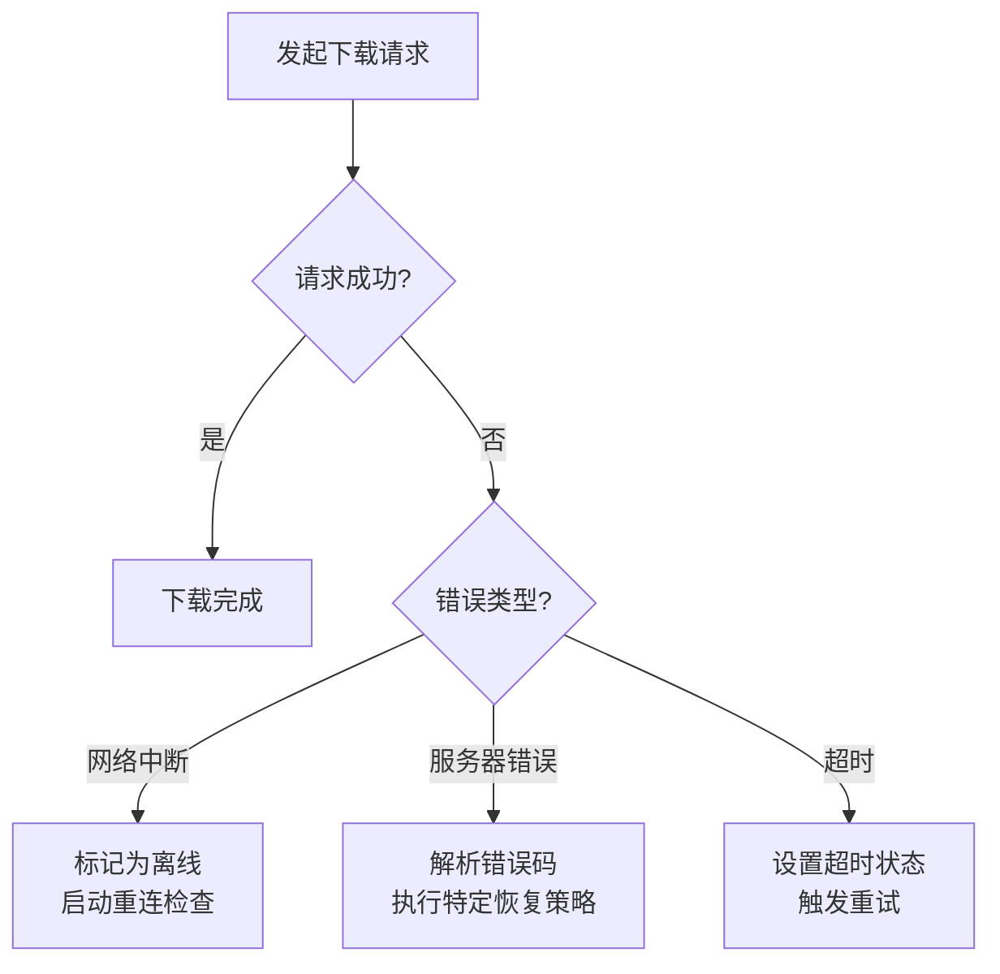
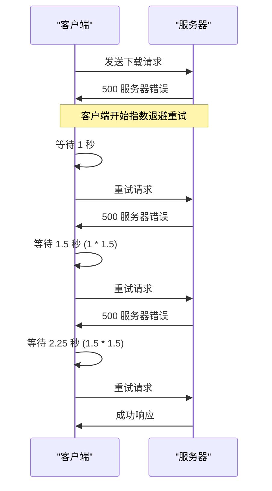
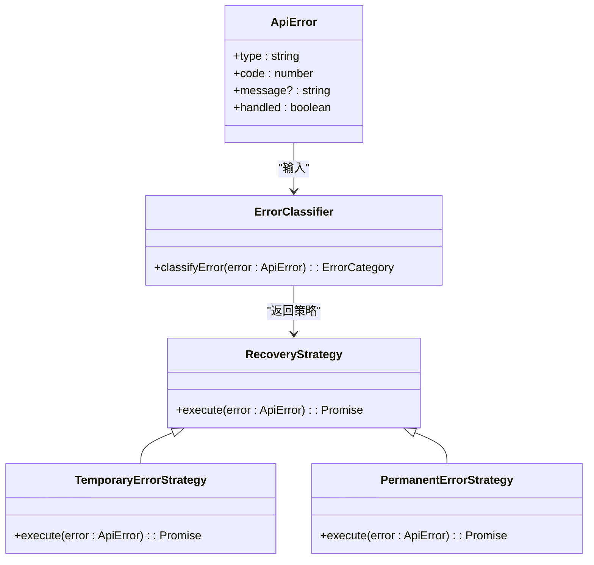
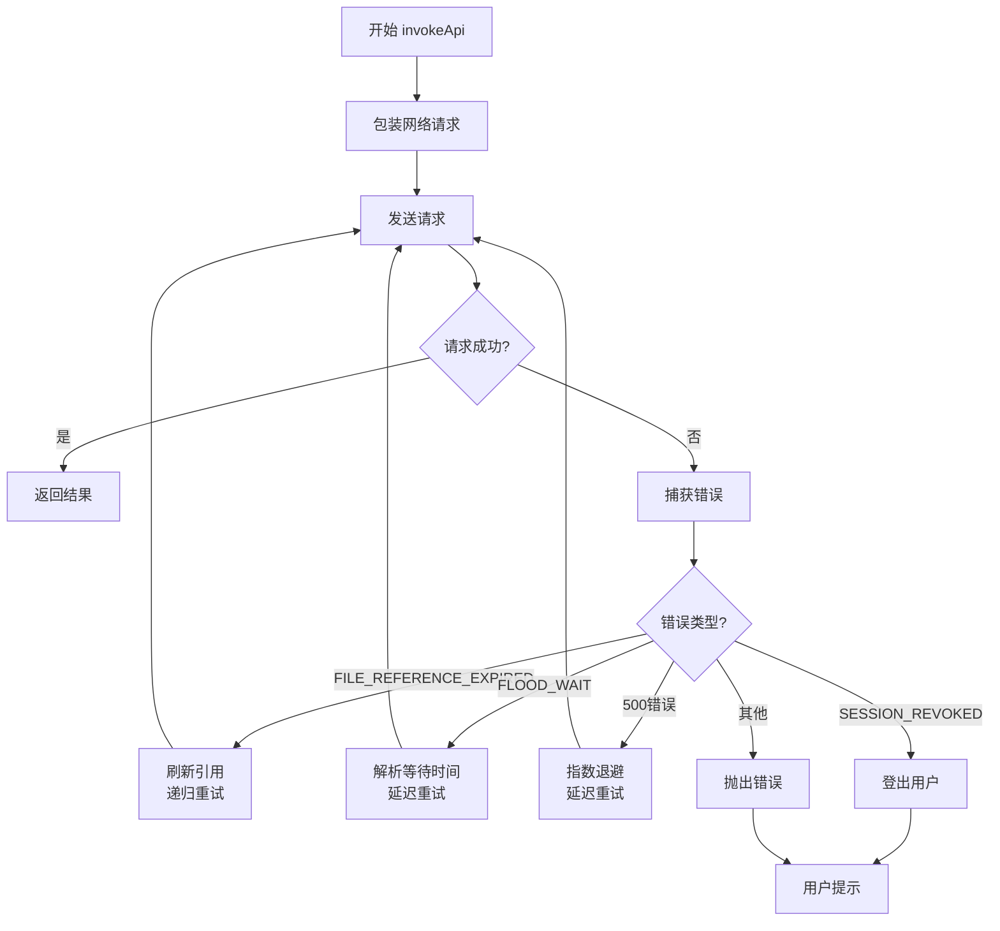

# 错误恢复

<cite>
**本文档引用的文件**  
- [apiFileManager.ts](file://src/lib/mtproto/apiFileManager.ts)
- [networker.ts](file://src/lib/mtproto/networker.ts)
- [apiManager.ts](file://src/lib/mtproto/apiManager.ts)
- [timeout.ts](file://src/lib/serviceWorker/timeout.ts)
- [makeError.ts](file://src/helpers/makeError.ts)
</cite>

## 目录
1. [引言](#引言)
2. [错误检测机制](#错误检测机制)
3. [重试机制与指数退避算法](#重试机制与指数退避算法)
4. [错误分类体系与恢复策略](#错误分类体系与恢复策略)
5. [重试次数限制与超时设置](#重试次数限制与超时设置)
6. [错误日志记录机制](#错误日志记录机制)
7. [错误处理管道代码示例](#错误处理管道代码示例)
8. [结论](#结论)

## 引言
本文档详细阐述了Telegram Web客户端中下载错误恢复机制的实现原理。该机制旨在确保在面对网络中断、服务器错误和超时等不稳定情况时，文件下载操作能够具备足够的鲁棒性和用户体验。文档将深入分析其核心组件，包括错误检测、重试策略、错误分类、参数配置以及日志记录，为开发者提供全面的技术参考。

## 错误检测机制
下载错误恢复机制的核心在于对各种异常情况的精准检测。系统通过多层监控来识别网络中断、服务器错误和超时。

首先，对于**网络中断**，系统通过`networker.ts`中的`toggleOffline`方法进行管理。当HTTP请求失败时，会调用`toggleOffline(true)`将连接状态标记为离线。同时，系统会监听浏览器的`online`和`focus`事件，一旦检测到网络恢复或页面重新获得焦点，便会触发`checkConnection`方法进行连接性检查。

其次，对于**服务器错误**，系统在`apiManager.ts`中实现了全面的错误处理。当API调用返回错误时，`invokeApi`方法会捕获`ApiError`对象，并根据其`code`和`type`字段进行分类处理。例如，`SESSION_REVOKED`（会话被撤销）和`AUTH_KEY_DUPLICATED`（授权密钥重复）等401错误会触发自动登出流程。

最后，对于**超时**，系统在`networker.ts`的`attachPromise`方法中设置了基于`delays.connectionTimeout`的超时定时器。如果在规定时间内（客户端默认5秒，文件传输默认7.5秒）未收到响应，且确认连接已超时，系统会将连接状态设置为`ConnectionStatus.TimedOut`。

**Diagram sources**
- [networker.ts](file://src/lib/mtproto/networker.ts#L802-L837)
- [apiManager.ts](file://src/lib/mtproto/apiManager.ts#L627-L663)
- [networker.ts](file://src/lib/mtproto/networker.ts#L912-L926)

**Section sources**
- [networker.ts](file://src/lib/mtproto/networker.ts#L802-L837)
- [apiManager.ts](file://src/lib/mtproto/apiManager.ts#L627-L663)
- [networker.ts](file://src/lib/mtproto/networker.ts#L912-L926)

## 重试机制与指数退避算法
系统采用了一套复杂的重试机制，其核心是结合了指数退避思想的动态等待策略。

在`apiManager.ts`中，`invokeApi`方法是重试逻辑的中心。当遇到可恢复的错误（如500服务器错误）时，系统会进入一个递归的`performRequest`循环。对于500错误，系统会使用一个指数增长的等待时间：`options.waitTime = options.waitTime ? Math.min(60, options.waitTime * 1.5) : 1;`。这意味着重试间隔会从1秒开始，每次乘以1.5，直到达到最大值60秒，从而有效避免对服务器造成持续的瞬时压力。

对于FLOOD_WAIT类型的错误，系统会直接读取服务器返回的等待时间（以秒为单位），并使用`pause(waitTime * 1000)`进行精确的延迟重试。这确保了客户端严格遵守服务器的限流策略。

此外，系统还实现了`msg_resend_req`机制。当怀疑消息丢失时，客户端会向服务器发送`msg_resend_req`请求，要求服务器重发未确认的响应。这一机制在`networker.ts`的`performScheduledRequest`方法中实现，是确保消息可靠性的关键。

**Diagram sources**
- [apiManager.ts](file://src/lib/mtproto/apiManager.ts#L777-L786)
- [apiManager.ts](file://src/lib/mtproto/apiManager.ts#L736-L768)
- [networker.ts](file://src/lib/mtproto/networker.ts#L1071-L1085)

**Section sources**
- [apiManager.ts](file://src/lib/mtproto/apiManager.ts#L777-L786)
- [apiManager.ts](file://src/lib/mtproto/apiManager.ts#L736-L768)
- [networker.ts](file://src/lib/mtproto/networker.ts#L1071-L1085)

## 错误分类体系与恢复策略
系统建立了一套清晰的错误分类体系，并为不同类型的错误定义了相应的恢复策略。

错误主要分为两大类：**临时错误**和**永久错误**。

**临时错误**（可自动恢复）：
- `FILE_REFERENCE_EXPIRED`: 文件引用过期。系统会自动调用`refreshReference`方法获取新的引用，并重新发起请求。
- `FLOOD_WAIT_*`: 速率限制。系统会根据服务器返回的等待时间进行精确的延迟重试。
- `CONNECTION_NOT_INITED`: 连接未初始化。系统会重新初始化连接并重试。
- 500系列服务器错误。系统会采用指数退避算法进行重试。
- 网络超时和中断。系统会标记为离线状态，并在后台持续尝试重连。

**永久错误**（需用户干预）：
- `SESSION_REVOKED` 和 `AUTH_KEY_DUPLICATED`: 会话或密钥失效。系统会触发`logOut()`，要求用户重新登录。
- `FILE_TOO_BIG`: 文件过大。系统会拒绝上传，并向用户提示。
- `DOWNLOAD_CANCELED`: 下载被用户取消。这是一个正常的操作结果。

恢复策略的执行在`apiManager.ts`的`invokeApi`方法中完成。该方法通过一系列`if-else`条件判断来识别错误类型，并执行相应的恢复动作。例如，对于`FILE_REFERENCE_EXPIRED`错误，系统会调用`refreshReference`并递归执行`invokeApi`；而对于`SESSION_REVOKED`错误，则直接调用`logOut()`。

**Diagram sources**
- [apiManager.ts](file://src/lib/mtproto/apiManager.ts#L688-L794)
- [apiFileManager.ts](file://src/lib/mtproto/apiFileManager.ts#L569-L577)
- [makeError.ts](file://src/helpers/makeError.ts#L1-L9)

**Section sources**
- [apiManager.ts](file://src/lib/mtproto/apiManager.ts#L688-L794)
- [apiFileManager.ts](file://src/lib/mtproto/apiFileManager.ts#L569-L577)
- [makeError.ts](file://src/helpers/makeError.ts#L1-L9)

## 重试次数限制与超时设置
为了防止无限重试和资源耗尽，系统对重试次数和超时时间进行了严格的配置。

在`apiManager.ts`中，重试次数的限制主要体现在两个方面：
1.  **Flood Wait 限制**：通过`options.floodMaxTimeout`参数，可以设置FLOOD_WAIT错误的最大等待时间。如果服务器要求的等待时间超过此值，系统将放弃重试并抛出原始错误。
2.  **500错误重试上限**：虽然没有硬编码的重试次数，但通过`Math.min(60, options.waitTime * 1.5)`的计算，等待时间最终会收敛到60秒。结合`pause`的异步特性，这在实践中形成了一个软性的重试次数上限。

超时设置主要在`networker.ts`中定义：
- `delays.connectionTimeout`：定义了单个请求的最大等待时间，默认客户端为5000毫秒，文件传输为7500毫秒。
- `DRAIN_TIMEOUT`：定义了在没有活动请求时，触发`onDrain`回调的延迟时间，为10000毫秒。
- `CHECK_CONNECTION_MAX_PERIOD`：定义了离线状态下，检查连接的最长间隔时间为15秒。

这些参数在`networker.ts`的`delays`常量中集中配置，便于统一管理和调整。

## 错误日志记录机制
系统具备完善的错误日志记录功能，这对于调试和监控至关重要。

日志记录主要通过`logger.ts`模块提供的`log`函数实现。在`apiFileManager.ts`和`networker.ts`等核心文件中，大量使用了`this.log.error()`、`this.log.warn()`和`this.log.debug()`等方法来记录关键事件和错误信息。

例如，在`apiFileManager.ts`的`downloadCheck`方法中，当下载请求出现非忽略错误时，会记录`downloadCheck error:`日志。在`networker.ts`的`handleSentEncryptedRequestHTTP`方法中，当加密请求失败时，会记录`encrypted request failed`的详细错误信息。

日志的输出级别受`Modes.debug`等配置项控制，可以在生产环境中关闭调试日志以减少性能开销。所有日志信息都包含了上下文（如`this.name`），便于在大量日志中进行追踪和分析。

## 错误处理管道代码示例
以下代码示例展示了错误处理管道的构建和执行流程。它模拟了`apiManager.invokeApi`方法的核心逻辑：

**Diagram sources**
- [apiManager.ts](file://src/lib/mtproto/apiManager.ts#L665-L816)

**Section sources**
- [apiManager.ts](file://src/lib/mtproto/apiManager.ts#L665-L816)

## 结论
Telegram Web客户端的下载错误恢复机制是一个设计精良、层次分明的系统。它通过精确的错误检测、智能的重试策略（包括指数退避）、清晰的错误分类和严格的参数限制，确保了在各种网络和服务器异常情况下，用户体验的稳定性和数据的可靠性。该机制不仅处理了常见的网络问题，还针对Telegram特有的MTProto协议特性（如文件引用过期）提供了专门的解决方案，展现了其作为成熟通信应用的工程实力。