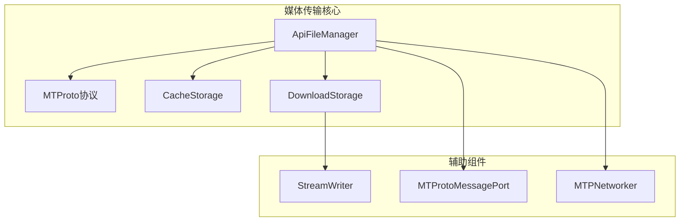
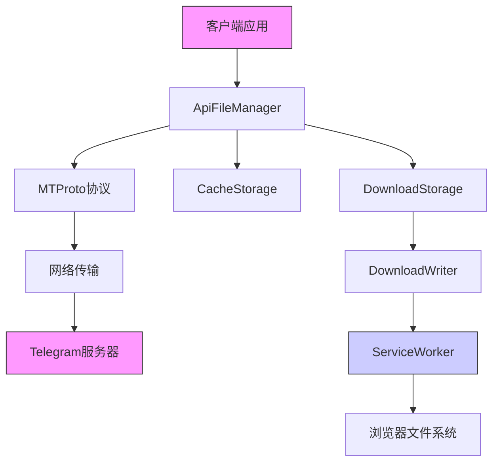
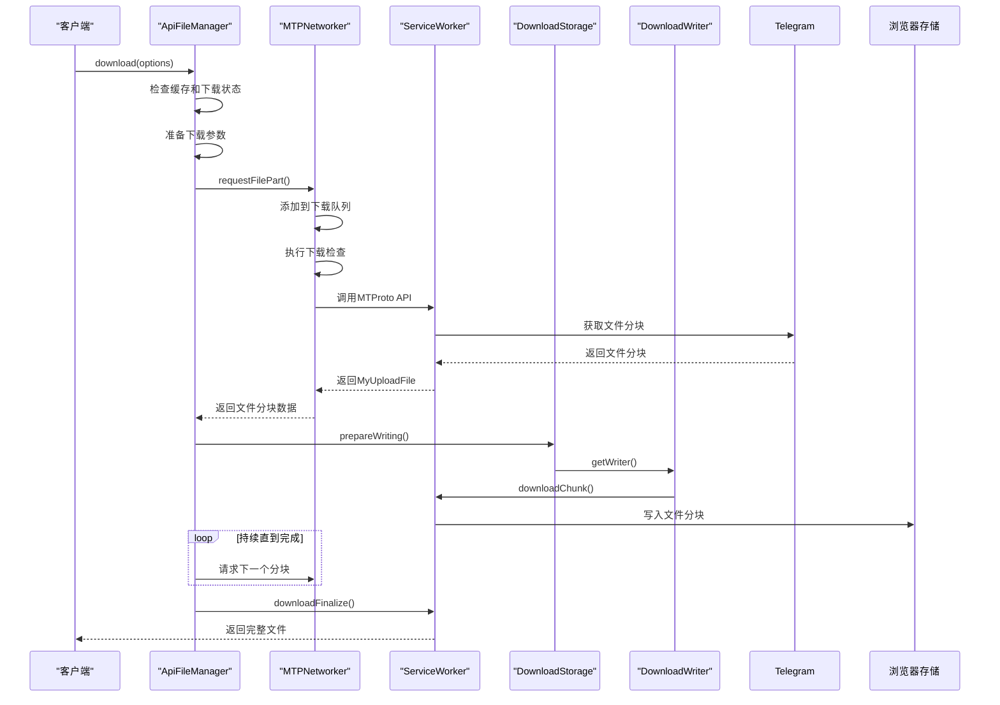
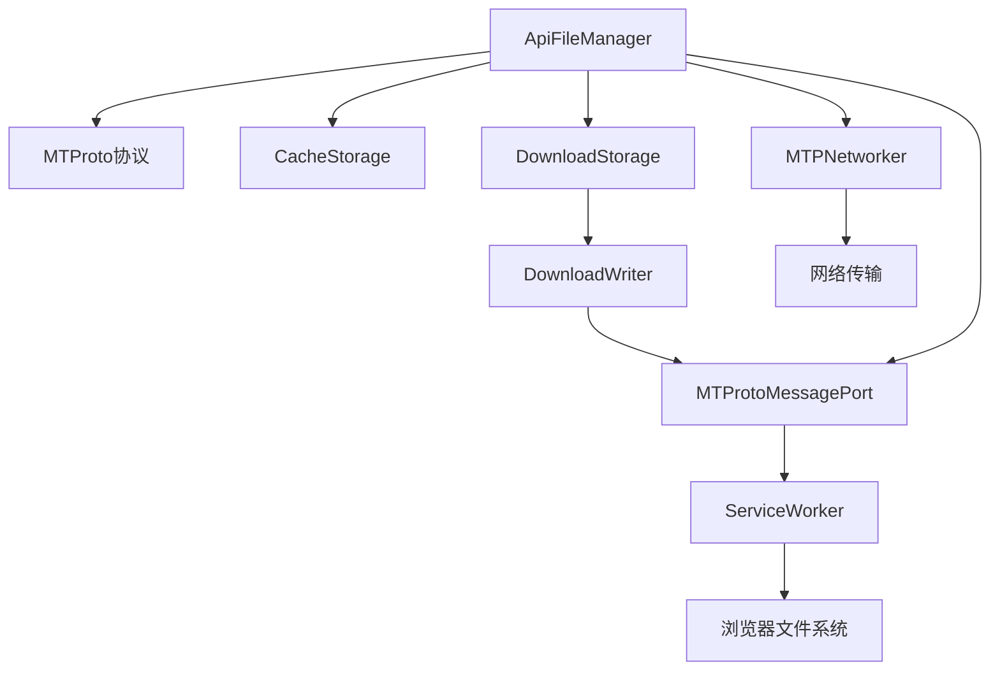

# 媒体传输

<cite>
**本文档中引用的文件**
- [downloadStorage.ts](file://src/lib/files/downloadStorage.ts)
- [downloadWriter.ts](file://src/lib/files/downloadWriter.ts)
- [apiFileManager.ts](file://src/lib/mtproto/apiFileManager.ts)
- [mtprotoMessagePort.ts](file://src/lib/mtproto/mtprotoMessagePort.ts)
- [networker.ts](file://src/lib/mtproto/networker.ts)
- [cacheStorage.ts](file://src/lib/files/cacheStorage.ts)
- [fileStorage.ts](file://src/lib/files/fileStorage.ts)
- [streamWriter.ts](file://src/lib/files/streamWriter.ts)
- [getDownloadMediaDetails.ts](file://src/lib/appManagers/utils/download/getDownloadMediaDetails.ts)
- [getDownloadFileNameFromOptions.ts](file://src/lib/appManagers/utils/download/getDownloadFileNameFromOptions.ts)
</cite>

## 目录
1. [介绍](#介绍)
2. [项目结构](#项目结构)
3. [核心组件](#核心组件)
4. [架构概述](#架构概述)
5. [详细组件分析](#详细组件分析)
6. [依赖分析](#依赖分析)
7. [性能考虑](#性能考虑)
8. [故障排除指南](#故障排除指南)
9. [结论](#结论)

## 介绍

本文档详细描述了基于MTProto协议的媒体传输功能实现，涵盖了媒体文件上传和下载的完整流程。文档重点介绍了分块传输、进度跟踪、断点续传机制，以及大文件传输的优化策略。同时，文档还说明了下载存储和文件存储的管理方式，包括缓存策略和磁盘空间管理，记录了传输过程中的错误处理和恢复机制，并包含了传输加密和完整性验证等安全性考虑。

## 项目结构

该媒体传输功能主要分布在`src/lib`目录下的多个子模块中，特别是`mtproto`和`files`相关的组件。核心功能由`apiFileManager`协调，通过`mtproto`协议与服务器通信，并使用专门的存储管理器处理文件的缓存和下载。



**图表来源**
- [apiFileManager.ts](file://src/lib/mtproto/apiFileManager.ts)
- [downloadStorage.ts](file://src/lib/files/downloadStorage.ts)
- [cacheStorage.ts](file://src/lib/files/cacheStorage.ts)

**章节来源**
- [apiFileManager.ts](file://src/lib/mtproto/apiFileManager.ts)
- [project_structure](file://project_structure)

## 核心组件

媒体传输功能的核心组件包括`ApiFileManager`，它负责协调所有文件操作；`DownloadStorage`和`CacheStorage`，它们分别管理下载和缓存的文件存储；以及`DownloadWriter`，它处理分块写入下载的文件数据。这些组件通过`MTProtoMessagePort`与服务工作线程通信，实现高效的文件传输。

**章节来源**
- [apiFileManager.ts](file://src/lib/mtproto/apiFileManager.ts)
- [downloadStorage.ts](file://src/lib/files/downloadStorage.ts)
- [cacheStorage.ts](file://src/lib/files/cacheStorage.ts)

## 架构概述

媒体传输系统采用分层架构，上层的`ApiFileManager`负责业务逻辑和流程控制，中间层的`MTProto`协议处理网络通信，底层的存储系统负责文件的持久化。该架构支持分块传输、断点续传和带宽自适应，确保了大文件传输的稳定性和效率。



**图表来源**
- [apiFileManager.ts](file://src/lib/mtproto/apiFileManager.ts)
- [downloadStorage.ts](file://src/lib/files/downloadStorage.ts)
- [mtprotoMessagePort.ts](file://src/lib/mtproto/mtprotoMessagePort.ts)

## 详细组件分析

### ApiFileManager 分析

`ApiFileManager`是媒体传输功能的核心管理器，它协调所有文件的上传和下载操作。该组件实现了分块传输、进度跟踪和断点续传等关键功能。

```mermaid
classDiagram
class ApiFileManager {
+downloadPromises : {[fileName : string] : DownloadPromise}
+uploadPromises : {[fileName : string] : CancellablePromise<InputFile>}
+downloadPulls : {[dcId : string] : Array<DownloadRequest>}
+downloadActives : {[dcId : string] : number}
+refreshReferencePromises : {[referenceHex : string] : Promise<ReferenceBytes>}
+download(options : DownloadOptions) : DownloadPromise
+upload(file : File, options : UploadOptions) : CancellablePromise<InputFile>
+requestFilePart() : Promise<MyUploadFile>
+invokeApiWithReference() : Promise<T>
+refreshReference() : Promise<void>
}
class DownloadOptions {
+dcId : DcId
+location : InputFileLocation | InputWebFileLocation
+size? : number
+fileName? : string
+mimeType? : MTMimeType
+limitPart? : number
+queueId? : number
+onlyCache? : boolean
+downloadId? : string
}
class DownloadPromise {
+isFulfilled : boolean
+isRejected : boolean
+cancel() : void
+then() : Promise<Blob>
+catch() : Promise<Blob>
}
ApiFileManager --> DownloadOptions : "使用"
ApiFileManager --> DownloadPromise : "返回"
```

**图表来源**
- [apiFileManager.ts](file://src/lib/mtproto/apiFileManager.ts#L48-L89)

### 下载流程分析

媒体文件下载流程涉及多个组件的协同工作，从请求文件分块到最终写入存储，整个过程实现了高效的分块传输和错误恢复机制。



**图表来源**
- [apiFileManager.ts](file://src/lib/mtproto/apiFileManager.ts)
- [downloadStorage.ts](file://src/lib/files/downloadStorage.ts)
- [downloadWriter.ts](file://src/lib/files/downloadWriter.ts)
- [networker.ts](file://src/lib/mtproto/networker.ts)

### 缓存与下载存储分析

文件存储系统分为缓存存储和下载存储两个部分，分别处理临时缓存和用户主动下载的文件。这种分离设计优化了存储空间的使用和访问效率。


**图表来源**
- [downloadStorage.ts](file://src/lib/files/downloadStorage.ts)
- [cacheStorage.ts](file://src/lib/files/cacheStorage.ts)
- [fileStorage.ts](file://src/lib/files/fileStorage.ts)

**章节来源**
- [downloadStorage.ts](file://src/lib/files/downloadStorage.ts)
- [cacheStorage.ts](file://src/lib/files/cacheStorage.ts)

## 依赖分析

媒体传输功能依赖于多个核心模块，包括MTProto协议栈、文件存储系统和消息端口通信机制。这些组件之间存在紧密的依赖关系，共同构成了完整的文件传输解决方案。



**图表来源**
- [apiFileManager.ts](file://src/lib/mtproto/apiFileManager.ts)
- [downloadStorage.ts](file://src/lib/files/downloadStorage.ts)
- [mtprotoMessagePort.ts](file://src/lib/mtproto/mtprotoMessagePort.ts)
- [networker.ts](file://src/lib/mtproto/networker.ts)

**章节来源**
- [apiFileManager.ts](file://src/lib/mtproto/apiFileManager.ts)
- [downloadStorage.ts](file://src/lib/files/downloadStorage.ts)

## 性能考虑

媒体传输系统在设计时充分考虑了性能优化，包括分块大小的动态调整、下载队列的优先级管理、以及带宽自适应机制。系统根据文件大小和用户是否为高级用户动态调整分块大小，确保传输效率最大化。

**章节来源**
- [apiFileManager.ts](file://src/lib/mtproto/apiFileManager.ts#L89-L96)
- [networker.ts](file://src/lib/mtproto/networker.ts#L100-L124)

## 故障排除指南

当媒体传输出现问题时，可以检查以下几个方面：首先确认网络连接是否正常，然后检查`ApiFileManager`中的下载队列状态，查看是否有被取消或失败的下载任务。对于断点续传问题，需要确保`file_reference`的有效性，系统会自动处理`FILE_REFERENCE_EXPIRED`等错误并尝试刷新引用。

**章节来源**
- [apiFileManager.ts](file://src/lib/mtproto/apiFileManager.ts#L569-L577)
- [downloadStorage.ts](file://src/lib/files/downloadStorage.ts#L44-L47)

## 结论

本文档详细介绍了基于MTProto协议的媒体传输功能实现。系统通过分块传输、断点续传和智能缓存等机制，实现了高效稳定的文件上传下载功能。安全性方面，系统通过`file_reference`机制和自动刷新策略确保了传输的安全性。未来可以进一步优化带宽自适应算法，提升在不同网络条件下的传输体验。