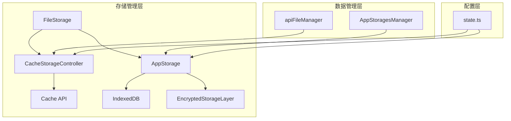
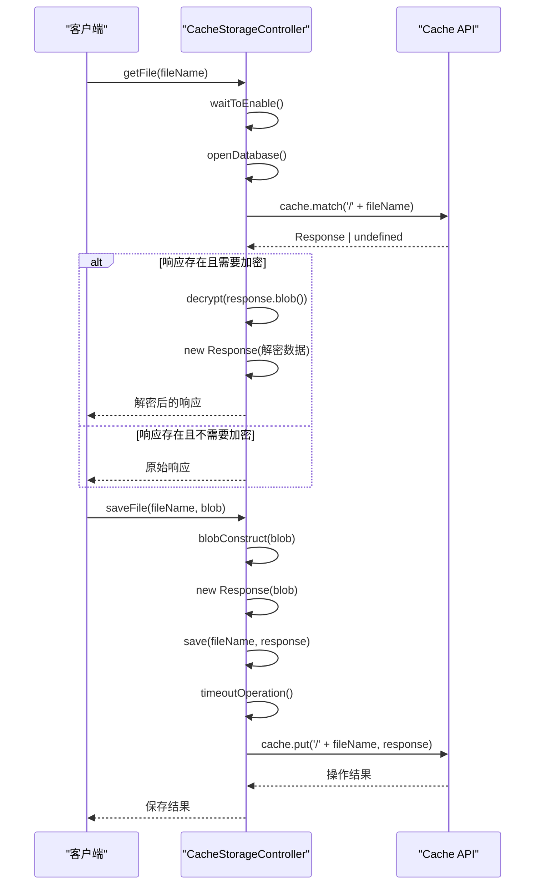
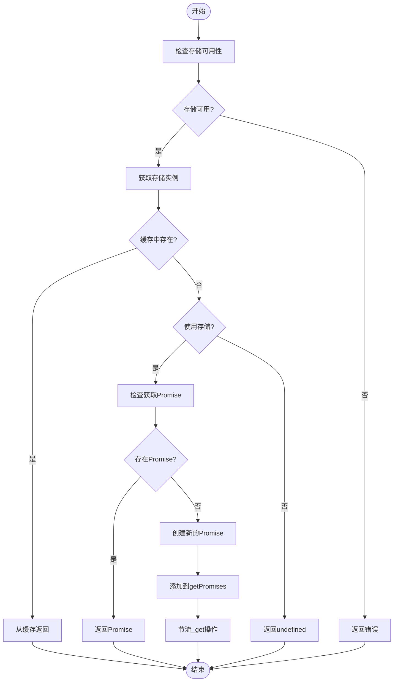
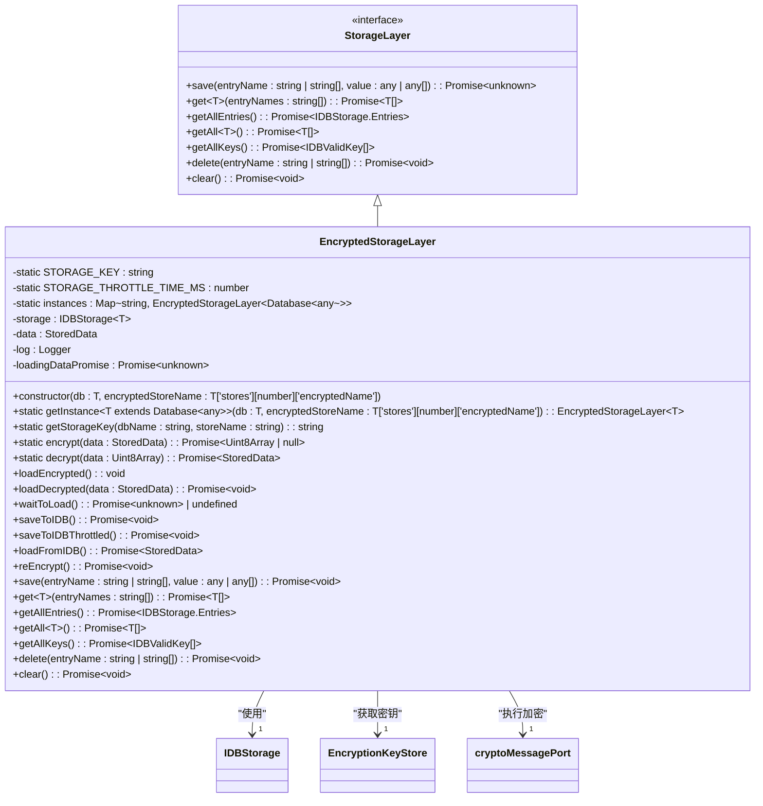
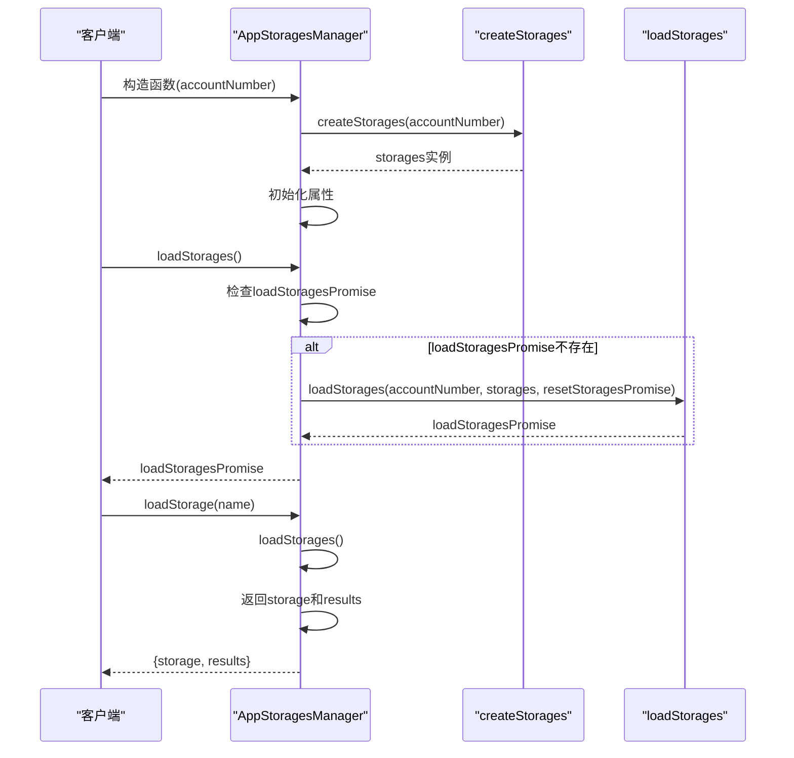
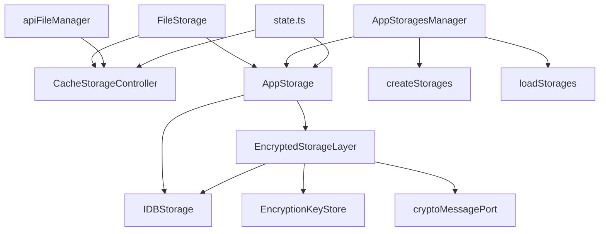

# 存储管理

<cite>
**本文档中引用的文件**   
- [fileStorage.ts](file://src/lib/files/fileStorage.ts)
- [cacheStorage.ts](file://src/lib/files/cacheStorage.ts)
- [storage.ts](file://src/lib/storage.ts)
- [idb.ts](file://src/lib/files/idb.ts)
- [encryptedStorageLayer.ts](file://src/lib/encryptedStorageLayer.ts)
- [appStoragesManager.ts](file://src/lib/appManagers/appStoragesManager.ts)
- [state.ts](file://src/config/databases/state.ts)
- [memoryWriter.ts](file://src/lib/files/memoryWriter.ts)
- [apiFileManager.ts](file://src/lib/mtproto/apiFileManager.ts)
</cite>

## 目录
1. [简介](#简介)
2. [项目结构](#项目结构)
3. [核心组件](#核心组件)
4. [架构概述](#架构概述)
5. [详细组件分析](#详细组件分析)
6. [依赖分析](#依赖分析)
7. [性能考虑](#性能考虑)
8. [故障排除指南](#故障排除指南)
9. [结论](#结论)

## 简介
本文档详细说明了tweb项目中存储管理功能的实现机制。系统采用多层存储架构，结合IndexedDB和Cache API，实现了高效的文件存储、索引管理和元数据处理。存储系统支持加密功能，确保用户数据安全，并通过配额管理和空间监控机制优化存储使用。文档还涵盖了多账户环境下的存储隔离实现和性能优化策略。

## 项目结构
tweb项目的存储管理功能主要分布在`src/lib`目录下的多个模块中，形成了一个分层的存储架构体系。系统通过`files`、`storage`和`appManagers`等模块协同工作，实现了完整的存储管理功能。



**Diagram sources**
- [fileStorage.ts](file://src/lib/files/fileStorage.ts#L10-L13)
- [cacheStorage.ts](file://src/lib/files/cacheStorage.ts#L48-L72)
- [storage.ts](file://src/lib/storage.ts#L46-L75)
- [appStoragesManager.ts](file://src/lib/appManagers/appStoragesManager.ts#L16-L31)
- [state.ts](file://src/config/databases/state.ts#L53-L88)

**Section sources**
- [fileStorage.ts](file://src/lib/files/fileStorage.ts#L1-L13)
- [cacheStorage.ts](file://src/lib/files/cacheStorage.ts#L1-L72)
- [storage.ts](file://src/lib/storage.ts#L1-L75)
- [appStoragesManager.ts](file://src/lib/appManagers/appStoragesManager.ts#L1-L31)
- [state.ts](file://src/config/databases/state.ts#L1-L91)

## 核心组件
存储管理系统由多个核心组件构成，包括抽象的`FileStorage`接口、基于Cache API的`CacheStorageController`、基于IndexedDB的`AppStorage`以及加密存储层`EncryptedStorageLayer`。这些组件共同实现了文件存储、索引管理和元数据处理功能。

**Section sources**
- [fileStorage.ts](file://src/lib/files/fileStorage.ts#L10-L13)
- [cacheStorage.ts](file://src/lib/files/cacheStorage.ts#L48-L72)
- [storage.ts](file://src/lib/storage.ts#L46-L75)
- [encryptedStorageLayer.ts](file://src/lib/encryptedStorageLayer.ts#L29-L58)

## 架构概述
tweb的存储管理架构采用分层设计，将存储功能分为抽象层、实现层和管理层。系统通过`FileStorage`抽象类定义统一的存储接口，由`CacheStorageController`和`AppStorage`分别实现基于Cache API和IndexedDB的具体存储逻辑。`AppStoragesManager`负责管理多个存储实例的生命周期。

```mermaid
classDiagram
class FileStorage {
+abstract getFile(fileName : string) : Promise~any~
+abstract prepareWriting(...args : any[]) : {deferred : CancellablePromise~any~, getWriter : () => StreamWriter}
}
class CacheStorageController {
-static STORAGES : CacheStorageController[]
-openDbPromise : Promise~Cache~
-config : CacheStorageDbConfigEntry
-useStorage : boolean
+constructor(dbName : CacheStorageDbName)
+get isEncryptable() : boolean
+delete(entryName : string) : Promise~void~
+deleteAll() : Promise~void~
+has(entryName : string) : Promise~boolean~
+get(entryName : string) : Promise~Response | undefined~
+save(entryName : string, response : Response) : Promise~boolean~
+getFile(fileName : string, method : 'blob' | 'json' | 'text') : Promise~any~
+saveFile(fileName : string, blob : Blob | Uint8Array) : Promise~Blob~
+timeoutOperation~T~(callback : (cache : Cache) => Promise~T~) : Promise~T~
+prepareWriting(fileName : string, fileSize : number, mimeType : string) : {deferred : CancellablePromise~Blob~, getWriter : () => StreamWriter}
+static toggleStorage(enabled : boolean, _clearWrite : boolean) : Promise~void~
+static deleteAllStorages() : Promise~void~
+static temporarilyToggle(enabled : boolean) : void
+static clearEncryptableStorages() : Promise~void~
+static getOpenEncryptableStorages() : CacheStorageController[]
+static resetOpenEncryptableCacheStorages() : void
}
class AppStorage {
-static STORAGES : AppStorage~any, Database~any~~[]
-storage : StorageLayer
-cache : Partial~Storage~
-useStorage : boolean
-savingFreezed : boolean
-getPromises : Map~keyof Storage, CancellablePromise~Storage[keyof Storage]~~
-getThrottled : () => void
-keysToSet : Set~keyof Storage~
-saveThrottled : () => void
-saveDeferred : CancellablePromise~void~
-keysToDelete : Set~keyof Storage~
-deleteThrottled : () => void
-deleteDeferred : CancellablePromise~void~
-isEncryptable : boolean
-encryptedStoreName? : T['stores'][number]['encryptedName']
-log : ReturnType~typeof logger~
+constructor(db : T, storeName : T['stores'][number]['name'])
+isAvailable() : boolean
+getCache() : Partial~Storage~
+getFromCache~T extends keyof Storage~(key : T) : Storage[T]
+setToCache(key : keyof Storage, value : Storage[typeof key]) : Storage[typeof key]
+get~T extends keyof Storage~(key : T, useCache : boolean) : Promise~Storage[T]~
+getAll() : Promise~any[]~
+getAllKeys() : Promise~IDBValidKey[]~
+getAllEntries() : Promise~IDBStorage.Entries~
+set(obj : Partial~Storage~, onlyLocal : boolean) : Promise~void~
+delete(key : keyof Storage, saveLocal : boolean) : Promise~void~
+clear(saveLocal : boolean) : Promise~void~
+unfreezeAsync(callback : () => Promise~unknown~) : Promise~void~
+static toggleStorage(enabled : boolean, clearWrite : boolean) : Promise~void~
+static freezeSaving~T extends Database~any~~(callback : () => any, names : T['stores'][number]['name'][]) : void
+static freezeSavingAsync(callback : () => Promise~unknown~) : Promise~void~
+static toggleEncryptedForAll(shouldEncrypt : boolean) : Promise~void~
+static reEncryptEncrypted() : Promise~void~
}
class EncryptedStorageLayer {
-static STORAGE_KEY : string
-static STORAGE_THROTTLE_TIME_MS : number
-static instances : Map~string, EncryptedStorageLayer~Database~any~~~
-storage : IDBStorage~T~
-data : StoredData
-log : Logger
-loadingDataPromise : Promise~unknown~
+constructor(db : T, encryptedStoreName : T['stores'][number]['encryptedName'])
+static getInstance~T extends Database~any~~(db : T, encryptedStoreName : T['stores'][number]['encryptedName']) : EncryptedStorageLayer~T~
+static getStorageKey(dbName : string, storeName : string) : string
+static encrypt(data : StoredData) : Promise~Uint8Array | null~
+static decrypt(data : Uint8Array) : Promise~StoredData~
+loadEncrypted() : void
+loadDecrypted(data : StoredData) : Promise~void~
+waitToLoad() : Promise~unknown~ | undefined
+saveToIDB() : Promise~void~
+saveToIDBThrottled() : Promise~void~
+loadFromIDB() : Promise~StoredData~
+reEncrypt() : Promise~void~
+save(entryName : string | string[], value : any | any[]) : Promise~void~
+get~T~(entryNames : string[]) : Promise~T[]~
+getAllEntries() : Promise~IDBStorage.Entries~
+getAll~T~() : Promise~T[]~
+getAllKeys() : Promise~IDBValidKey[]~
+delete(entryName : string | string[]) : Promise~void~
+clear() : Promise~void~
}
FileStorage <|-- CacheStorageController
FileStorage <|-- AppStorage
AppStorage --> EncryptedStorageLayer
```

**Diagram sources**
- [fileStorage.ts](file://src/lib/files/fileStorage.ts#L10-L13)
- [cacheStorage.ts](file://src/lib/files/cacheStorage.ts#L48-L271)
- [storage.ts](file://src/lib/storage.ts#L46-L487)
- [encryptedStorageLayer.ts](file://src/lib/encryptedStorageLayer.ts#L29-L229)

## 详细组件分析

### 文件存储抽象层分析
`FileStorage`是存储系统的抽象基类，定义了所有存储实现必须遵循的接口规范。该类提供了两个核心方法：`getFile`用于获取文件，`prepareWriting`用于准备文件写入操作。

**Section sources**
- [fileStorage.ts](file://src/lib/files/fileStorage.ts#L10-L13)

### 缓存存储控制器分析
`CacheStorageController`实现了基于浏览器Cache API的存储功能，支持文件的缓存、检索和管理。该组件通过`caches.open()`方法创建和管理缓存存储，并提供了加密功能以保护敏感数据。



**Diagram sources**
- [cacheStorage.ts](file://src/lib/files/cacheStorage.ts#L122-L216)

### 应用存储分析
`AppStorage`是基于IndexedDB的存储实现，提供了更持久化的数据存储解决方案。该组件通过`IDBStorage`类与IndexedDB进行交互，并支持加密存储功能。



**Diagram sources**
- [storage.ts](file://src/lib/storage.ts#L251-L268)

### 加密存储层分析
`EncryptedStorageLayer`提供了数据加密存储功能，确保敏感信息的安全性。该组件使用AES加密算法对数据进行加密，并将加密后的数据存储在IndexedDB中。



**Diagram sources**
- [encryptedStorageLayer.ts](file://src/lib/encryptedStorageLayer.ts#L29-L229)

### 存储管理器分析
`AppStoragesManager`负责管理应用程序中所有存储实例的生命周期，包括加载、切换和清理存储。



**Diagram sources**
- [appStoragesManager.ts](file://src/lib/appManagers/appStoragesManager.ts#L16-L53)

## 依赖分析
存储管理系统各组件之间存在明确的依赖关系，形成了一个层次化的架构。`FileStorage`作为抽象基类被具体实现类继承，`AppStorage`依赖于`EncryptedStorageLayer`提供加密功能，而`AppStoragesManager`则管理所有存储实例。



**Diagram sources**
- [fileStorage.ts](file://src/lib/files/fileStorage.ts#L10-L13)
- [cacheStorage.ts](file://src/lib/files/cacheStorage.ts#L48-L72)
- [storage.ts](file://src/lib/storage.ts#L46-L75)
- [encryptedStorageLayer.ts](file://src/lib/encryptedStorageLayer.ts#L29-L58)
- [appStoragesManager.ts](file://src/lib/appManagers/appStoragesManager.ts#L16-L31)
- [state.ts](file://src/config/databases/state.ts#L53-L88)

**Section sources**
- [fileStorage.ts](file://src/lib/files/fileStorage.ts#L1-L13)
- [cacheStorage.ts](file://src/lib/files/cacheStorage.ts#L1-L72)
- [storage.ts](file://src/lib/storage.ts#L1-L75)
- [encryptedStorageLayer.ts](file://src/lib/encryptedStorageLayer.ts#L1-L58)
- [appStoragesManager.ts](file://src/lib/appManagers/appStoragesManager.ts#L1-L31)
- [state.ts](file://src/config/databases/state.ts#L1-L91)

## 性能考虑
存储管理系统在设计时充分考虑了性能优化，采用了多种技术来提高文件访问速度和存储效率。系统通过节流机制(throttleWith)减少频繁的存储操作，使用缓存机制避免重复的数据读取，并通过异步操作确保UI的响应性。

**Section sources**
- [storage.ts](file://src/lib/storage.ts#L43-L44)
- [encryptedStorageLayer.ts](file://src/lib/encryptedStorageLayer.ts#L37-L38)
- [storage.ts](file://src/lib/storage.ts#L99-L101)

## 故障排除指南
当存储系统出现问题时，可以参考以下常见问题的解决方案：

1. **存储不可用**: 检查浏览器是否支持IndexedDB和Cache API，确认用户没有禁用存储权限。
2. **加密存储问题**: 确保加密密钥已正确生成和存储，检查`EncryptionKeyStore`的状态。
3. **缓存操作超时**: 调整`timeoutOperation`中的超时时间，或检查网络连接状态。
4. **存储空间不足**: 实现存储空间监控，及时清理不必要的缓存文件。

**Section sources**
- [cacheStorage.ts](file://src/lib/files/cacheStorage.ts#L219-L248)
- [storage.ts](file://src/lib/storage.ts#L147-L154)
- [encryptedStorageLayer.ts](file://src/lib/encryptedStorageLayer.ts#L156-L166)

## 结论
tweb的存储管理系统采用分层架构设计，结合了Cache API和IndexedDB的优势，提供了高效、安全的文件存储解决方案。系统通过抽象接口`FileStorage`统一了存储操作，支持加密存储以保护用户数据安全，并通过`AppStoragesManager`实现了存储实例的集中管理。该设计既保证了性能，又提供了良好的扩展性和维护性。