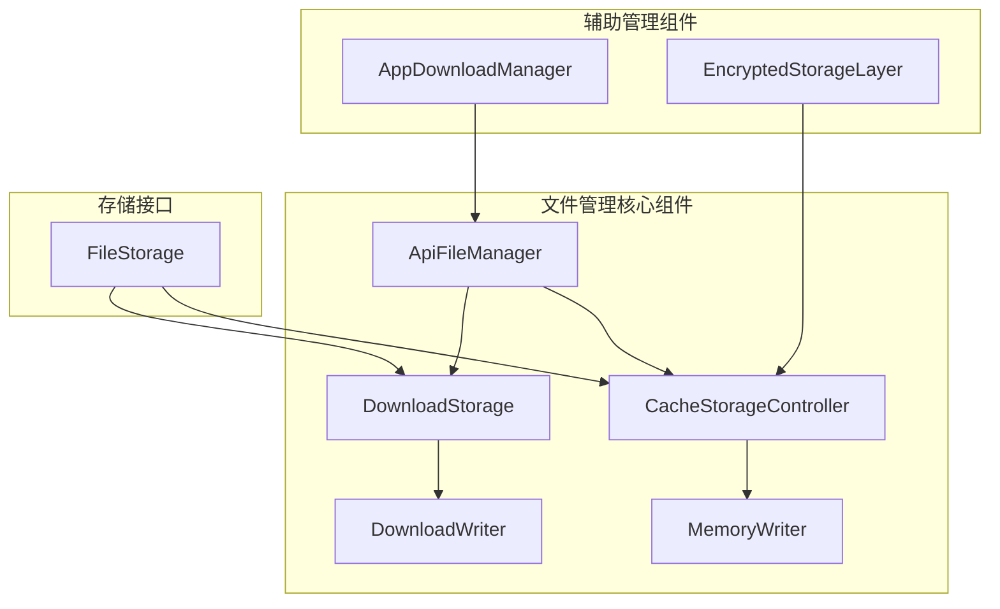
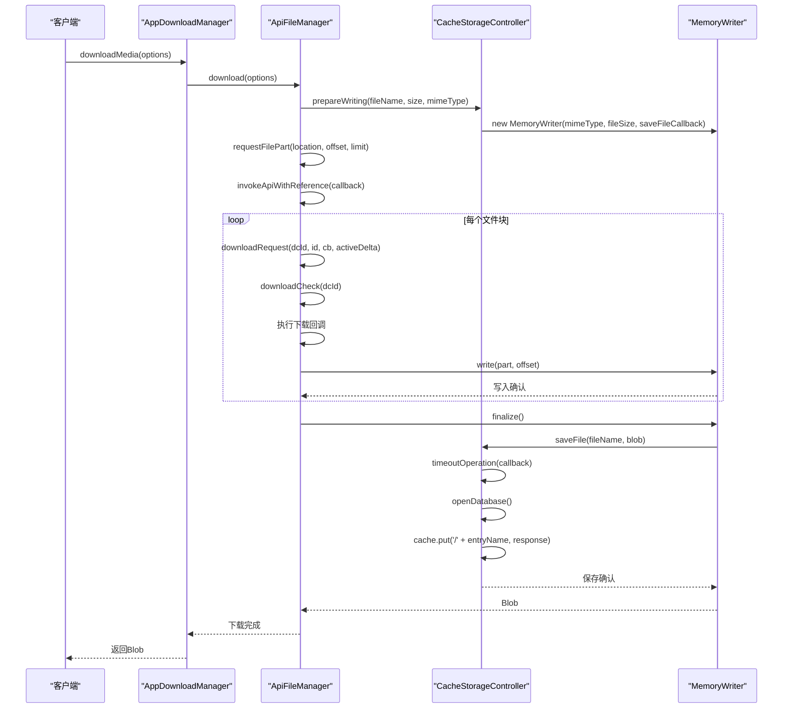
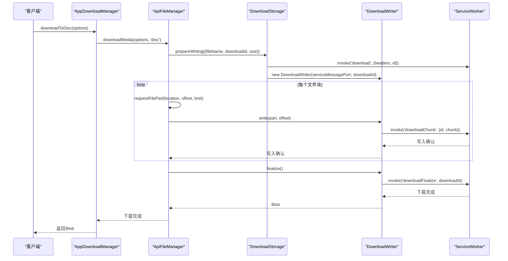
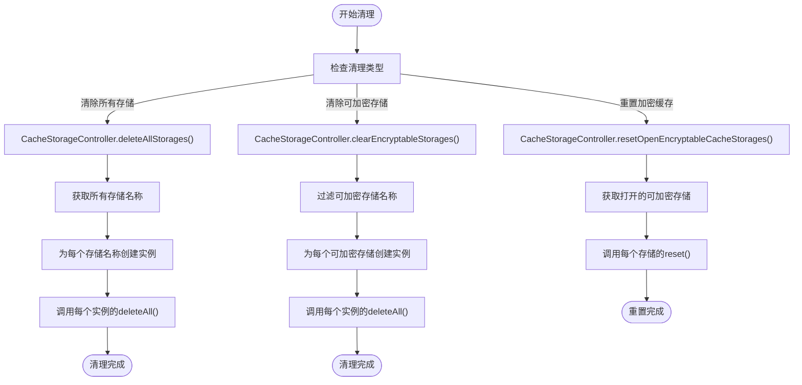
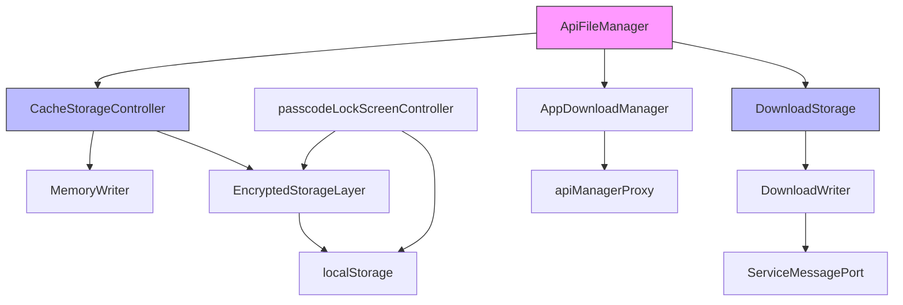

# 文件生命周期

<cite>
**本文档引用的文件**   
- [cacheStorage.ts](file://src/lib/files/cacheStorage.ts)
- [fileStorage.ts](file://src/lib/files/fileStorage.ts)
- [memoryWriter.ts](file://src/lib/files/memoryWriter.ts)
- [downloadStorage.ts](file://src/lib/files/downloadStorage.ts)
- [downloadWriter.ts](file://src/lib/files/downloadWriter.ts)
- [apiFileManager.ts](file://src/lib/mtproto/apiFileManager.ts)
- [appDownloadManager.ts](file://src/lib/appManagers/appDownloadManager.ts)
- [encryptedStorageLayer.ts](file://src/lib/encryptedStorageLayer.ts)
- [localStorage.ts](file://src/lib/localStorage.ts)
- [passcodeLockScreenController.tsx](file://src/components/passcodeLock/passcodeLockScreenController.tsx)
</cite>

## 目录
1. [简介](#简介)
2. [项目结构](#项目结构)
3. [核心组件](#核心组件)
4. [架构概述](#架构概述)
5. [详细组件分析](#详细组件分析)
6. [依赖分析](#依赖分析)
7. [性能考虑](#性能考虑)
8. [故障排除指南](#故障排除指南)
9. [结论](#结论)

## 简介
本文档详细描述了Telegram Web客户端中文件生命周期管理的实现机制。系统通过多层存储架构管理文件的下载、存储、使用和清理，支持临时文件与持久文件的区分管理，并实现了基于Service Worker的后台文件下载功能。文件管理器还集成了加密存储功能，确保用户数据的安全性。

## 项目结构
项目中的文件生命周期管理主要分布在`src/lib/files`和`src/lib/mtproto`目录中，通过多个组件协同工作实现完整的文件管理功能。



**图表来源**
- [apiFileManager.ts](file://src/lib/mtproto/apiFileManager.ts#L105-L137)
- [cacheStorage.ts](file://src/lib/files/cacheStorage.ts#L48-L72)
- [downloadStorage.ts](file://src/lib/files/downloadStorage.ts#L14-L15)
- [fileStorage.ts](file://src/lib/files/fileStorage.ts#L10-L11)

**章节来源**
- [apiFileManager.ts](file://src/lib/mtproto/apiFileManager.ts#L1-L137)
- [cacheStorage.ts](file://src/lib/files/cacheStorage.ts#L1-L72)

## 核心组件
文件生命周期管理的核心由`ApiFileManager`类实现，它协调文件的下载、上传和存储操作。`CacheStorageController`负责管理缓存存储，而`DownloadStorage`则处理通过Service Worker的文件下载。`MemoryWriter`和`DownloadWriter`作为流式写入器，分别处理内存和下载流的写入操作。

**章节来源**
- [apiFileManager.ts](file://src/lib/mtproto/apiFileManager.ts#L105-L137)
- [cacheStorage.ts](file://src/lib/files/cacheStorage.ts#L48-L72)
- [downloadStorage.ts](file://src/lib/files/downloadStorage.ts#L14-L15)

## 架构概述
文件生命周期管理采用分层架构设计，通过抽象的`FileStorage`接口统一不同存储后端的访问方式。系统实现了两种主要的存储实现：`CacheStorageController`用于常规缓存存储，`DownloadStorage`用于通过Service Worker的文件下载。

```mermaid
classDiagram
class FileStorage {
<<abstract>>
+getFile(fileName : string) : Promise~any~
+prepareWriting(...args : any[]) : {deferred : CancellablePromise~any~, getWriter : () => StreamWriter}
}
class CacheStorageController {
-dbName : CacheStorageDbName
-openDbPromise : Promise~Cache~
-config : CacheStorageDbConfigEntry
-useStorage : boolean
+getFile(fileName : string, method : 'blob' | 'json' | 'text') : Promise~any~
+saveFile(fileName : string, blob : Blob | Uint8Array) : Promise~Blob~
+prepareWriting(fileName : string, fileSize : number, mimeType : string) : {deferred : CancellablePromise~Blob~, getWriter : () => StreamWriter}
+delete(entryName : string) : Promise~boolean~
+deleteAll() : Promise~boolean~
}
class DownloadStorage {
+getFile(fileName : string) : Promise~any~
+prepareWriting({fileName, downloadId, size}) : {deferred : CancellablePromise~void~, getWriter : () => StreamWriter}
}
class StreamWriter {
<<abstract>>
+write(part : Uint8Array, offset? : number) : Promise~any~
+truncate?() : void
+trim?(size : number) : void
+finalize(saveToStorage? : boolean) : Promise~Blob~ | Blob
}
class MemoryWriter {
-bytes : Uint8Array
-mimeType : string
-size : number
-saveFileCallback? : (blob : Blob) => Promise~Blob~
+write(part : Uint8Array, offset : number) : Promise~any~
+truncate() : void
+trim(size : number) : void
+finalize(saveToStorage : boolean) : Blob
+getParts() : Uint8Array
+replaceParts(parts : Uint8Array) : void
}
class DownloadWriter {
-serviceMessagePort : ServiceMessagePort~true~
-downloadId : string
+write(part : Uint8Array, offset? : number) : Promise~any~
+finalize(saveToStorage? : boolean) : Promise~Blob~
}
FileStorage <|-- CacheStorageController
FileStorage <|-- DownloadStorage
StreamWriter <|-- MemoryWriter
StreamWriter <|-- DownloadWriter
CacheStorageController --> MemoryWriter
DownloadStorage --> DownloadWriter
```

**图表来源**
- [fileStorage.ts](file://src/lib/files/fileStorage.ts#L10-L11)
- [cacheStorage.ts](file://src/lib/files/cacheStorage.ts#L48-L72)
- [downloadStorage.ts](file://src/lib/files/downloadStorage.ts#L14-L15)
- [memoryWriter.ts](file://src/lib/files/memoryWriter.ts#L10-L11)
- [downloadWriter.ts](file://src/lib/files/downloadWriter.ts#L11-L12)

## 详细组件分析

### 文件存储管理分析
文件存储管理通过`CacheStorageController`实现，它基于浏览器的Cache API提供持久化存储功能。存储系统支持加密功能，当用户启用密码锁时，敏感文件会被加密存储。

#### 文件存储类图
```mermaid
classDiagram
class CacheStorageController {
-STORAGES : CacheStorageController[]
-openDbPromise : Promise~Cache~
-config : CacheStorageDbConfigEntry
-useStorage : boolean
-static disabledPromise : CancellablePromise~void~
+constructor(dbName : CacheStorageDbName)
+get isEncryptable() : boolean
+delete(entryName : string) : Promise~boolean~
+deleteAll() : Promise~boolean~
+reset() : void
+has(entryName : string) : Promise~boolean~
+get(entryName : string) : Promise~Response | undefined~
+save(entryName : string, response : Response) : Promise~void~
+getFile(fileName : string, method : 'blob' | 'json' | 'text') : Promise~any~
+saveFile(fileName : string, blob : Blob | Uint8Array) : Promise~Blob~
+timeoutOperation~T~(callback : (cache : Cache) => Promise~T~) : Promise~T~
+prepareWriting(fileName : string, fileSize : number, mimeType : string) : {deferred : CancellablePromise~Blob~, getWriter : () => StreamWriter}
+static toggleStorage(enabled : boolean, _clearWrite : boolean) : Promise~void~
+static deleteAllStorages() : Promise~void~
+static temporarilyToggle(enabled : boolean) : void
+static clearEncryptableStorages() : Promise~void~
+static getOpenEncryptableStorages() : CacheStorageController[]
+static resetOpenEncryptableCacheStorages() : void
}
class FileStorage {
<<abstract>>
+getFile(fileName : string) : Promise~any~
+prepareWriting(...args : any[]) : {deferred : CancellablePromise~any~, getWriter : () => StreamWriter}
}
FileStorage <|-- CacheStorageController
```

**图表来源**
- [cacheStorage.ts](file://src/lib/files/cacheStorage.ts#L48-L72)
- [fileStorage.ts](file://src/lib/files/fileStorage.ts#L10-L11)

#### 文件下载流程序列图


**图表来源**
- [apiFileManager.ts](file://src/lib/mtproto/apiFileManager.ts#L669-L848)
- [cacheStorage.ts](file://src/lib/files/cacheStorage.ts#L251-L262)
- [memoryWriter.ts](file://src/lib/files/memoryWriter.ts#L10-L11)

**章节来源**
- [apiFileManager.ts](file://src/lib/mtproto/apiFileManager.ts#L669-L848)
- [cacheStorage.ts](file://src/lib/files/cacheStorage.ts#L251-L262)
- [memoryWriter.ts](file://src/lib/files/memoryWriter.ts#L10-L11)

### 临时文件与持久文件管理分析
系统通过`DownloadStorage`和`DownloadWriter`实现临时文件的管理，主要用于通过Service Worker进行文件下载。这种机制允许在后台下载文件，即使页面关闭也能继续下载。

#### 临时文件管理类图
```mermaid
classDiagram
class DownloadStorage {
+getFile(fileName : string) : Promise~any~
+prepareWriting({fileName, downloadId, size}) : {deferred : CancellablePromise~void~, getWriter : () => StreamWriter}
}
class DownloadWriter {
-serviceMessagePort : ServiceMessagePort~true~
-downloadId : string
+write(part : Uint8Array, offset? : number) : Promise~any~
+finalize(saveToStorage? : boolean) : Promise~Blob~
}
class StreamWriter {
<<abstract>>
+write(part : Uint8Array, offset? : number) : Promise~any~
+finalize(saveToStorage? : boolean) : Promise~Blob~ | Blob
}
class ServiceMessagePort {
+invoke(method : string, payload : any) : Promise~any~
+invokeVoid(method : string, payload : any) : void
}
StreamWriter <|-- DownloadWriter
DownloadStorage --> DownloadWriter
DownloadWriter --> ServiceMessagePort
```

**图表来源**
- [downloadStorage.ts](file://src/lib/files/downloadStorage.ts#L14-L15)
- [downloadWriter.ts](file://src/lib/files/downloadWriter.ts#L11-L12)
- [streamWriter.ts](file://src/lib/files/streamWriter.ts#L7-L8)

#### 临时文件下载序列图


**图表来源**
- [appDownloadManager.ts](file://src/lib/appManagers/appDownloadManager.ts#L239-L361)
- [downloadStorage.ts](file://src/lib/files/downloadStorage.ts#L19-L37)
- [downloadWriter.ts](file://src/lib/files/downloadWriter.ts#L19-L27)

**章节来源**
- [appDownloadManager.ts](file://src/lib/appManagers/appDownloadManager.ts#L239-L361)
- [downloadStorage.ts](file://src/lib/files/downloadStorage.ts#L19-L37)
- [downloadWriter.ts](file://src/lib/files/downloadWriter.ts#L19-L27)

### 文件清理策略分析
文件清理策略通过`CacheStorageController`的静态方法实现，支持清除所有存储、仅清除可加密存储或重置打开的加密缓存存储。

#### 文件清理流程图


**图表来源**
- [cacheStorage.ts](file://src/lib/files/cacheStorage.ts#L271-L322)

**章节来源**
- [cacheStorage.ts](file://src/lib/files/cacheStorage.ts#L271-L322)

## 依赖分析
文件生命周期管理组件之间存在紧密的依赖关系，通过抽象接口解耦具体实现，提高了系统的可维护性和可扩展性。



**图表来源**
- [apiFileManager.ts](file://src/lib/mtproto/apiFileManager.ts#L106-L107)
- [cacheStorage.ts](file://src/lib/files/cacheStorage.ts#L14-L15)
- [downloadStorage.ts](file://src/lib/files/downloadStorage.ts#L14-L15)
- [appDownloadManager.ts](file://src/lib/appManagers/appDownloadManager.ts#L7-L8)
- [encryptedStorageLayer.ts](file://src/lib/encryptedStorageLayer.ts#L1-L2)
- [localStorage.ts](file://src/lib/localStorage.ts#L1-L2)
- [passcodeLockScreenController.tsx](file://src/components/passcodeLock/passcodeLockScreenController.tsx#L1-L2)

**章节来源**
- [apiFileManager.ts](file://src/lib/mtproto/apiFileManager.ts#L106-L107)
- [cacheStorage.ts](file://src/lib/files/cacheStorage.ts#L14-L15)
- [downloadStorage.ts](file://src/lib/files/downloadStorage.ts#L14-L15)

## 性能考虑
文件生命周期管理系统在性能方面进行了多项优化，包括下载任务的资源占用控制、后台执行策略和缓存预加载机制。

- **下载并发控制**：通过`REGULAR_DOWNLOAD_DELTA`和`PREMIUM_DOWNLOAD_DELTA`常量控制同时下载的文件块数量，避免过多的并发请求影响性能
- **后台执行**：利用Service Worker在后台执行文件下载，即使页面关闭也能继续下载
- **缓存预加载**：在初始化时预加载缓存中的文件信息，提高后续访问速度
- **资源清理**：定期清理已完成或已拒绝的引用promise，防止内存泄漏
- **超时机制**：为存储操作设置15秒超时，避免长时间阻塞

**章节来源**
- [apiFileManager.ts](file://src/lib/mtproto/apiFileManager.ts#L94-L96)
- [cacheStorage.ts](file://src/lib/files/cacheStorage.ts#L223-L248)
- [apiFileManager.ts](file://src/lib/mtproto/apiFileManager.ts#L160-L167)

## 故障排除指南
### 常见问题及解决方案

1. **文件下载失败**
   - 检查网络连接状态
   - 确认Service Worker是否正常运行
   - 检查存储空间是否充足
   - 查看浏览器控制台是否有相关错误信息

2. **文件无法加密存储**
   - 确认用户已设置密码锁
   - 检查加密密钥是否正确加载
   - 验证IndexedDB访问权限

3. **下载进度不更新**
   - 检查`download_progress`事件监听器是否正确注册
   - 确认Service Worker与主页面的通信通道正常
   - 验证下载ID是否正确传递

4. **缓存清理无效**
   - 确认调用的是正确的清理方法
   - 检查存储实例是否已正确初始化
   - 验证是否有其他引用阻止清理操作

**章节来源**
- [apiFileManager.ts](file://src/lib/mtproto/apiFileManager.ts#L264-L273)
- [cacheStorage.ts](file://src/lib/files/cacheStorage.ts#L220-L221)
- [appDownloadManager.ts](file://src/lib/appManagers/appDownloadManager.ts#L55-L66)
- [passcodeLockScreenController.tsx](file://src/components/passcodeLock/passcodeLockScreenController.tsx#L30-L50)

## 结论
Telegram Web客户端的文件生命周期管理系统通过分层架构设计，实现了高效、安全的文件管理功能。系统支持常规缓存存储和后台下载两种模式，满足不同场景的需求。通过抽象的`FileStorage`接口，系统能够灵活扩展新的存储后端。加密存储功能确保了用户数据的安全性，而Service Worker的集成则实现了强大的后台文件下载能力。整体设计充分考虑了性能优化和资源管理，为用户提供流畅的文件操作体验。