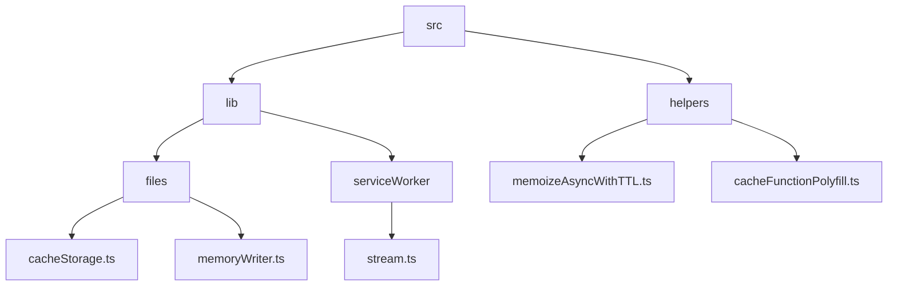
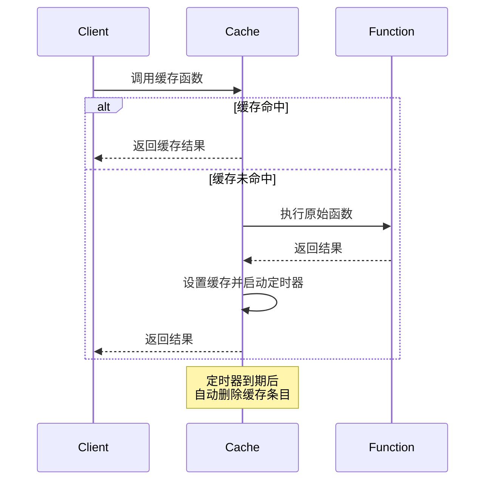
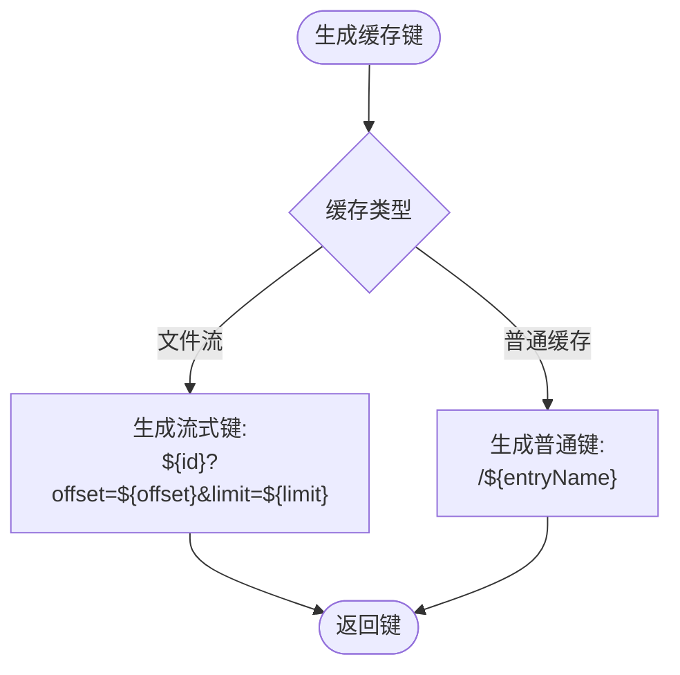
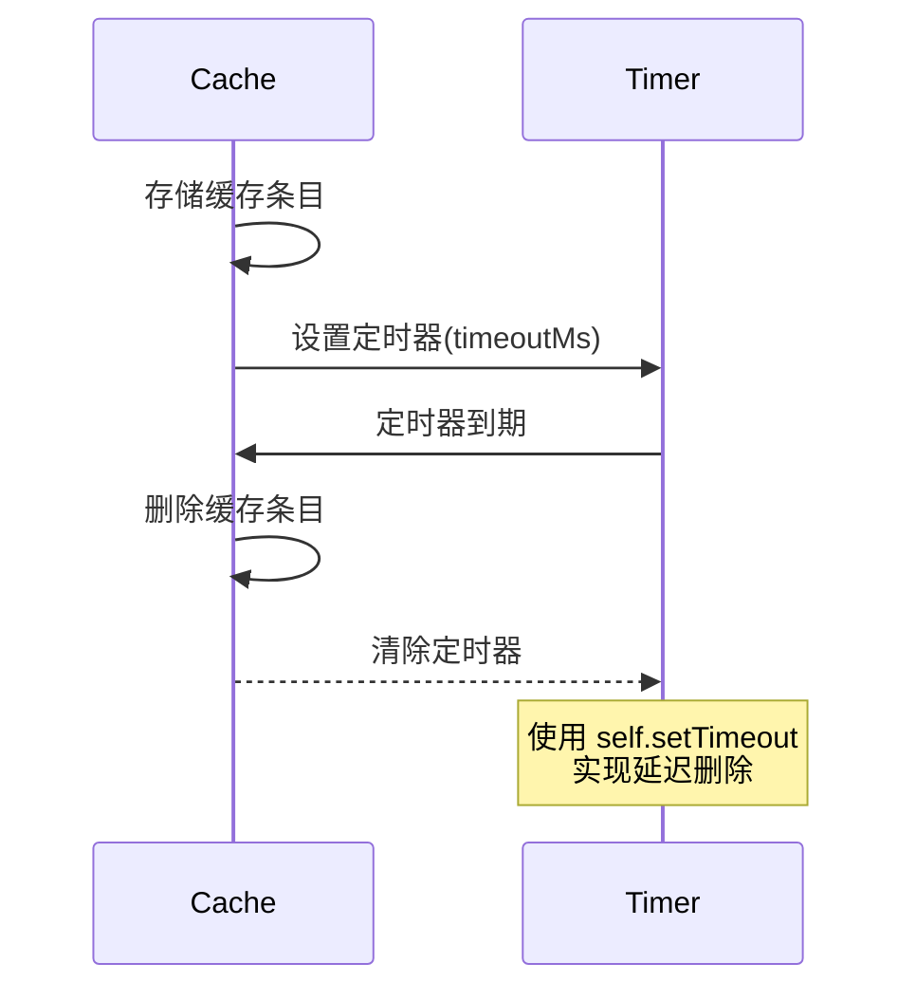
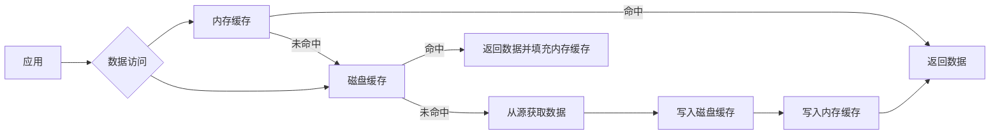
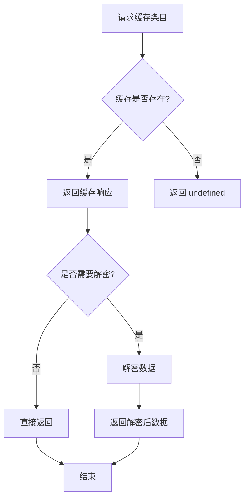
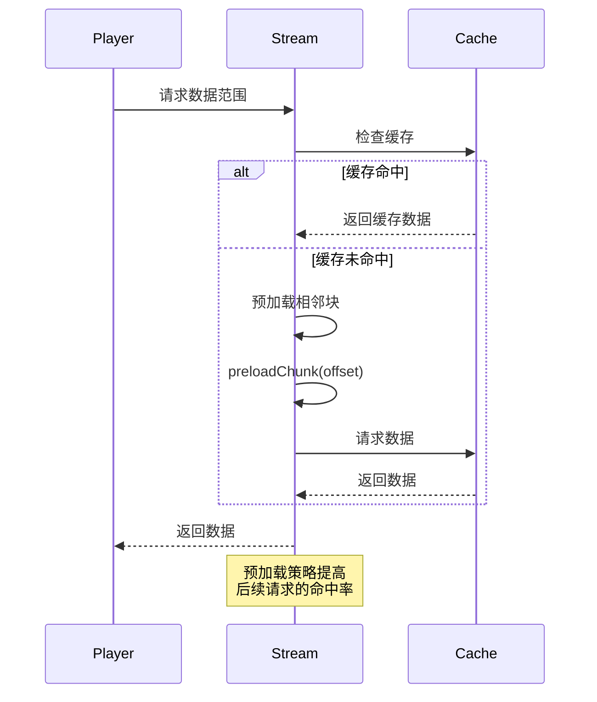
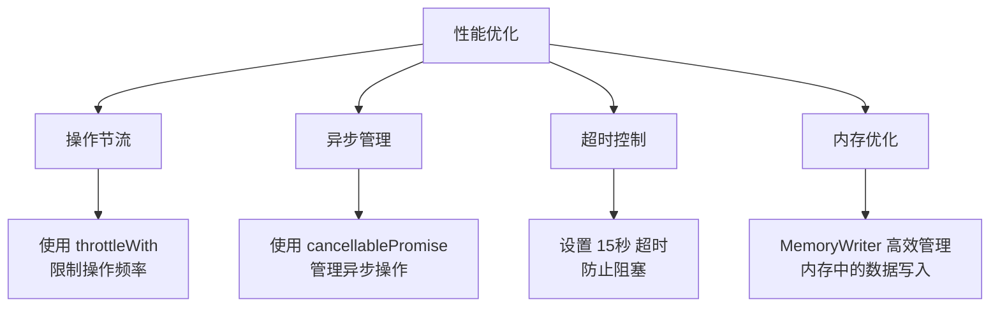

# 缓存策略

<cite>
**本文档中引用的文件**  
- [cacheStorage.ts](file://src/lib/files/cacheStorage.ts)
- [storage.ts](file://src/lib/storage.ts)
- [memoizeAsyncWithTTL.ts](file://src/helpers/memoizeAsyncWithTTL.ts)
- [cacheFunctionPolyfill.ts](file://src/helpers/cacheFunctionPolyfill.ts)
- [memoryWriter.ts](file://src/lib/files/memoryWriter.ts)
- [stream.ts](file://src/lib/serviceWorker/stream.ts)
</cite>

## 目录
1. [项目结构](#项目结构)
2. [核心组件](#核心组件)
3. [缓存存储实现机制](#缓存存储实现机制)
4. [LRU淘汰策略分析](#lru淘汰策略分析)
5. [缓存键生成规则](#缓存键生成规则)
6. [缓存有效期管理](#缓存有效期管理)
7. [内存缓存与磁盘缓存协同机制](#内存缓存与磁盘缓存协同机制)
8. [缓存命中与未命中处理流程](#缓存命中与未命中处理流程)
9. [缓存预加载策略](#缓存预加载策略)
10. [性能优化考虑](#性能优化考虑)
11. [代码示例](#代码示例)

## 项目结构



**图示来源**
- [cacheStorage.ts](file://src/lib/files/cacheStorage.ts)
- [stream.ts](file://src/lib/serviceWorker/stream.ts)
- [memoizeAsyncWithTTL.ts](file://src/helpers/memoizeAsyncWithTTL.ts)

**本节来源**
- [cacheStorage.ts](file://src/lib/files/cacheStorage.ts)
- [storage.ts](file://src/lib/storage.ts)

## 核心组件

系统中的缓存功能主要由以下几个核心组件构成：`CacheStorageController` 负责管理基于浏览器 Cache API 的缓存存储，`AppStorage` 提供基于 IndexedDB 的持久化存储，`memoizeAsyncWithTTL` 实现函数结果的内存缓存，以及 `stream.ts` 中的流式缓存处理机制。

**本节来源**
- [cacheStorage.ts](file://src/lib/files/cacheStorage.ts)
- [storage.ts](file://src/lib/storage.ts)
- [memoizeAsyncWithTTL.ts](file://src/helpers/memoizeAsyncWithTTL.ts)

## 缓存存储实现机制

缓存存储通过 `CacheStorageController` 类实现，该类封装了浏览器的 Cache API，提供了统一的缓存操作接口。系统定义了多种缓存类型，包括 `cachedAssets`、`cachedBackgrounds`、`cachedFiles` 等，每种类型都有不同的加密配置。

```mermaid
classDiagram
class CacheStorageController {
+dbName : CacheStorageDbName
+isEncryptable : boolean
+has(entryName : string) : Promise<boolean>
+get(entryName : string) : Promise<Response>
+save(entryName : string, response : Response) : Promise<void>
+getFile(fileName : string, method : 'blob'|'json'|'text') : Promise<any>
+saveFile(fileName : string, blob : Blob|Uint8Array) : Promise<Blob>
+delete(entryName : string) : Promise<boolean>
+deleteAll() : Promise<boolean>
}
class FileStorage {
<<abstract>>
+getFile(fileName : string) : Promise<any>
+prepareWriting(...args : any[]) : {deferred, getWriter}
}
CacheStorageController --> FileStorage : "实现"
```

**图示来源**
- [cacheStorage.ts](file://src/lib/files/cacheStorage.ts)

**本节来源**
- [cacheStorage.ts](file://src/lib/files/cacheStorage.ts#L48-L322)

## LRU淘汰策略分析

虽然代码库中没有显式实现传统的LRU（最近最少使用）淘汰算法，但通过 `memoizeAsyncWithTTL` 函数实现了基于时间的缓存淘汰机制。该机制通过设置缓存有效期（TTL）来自动清除过期的缓存条目。



**图示来源**
- [memoizeAsyncWithTTL.ts](file://src/helpers/memoizeAsyncWithTTL.ts#L13-L36)

**本节来源**
- [memoizeAsyncWithTTL.ts](file://src/helpers/memoizeAsyncWithTTL.ts#L13-L36)

## 缓存键生成规则

缓存键的生成遵循特定的命名约定和结构。对于文件流缓存，键由文档ID、偏移量和限制大小组成，格式为 `${docId}?offset=${alignedOffset}&limit=${limit}`。对于普通缓存条目，键前会添加斜杠前缀，如 `/${entryName}`。



**图示来源**
- [stream.ts](file://src/lib/serviceWorker/stream.ts#L310-L312)

**本节来源**
- [stream.ts](file://src/lib/serviceWorker/stream.ts#L310-L312)
- [cacheStorage.ts](file://src/lib/files/cacheStorage.ts#L139-L146)

## 缓存有效期管理

缓存有效期通过多种机制进行管理。`memoizeAsyncWithTTL` 函数使用 `setTimeout` 在指定时间后自动清除缓存条目。对于流式缓存，系统在响应头中添加 `X-Chunk-Cached-Time` 字段记录缓存时间戳。



**图示来源**
- [memoizeAsyncWithTTL.ts](file://src/helpers/memoizeAsyncWithTTL.ts#L27-L29)

**本节来源**
- [memoizeAsyncWithTTL.ts](file://src/helpers/memoizeAsyncWithTTL.ts#L27-L29)
- [stream.ts](file://src/lib/serviceWorker/stream.ts#L204-L205)

## 内存缓存与磁盘缓存协同机制

系统实现了内存缓存与磁盘缓存的协同工作机制。`CacheStorageController` 使用浏览器的 Cache API 作为磁盘缓存层，而 `memoizeAsyncWithTTL` 和 `cacheFunctionPolyfill` 则提供了内存缓存层。`MemoryWriter` 类在内存中累积数据，达到条件后写入磁盘缓存。



**图示来源**
- [cacheStorage.ts](file://src/lib/files/cacheStorage.ts)
- [memoizeAsyncWithTTL.ts](file://src/helpers/memoizeAsyncWithTTL.ts)
- [memoryWriter.ts](file://src/lib/files/memoryWriter.ts)

**本节来源**
- [cacheStorage.ts](file://src/lib/files/cacheStorage.ts)
- [memoizeAsyncWithTTL.ts](file://src/helpers/memoizeAsyncWithTTL.ts)
- [memoryWriter.ts](file://src/lib/files/memoryWriter.ts)

## 缓存命中与未命中处理流程

缓存命中与未命中的处理流程在 `CacheStorageController` 类中实现。当请求缓存条目时，系统首先检查是否存在对应的响应，如果存在则返回缓存数据，否则返回 undefined 表示缓存未命中。



**图示来源**
- [cacheStorage.ts](file://src/lib/files/cacheStorage.ts#L143-L161)

**本节来源**
- [cacheStorage.ts](file://src/lib/files/cacheStorage.ts#L143-L161)

## 缓存预加载策略

系统实现了智能的缓存预加载策略，特别是在流媒体处理中。`Stream` 类中的 `preloadChunk` 和 `preloadChunks` 方法会根据当前播放位置预加载相邻的数据块，以提高用户体验。



**图示来源**
- [stream.ts](file://src/lib/serviceWorker/stream.ts#L212-L232)

**本节来源**
- [stream.ts](file://src/lib/serviceWorker/stream.ts#L212-L232)

## 性能优化考虑

系统在多个层面进行了性能优化。通过 `throttleWith` 函数对存储操作进行节流，减少频繁的磁盘I/O。使用 `cancellablePromise` 管理异步操作，避免资源浪费。同时，通过 `timeoutOperation` 方法为缓存操作设置超时机制，防止长时间阻塞。



**图示来源**
- [storage.ts](file://src/lib/storage.ts#L99-L101)
- [cacheStorage.ts](file://src/lib/files/cacheStorage.ts#L223-L248)

**本节来源**
- [storage.ts](file://src/lib/storage.ts#L99-L101)
- [cacheStorage.ts](file://src/lib/files/cacheStorage.ts#L223-L248)

## 代码示例

以下是缓存策略核心逻辑的代码示例路径：

- `CacheStorageController` 类定义: [cacheStorage.ts](file://src/lib/files/cacheStorage.ts#L48-L322)
- `memoizeAsyncWithTTL` 函数实现: [memoizeAsyncWithTTL.ts](file://src/helpers/memoizeAsyncWithTTL.ts#L13-L36)
- 流式缓存键生成: [stream.ts](file://src/lib/serviceWorker/stream.ts#L310-L312)
- 内存写入器实现: [memoryWriter.ts](file://src/lib/files/memoryWriter.ts#L10-L58)
- 缓存函数装饰器: [cacheFunctionPolyfill.ts](file://src/helpers/cacheFunctionPolyfill.ts#L12-L28)

**本节来源**
- [cacheStorage.ts](file://src/lib/files/cacheStorage.ts#L48-L322)
- [memoizeAsyncWithTTL.ts](file://src/helpers/memoizeAsyncWithTTL.ts#L13-L36)
- [stream.ts](file://src/lib/serviceWorker/stream.ts#L310-L312)
- [memoryWriter.ts](file://src/lib/files/memoryWriter.ts#L10-L58)
- [cacheFunctionPolyfill.ts](file://src/helpers/cacheFunctionPolyfill.ts#L12-L28)