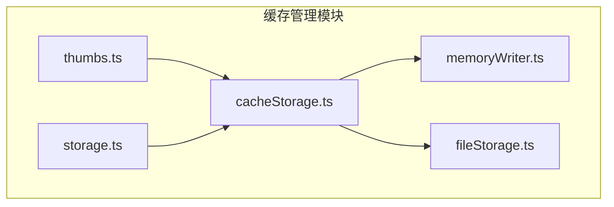
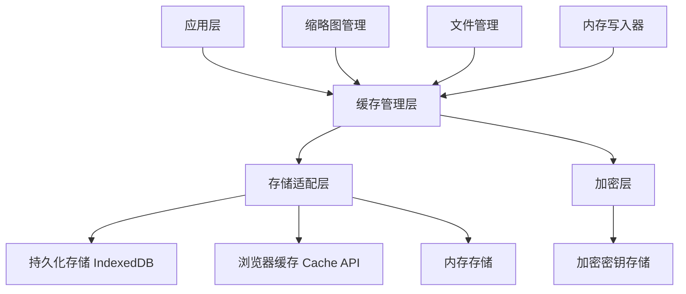
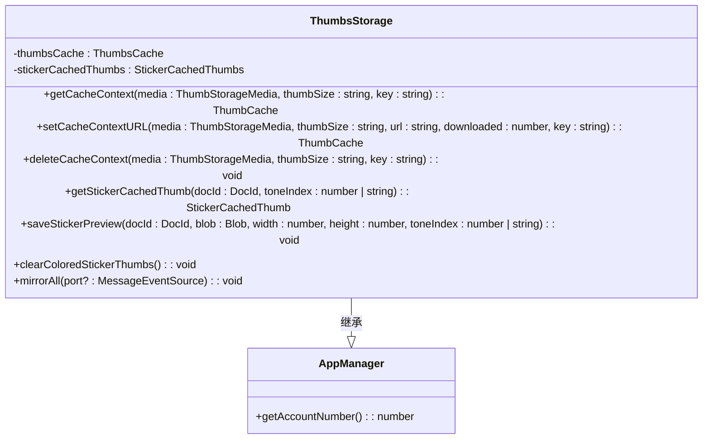
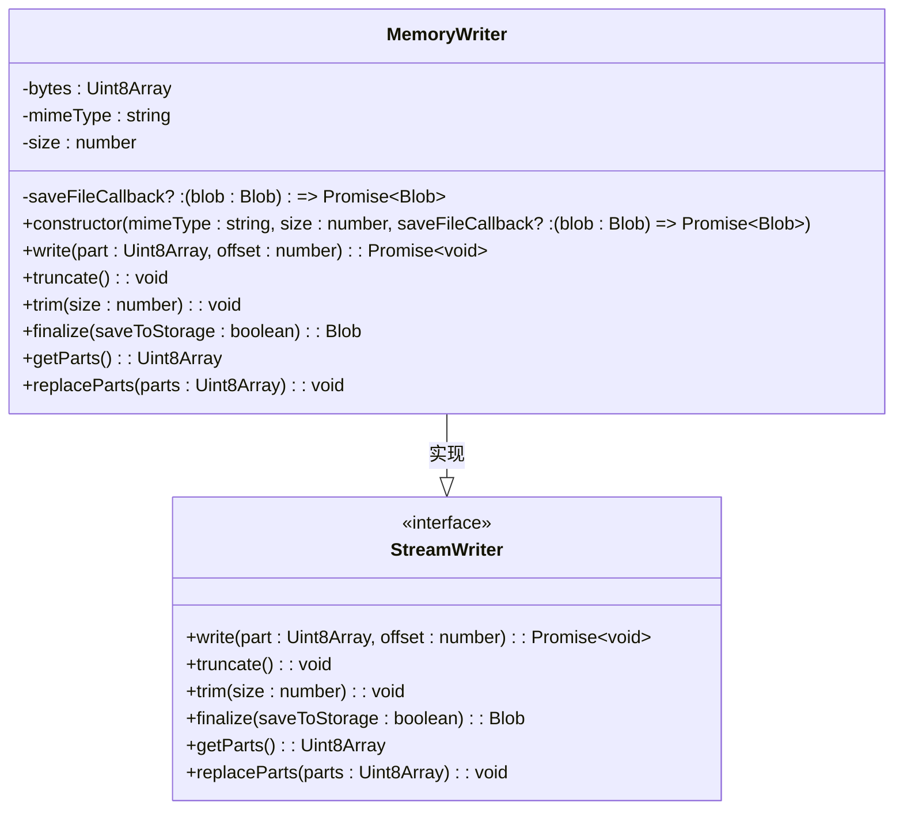
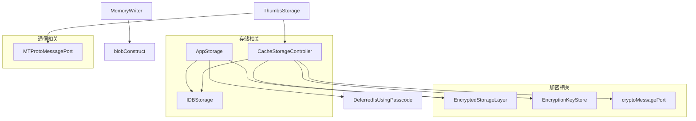

# 缓存管理

<cite>
**本文档引用的文件**
- [cacheStorage.ts](file://src/lib/files/cacheStorage.ts)
- [thumbs.ts](file://src/lib/storages/thumbs.ts)
- [storage.ts](file://src/lib/storage.ts)
- [memoryWriter.ts](file://src/lib/files/memoryWriter.ts)
- [fileStorage.ts](file://src/lib/files/fileStorage.ts)
- [getThumbKey.ts](file://src/lib/storages/utils/thumbs/getThumbKey.ts)
</cite>

## 目录
1. [简介](#简介)
2. [项目结构](#项目结构)
3. [核心组件](#核心组件)
4. [架构概述](#架构概述)
5. [详细组件分析](#详细组件分析)
6. [依赖分析](#依赖分析)
7. [性能考虑](#性能考虑)
8. [故障排除指南](#故障排除指南)
9. [结论](#结论)

## 简介
本文档详细说明了Telegram Web应用中的缓存管理功能，重点介绍下载存储和文件存储的实现机制。文档涵盖了缓存策略、磁盘空间管理、文件生命周期、缩略图缓存处理、缓存清理策略、多账户环境下的缓存隔离以及性能优化等方面。

## 项目结构
该项目采用模块化结构，缓存管理功能主要分布在`src/lib/files`和`src/lib/storages`目录下。核心缓存功能由`cacheStorage.ts`实现，缩略图缓存由`thumbs.ts`管理，而通用存储功能由`storage.ts`提供。



**Diagram sources**
- [cacheStorage.ts](file://src/lib/files/cacheStorage.ts)
- [thumbs.ts](file://src/lib/storages/thumbs.ts)
- [storage.ts](file://src/lib/storage.ts)

**Section sources**
- [cacheStorage.ts](file://src/lib/files/cacheStorage.ts)
- [thumbs.ts](file://src/lib/storages/thumbs.ts)

## 核心组件
缓存管理系统由多个核心组件构成，包括缓存存储控制器、缩略图存储、内存写入器和文件存储接口。这些组件协同工作，实现了高效的缓存管理和文件处理功能。

**Section sources**
- [cacheStorage.ts](file://src/lib/files/cacheStorage.ts#L48-L322)
- [thumbs.ts](file://src/lib/storages/thumbs.ts#L43-L151)

## 架构概述
缓存管理系统的架构基于浏览器的Cache API和IndexedDB技术，结合了内存缓存和持久化存储的优势。系统通过分层设计实现了不同类型数据的分类存储和管理。



**Diagram sources**
- [cacheStorage.ts](file://src/lib/files/cacheStorage.ts#L48-L322)
- [storage.ts](file://src/lib/storage.ts#L46-L487)

## 详细组件分析

### 缓存存储控制器分析
缓存存储控制器是整个缓存系统的核心，负责管理不同类型的缓存数据。

#### 类图
```mermaid
classDiagram
class CacheStorageController {
+dbName : CacheStorageDbName
-openDbPromise : Promise~Cache~
-config : CacheStorageDbConfigEntry
-useStorage : boolean
+get isEncryptable() : boolean
+delete(entryName : string) : Promise~boolean~
+deleteAll() : Promise~boolean~
+reset() : void
+has(entryName : string) : Promise~boolean~
+get(entryName : string) : Promise~Response | undefined~
+save(entryName : string, response : Response) : Promise~void~
+getFile(fileName : string, method : 'blob' | 'json' | 'text') : Promise~any~
+saveFile(fileName : string, blob : Blob | Uint8Array) : Promise~Blob~
+timeoutOperation~T~(callback : (cache : Cache) => Promise~T~) : Promise~T~
+prepareWriting(fileName : string, fileSize : number, mimeType : string) : {deferred : CancellablePromise~Blob~, getWriter : () => StreamWriter}
+static toggleStorage(enabled : boolean, _clearWrite : boolean) : Promise~void~
+static deleteAllStorages() : Promise~void~
+static temporarilyToggle(enabled : boolean) : void
+static clearEncryptableStorages() : Promise~void~
+static getOpenEncryptableStorages() : CacheStorageController[]
+static resetOpenEncryptableCacheStorages() : void
}
class FileStorage {
+abstract getFile(fileName : string) : Promise~any~
+abstract prepareWriting(...args : any[]) : {deferred : CancellablePromise~any~, getWriter : () => StreamWriter}
}
CacheStorageController --|> FileStorage : 实现
CacheStorageController --> MemoryWriter : 使用
```

**Diagram sources**
- [cacheStorage.ts](file://src/lib/files/cacheStorage.ts#L48-L322)
- [fileStorage.ts](file://src/lib/files/fileStorage.ts#L10-L13)

### 缩略图存储分析
缩略图存储组件专门负责管理媒体文件的缩略图缓存，包括图片、文档和贴纸的缩略图。

#### 类图


**Diagram sources**
- [thumbs.ts](file://src/lib/storages/thumbs.ts#L43-L151)
- [getThumbKey.ts](file://src/lib/storages/utils/thumbs/getThumbKey.ts#L7-L13)

### 内存写入器分析
内存写入器组件负责在内存中构建文件，支持分块写入和最终持久化存储。

#### 类图


**Diagram sources**
- [memoryWriter.ts](file://src/lib/files/memoryWriter.ts#L10-L58)
- [fileStorage.ts](file://src/lib/files/fileStorage.ts#L8-L9)

## 依赖分析
缓存管理系统与其他组件存在紧密的依赖关系，形成了完整的数据管理链条。



**Diagram sources**
- [cacheStorage.ts](file://src/lib/files/cacheStorage.ts#L13-L15)
- [storage.ts](file://src/lib/storage.ts#L19-L22)
- [thumbs.ts](file://src/lib/storages/thumbs.ts#L11-L12)

## 性能考虑
缓存管理系统在设计时充分考虑了性能优化，通过多种机制提升缓存命中率和内存使用效率。

1. **缓存分层策略**：系统采用多级缓存策略，包括内存缓存、浏览器缓存和持久化存储，根据数据访问频率自动选择最优存储位置。

2. **异步操作优化**：所有存储操作都采用异步方式执行，避免阻塞主线程，确保应用响应性。

3. **批量操作**：通过`throttleWith`机制对存储操作进行节流，将多个连续的写入操作合并为批量操作，减少I/O开销。

4. **内存管理**：内存写入器采用预分配缓冲区的方式，避免频繁的内存分配和回收，提高内存使用效率。

5. **缓存清理**：系统实现了智能的缓存清理策略，根据存储空间使用情况和数据访问频率自动清理过期或低频访问的缓存数据。

**Section sources**
- [cacheStorage.ts](file://src/lib/files/cacheStorage.ts#L218-L248)
- [storage.ts](file://src/lib/storage.ts#L99-L101)

## 故障排除指南
在使用缓存管理系统时，可能会遇到以下常见问题及解决方案：

1. **缓存存储失败**：检查浏览器是否支持Cache API，确认存储空间是否充足，检查是否有权限限制。

2. **加密缓存访问失败**：确保加密密钥已正确生成和存储，检查密码锁状态是否影响加密功能。

3. **缩略图加载缓慢**：检查网络连接状态，确认缩略图URL是否正确生成，验证缓存键生成逻辑。

4. **内存泄漏**：确保及时释放不再使用的Blob URL，检查内存写入器的finalize调用是否完整。

5. **多账户缓存冲突**：验证账户编号是否正确传递，确认缓存键中包含正确的账户标识。

**Section sources**
- [cacheStorage.ts](file://src/lib/files/cacheStorage.ts#L144-L160)
- [thumbs.ts](file://src/lib/storages/thumbs.ts#L94-L105)

## 结论
Telegram Web应用的缓存管理系统通过精心设计的架构和高效的实现，提供了可靠的缓存管理功能。系统支持多种缓存类型，实现了安全的加密存储，并通过智能的缓存策略优化了性能表现。多账户环境下的缓存隔离机制确保了数据的安全性和独立性。整体设计充分考虑了Web应用的特性和限制，为用户提供流畅的使用体验。