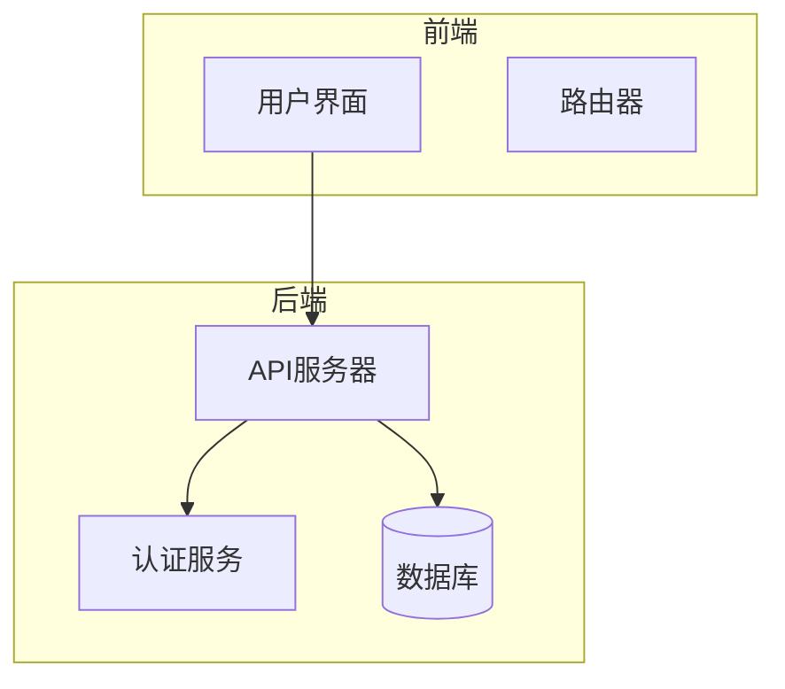
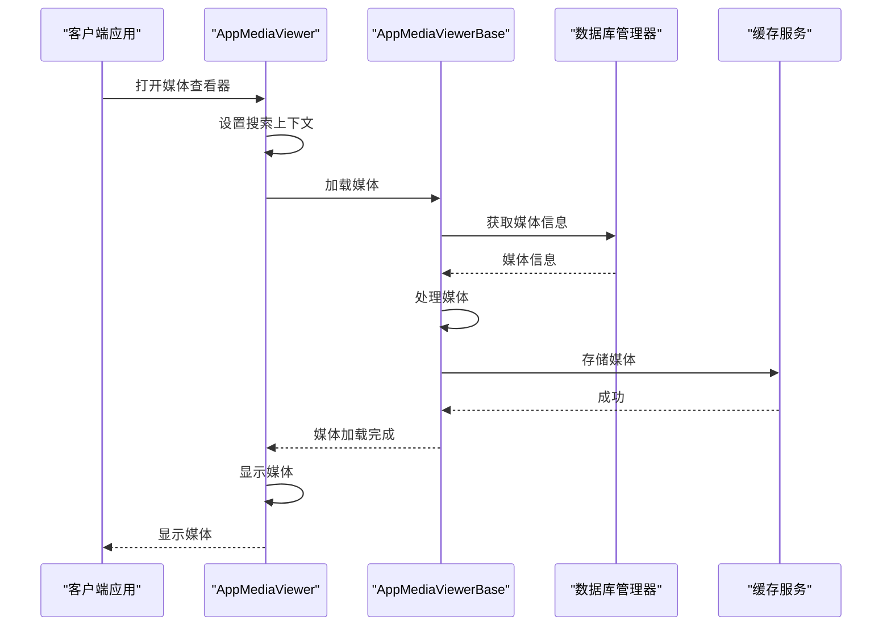
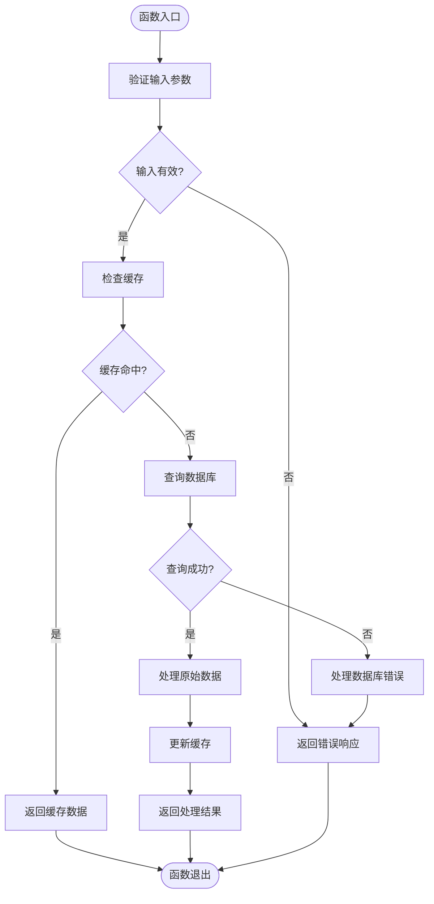
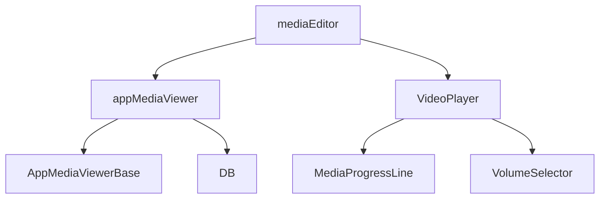

# 媒体处理

<cite>
**本文档中引用的文件**  
- [mediaEditor.tsx](file://src/components/mediaEditor/mediaEditor.tsx)
- [index.ts](file://src/components/mediaEditor/index.ts)
- [context.ts](file://src/components/mediaEditor/context.ts)
- [createFinalResult.ts](file://src/components/mediaEditor/finalRender/createFinalResult.ts)
- [appMediaViewer.ts](file://src/components/appMediaViewer.ts)
- [mediaPlayer/index.ts](file://src/lib/mediaPlayer/index.ts)
- [onMediaLoad.ts](file://src/helpers/onMediaLoad.ts)
- [mediaMimeTypesSupport.ts](file://src/environment/mediaMimeTypesSupport.ts)
- [videoMimeTypesSupport.ts](file://src/environment/videoMimeTypesSupport.ts)
- [imageMimeTypesSupport.ts](file://src/environment/imageMimeTypesSupport.ts)
</cite>

## 目录
1. [简介](#简介)
2. [项目结构](#项目结构)
3. [核心组件](#核心组件)
4. [架构概述](#架构概述)
5. [详细组件分析](#详细组件分析)
6. [依赖分析](#依赖分析)
7. [性能考虑](#性能考虑)
8. [故障排除指南](#故障排除指南)
9. [结论](#结论)

## 简介
本文档详细介绍了媒体处理功能，包括图片、视频、音频消息的上传、处理和播放机制。文档还描述了mediaEditor组件的编辑功能和用户界面，HLS流媒体的实现和自适应码率切换，媒体预览生成和缩略图处理策略，媒体缓存和离线访问的实现细节，以及性能优化如懒加载和资源预取。此外，文档还解释了媒体格式支持和转换策略。

## 项目结构
项目结构包括多个目录，如`handlebarsHelpers`、`public`、`snapshot-server`和`src`。`src`目录包含组件、配置、环境、帮助程序、钩子、库、模拟、页面、脚本、SCSS、存储和测试等子目录。媒体处理相关的组件主要位于`src/components`目录下，特别是`mediaEditor`和`appMediaViewer`。



**图表来源**
- [mediaEditor.tsx](file://src/components/mediaEditor/mediaEditor.tsx)
- [appMediaViewer.ts](file://src/components/appMediaViewer.ts)

**章节来源**
- [mediaEditor.tsx](file://src/components/mediaEditor/mediaEditor.tsx)
- [appMediaViewer.ts](file://src/components/appMediaViewer.ts)

## 核心组件
核心组件包括`mediaEditor`、`appMediaViewer`和`VideoPlayer`。`mediaEditor`组件负责媒体的编辑功能，`appMediaViewer`组件负责媒体的查看和播放，`VideoPlayer`类提供了视频播放的控制和功能。

**章节来源**
- [mediaEditor.tsx](file://src/components/mediaEditor/mediaEditor.tsx)
- [appMediaViewer.ts](file://src/components/appMediaViewer.ts)
- [index.ts](file://src/lib/mediaPlayer/index.ts)

## 架构概述
系统架构包括前端用户界面、后端API服务器、认证服务和数据库。前端通过API服务器与后端服务进行通信，认证服务负责用户认证，数据库存储媒体文件和用户数据。

```mermaid
classDiagram
class VideoPlayer {
+video : HTMLVideoElement
+wrapper : HTMLElement
+progress : MediaProgressLine
+skin : 'default'
+live : boolean
+listenerSetter : ListenerSetter
+playbackRateButton : ReturnType<typeof createPlaybackRateButton>
+speedDragHandler : ReturnType<typeof createSpeedDragHandler>
+qualityLevelsButton : ReturnType<typeof createQualityLevelsSwitchButton>
+pipButton : HTMLElement
+liveMenuButton : HTMLElement
+toggles : HTMLElement[]
+mainToggle : HTMLElement
+controls : HTMLElement
+gradient : HTMLElement
+liveEl : HTMLElement
+onPlaybackRateMenuToggle? : (open : boolean) => void
+onPip? : (pip : boolean) => void
+onPipClose? : () => void
+onVolumeChange : VolumeSelector['onVolumeChange']
+onFullScreen : (active : boolean) => void
+onFullScreenToPip : () => void
+canPause : boolean
+canSeek : boolean
+_inPip = false
+_width : number
+_height : number
+emptyPipVideo : HTMLVideoElement
+debouncedPip : (pip : boolean) => void
+debouncePipTime : number
+emptyPipVideoSource : CanvasImageSource
+listenKeyboardEvents : 'always' | 'fullscreen'
+hadContainer : boolean
+useGlobalVolume : VolumeSelector['useGlobalVolume']
+volumeSelector : VolumeSelector
+isPlaying : boolean
+shouldEnableSoundOnClick : () => boolean
+constructor(video : HTMLVideoElement, container? : HTMLElement, play? : boolean, streamable? : boolean, duration? : number, live? : boolean, width? : number, height? : number, videoTimestamps? : VideoTimestamp[], onPlaybackRateMenuToggle? : VideoPlayer['onPlaybackRateMenuToggle'], onPip? : VideoPlayer['onPip'], onPipClose? : VideoPlayer['onPipClose'], listenKeyboardEvents? : VideoPlayer['listenKeyboardEvents'], useGlobalVolume? : VolumeSelector['useGlobalVolume'], onVolumeChange? : VideoPlayer['onVolumeChange'], onFullScreen? : (active : boolean) => void, onFullScreenToPip? : VideoPlayer['onFullScreenToPip'], shouldEnableSoundOnClick? : VideoPlayer['shouldEnableSoundOnClick'])
+get width() : number
+get height() : number
+setIsPlaying(isPlaying : boolean) : void
+stylePlayer(initDuration : number) : void
+createQualityLevelsButton() : HTMLElement
+loadQualityLevels() : Promise<void>
+checkInteraction() : boolean
+_onPip(pip : boolean) : void
+onEnterPictureInPictureLeave(e : Event) : void
+onEnterPictureInPicture(e : Event) : void
+onLeavePictureInPicture() : void
+addPipListeners(video : HTMLVideoElement) : void
+requestPictureInPicture() : Promise<void>
+togglePlay(isPaused : boolean) : void
+buildControls() : string
+cancelFullScreen() : void
+toggleFullScreen() : void
+toggleActivity(active : boolean) : void
+isFullScreen() : boolean
+_onFullScreen(fullScreenButton : HTMLElement, noEvent? : boolean) : void
+dimBackground() : void
+setTimestamp(timestamp : number) : void
+cleanup() : void
+unmount() : void
+setupLiveMenu(buttons : ButtonMenuItemOptionsVerifiable[]) : void
+updateLiveViewersCount(count : number) : void
+get inPip() : boolean
}
class MediaEditor {
+onClose : (hasGif : boolean) => void
+managers : AppManagers
+onEditFinish : (result : MediaEditorFinalResult) => void
+onCanvasReady : (canvas : HTMLCanvasElement) => Promise<void>
+onImageRendered : () => void
+mediaSrc : string
+mediaType : MediaType
+mediaBlob : Blob
+mediaSize : NumberPair
+editingMediaState? : EditingMediaState
+MediaEditor(props : MediaEditorProps) : JSX.Element
+openMediaEditor(props : MediaEditorProps, HotReloadGuardProvider : typeof SolidJSHotReloadGuardProvider) : void
}
class AppMediaViewer {
+listLoader : SearchListLoader<AppMediaViewerTargetType>
+btnMenuForward : ButtonMenuItemOptionsVerifiable
+btnMenuDownload : ButtonMenuItemOptionsVerifiable
+btnMenuDelete : ButtonMenuItemOptionsVerifiable
+searchContext : MediaSearchContext
+constructor(local? : boolean, sponsored? : boolean)
+setListeners() : void
+getMessageByPeer(peerId : PeerId, mid : number) : Promise<MyMessage>
+onPrevClick(target : AppMediaViewerTargetType) : Promise<void>
+onNextClick(target : AppMediaViewerTargetType) : Promise<void>
+onDeleteClick() : void
+onForwardClick() : void
+onAuthorClick(e : MouseEvent) : Promise<void>
+onDownloadClick(_ : any, docId? : DocId) : Promise<void>
+setCaption(message : MyMessage) : void
+removeTimestamps() : void
+saveTimestamps(messageContent : HTMLElement, loadPromises : Promise<any>[]) : Promise<void>
+extractTimestampText(element : Element) : string
+setSearchContext(context : MediaSearchContext) : AppMediaViewer
+openMedia({message, index, target, fromRight, reverse, prevTargets, nextTargets, mediaTimestamp} : {message : MyMessage, index? : number, target? : HTMLElement, fromRight? : number, reverse? : boolean, prevTargets? : AppMediaViewerTargetType[], nextTargets? : AppMediaViewerTargetType[], mediaTimestamp? : number}) : Promise<void>
+isMediaCompatibleForDocumentViewer(media : MyPhoto | MyDocument) : boolean
}
VideoPlayer --> MediaEditor
VideoPlayer --> AppMediaViewer
```

**图表来源**
- [index.ts](file://src/lib/mediaPlayer/index.ts)
- [mediaEditor.tsx](file://src/components/mediaEditor/mediaEditor.tsx)
- [appMediaViewer.ts](file://src/components/appMediaViewer.ts)

## 详细组件分析

### mediaEditor组件分析
`mediaEditor`组件提供了媒体编辑功能，包括调整、裁剪、旋转和添加文本等。组件使用SolidJS框架构建，支持响应式设计和高效的状态管理。

#### 对象导向组件
```mermaid
classDiagram
class MediaEditor {
+onClose : (hasGif : boolean) => void
+managers : AppManagers
+onEditFinish : (result : MediaEditorFinalResult) => void
+onCanvasReady : (canvas : HTMLCanvasElement) => Promise<void>
+onImageRendered : () => void
+mediaSrc : string
+mediaType : MediaType
+mediaBlob : Blob
+mediaSize : NumberPair
+editingMediaState? : EditingMediaState
+MediaEditor(props : MediaEditorProps) : JSX.Element
+openMediaEditor(props : MediaEditorProps, HotReloadGuardProvider : typeof SolidJSHotReloadGuardProvider) : void
}
class MediaEditorContext {
+managers : AppManagers
+mediaSrc : string
+mediaType : MediaType
+mediaBlob : Blob
+mediaSize : NumberPair
+mediaState : Store<EditingMediaState>
+editorState : Store<MediaEditorState>
+actions : EditorOverridableGlobalActions
+hasModifications : Accessor<boolean>
+imageRatio : number
+resizableLayersSeed : number
}
class EditingMediaState {
+scale : number
+rotation : number
+translation : NumberPair
+flip : NumberPair
+currentImageRatio : number
+currentVideoTime : number
+videoCropStart : number
+videoCropLength : number
+videoThumbnailPosition : number
+videoMuted : boolean
+videoQuality : number
+adjustments : Record<AdjustmentKey, number>
+resizableLayers : ResizableLayer[]
+brushDrawnLines : BrushDrawnLine[]
+history : HistoryItem[]
+redoHistory : HistoryItem[]
}
class MediaEditorState {
+isReady : boolean
+pixelRatio : number
+renderingPayload? : RenderingPayload
+currentTab : string
+imageSize? : NumberPair
+canvasSize? : NumberPair
+fixedImageRatioKey? : string
+finalTransform : FinalTransform
+currentTextLayerInfo : TextLayerInfo
+selectedResizableLayer? : number
+stickersLayersInfo : Record<number, StickerRenderingInfo>
+imageCanvas? : HTMLCanvasElement
+brushCanvas? : HTMLCanvasElement
+currentBrush : {color : string, size : number, brush : string}
+previewBrushSize? : number
+resizeHandlesContainer? : HTMLDivElement
+isAdjusting : boolean
+isMoving : boolean
+isPlaying : boolean
}
MediaEditor --> MediaEditorContext
MediaEditorContext --> EditingMediaState
MediaEditorContext --> MediaEditorState
```

**图表来源**
- [mediaEditor.tsx](file://src/components/mediaEditor/mediaEditor.tsx)
- [context.ts](file://src/components/mediaEditor/context.ts)

### appMediaViewer组件分析
`appMediaViewer`组件负责媒体的查看和播放，支持图片、视频和音频消息。组件提供了播放控制、字幕显示和媒体信息展示功能。

#### API/服务组件


**图表来源**
- [appMediaViewer.ts](file://src/components/appMediaViewer.ts)
- [appMediaViewerBase.ts](file://src/components/appMediaViewerBase.ts)

### 复杂逻辑组件


**图表来源**
- [onMediaLoad.ts](file://src/helpers/onMediaLoad.ts)

**章节来源**
- [onMediaLoad.ts](file://src/helpers/onMediaLoad.ts)

## 依赖分析
组件之间的依赖关系包括`mediaEditor`依赖`appMediaViewer`和`VideoPlayer`，`appMediaViewer`依赖`AppMediaViewerBase`和数据库管理器，`VideoPlayer`依赖`MediaProgressLine`和`VolumeSelector`。



**图表来源**
- [mediaEditor.tsx](file://src/components/mediaEditor/mediaEditor.tsx)
- [appMediaViewer.ts](file://src/components/appMediaViewer.ts)
- [index.ts](file://src/lib/mediaPlayer/index.ts)

**章节来源**
- [mediaEditor.tsx](file://src/components/mediaEditor/mediaEditor.tsx)
- [appMediaViewer.ts](file://src/components/appMediaViewer.ts)
- [index.ts](file://src/lib/mediaPlayer/index.ts)

## 性能考虑
性能优化包括懒加载、资源预取、缓存策略和自适应码率切换。媒体预览生成和缩略图处理策略也考虑了性能因素，确保快速加载和流畅播放。

## 故障排除指南
常见问题包括媒体加载失败、播放卡顿和编辑功能异常。解决方案包括检查网络连接、清除缓存和更新应用。

**章节来源**
- [onMediaLoad.ts](file://src/helpers/onMediaLoad.ts)
- [mediaPlayer/index.ts](file://src/lib/mediaPlayer/index.ts)

## 结论
本文档详细介绍了媒体处理功能的各个方面，包括上传、处理、播放、编辑、缓存和性能优化。通过深入分析核心组件和架构，提供了全面的技术指导和最佳实践。