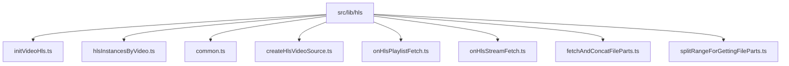
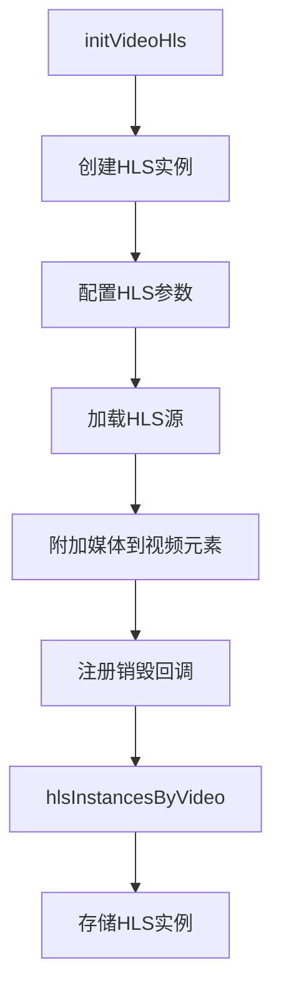
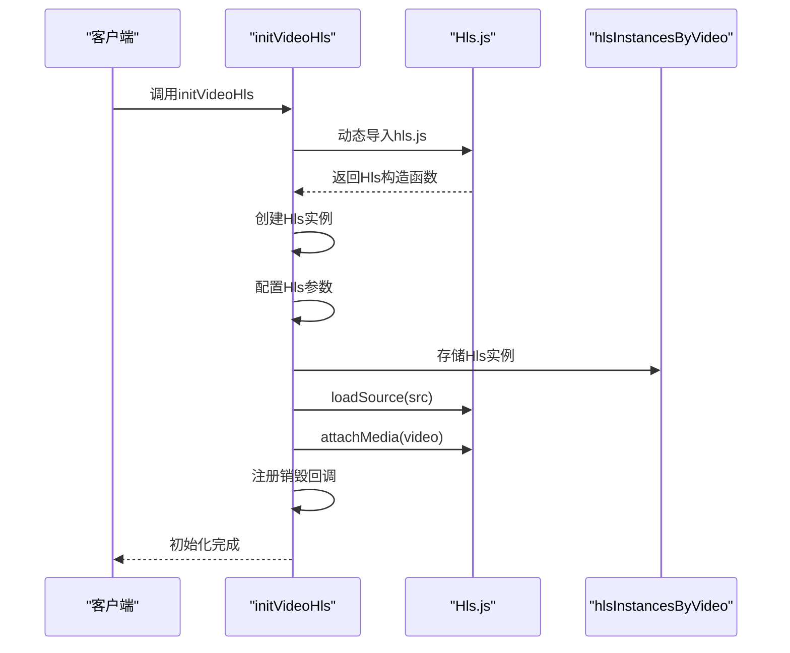
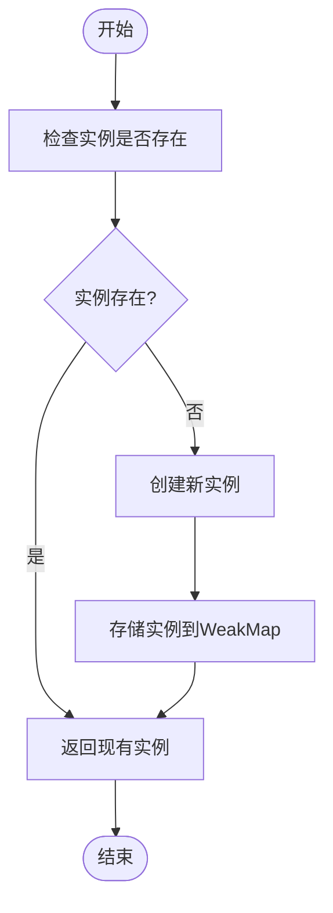
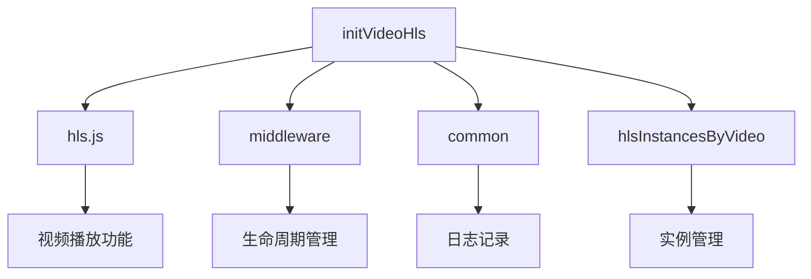

# HLS初始化流程

<cite>
**本文档引用的文件**
- [initVideoHls.ts](file://src/lib/hls/initVideoHls.ts)
- [hlsInstancesByVideo.ts](file://src/lib/hls/hlsInstancesByVideo.ts)
- [common.ts](file://src/lib/hls/common.ts)
- [createHlsVideoSource.ts](file://src/lib/hls/createHlsVideoSource.ts)
- [onHlsPlaylistFetch.ts](file://src/lib/hls/onHlsPlaylistFetch.ts)
- [onHlsStreamFetch.ts](file://src/lib/hls/onHlsStreamFetch.ts)
- [fetchAndConcatFileParts.ts](file://src/lib/hls/fetchAndConcatFileParts.ts)
- [splitRangeForGettingFileParts.ts](file://src/lib/hls/splitRangeForGettingFileParts.ts)
</cite>

## 目录
1. [简介](#简介)
2. [项目结构](#项目结构)
3. [核心组件](#核心组件)
4. [架构概述](#架构概述)
5. [详细组件分析](#详细组件分析)
6. [依赖分析](#依赖分析)
7. [性能考虑](#性能考虑)
8. [故障排除指南](#故障排除指南)
9. [结论](#结论)

## 简介
本文档详细解析了视频HLS初始化的完整过程，包括HLS实例的创建、配置参数设置、事件监听器注册机制，以及HLS实例的管理策略。文档还深入探讨了初始化过程中的错误处理和恢复机制，并提供了代码示例和状态图来说明从请求到准备播放的各个阶段转换。

## 项目结构
HLS相关功能位于`src/lib/hls`目录下，该目录包含多个模块文件，每个文件负责HLS流处理的不同方面。主要文件包括`initVideoHls.ts`用于初始化HLS播放，`hlsInstancesByVideo.ts`用于管理HLS实例，以及其他辅助文件处理HLS流的各个阶段。

**图示来源**
- [initVideoHls.ts](file://src/lib/hls/initVideoHls.ts)
- [hlsInstancesByVideo.ts](file://src/lib/hls/hlsInstancesByVideo.ts)

**章节来源**
- [initVideoHls.ts](file://src/lib/hls/initVideoHls.ts)
- [hlsInstancesByVideo.ts](file://src/lib/hls/hlsInstancesByVideo.ts)

## 核心组件
核心组件包括`initVideoHls`函数，负责创建和配置HLS实例，以及`hlsInstancesByVideo` WeakMap，用于管理视频元素与HLS实例之间的映射关系。这些组件共同实现了HLS流的初始化和管理。

**章节来源**
- [initVideoHls.ts](file://src/lib/hls/initVideoHls.ts#L13-L40)
- [hlsInstancesByVideo.ts](file://src/lib/hls/hlsInstancesByVideo.ts#L3)

## 架构概述
HLS初始化流程涉及多个组件的协同工作。`initVideoHls`函数创建HLS实例并配置其参数，然后将实例与视频元素关联。`hlsInstancesByVideo` WeakMap用于存储和管理这些实例，确保每个视频元素都有一个对应的HLS实例。

**图示来源**
- [initVideoHls.ts](file://src/lib/hls/initVideoHls.ts#L18-L39)
- [hlsInstancesByVideo.ts](file://src/lib/hls/hlsInstancesByVideo.ts#L3)

## 详细组件分析

### initVideoHls分析
`initVideoHls`函数是HLS初始化的核心，它接收视频元素、源URL和中间件作为参数，创建HLS实例并配置其行为。

#### 初始化流程

**图示来源**
- [initVideoHls.ts](file://src/lib/hls/initVideoHls.ts#L13-L40)

**章节来源**
- [initVideoHls.ts](file://src/lib/hls/initVideoHls.ts#L13-L40)

### hlsInstancesByVideo分析
`hlsInstancesByVideo`是一个WeakMap，用于存储视频元素与HLS实例之间的映射关系，确保实例的正确管理和复用。

#### 实例管理策略

**图示来源**
- [hlsInstancesByVideo.ts](file://src/lib/hls/hlsInstancesByVideo.ts#L3)

**章节来源**
- [hlsInstancesByVideo.ts](file://src/lib/hls/hlsInstancesByVideo.ts#L3)

## 依赖分析
HLS初始化流程依赖于多个外部模块和内部组件。主要依赖包括`hls.js`库、`middleware`系统、`common`工具函数等。

**图示来源**
- [initVideoHls.ts](file://src/lib/hls/initVideoHls.ts#L1-L40)
- [hlsInstancesByVideo.ts](file://src/lib/hls/hlsInstancesByVideo.ts#L1-L4)

**章节来源**
- [initVideoHls.ts](file://src/lib/hls/initVideoHls.ts#L1-L40)
- [hlsInstancesByVideo.ts](file://src/lib/hls/hlsInstancesByVideo.ts#L1-L4)

## 性能考虑
HLS初始化流程在设计时考虑了性能优化，包括使用WeakMap来避免内存泄漏，配置合理的缓冲区大小以平衡内存使用和播放流畅性，以及通过动态导入减少初始加载时间。

## 故障排除指南
在HLS初始化过程中可能遇到的常见问题包括网络连接失败、MIME类型不支持等。系统通过错误处理机制捕获这些异常，并提供相应的恢复策略。

**章节来源**
- [onHlsPlaylistFetch.ts](file://src/lib/hls/onHlsPlaylistFetch.ts#L12-L37)
- [onHlsStreamFetch.ts](file://src/lib/hls/onHlsStreamFetch.ts#L14-L53)

## 结论
本文档详细解析了HLS初始化流程的各个方面，从核心组件到架构设计，再到错误处理和性能优化。通过理解这些内容，开发者可以更好地使用和维护HLS播放功能。