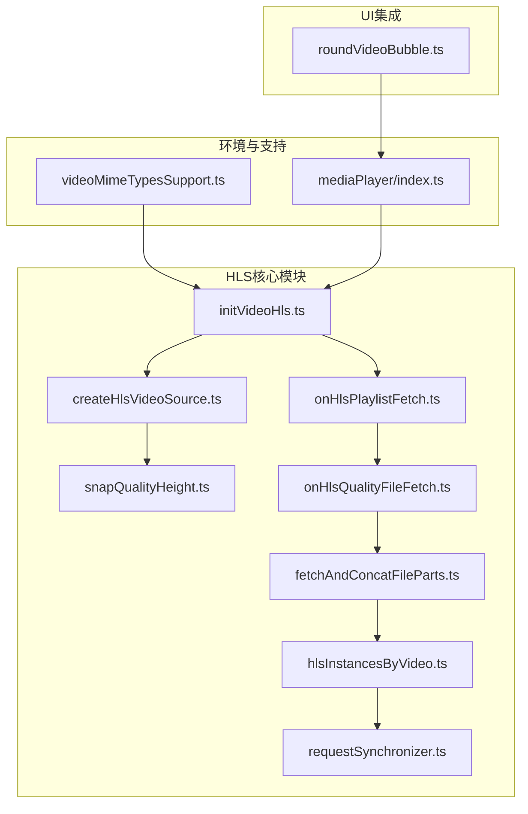
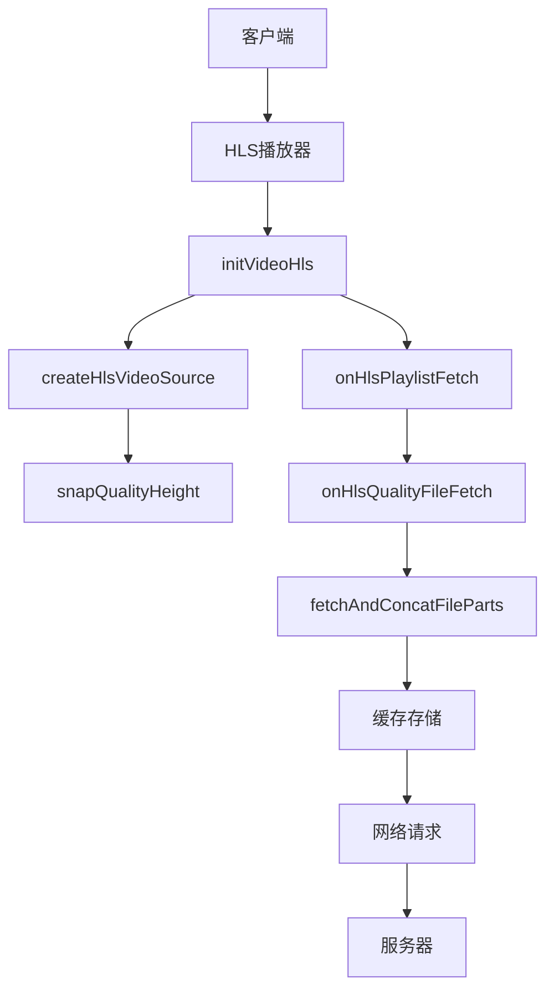
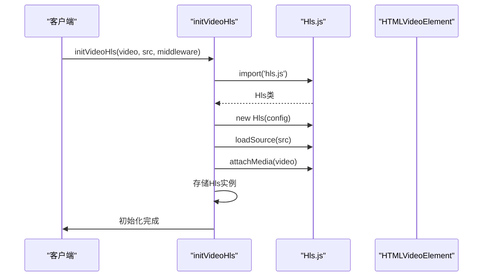
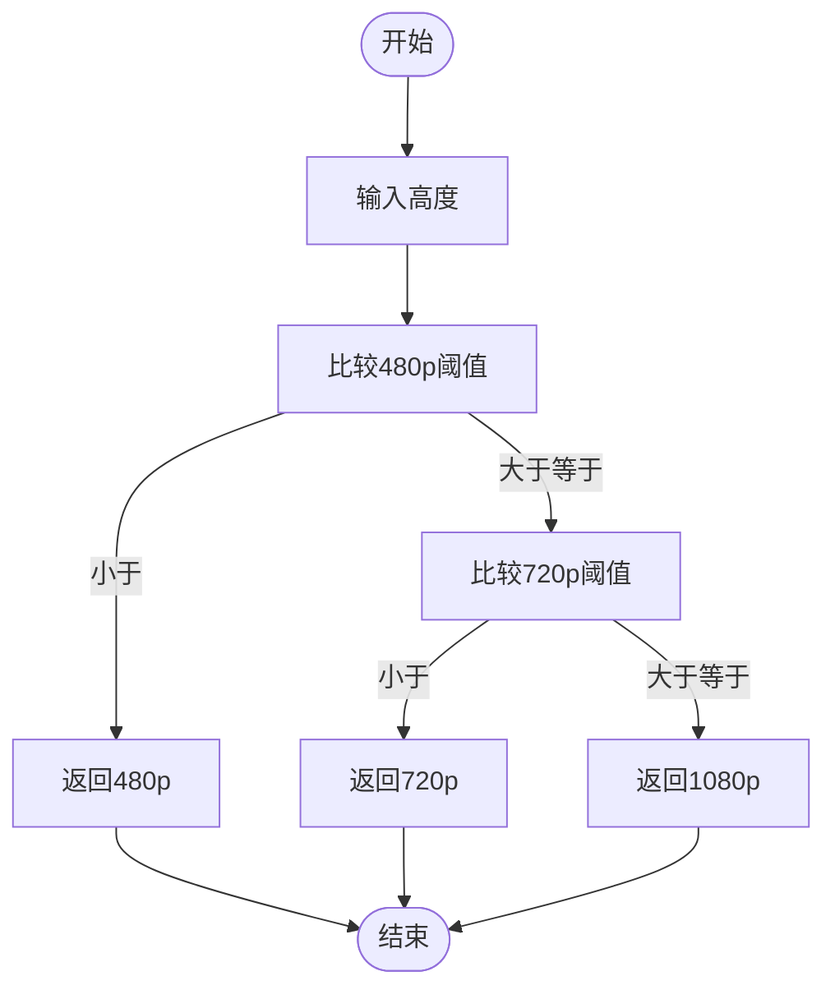
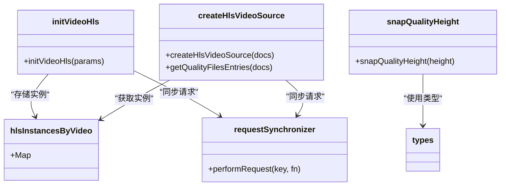

# HLS流媒体

<cite>
**本文档中引用的文件**  
- [initVideoHls.ts](file://src/lib/hls/initVideoHls.ts)
- [createHlsVideoSource.ts](file://src/lib/hls/createHlsVideoSource.ts)
- [snapQualityHeight.ts](file://src/lib/hls/snapQualityHeight.ts)
- [common.ts](file://src/lib/hls/common.ts)
- [onHlsPlaylistFetch.ts](file://src/lib/hls/onHlsPlaylistFetch.ts)
- [onHlsQualityFileFetch.ts](file://src/lib/hls/onHlsQualityFileFetch.ts)
- [fetchAndConcatFileParts.ts](file://src/lib/hls/fetchAndConcatFileParts.ts)
- [types.ts](file://src/lib/hls/types.ts)
- [hlsInstancesByVideo.ts](file://src/lib/hls/hlsInstancesByVideo.ts)
- [requestSynchronizer.ts](file://src/lib/hls/requestSynchronizer.ts)
- [videoMimeTypesSupport.ts](file://src/environment/videoMimeTypesSupport.ts)
- [mediaPlayer/index.ts](file://src/lib/mediaPlayer/index.ts)
- [roundVideoBubble.ts](file://src/components/chat/bubbleParts/roundVideoBubble.ts)
</cite>

## 目录
1. [简介](#简介)
2. [项目结构](#项目结构)
3. [核心组件](#核心组件)
4. [架构概述](#架构概述)
5. [详细组件分析](#详细组件分析)
6. [依赖分析](#依赖分析)
7. [性能考虑](#性能考虑)
8. [故障排除指南](#故障排除指南)
9. [结论](#结论)

## 简介
本文档详细说明了HLS流媒体功能的实现，包括HLS视频初始化、视频源构建、自适应码率切换算法、播放器生命周期管理、网络恢复策略、缓冲区管理以及性能监控。文档还提供了在聊天组件中集成HLS播放器的实际示例。

## 项目结构
HLS流媒体功能主要位于`src/lib/hls`目录下，该目录包含HLS播放器初始化、视频源创建、质量切换、事件处理和缓存优化等核心功能。HLS播放器与聊天组件集成，通过`src/components/chat`目录下的组件实现视频播放功能。

**Diagram sources**
- [initVideoHls.ts](file://src/lib/hls/initVideoHls.ts)
- [createHlsVideoSource.ts](file://src/lib/hls/createHlsVideoSource.ts)
- [snapQualityHeight.ts](file://src/lib/hls/snapQualityHeight.ts)
- [onHlsPlaylistFetch.ts](file://src/lib/hls/onHlsPlaylistFetch.ts)
- [onHlsQualityFileFetch.ts](file://src/lib/hls/onHlsQualityFileFetch.ts)
- [fetchAndConcatFileParts.ts](file://src/lib/hls/fetchAndConcatFileParts.ts)
- [hlsInstancesByVideo.ts](file://src/lib/hls/hlsInstancesByVideo.ts)
- [requestSynchronizer.ts](file://src/lib/hls/requestSynchronizer.ts)
- [videoMimeTypesSupport.ts](file://src/environment/videoMimeTypesSupport.ts)
- [mediaPlayer/index.ts](file://src/lib/mediaPlayer/index.ts)
- [roundVideoBubble.ts](file://src/components/chat/bubbleParts/roundVideoBubble.ts)

**Section sources**
- [initVideoHls.ts](file://src/lib/hls/initVideoHls.ts)
- [createHlsVideoSource.ts](file://src/lib/hls/createHlsVideoSource.ts)
- [snapQualityHeight.ts](file://src/lib/hls/snapQualityHeight.ts)

## 核心组件
HLS流媒体功能的核心组件包括`initVideoHls.ts`中的HLS实例初始化、`createHlsVideoSource.ts`中的视频源构建和`snapQualityHeight.ts`中的自适应码率切换算法。这些组件协同工作，实现高效的HLS视频播放。

**Section sources**
- [initVideoHls.ts](file://src/lib/hls/initVideoHls.ts#L1-L41)
- [createHlsVideoSource.ts](file://src/lib/hls/createHlsVideoSource.ts#L1-L106)
- [snapQualityHeight.ts](file://src/lib/hls/snapQualityHeight.ts#L1-L14)

## 架构概述
HLS流媒体功能采用分层架构，包括HLS实例管理、视频源生成、质量切换、网络请求处理和缓存优化。系统通过Service Worker拦截HLS相关请求，实现高效的流媒体传输和缓存管理。

**Diagram sources**
- [initVideoHls.ts](file://src/lib/hls/initVideoHls.ts)
- [createHlsVideoSource.ts](file://src/lib/hls/createHlsVideoSource.ts)
- [snapQualityHeight.ts](file://src/lib/hls/snapQualityHeight.ts)
- [onHlsPlaylistFetch.ts](file://src/lib/hls/onHlsPlaylistFetch.ts)
- [onHlsQualityFileFetch.ts](file://src/lib/hls/onHlsQualityFileFetch.ts)
- [fetchAndConcatFileParts.ts](file://src/lib/hls/fetchAndConcatFileParts.ts)

## 详细组件分析

### HLS初始化分析
`initVideoHls.ts`文件负责HLS播放器的初始化，包括HLS实例创建、事件监听器注册和错误处理。该组件使用`hls.js`库创建HLS实例，并配置缓冲区大小、调试模式等参数。

**Diagram sources**
- [initVideoHls.ts](file://src/lib/hls/initVideoHls.ts#L1-L41)

**Section sources**
- [initVideoHls.ts](file://src/lib/hls/initVideoHls.ts#L1-L41)

### 视频源构建分析
`createHlsVideoSource.ts`文件负责构建HLS视频源，包括MIME类型检测、分段加载策略和缓存优化。该组件根据视频文档属性生成M3U8播放列表，支持不同分辨率和码率的视频流。

**Diagram sources**
- [createHlsVideoSource.ts](file://src/lib/hls/createHlsVideoSource.ts#L1-L106)

**Section sources**
- [createHlsVideoSource.ts](file://src/lib/hls/createHlsVideoSource.ts#L1-L106)

### 自适应码率切换分析
`snapQualityHeight.ts`文件实现了自适应码率切换算法，根据屏幕尺寸和网络状况选择合适的质量等级。该算法将视频高度映射到标准分辨率（480p、720p、1080p）。

**Diagram sources**
- [snapQualityHeight.ts](file://src/lib/hls/snapQualityHeight.ts#L1-L14)

**Section sources**
- [snapQualityHeight.ts](file://src/lib/hls/snapQualityHeight.ts#L1-L14)

## 依赖分析
HLS流媒体功能依赖多个核心模块，包括HLS实例管理、缓存存储、请求同步和环境检测。这些依赖关系确保了HLS播放的稳定性和性能。

**Diagram sources**
- [initVideoHls.ts](file://src/lib/hls/initVideoHls.ts)
- [createHlsVideoSource.ts](file://src/lib/hls/createHlsVideoSource.ts)
- [snapQualityHeight.ts](file://src/lib/hls/snapQualityHeight.ts)
- [hlsInstancesByVideo.ts](file://src/lib/hls/hlsInstancesByVideo.ts)
- [requestSynchronizer.ts](file://src/lib/hls/requestSynchronizer.ts)
- [types.ts](file://src/lib/hls/types.ts)

**Section sources**
- [initVideoHls.ts](file://src/lib/hls/initVideoHls.ts)
- [createHlsVideoSource.ts](file://src/lib/hls/createHlsVideoSource.ts)
- [snapQualityHeight.ts](file://src/lib/hls/snapQualityHeight.ts)
- [hlsInstancesByVideo.ts](file://src/lib/hls/hlsInstancesByVideo.ts)
- [requestSynchronizer.ts](file://src/lib/hls/requestSynchronizer.ts)

## 性能考虑
HLS流媒体功能通过多种机制优化性能，包括缓冲区管理、缓存策略和网络请求优化。系统配置了合理的缓冲区大小（backBufferLength: 30, maxBufferLength: 60），并使用Service Worker缓存HLS分段文件，减少网络请求。

**Section sources**
- [initVideoHls.ts](file://src/lib/hls/initVideoHls.ts#L18-L28)
- [fetchAndConcatFileParts.ts](file://src/lib/hls/fetchAndConcatFileParts.ts#L12-L13)
- [onHlsQualityFileFetch.ts](file://src/lib/hls/onHlsQualityFileFetch.ts#L12-L13)

## 故障排除指南
HLS流媒体功能包含完善的错误处理机制，包括网络中断恢复、缓存失效处理和播放器销毁。当网络中断时，系统会自动重试请求，并在播放器销毁时清理相关资源。

**Section sources**
- [initVideoHls.ts](file://src/lib/hls/initVideoHls.ts#L36-L39)
- [onHlsPlaylistFetch.ts](file://src/lib/hls/onHlsPlaylistFetch.ts#L32-L35)
- [onHlsQualityFileFetch.ts](file://src/lib/hls/onHlsQualityFileFetch.ts#L39-L42)

## 结论
HLS流媒体功能通过模块化设计和高效的缓存策略，实现了流畅的视频播放体验。系统支持自适应码率切换、网络中断恢复和性能优化，为用户提供高质量的流媒体服务。