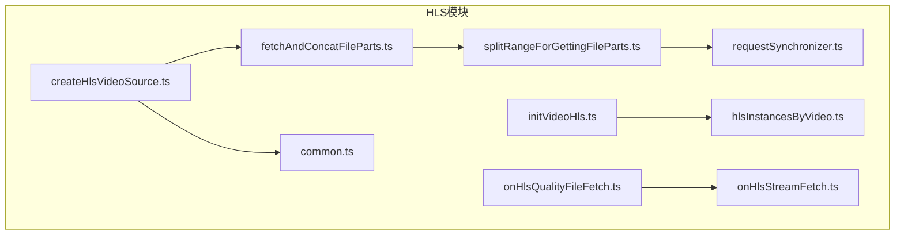
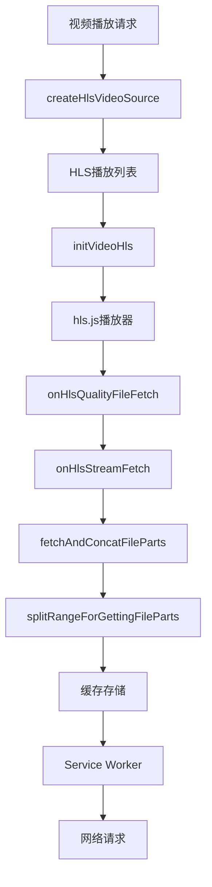
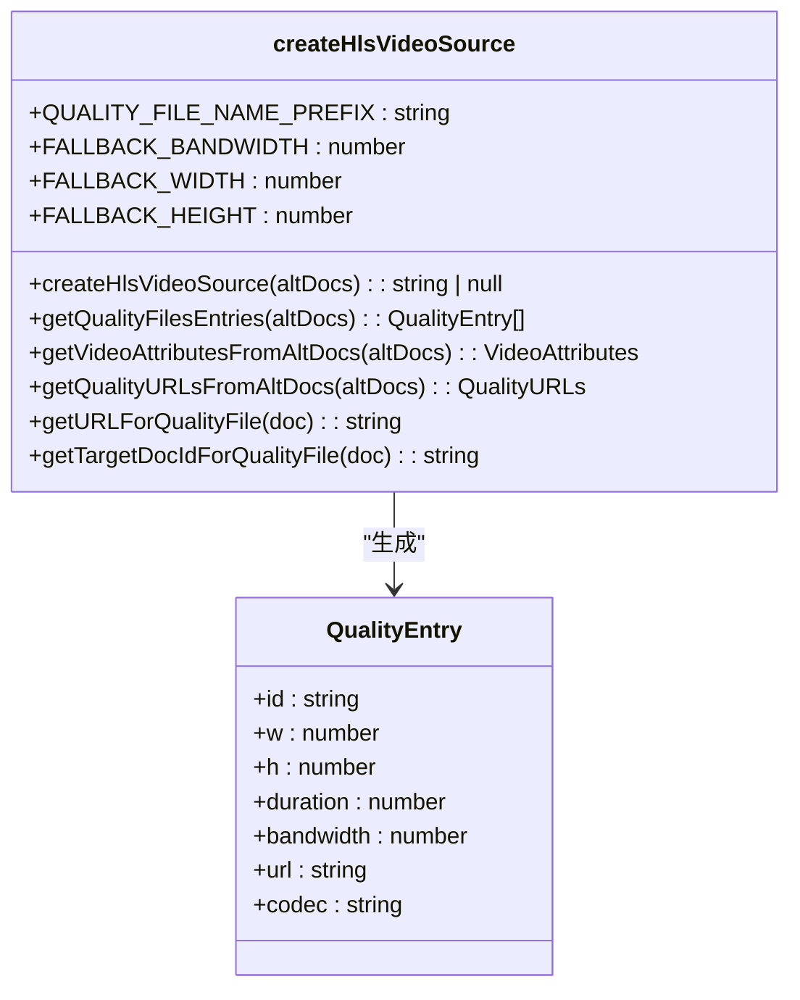
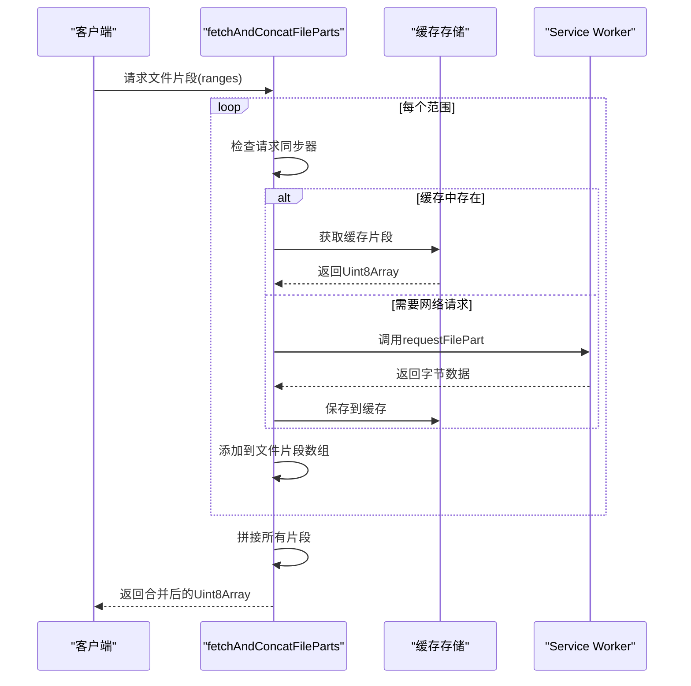
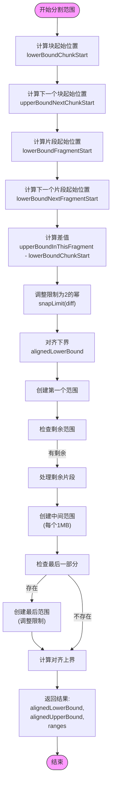

# HLS视频源创建

<cite>
**本文档引用的文件**
- [createHlsVideoSource.ts](file://src/lib/hls/createHlsVideoSource.ts)
- [fetchAndConcatFileParts.ts](file://src/lib/hls/fetchAndConcatFileParts.ts)
- [splitRangeForGettingFileParts.ts](file://src/lib/hls/splitRangeForGettingFileParts.ts)
- [common.ts](file://src/lib/hls/common.ts)
- [requestSynchronizer.ts](file://src/lib/hls/requestSynchronizer.ts)
- [initVideoHls.ts](file://src/lib/hls/initVideoHls.ts)
- [onHlsQualityFileFetch.ts](file://src/lib/hls/onHlsQualityFileFetch.ts)
- [onHlsStreamFetch.ts](file://src/lib/hls/onHlsStreamFetch.ts)
- [hlsInstancesByVideo.ts](file://src/lib/hls/hlsInstancesByVideo.ts)
- [types.ts](file://src/lib/hls/types.ts)
</cite>

## 目录
1. [简介](#简介)
2. [项目结构](#项目结构)
3. [核心组件](#核心组件)
4. [架构概述](#架构概述)
5. [详细组件分析](#详细组件分析)
6. [依赖分析](#依赖分析)
7. [性能考虑](#性能考虑)
8. [故障排除指南](#故障排除指南)
9. [结论](#结论)

## 简介
本文档详细分析了HLS视频源的创建过程，重点研究了`createHlsVideoSource.ts`中HLS视频源的构建机制，包括MIME类型检测、分段加载策略和缓存优化。文档还深入探讨了`fetchAndConcatFileParts.ts`中的文件片段获取和拼接算法，以及`splitRangeForGettingFileParts.ts`中的范围分割策略。通过分析这些核心组件，展示了视频源创建过程中的性能优化措施，如预加载、并行下载和内存管理。

## 项目结构
HLS视频源创建功能主要位于`src/lib/hls`目录下，该目录包含了实现HLS流媒体处理的所有核心组件。这些组件协同工作，实现了从视频请求到可播放源生成的完整流程。

**图表来源**
- [createHlsVideoSource.ts](file://src/lib/hls/createHlsVideoSource.ts)
- [fetchAndConcatFileParts.ts](file://src/lib/hls/fetchAndConcatFileParts.ts)
- [splitRangeForGettingFileParts.ts](file://src/lib/hls/splitRangeForGettingFileParts.ts)

**本节来源**
- [src/lib/hls](file://src/lib/hls)

## 核心组件
HLS视频源创建系统由多个核心组件构成，每个组件负责特定的功能。`createHlsVideoSource.ts`负责生成HLS播放列表，`fetchAndConcatFileParts.ts`处理文件片段的获取和拼接，而`splitRangeForGettingFileParts.ts`则实现了智能的范围分割策略。

**本节来源**
- [createHlsVideoSource.ts](file://src/lib/hls/createHlsVideoSource.ts#L13-L41)
- [fetchAndConcatFileParts.ts](file://src/lib/hls/fetchAndConcatFileParts.ts#L24-L53)
- [splitRangeForGettingFileParts.ts](file://src/lib/hls/splitRangeForGettingFileParts.ts#L14-L65)

## 架构概述
HLS视频源创建系统采用分层架构设计，从上层的播放列表生成到底层的文件片段处理，各组件之间通过清晰的接口进行通信。系统利用Service Worker拦截网络请求，实现高效的缓存管理和流媒体传输。

**图表来源**
- [createHlsVideoSource.ts](file://src/lib/hls/createHlsVideoSource.ts#L13-L41)
- [initVideoHls.ts](file://src/lib/hls/initVideoHls.ts#L13-L40)
- [onHlsQualityFileFetch.ts](file://src/lib/hls/onHlsQualityFileFetch.ts#L23-L43)
- [onHlsStreamFetch.ts](file://src/lib/hls/onHlsStreamFetch.ts#L14-L53)

## 详细组件分析

### createHlsVideoSource分析
`createHlsVideoSource`组件负责生成标准的HLS播放列表（M3U8格式），该播放列表包含了不同质量级别的视频流信息。

**图表来源**
- [createHlsVideoSource.ts](file://src/lib/hls/createHlsVideoSource.ts#L13-L105)

**本节来源**
- [createHlsVideoSource.ts](file://src/lib/hls/createHlsVideoSource.ts#L13-L105)

### fetchAndConcatFileParts分析
`fetchAndConcatFileParts`组件实现了文件片段的获取和拼接功能，通过缓存机制和请求同步器优化了性能。

**图表来源**
- [fetchAndConcatFileParts.ts](file://src/lib/hls/fetchAndConcatFileParts.ts#L24-L53)
- [requestSynchronizer.ts](file://src/lib/hls/requestSynchronizer.ts#L1-L15)

**本节来源**
- [fetchAndConcatFileParts.ts](file://src/lib/hls/fetchAndConcatFileParts.ts#L24-L119)
- [requestSynchronizer.ts](file://src/lib/hls/requestSynchronizer.ts#L1-L15)

### splitRangeForGettingFileParts分析
`splitRangeForGettingFileParts`组件实现了智能的范围分割策略，确保文件请求符合Telegram CDN的限制要求。

**图表来源**
- [splitRangeForGettingFileParts.ts](file://src/lib/hls/splitRangeForGettingFileParts.ts#L14-L65)

**本节来源**
- [splitRangeForGettingFileParts.ts](file://src/lib/hls/splitRangeForGettingFileParts.ts#L14-L114)

## 依赖分析
HLS视频源创建系统依赖于多个内部和外部组件，这些依赖关系确保了系统的完整性和功能性。

**图表来源**
- [createHlsVideoSource.ts](file://src/lib/hls/createHlsVideoSource.ts)
- [fetchAndConcatFileParts.ts](file://src/lib/hls/fetchAndConcatFileParts.ts)
- [splitRangeForGettingFileParts.ts](file://src/lib/hls/splitRangeForGettingFileParts.ts)
- [initVideoHls.ts](file://src/lib/hls/initVideoHls.ts)
- [onHlsQualityFileFetch.ts](file://src/lib/hls/onHlsQualityFileFetch.ts)
- [onHlsStreamFetch.ts](file://src/lib/hls/onHlsStreamFetch.ts)

**本节来源**
- [src/lib/hls](file://src/lib/hls)

## 性能考虑
HLS视频源创建系统在设计时充分考虑了性能优化，通过多种机制确保了流畅的视频播放体验。

1. **缓存优化**: 系统使用`CacheStorageController`对HLS质量文件和流媒体片段进行缓存，减少重复网络请求。
2. **请求同步**: `RequestSynchronizer`类确保同一资源的并发请求只执行一次，避免重复下载。
3. **内存管理**: 文件片段以`Uint8Array`格式处理，优化内存使用效率。
4. **预加载策略**: 系统通过`backBufferLength`和`maxBufferLength`配置实现智能预加载。
5. **生命周期管理**: 定期清理过期的缓存片段，防止存储无限增长。

**本节来源**
- [fetchAndConcatFileParts.ts](file://src/lib/hls/fetchAndConcatFileParts.ts#L92-L118)
- [initVideoHls.ts](file://src/lib/hls/initVideoHls.ts#L18-L28)

## 故障排除指南
在HLS视频源创建过程中可能遇到各种问题，以下是一些常见问题及其解决方案：

**本节来源**
- [onHlsQualityFileFetch.ts](file://src/lib/hls/onHlsQualityFileFetch.ts#L23-L43)
- [onHlsStreamFetch.ts](file://src/lib/hls/onHlsStreamFetch.ts#L14-L53)
- [common.ts](file://src/lib/hls/common.ts#L11-L14)

## 结论
HLS视频源创建系统通过精心设计的组件架构和优化策略，实现了高效、可靠的流媒体播放功能。系统充分利用了Service Worker的拦截能力，结合智能的缓存管理和请求优化，为用户提供流畅的视频观看体验。各个组件之间的清晰职责划分和松耦合设计，使得系统具有良好的可维护性和扩展性。